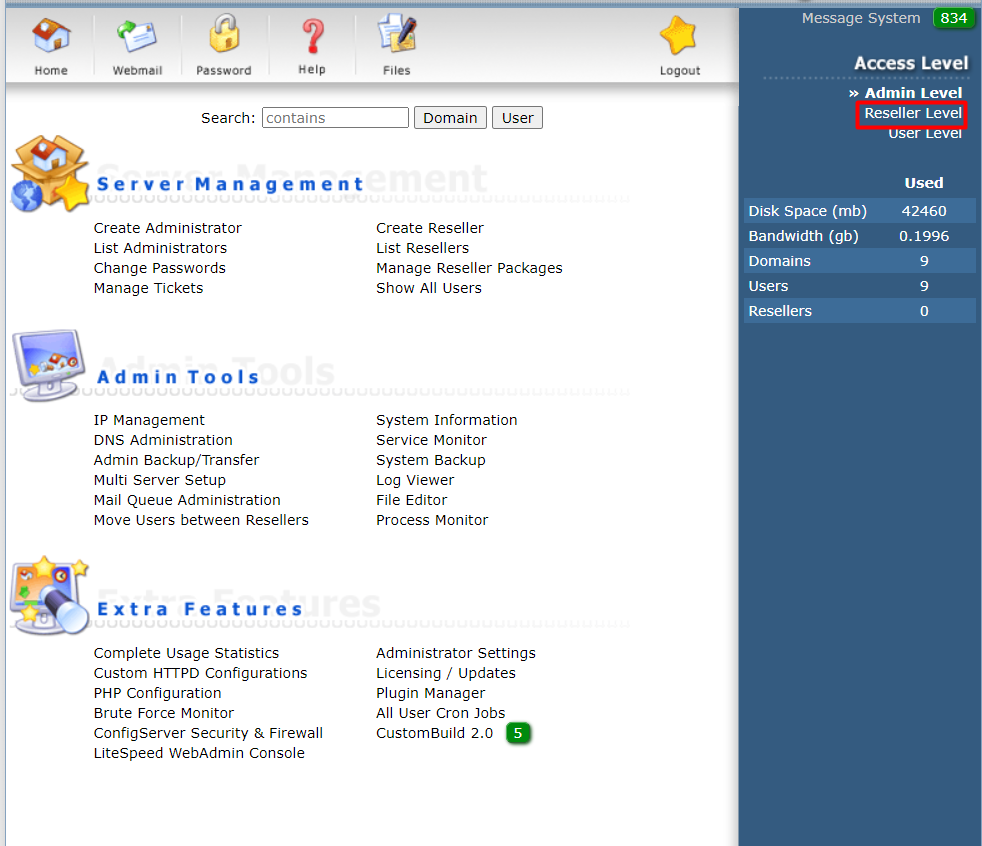
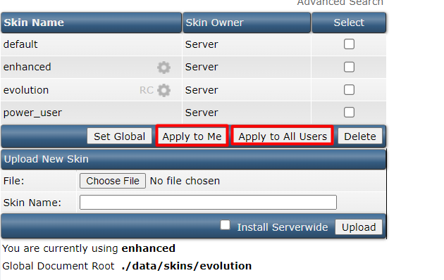
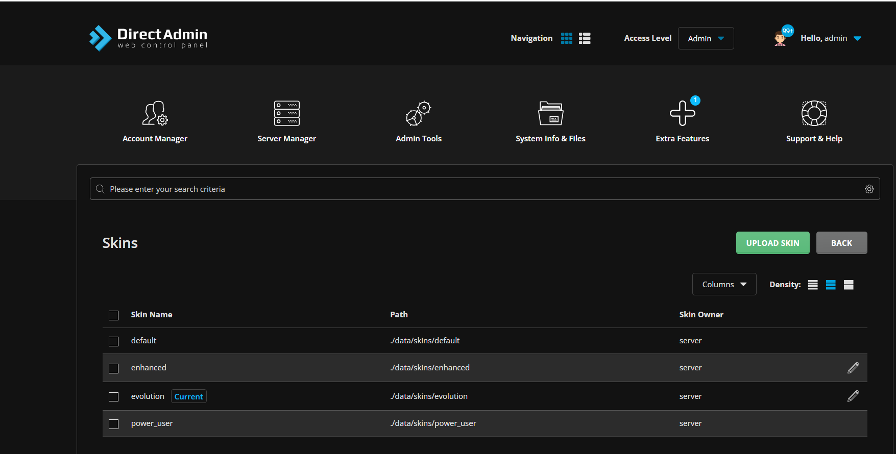
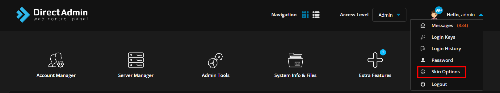

Bài viết này sẽ hướng dẫn bạn cách **Hướng dẫn thay đổi giao diện trên Directadmin**. Nếu bạn cần hỗ trợ, xin vui lòng liên hệ VinaHost qua **Hotline 1900 6046 ext.3**, email về [support@vinahost.vn](mailto:support@vinahost.vn) hoặc chat với VinaHost qua livechat [https://livechat.vinahost.vn/chat.php](https://livechat.vinahost.vn/chat.php).

# Hướng dẫn thay đổi giao diện Directadmin

Hiện nay Directadmin đã cập nhật khá nhiều về giao diện. Vì thế sẽ gây khó khăn cho những người dùng sử dụng quen với giao diện cũ. Bài viết này nhằm mục đích giúp người dùng có thể chủ động thay đổi giao diện về giao diện mà người dùng đã quen.

Bước 1: Truy cập vào giao diện Directadmin với quyền admin ==> chọn mục **Reseller Level**

Bước 2: Chọn mục **Skin Manager** ==> Chọn 1 trong 4 skin bên dưới:

**Lưu ý:**
 - Apply to me: Là để áp dụng cho user admin
 - Apply to All Users: Là áp dụng cho toàn bộ user

 Chúng ta cần set cho 2 option trên

 Hiện tại sau khi thao tác skin đã được thay đổi như ảnh minh họa bên dưới:

Đối với giao diện vừa thay đổi như ảnh đính kèm bên trên ta cần thao tác như ảnh minh họa bên dưới:

Sau đó chọn skin mong muốn và thao tác Apply to me & Apply to All Users để thay đổi giao diện Directadmin về giao diện mà bạn mong muốn.

Chúc các bạn thành công!

> **THAM KHẢO CÁC DỊCH VỤ TẠI [VINAHOST](https://vinahost.vn/)**
> 
> **\>>** [**SERVER**](https://vinahost.vn/thue-may-chu-rieng/) **–** [**COLOCATION**](https://vinahost.vn/colocation.html) – [**CDN**](https://vinahost.vn/dich-vu-cdn-chuyen-nghiep)
> 
> **\>> [CLOUD](https://vinahost.vn/cloud-server-gia-re/) – [VPS](https://vinahost.vn/vps-ssd-chuyen-nghiep/)**
> 
> **\>> [HOSTING](https://vinahost.vn/wordpress-hosting)**
> 
> **\>> [EMAIL](https://vinahost.vn/email-hosting)**
> 
> **\>> [WEBSITE](http://vinawebsite.vn/)**
> 
> **\>> [TÊN MIỀN](https://vinahost.vn/ten-mien-gia-re/)**

