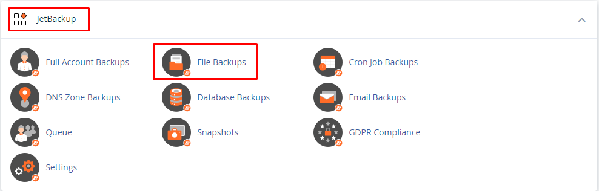
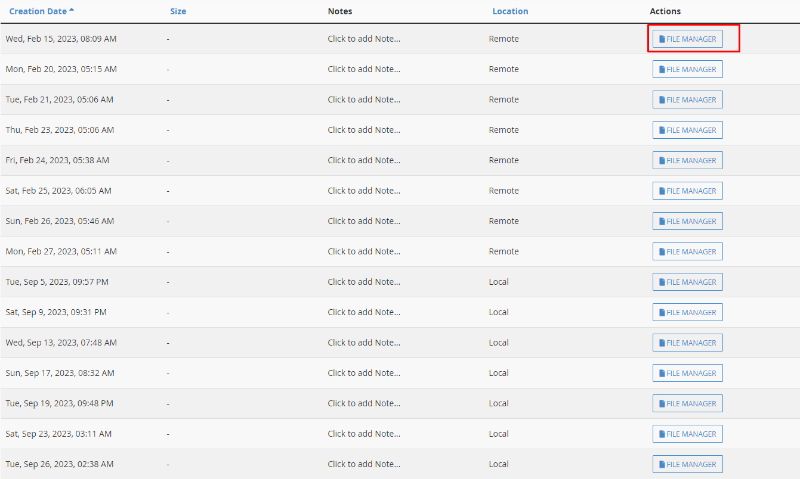

Bài viết này sẽ hướng dẫn mọi người cách  **Download backup Cpanel**. Nếu bạn cần hỗ trợ, xin vui lòng liên hệ [**VinaHost**](https://blog.vinahost.vn/) qua Hotline **1900 6046 ext.3**, email về **support@vinahost.vn** hoặc chat với VinaHost qua livechat **[https://livechat.vinahost.vn/chat.php](https://livechat.vinahost.vn/chat.php)**.

# Hướng dẫn download backup Cpanel

Bước 1: Truy cập vào giao diện Cpanel ==> Ở trong **Mục JetBackup** ta chọn **File Backups**

Bước 2: Sau khi vào giao diện File Backups sẽ có các ngày backup như sau:

Chọn ngày mà muốn backup sau đó click vào File Manager

Bước 3: Chọn thư mục mà mình muốn backup ==> Chọn Download Selected ==> Add Queue để tạo bản download backup trên server.

Bước 4: Trở lại **Mục Jet Backup** ==> **Chọn Mục Queue** để có thể download bản backup nhé.
 

 Chúc các bạn thành công!

 > **THAM KHẢO CÁC DỊCH VỤ TẠI [VINAHOST](https://vinahost.vn/)**
> 
> **\>>** [**SERVER**](https://vinahost.vn/thue-may-chu-rieng/) **–** [**COLOCATION**](https://vinahost.vn/colocation.html) – [**CDN**](https://vinahost.vn/dich-vu-cdn-chuyen-nghiep)
> 
> **\>> [CLOUD](https://vinahost.vn/cloud-server-gia-re/) – [VPS](https://vinahost.vn/vps-ssd-chuyen-nghiep/)**
> 
> **\>> [HOSTING](https://vinahost.vn/wordpress-hosting)**
> 
> **\>> [EMAIL](https://vinahost.vn/email-hosting)**
> 
> **\>> [WEBSITE](http://vinawebsite.vn/)**
> 
> **\>> [TÊN MIỀN](https://vinahost.vn/ten-mien-gia-re/)**
