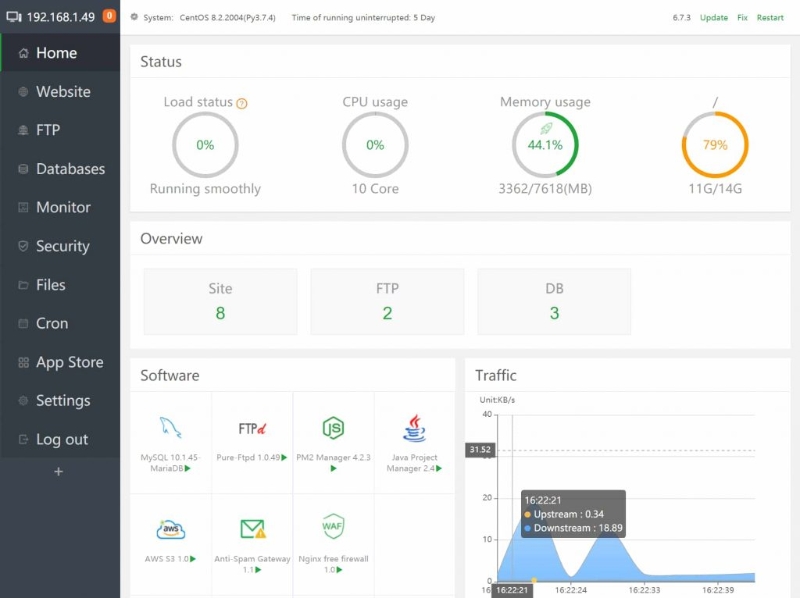
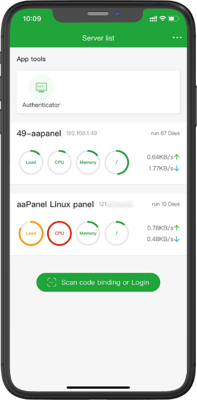
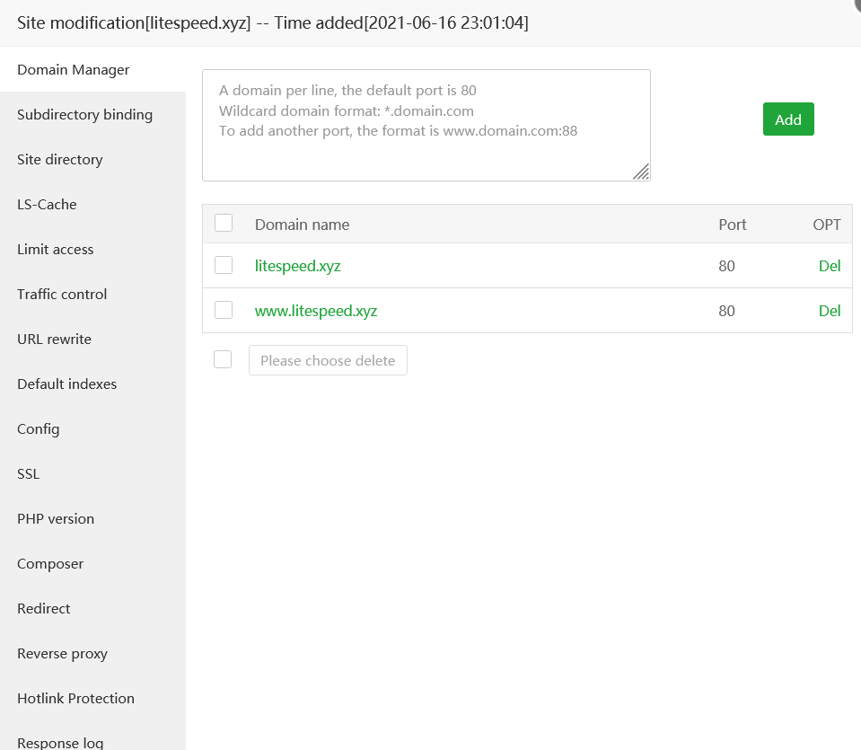
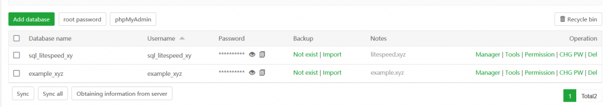
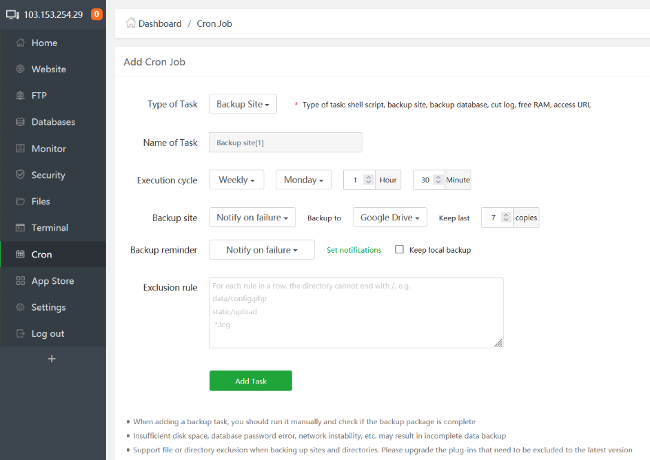
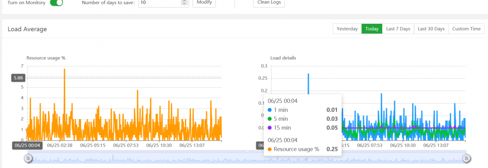

Bài viết này sẽ hướng giới thiệu về **Aapanel Quản Lý Server Linux Đơn Giản**. Nếu bạn cần hỗ trợ, xin vui lòng liên hệ [**VinaHost**](https://blog.vinahost.vn/) qua Hotline **1900 6046 ext.3**, email về **support@vinahost.vn** hoặc chat với VinaHost qua livechat **[https://livechat.vinahost.vn/chat.php](https://livechat.vinahost.vn/chat.php)**.

## aaPanel overview

Hiện này hầu hết các **server linux** cung cấp dịch vụ **public** thường không được cài sẵn với giao diện quản lý, khiến người quản lý dịch vụ khó khăn trong việc cài đặt, quản lý các dịch vụ chạy trên **server**.

Một số nhà cung cấp **ISP** khi bạn sử dụng các dịch vụ **web server** thường sẽ được cài đặt sẵn **panel** để quản trị **server** thông qua giao diện **web** như **cpanel** hay **directadmin**, nhưng lại tốn quá nhiều tài nguyên và làm chậm tốc độ **server** bằng việc chạy những dịch vụ mà có thể người quản trị còn không biết đến.

**aaPanel**, cũng là một **control panel** hỗ trợ quản trị **server Linux** thông qua giao diện **web**. Tuy nhiên **aaPanel** hỗ trợ tối ưu, không sử dụng quá nhiều tài nguyên **server** và cung cấp khả năng quản lý và cài đặt dịch vụ tùy theo yêu cầu người quản trị. Đây sẽ là một **panel** phù hợp cho các nhà quản trị **website** nhỏ.

## aaPanel có thể làm gì?

**aaPanel** là một phần mềm hỗ trợ quản lý **server** chạy trên hệ điều hành **linux**.

Giúp quản trị viên dễ dàng quản lý, theo dõi, cài đặt và cấu hình trực tiếp thông qua **web interface**

**aaPanel** hỗ trợ các chức năng khác làm tăng độ bảo mật server và **website** trên cả ba tầng **3, 4 và 7** trong mô hình **OSI**.

Giao diện thân thiện với người dùng, cùng với tính dễ dàng mở rộng và chỉnh sửa các dịch vụ khi cần thiết, **aaPanel** là sự lựa chọn phù hợp cho **web server** nhỏ, người quản lý có nền tảng về các dịch vụ trên **linux**.

## Các tính năng trên aaPanel

**\# Webserver**

Hỗ trợ **multiple php** dễ dàng cài đặt trực tiếp trên **panel** mà không cần truy cập **server** qua **ssh**

Hỗ trợ cài đặt **SSL** miễn phí với **Let’sEncrypt**

Cho phép tùy chỉnh nhiều thông số và cài đặt trực tiếp trên **panel** như:

- Thông số cache
- Home directory
- Subdirectory
- Tạo limit access (basic authentication)
- Control limit traffic
- URL rewrite
- Default index
- Webserver config
- SSL
- PHP version
- Composer
- Domain redirection
- Reverse proxy
- Hotlink protection: Block quyền truy cập các file đặc biệt hoặc không liên quan đến website.
- Log
- FTP dễ dàng quản lý.

**\# Database**

- Hỗ trợ nhiều tính năng hỗ trợ quản lý và sửa chữa **database** khi gặp lỗi: **repair, optimize, convert InnoDB/MyISAM**
- Hỗ trợ **phpMyAdmin** (Tùy chọn cài đặt).

**\# Backup**

- Hỗ trợ **backup** đến các **cloud drive** như **gdrive**, **google cloud storage**, **AWS** giúp dễ dàng quản lý, **backup** mà không cần sử dụng dung lượng trên **VPS**.
- Dễ dàng tạo **jobs backup** đến các **drive** ngoại vi này thông qua **cron**.

**\# Monitor:**

- Hệ thống **monitor**, **monitor** thông số **resource** sử dụng trên server gồm **Load, CPU, Ram, Disk I/O, Storage**.

**\# Security**

- Dễ dàng quản lý **firewall, add rule, remove rule, check security log, block ICMP**

**\# Kết nối terminal thông qua xterm**

**\# Cronjob**

- Cài đặt **cronjob** hỗ trợ **format** đơn giản dễ dàng **setup**

**\# Hỗ trợ thư viện ứng dụng App Store,**

- Dễ dàng cài đặt và thiết lập các dịch vụ cơ bản khác liên quan như **java, docker, mongodb, litespeed, fail2ban, mail server**,...

## Cài đặt panel (CentOS 7)

**aaPanel** dễ dàng cài đặt chỉ với 1 dòng lệnh trên **linux**:

- Centos

        yum install -y wget && wget -O install.sh http://www.aapanel.com/script/install_6.0_en.sh && bash install.sh aapanel

- Ubuntu

        wget -O install.sh http://www.aapanel.com/script/install-ubuntu_6.0_en.sh && sudo bash install.sh aapanel

- Debian

        wget -O install.sh http://www.aapanel.com/script/install-ubuntu_6.0_en.sh && bash install.sh aapanel

Sau khi **panel** được cài đặt thành công, thông tin quản trị sẽ được hiển trị trong phần log cài đặt, hoặc có thể dùng lệnh sau để xem thông tin quản trị **panel**:

        /etc/init.d/bt default

### Ưu nhược điểm

**\# Ưu điểm**

\+ Dễ dàng cài đặt, hỗ trợ phiên bản miễn phí và trả phí.

\+ Khả năng tinh chỉnh dịch vụ cao, dễ dàng cài đặt và cấu hình trực tiếp trên panel. Bao gồm các công nghệ website, hệ thống backup, hệ thống mail, DNS, lưu trữ, quản trị và kết nối, môi trường hỗ trợ các loại mã nguồn web, các extension hỗ trợ khác như cache, firewall, fail2ban, ...

\+ Lightweight, có thể tùy chọn cài đặt và xóa những dịch vụ không cần thiết, giúp tối ưu được resource trên server.

**\# Nhược điểm:**

\+ Không hỗ trợ hệ thống phần quyền user website, nên không phù hợp cho các webserver lớn như reseller hay ISP.

## aaPanel Management script
### Management
Stop
        service bt stop
Start
        service bt start
Restart
        service bt restart
Uninstall
        service bt stop && chkconfig --del bt && rm -f /etc/init.d/bt && rm -rf /www/server/panel
View current port of control panel
        cat /www/server/panel/data/port.pl
Change port of control panel，e.g. 8881（centos 6 Operation System）
        echo '8881' > /www/server/panel/data/port.pl && service bt restart iptables -I INPUT -p tcp -m state --state NEW -m tcp --dport 8881 -j ACCEPT service iptables save service iptables restart
Change port of control panel，e.g. 8881（centos 7 Operation System）
        echo '8881' > /www/server/panel/data/port.pl && service bt restart firewall-cmd --permanent --zone=public --add-port=8881/tcp firewall-cmd --reload
Force to change MySQL manager (root) Password，e.g. 123456
        cd /www/server/panel && python tools.py root 123456
Change control Panel login password，e.g. 123456
        cd /www/server/panel && python tools.py panel 123456
Site Configuration location
        /www/server/panel/vhost
Delete banding domain of control panel
        rm -f /www/server/panel/data/domain.conf
Clean login restriction
        rm -f /www/server/panel/data/*.login
View control panel authorization IP
        cat /www/server/panel/data/limitip.conf
Stop access restriction
        rm -f /www/server/panel/data/limitip.conf
View permission domain
        cat /www/server/panel/data/domain.conf
Turn off control panel SSL
        rm -f /www/server/panel/data/ssl.pl && /etc/init.d/bt restart
View control panel error logs
        cat /tmp/panelBoot
View database error log
        cat /www/server/data/*.err
Site Configuration directory(nginx)
        /www/server/panel/vhost/nginx
Site Configuration directory(apache)
        /www/server/panel/vhost/apache
Site default directory
        /www/wwwroot
Database backup directory
        /www/backup/database
Site backup directory
        /www/backup/site
Site logs
        /www/wwwlogs
### Nginx
nginx installation directory
        /www/server/nginx
Start
        service nginx start
Stop
        service nginx stop
Restart
        service nginx restart
Reload
        service nginx reload
nginx Configuration
        /www/server/nginx/conf/nginx.conf
### Apache
apache installation directory
        /www/server/httpd
Start
        service httpd start
Stop
        service httpd stop
Restart
        service httpd restart
Reload
        service httpd reload
apache Configuration
        /www/server/apache/conf/httpd.conf
### MySQL
mysql installation directory
        /www/server/mysql
phpmyadmin installation directory
        /www/server/phpmyadmin
Data storage directory
        /www/server/data mysql
Start
        service mysqld start
Stop
        service mysqld stop
Restart
        service mysqld restart
Reload
        service mysqld reload
mysql Configuration
        /etc/my.cnf
### FTP
ftp installation directory
        /www/server/pure-ftpd
Start
        service pure-ftpd start
Stop
        service pure-ftpd stop
Restart
        service pure-ftpd restart
ftp Configuration
        /www/server/pure-ftpd/etc/pure-ftpd
### PHP
php installation directory
        /www/server/php
Start(Please modify by PHP version, e.g. service php-fpm-54 start)
        servicephp-fpm-{52|53|54|55|56|70|71|72|73|74|80|81} start
Stop(Please modify by PHP version, e.g. service php-fpm-54 stop)
        service php-fpm-{52|53|54|55|56|70|71|72|73|74|80|81} stop
Restart(Please modify by PHP version, e.g. service php-fpm-54 restart)
        service php-fpm-{52|53|54|55|56|70|71|72|73|74|80|81} restart
Reload(Please modify by PHP version, e.g. service php-fpm-54 reload)
        service php-fpm-{52|53|54|55|56|70|71|72|73|74|80|81} reload
Configuration(Please modify by PHP version, e.g. /www/server/php/52/etc/php.ini)
        /www/server/php/{52|53|54|55|56|70|71|72|73|74|80|81}/etc/php.ini
#### Redis
redis installation directory
        /www/server/redis
Start
        service redis start
Stop
        service redis stop
redis Configuration
        /www/server/redis/redis.conf
### Memcached
memcached installation directory
        /usr/local/memcached
Start
        service memcached start
Stop
        service memcached stop
Restart
        service memcached restart
Reload
        service memcached reload

> **THAM KHẢO CÁC DỊCH VỤ TẠI VINAHOST:**
> 
> **\>>** [**SERVER**](https://vinahost.vn/server.php) **-** [**COLOCATION**](https://vinahost.vn/colocation.html) - [**CDN**](https://vinahost.vn/dich-vu-cdn-chuyen-nghiep)
> 
> **\>> [CLOUD](https://vinahost.vn/cloud-server.html) - [VPS](https://vinahost.vn/vps.html)**
> 
> **\>> [HOSTING](https://vinahost.vn/wordpress-hosting)**
> 
> **\>> [EMAIL](https://vinahost.vn/email-hosting.html)**
> 
> **\>> [WEBSITE](http://vinawebsite.vn/)**
> 
> **\>> [TÊN MIỀN](https://vinahost.vn/bang-gia-ten-mien.html)**
> 
> **\>>** [**SSL**](https://vinahost.vn/geotrust-ssl.html)
