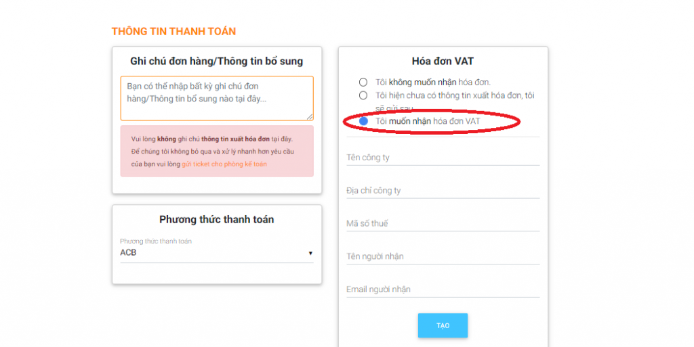
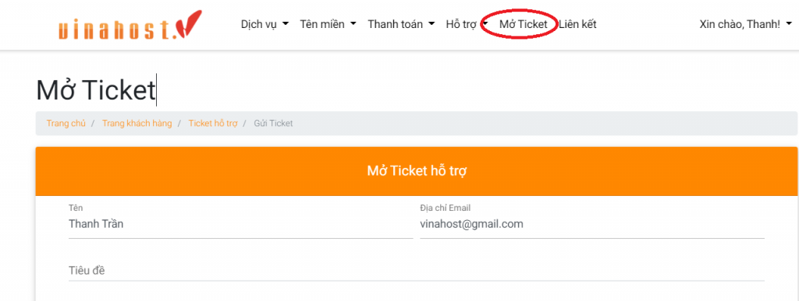
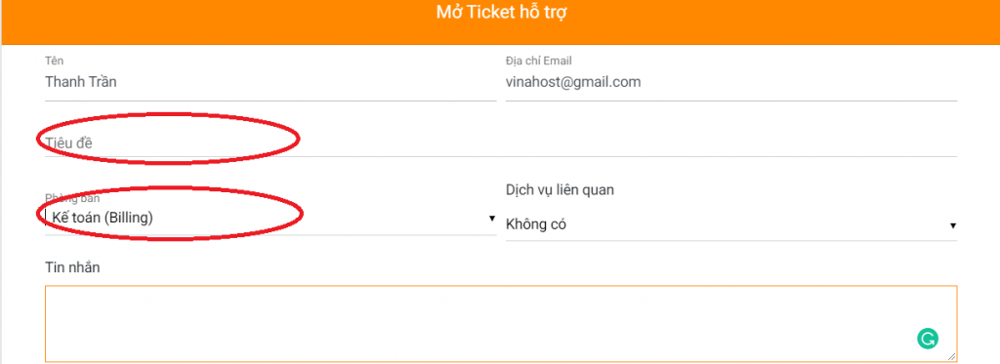
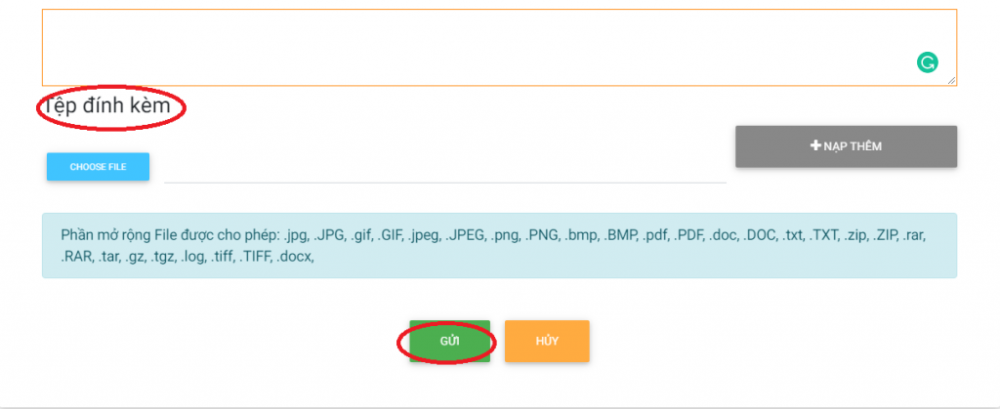
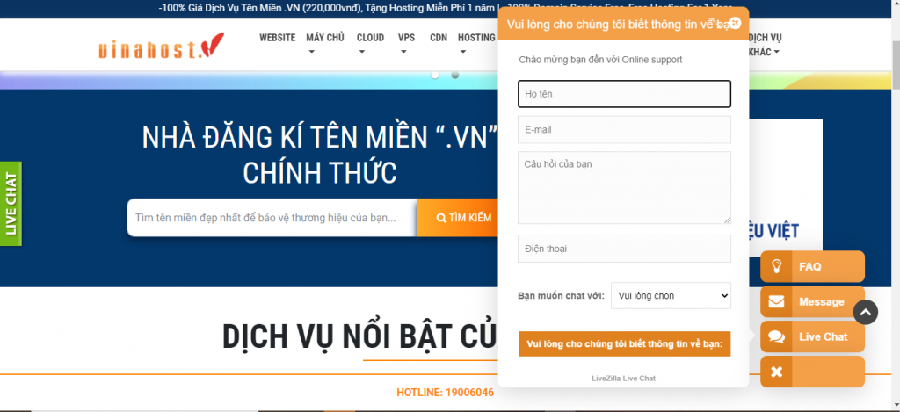

Bài viết này nhằm mục đích hướng dẫn Quý khách hàng cung cấp thông tin xuất hoá đơn hoặc báo thay đổi thông tin xuất hoá đơn đã cung cấp ban đầu.

## Hướng dẫn thực hiện

Khi Quý khách hàng có nhu cầu xuất hoá đơn hoặc thay đổi thông tin xuất hoá đơn do phía công ty có thay đổi tên, địa chỉ, mail gởi hoá đơn hoặc chuyển sang xuất theo thông tin công ty khác. Quý khách có thể chọn các cách sau để thông tin đến VinaHost:

- **Cách 1:** Cung cấp thông tin xuất hoá đơn ngay tại đơn hàng khi khách hàng order dịch vụ _(quý khách nên chọn cách này)._

- **Cách 2:** Thông báo từ hệ thống quản lý của Quý khách tại VinaHost.

**Bước 1**: Quý khách đăng nhập vào tài khoản quản lý tại https://secure.vinahost.vn/ac/clientarea.php

**Bước 2**: Chọn Mở ticket

Tiếp theo, điền thông tin tiêu đề và nội dung cần thay đổi, lưu ý chọn phòng kế toán.

Nếu có file đính kèm, Quý khách có thể thêm ở mục chọn file đính kèm:

**Bước 3**: Chọn gửi ở cuối trang, kết thúc quá trình thông báo, VinaHost sẽ trả lời trực tiếp vào yêu cầu này để thông báo đã cập nhật thông tin hoàn tất.

- **Cách 3**: Gọi điện thoại đến tổng đài 1900 6046 -> **nhấn phím 4** và cung cấp thông tin trực tiếp đến nhân viên hỗ trợ của phòng kế toán.
- **Cách 4**_**:**_  Đến trực tiếp văn phòng làm việc của VinaHost và cung cấp thông tin thay đổi với bộ phận hỗ trợ.
- **Cách** **5**: Cung cấp thông tin xuất hoá đơn cho phòng kinh doanh/chăm sóc khách hàng khi cung cấp thông tin làm hợp đồng, Phòng kinh doanh sẽ hỗ trợ chuyển thông tin xuất đến Phòng kế toán.
- **Cách 6**_**:**_ Quý khách vào trang **Vinahost.vn -> Livechat** -> **Điền thông tin** của quý khách -> Chọn **Billing** -> Vui lòng cho chúng tôi thông tin về bạn -> **Chờ kết nổi để được hỗ trợ**.

## Các quy định về việc xuất hoá đơn

Quý khách hàng vui lòng lưu ý các điểm sau:

- Trong thời hạn **01 ngày** kể từ ngày thanh toán, vui lòng liên hệ phòng kế toán để cung cấp các thông tin xuất hóa đơn gồm:

_\- Tên công ty_ _\- Mã số thuế công ty_ _\- Địa chỉ công ty_ _\- Mail nhận hoá đơn_

- Vinahost không giải quyết các trường hợp:

\- _Yêu cầu xuất hóa đơn phát sinh tại thời điểm ngoài mốc 01 ngày kể từ ngày thanh toán dịch vụ muốn xuất hóa đơn._ _\- Yêu cầu xuất lại hoá đơn (do mất, thất lạc mà nguyên nhân từ phía khách hàng, hoặc do khách hàng cung cấp sai thông tin hoặc có thay đổi thông tin mà không thông báo)._

- Trường hợp khách hàng đã cung cấp thông tin xuất hóa đơn nhưng không nhận được hoá đơn, vui lòng liên hệ với bộ phận kế toán của VinaHost qua tổng đài 1900.6046 ext. 4 hoặc gởi mail về [billing@vinahost.vn](mailto:billing@vinahost.vn)  để được hỗ trợ.

Cảm ơn quý khách!

> **THAM KHẢO CÁC DỊCH VỤ TẠI [VINAHOST](https://vinahost.vn/)**
> 
> **\>>** [**SERVER**](https://vinahost.vn/thue-may-chu-rieng/) **–** [**COLOCATION**](https://vinahost.vn/colocation.html) – [**CDN**](https://vinahost.vn/dich-vu-cdn-chuyen-nghiep)
> 
> **\>> [CLOUD](https://vinahost.vn/cloud-server-gia-re/) – [VPS](https://vinahost.vn/vps-ssd-chuyen-nghiep/)**
> 
> **\>> [HOSTING](https://vinahost.vn/wordpress-hosting)**
> 
> **\>> [EMAIL](https://vinahost.vn/email-hosting)**
> 
> **\>> [WEBSITE](http://vinawebsite.vn/)**
> 
> **\>> [TÊN MIỀN](https://vinahost.vn/ten-mien-gia-re/)**