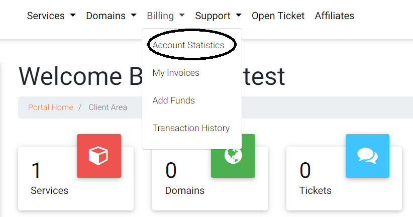
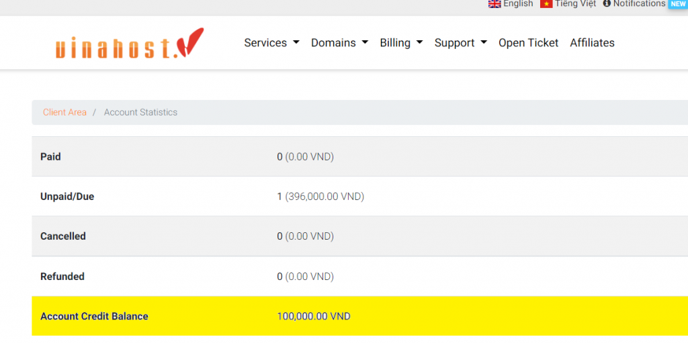
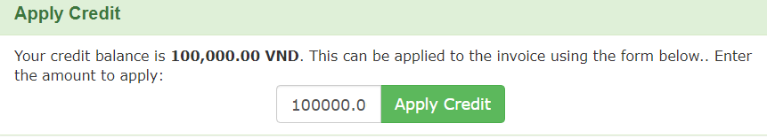
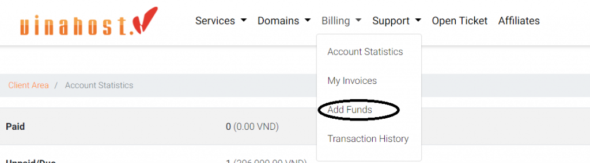
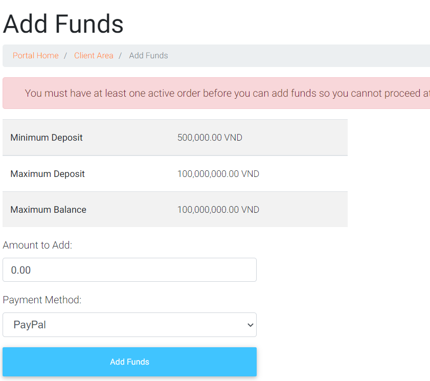
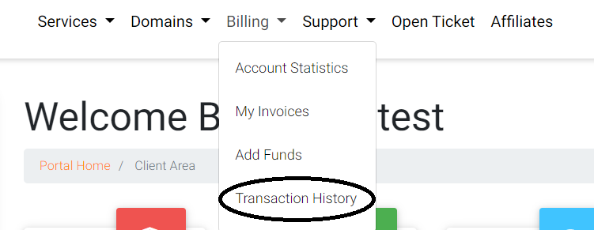

Bài viêt này sẽ hướng dẫn bạn cách **Kiểm Tra Số Dư Và Thanh Toán Hóa Đơn Tại VinaHost**. Nếu cần hỗ trợ, xin vui lòng liên hệ VinaHost qua Hotline 1900 6046 hoặc email về billing@vinahost.vn.

## Lợi ích của việc nạp tiền sẵn vào tài khoản VinaHost

Ngoài việc thanh toán trực tiếp vào hóa đơn cần thanh toán, các khách hàng tại VinaHost có thể dùng một phương thức thanh toán khác đó là nạp sẵn tiền vào tài khoản (gọi là số dư tài khoản) để có thể kịp thời thanh toán khi cần thiết. Việc này sẽ thuận tiện hơn cho các khách hàng cần thanh toán dịch vụ vào các dịp ngày nghỉ/Lễ/Tết ((ngoại trừ thanh toán tên miền và kích hoạt mới dịch vụ bản quyền SSL, cho thuê chỗ đặt và máy chủ).

## Hướng dẫn thực hiện

- **Bước 1**: Để kiểm tra số dư hiện có, bạn cần có tài khoản trang quản lý dịch vụ của VinaHost tại [https://secure.vinahost.vn/ac/clientarea.php](https://secure.vinahost.vn/ac/clientarea.php), nếu chưa có bạn có thể đăng ký [**tại đây**](https://secure.vinahost.vn/ac/register.php).

Sau khi đăng nhập vào trang https://secure.vinahost.vn/ac/clientarea.php, bạn vào menu **Thanh toán**, chọn **Thống kê tài khoản.**

Quý khách sẽ thấy số tiền hiện tại trong tài khoản ở dòng **Account Credit Balance.**

- **Bước 2:** Sau khi kiểm tra số dư tài khoản, bạn có thể thực hiện thanh toán các hóa đơn bằng số dư này bằng cách  truy cập **billing**, chọn **My Invoices ->** Chọn hóa đơn cần thanh toán.

- **Bước 3**: Thanh toán bằng tiền trong tài khoản

Chọn Apply Credit Card để dung tiền thanh toán hóa đơn.

- **Bước 4:** Tạo hóa đơn nạp tiền vào tài khoản tại VinaHost

Quý khách vào thanh Menu chọn Billing chọn **Add Funds**

Sau đó, nhập số tiền mình muốn thêm tiền vào tài khoản ở ô **Amount to Add.**

_**\*\*\*Lưu ý:** Số tiền tối thiểu là 500.000 VND (Năm trăm ngàn Việt Nam đồng) và tối đa là 100.000.000 VND (Một trăm triệu Việt Nam đồng)_

Chọn phương thức thanh toán tại ô **Payment Method ->** Chọn **Add Funds** để hoàn thành việc tạo hóa đơn thêm tiền vào tài khoản.

- **Bước 5:** Kiểm tra lịch sử số tiền trong tài khoản đã sử dụng

Quý khách vào thanh menu chọn **Transaction History**

Tại đây, Quý khách có thể xem lại lịch sử dùng tiền trong tài khoản để thanh toán từng hóa đơn cùng số tiền tương ứng.

Nếu có thắc mắc thêm, Quý khách hàng vui lòng liên số tổng đài 1900.6046 ext 4 hoặc gởi mail về [billing@vinahost.vn](mailto:billing@vinahost.vn) để được hỗ trợ.

> **THAM KHẢO CÁC DỊCH VỤ TẠI [VINAHOST](https://vinahost.vn/)**
> 
> **\>>** [**SERVER**](https://vinahost.vn/thue-may-chu-rieng/) **–** [**COLOCATION**](https://vinahost.vn/colocation.html) – [**CDN**](https://vinahost.vn/dich-vu-cdn-chuyen-nghiep)
> 
> **\>> [CLOUD](https://vinahost.vn/cloud-server-gia-re/) – [VPS](https://vinahost.vn/vps-ssd-chuyen-nghiep/)**
> 
> **\>> [HOSTING](https://vinahost.vn/wordpress-hosting)**
> 
> **\>> [EMAIL](https://vinahost.vn/email-hosting)**
> 
> **\>> [WEBSITE](http://vinawebsite.vn/)**
> 
> **\>> [TÊN MIỀN](https://vinahost.vn/ten-mien-gia-re/)**