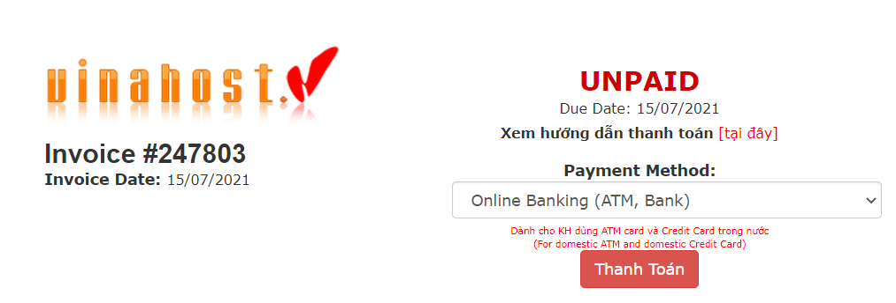
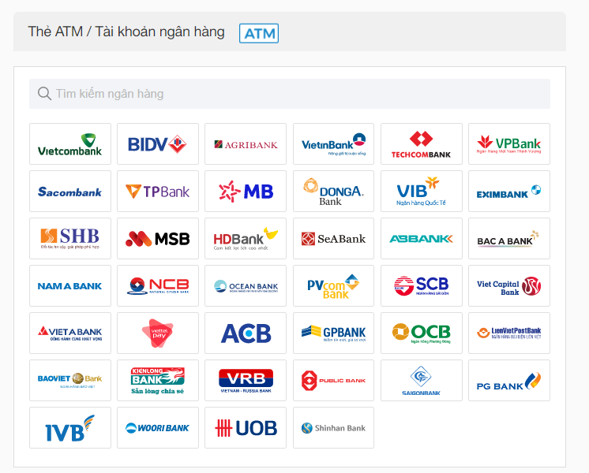
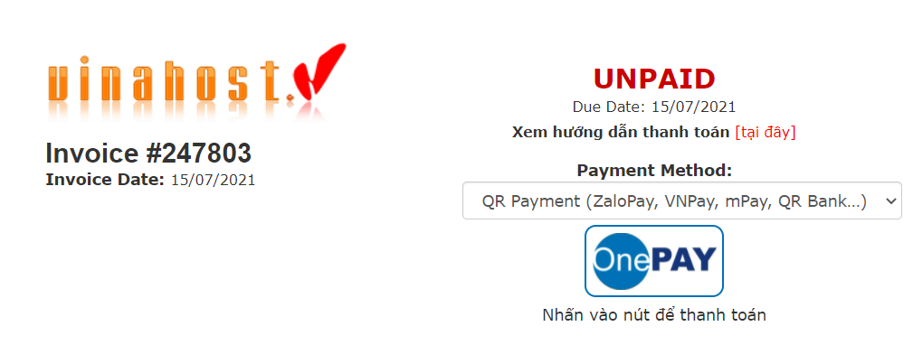
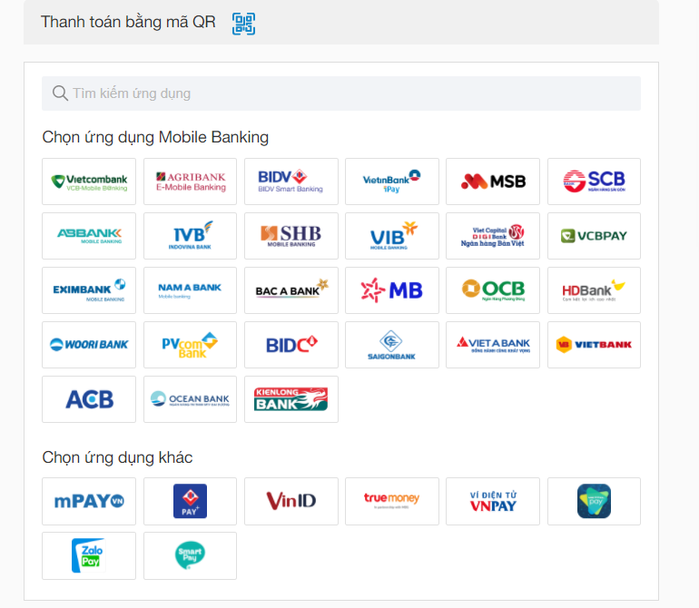
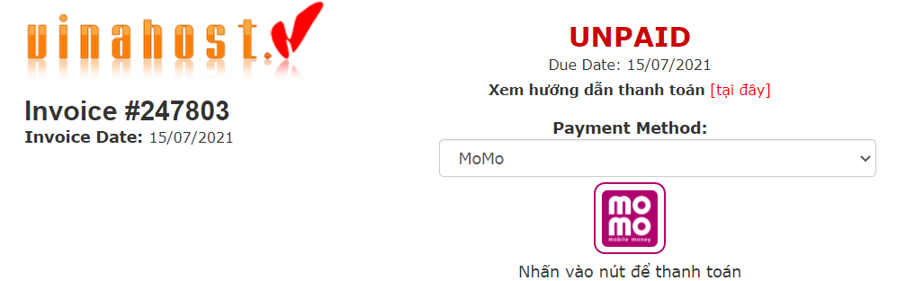
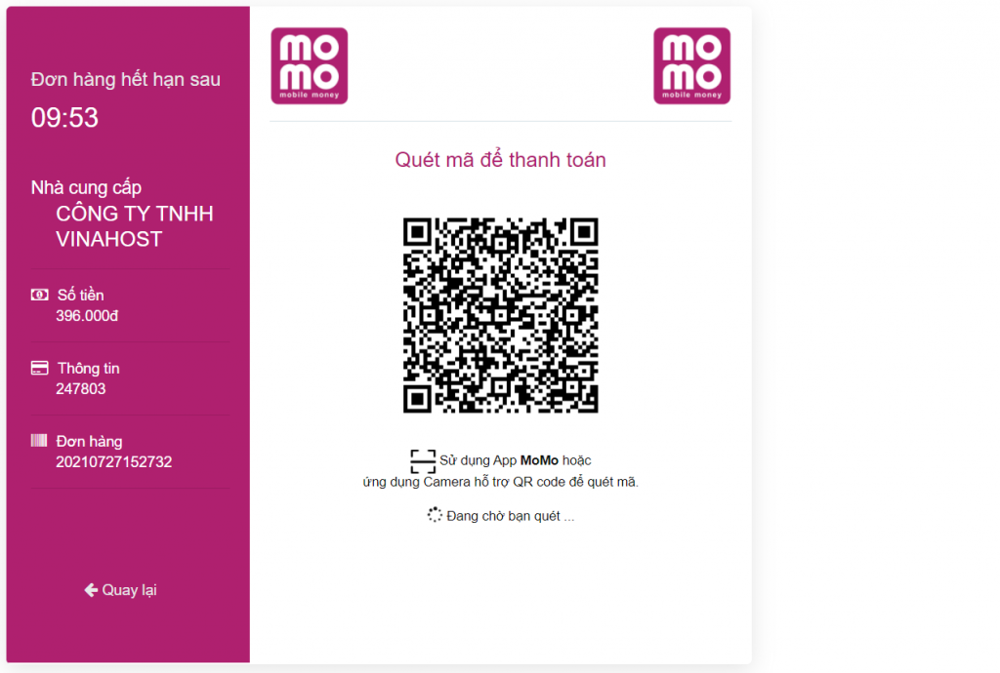

Bài viết này sẽ hướng dẫn quý khách **Thanh Toán Trực Tuyến - Online Payment** tại VinaHost. Nếu quý khách cần hỗ trợ, xin vui lòng liên hệ VinaHost qua Hotline 1900 6046, email về billing@vinahost.vn hoặc chat với VinaHost qua livechat https://livechat.vinahost.vn/chat.php.

<iframe title="YouTube video player" src="https://www.youtube.com/embed/kN28WPcX6ao" width="560" height="315" frameborder="0" allowfullscreen="allowfullscreen"></iframe>

## **Thanh toán qua** **Online Banking (ATM, Bank)**

Đây là hình thức thanh toán thông qua cổng **Onepay nội địa**, sử dụng thẻ ATM và internet banking và dành riêng cho khách hàng Việt Nam.

_\*\*\* **Lưu ý:**_ _Để đủ điều kiện thực hiện thanh toán trực tuyến, tùy theo từng ngân hàng mà bạn phải thực hiện đăng ký chức năng thanh toán trên Internet tại quầy giao dịch của ngân hàng hoặc trên kênh trực tuyến)_

Quý khách vui lòng thanh toán theo các bước sau:

\- **Bước 1**: Đăng nhập vào tài khoản của Quý khách tại VinaHost ở [https://secure.vinahost.vn/ac/clientarea.php](https://secure.vinahost.vn/ac/clientarea.php)

\- **Bước 2**: Chọn Thanh toán – Quản lý hóa đơn – Hóa đơn cần thanh toán

Ở phần Hình thức thanh toán, chọn **Online Banking (ATM, Bank)**

\+ Chọn Thanh toán

\+ Chọn ngân hàng để thanh toán, đăng nhập và thanh toán hóa đơn.

\+ Chọn tiếp tục.

\+ Đăng nhập vào hệ thống ngân hàng và tiến hành thanh toán.

Sẽ có mã OTP gửi về điện thoại của quý khách để hoàn thành thanh toán.

\- **Bước 3**: Nhận kết quả thanh toán thành công:

Quý khách sẽ chờ trong vài giây để nhận kết quả xử lý từ cổng thanh toán. Chúng tôi sẽ gửi email xác nhận đơn hàng và kết quả thanh toán thành công cho quý khách.

**\*\*\* Lưu ý:** Trong trường hợp Quý khách nhận được kết quả thông báo giao dịch không thành công (Your payment was NOT successful, Your payment is declined by the Issues). Nguyên nhân không thành công có thể do:

- Quý khách nhập sai thông tin.
- Thẻ của quý khách chưa được Ngân hàng phát hành kích hoạt chức năng thanh toán trực tuyến. Quý khách vui lòng liên hệ với ngân hàng phát hành để kích hoạt.

Trường hợp quý khách điền đúng thông tin nhưng không nhận được kết quả xác nhận thanh toán trên website, Quý khách vui lòng **không** thực hiện thanh toán lặp lại và liên hệ cho chúng tôi để xác nhận lại kết quả thanh toán qua **_email_** [**_billing@vinahost.vn_**](mailto:billing@vinahost.vn) **_hoặc gọi điện thoại tới 1900 6046 ext. 4_**

##  **Thanh toán qua** **QR Payment (ZaloPay, VNPay, mPay, QR Bank…)**

Đây là hình thức thanh toán thông qua cổng **QR Payment** và dành riêng cho **khách hàng Việt Nam**.

\- **Bước 1**: Đăng nhập vào tài khoản của Quý khách tại Vinahost ở [https://secure.vinahost.vn/ac/clientarea.php](https://secure.vinahost.vn/ac/clientarea.php)

\- **Bước 2**: Chọn Thanh toán – Quản lý hóa đơn – Hóa đơn cần thanh toán

Ở phần Hình thức thanh toán chọn **QR Payment (ZaloPay, VNPay, mPay, QR Bank…)**

\+ Bấm vào nút Onepay để thanh toán

\+ Chọn ứng dụng Mobile Banking/ứng dụng khác (ZaloPay, mPay, SmartPay…) để thanh toán.

Đăng nhập và quét mã QR để thanh toán hóa đơn.

\- **Bước 3**: Nhận kết quả thanh toán thành công:

Quý khách sẽ chờ trong vài giây để nhận kết quả xử lý từ cổng thanh toán. Chúng tôi sẽ gửi email xác nhận đơn hàng và kết quả thanh toán thành công cho quý khách.

Trường hợp quý khách điền đúng thông tin nhưng không nhận được kết quả xác nhận thanh toán trên website, Quý khách vui lòng **không** thực hiện thanh toán lặp lại và liên hệ cho chúng tôi để xác nhận lại kết quả thanh toán: **_email_** [**_billing@vinahost.vn_**](mailto:billing@vinahost.vn) **_hoặc gọi điện thoại tới 1900 6046 – ext 4_**

## **Thanh toán qua** **MoMo**

Đây là hình thức thanh toán thông qua ví MoMo và dành riêng cho khách hàng Việt Nam.

\- **Bước 1**: Đăng nhập vào tài khoản của Quý khách tại VinaHost ở [https://secure.vinahost.vn/ac/clientarea.php](https://secure.vinahost.vn/ac/clientarea.php)

\- **Bước 2**: Chọn Thanh toán – Quản lý hóa đơn – Hóa đơn cần thanh toán

Ở phần Hình thức thanh toán chọn **MoMo**

\+ Chọn Thanh toán

\+ Quét mã để tiến hành thanh toán

\- **Bước 3**: Nhận kết quả thanh toán thành công :

Quý khách sẽ chờ trong vài giây để nhận kết quả xử lý từ cổng thanh toán. Chúng tôi sẽ gửi email xác nhận đơn hàng và kết quả thanh toán thành công cho quý khách.

Trường hợp quý khách điền đúng thông tin nhưng không nhận được kết quả xác nhận thanh toán trên website, Quý khách vui lòng **không** thực hiện thanh toán lặp lại và liên hệ cho chúng tôi để xác nhận lại kết quả thanh toán: **_email_** [**_billing@vinahost.vn_**](mailto:billing@vinahost.vn) **_hoặc gọi điện thoại tới 1900 6046 ext. 4._**

Cảm ơn quý khách

> **THAM KHẢO CÁC DỊCH VỤ TẠI [VINAHOST](https://vinahost.vn/)**
> 
> **\>>** [**SERVER**](https://vinahost.vn/thue-may-chu-rieng/) **–** [**COLOCATION**](https://vinahost.vn/colocation.html) – [**CDN**](https://vinahost.vn/dich-vu-cdn-chuyen-nghiep)
> 
> **\>> [CLOUD](https://vinahost.vn/cloud-server-gia-re/) – [VPS](https://vinahost.vn/vps-ssd-chuyen-nghiep/)**
> 
> **\>> [HOSTING](https://vinahost.vn/wordpress-hosting)**
> 
> **\>> [EMAIL](https://vinahost.vn/email-hosting)**
> 
> **\>> [WEBSITE](http://vinawebsite.vn/)**
> 
> **\>> [TÊN MIỀN](https://vinahost.vn/ten-mien-gia-re/)**