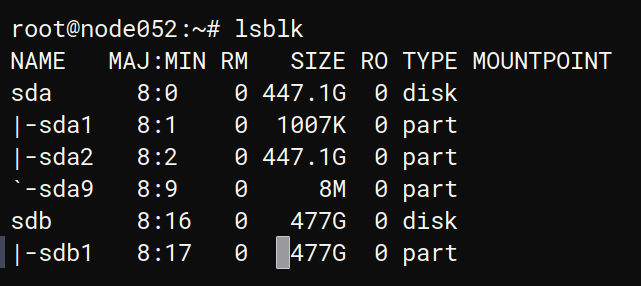
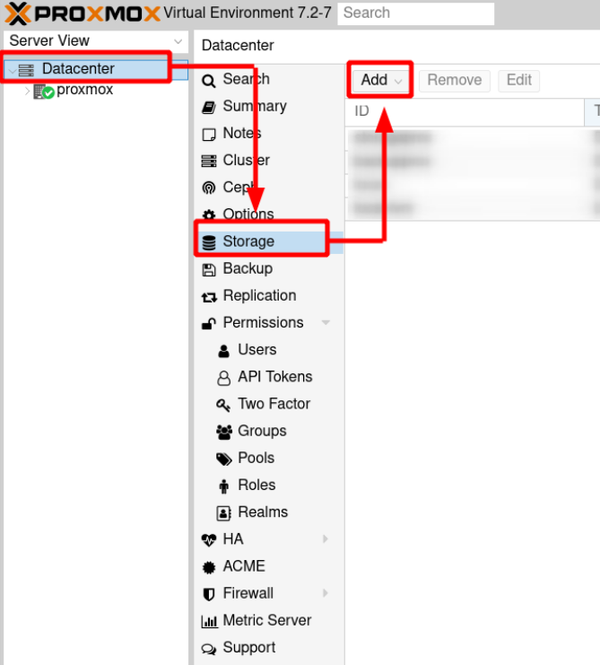
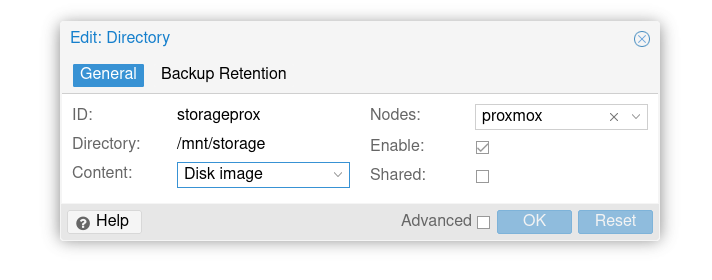

Bài viết này sẽ hướng dẫn bạn cách **Add Storage Trong Proxmox**. Nếu bạn cần hỗ trợ, xin vui lòng liên hệ VinaHost qua **Hotline 1900 6046 ext.3, email về support@vinahost.vn hoặc chat với VinaHost qua livechat https://livechat.vinahost.vn/chat.php**.

## 1\. Mục tiêu bài viết

Qua bài viết này, người dùng có thể tự thao tác

\- Cách tạo partition và định dạng một ổ cứng HDD mới gắn vào

\- Các trường hợp yêu cầu tạo phân vùng host VM, phân vùng Backup

## 2\. Hướng dẫn thực hiện Add Storage Trong Proxmox

**Bước 1: Xác định ổ cứng HDD**

Kiểm tra **layout** của toàn bộ ổ cứng đang gắn vào server.

  root@node052:~# _lsblk_

  NAME   MAJ:MIN RM   SIZE RO TYPE MOUNTPOINT

  sda      8:0    0 447.1G  0 disk
  |-sda1   8:1    0  1007K  0 part
  |-sda2   8:2    0 447.1G  0 part
  \`-sda9   8:9    0     8M  0 part
  **sdb      8:16   0   477G  0 disk** 

Trong ví dụ trên: ta có 2 ổ **sda** và **sdb**. Ổ **sda** đang được sử dụng bởi **OS**. Vì vậy chúng ta sẽ tiến hành định dạng ổ **sdb** mới thành 1 phân vùng thứ 2 để host **VMs**.

**Bước 2: Format ổ cứng HDD**

Tại bước này, chúng ta sẽ sử dụng công cụ **parted** có sẵn trên hệ điều hành.

\- Nếu chưa có chúng ta cần tiến hành **install** thêm **package**:

  $ apt install parted

\- Tiến hành **format** sạch ổ cứng

  $ wipefs /dev/sdb

\- Tạo mới phân vùng **GPT** trên ổ **sdb**

  $ parted /dev/sdb mklabel gpt

\- Tạo phân vùng **primary** với định dạng **filesystem** là **ext4** và sử dụng **100%** dung lượng **disk**

  $ parted -a opt /dev/sdb mkpart primary ext4 0% 100%

_\-_ Tạo **label** cho phân vùng **sdb1** trong trường hợp thêm / rút bớt ổ cứng có thể làm thay đổi tên của ổ.

  $ mkfs.ext4 -L storageprox /dev/sdb1

_\-_ Kiểm tra lại bằng lệnh `lsblk -fs` để check **filesystem** type và label

  $ lsblk -fs

_\-_ Tạo thư mục để `mount` phân vùng **sdb1** vào

  $ mkdir -p /mnt/storage

\- Thêm entry vào file `/etc/fstab`, mỗi lần **reboot** thì phân vùng **sdb1** sẽ tự **mount** vào /**mnt/storage**

  $ vim /etc/fstab

Add thêm dòng bên dưới vào file **fstab**

_LABEL=storageprox /mnt/data ext4 defaults 0 2_

\- **Mount** thủ công **sdb1** vào **/mnt/storage**

  $ mount -t ext4 /dev/sdb1 /mnt/storage

**Bước 3: Truy cập vào Proxmox GUI và thêm phân vùng mới nhầm mục đích sử dụng để host VMs**

Chọn **Add** và cấu hình như ảnh bên dưới, chọn **OK** là hoàn tất quá trình.

Chúc bạn thực hiện **Add Storage Trong Proxmox** thành công!

> **THAM KHẢO CÁC DỊCH VỤ TẠI [VINAHOST](https://vinahost.vn/)**
> 
> **\>>** [**SERVER**](https://vinahost.vn/thue-may-chu-rieng/) **–** [**COLOCATION**](https://vinahost.vn/colocation.html) – [**CDN**](https://vinahost.vn/dich-vu-cdn-chuyen-nghiep)
> 
> **\>> [CLOUD](https://vinahost.vn/cloud-server-gia-re/) – [VPS](https://vinahost.vn/vps-ssd-chuyen-nghiep/)**
> 
> **\>> [HOSTING](https://vinahost.vn/wordpress-hosting)**
> 
> **\>> [EMAIL](https://vinahost.vn/email-hosting)**
> 
> **\>> [WEBSITE](http://vinawebsite.vn/)**
> 
> **\>> [TÊN MIỀN](https://vinahost.vn/ten-mien-gia-re/)**
