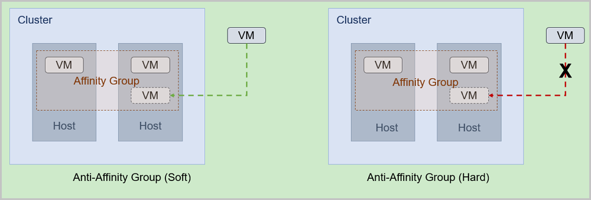
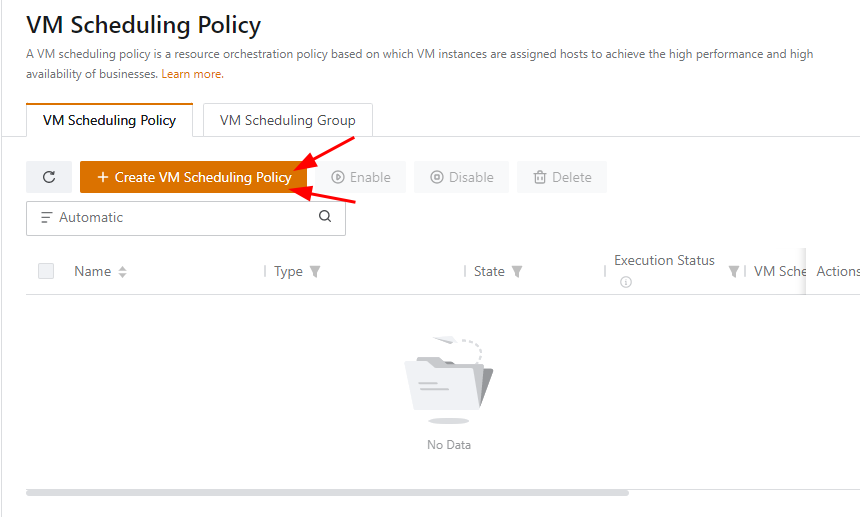
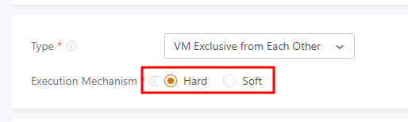
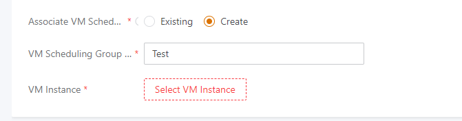
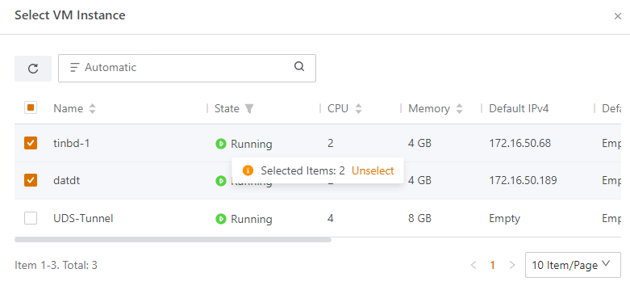

Bài viết này sẽ giới thiệu về **Affinity Group Và Cách Sử Dụng.** Nếu bạn cần hỗ trợ, xin vui lòng liên hệ VinaHost qua **Hotline 1900 6046 ext. 3**, email về [support@vinahost.vn](mailto:support@vinahost.vn) hoặc chat với VinaHost qua livechat [https://livechat.vinahost.vn/chat.php](https://livechat.vinahost.vn/chat.php).

## **1\. Giới thiệu chung**

**Định nghĩa**: là một chính sách điều phối đơn giản được thiết kế cho các tài nguyên **IaaS** để đảm bảo doanh nghiệp của bạn có hiệu suất cao hoặc tính sẵn sàng cao.

## **2\. Affinity Group Policy**

**vCloud** cung cấp 2 **affinity group policy** nhằm quản lý tốt hơn các **VM instance**:

- **Anti-affinity group (soft):** Chỉ định VM instance trong affinity group tới các host khác càng nhiều càng tốt. Nếu không còn host nào có thể chứa nữa, VM sẽ được chỉ định vị trí ngẫu nhiên. Thường được dùng để tăng hiệu suất hệ thống tổng thể

- **Anti-affinity group (hard)**: Phân bổ chặt chẽ VM trong affinity group tới các host khác. Nếu không còn host nào khác nữa, hoạt động phân bổ đó sẽ thất bại. Bạn có thể muốn triển khai hai VM instance chạy database đang hoạt động và database dự phòng trên các máy chủ khác nhau để đảm bảo tính sẵn sàng cao (giảm downtime khi gặp sự cố).

## **3\. VM Scheduling Policy**

Trong hệ thống cloud của VinaHost, **Affinity Group** sẽ được đổi tên thành **VM Scheduling Policy**

Để tạo một **Affinity Group**, bạn theo đường dẫn:

- Resource Center/Resource Pool/VM Scheduling Policy

Để tạo một group mới ta chọn **Create VM Scheduling Policy**

Tiếp theo, ta cung cấp các thông tin cần thiết. Quan trọng ở phần chọn policy cho group phù hợp với mục đích sửa dụng của mình

Cuối cùng là chọn các** VM instance** muốn add vào group đang tạo và chọn **OK** để hoàn thành quá trình

Chúc bạn thực hiện thành công!

> **THAM KHẢO CÁC DỊCH VỤ TẠI [VINAHOST](https://vinahost.vn/)**
> 
> **\>>** [**SERVER**](https://vinahost.vn/thue-may-chu-rieng/) **–** [**COLOCATION**](https://vinahost.vn/colocation.html) – [**CDN**](https://vinahost.vn/dich-vu-cdn-chuyen-nghiep)
> 
> **\>> [CLOUD](https://vinahost.vn/cloud-server-gia-re/) – [VPS](https://vinahost.vn/vps-ssd-chuyen-nghiep/)**
> 
> **\>> [HOSTING](https://vinahost.vn/wordpress-hosting)**
> 
> **\>> [EMAIL](https://vinahost.vn/email-hosting)**
> 
> **\>> [WEBSITE](http://vinawebsite.vn/)**
> 
> **\>> [TÊN MIỀN](https://vinahost.vn/ten-mien-gia-re/)**
