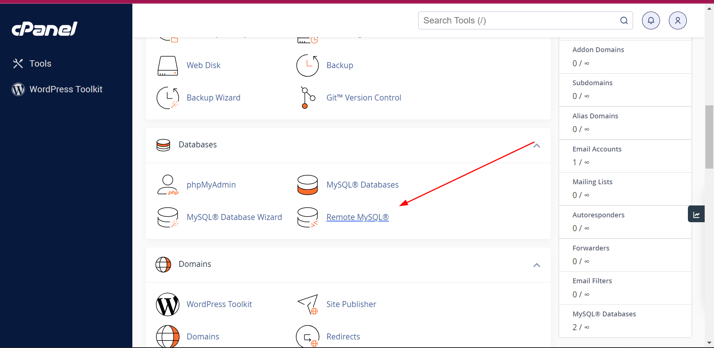
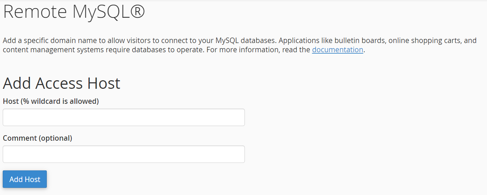
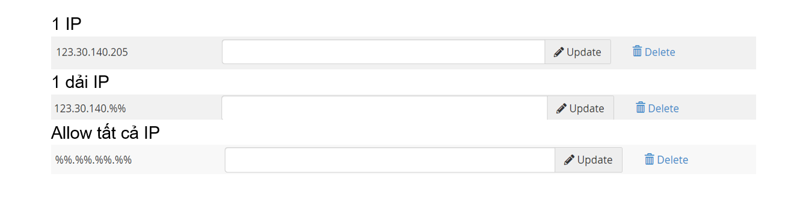
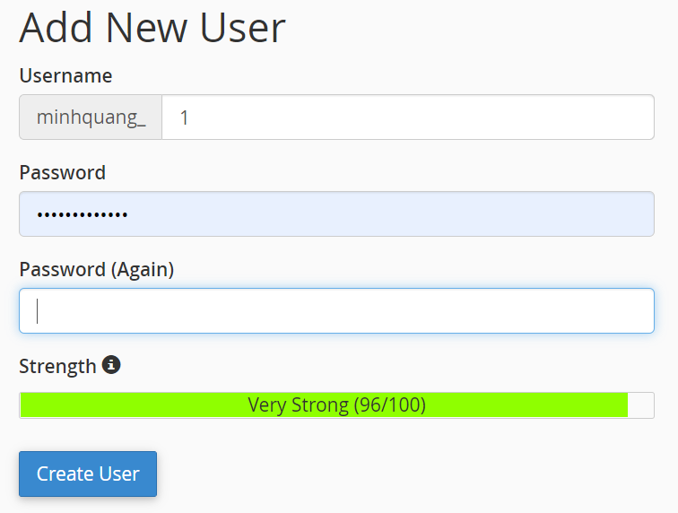
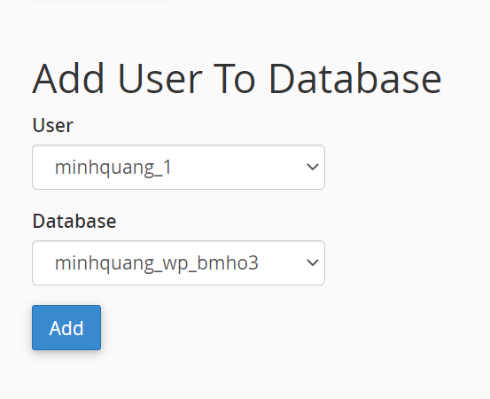
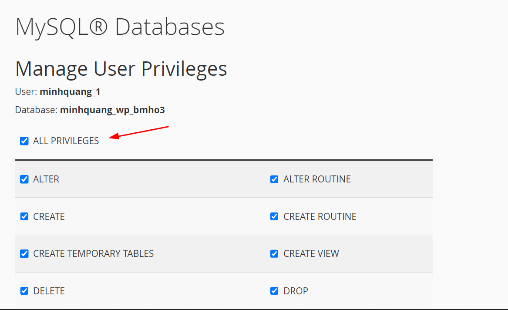
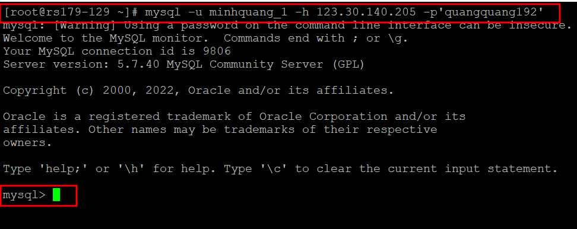
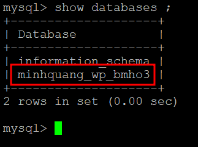

Bài viết này hướng dẫn bạn **Allow Remote MySQL Databases Bằng cPanel**. Nếu bạn cần hỗ trợ, xin vui lòng liên hệ VinaHost qua **Hotline 1900 6046 ext.3**, email về [support@vinahost.vn](mailto:support@vinahost.vn) hoặc chat với VinaHost qua livechat [https://livechat.vinahost.vn/chat.php](https://livechat.vinahost.vn/chat.php).

## Hướng Dẫn Allow Remote MySQL Databases Bằng cPanel

B1: Trong giao diện cPanel, ở phần databases ta chọn Remote MySQL

B2: ở phần Add Access Host, ta có thể thêm các host có thể allow để remote access database.

Ta có thể thêm:

B3: Tạo một user để access vào databases

- Do không thể dùng tài khoản host, ta cần phải tạo 1 user và phân quyền để có thể truy cấp vào DB
- MySQL databases -> add new user

B4: Add user vừa tạo vào databases ta cần access

- MySQL databases -> Add User To Database

- Phân quyền cho user: Chọn vào all priviledge nếu muốn. Sau đó chọn make change

B5: Access remote MySQL với lệnh : mysql -u <user> -h <host> -p’<password>’

- mysql -u minhquang\_1 -h 30.140.205 -p’quangquang192’

- Khi ta dùng câu lệnh show databases thì chỉ thấy 1 databases mà ta đã add user vào.

Chúc bạn thực hiện Allow Remote MySQL Databases Bằng cPanel thành công!

> **THAM KHẢO CÁC DỊCH VỤ TẠI [VINAHOST](https://kb.vinahost.vn/)**
> 
> **\>>** [**SERVER**](https://vinahost.vn/thue-may-chu-rieng/) **–** [**COLOCATION**](https://vinahost.vn/colocation.html) – [**CDN**](https://vinahost.vn/dich-vu-cdn-chuyen-nghiep)
> 
> **\>> [CLOUD](https://vinahost.vn/cloud-server-gia-re/) – [VPS](https://vinahost.vn/vps-ssd-chuyen-nghiep/)**
> 
> **\>> [HOSTING](https://vinahost.vn/wordpress-hosting)**
> 
> **\>> [EMAIL](https://vinahost.vn/email-hosting)**
> 
> **\>> [WEBSITE](http://vinawebsite.vn/)**
> 
> **\>> [TÊN MIỀN](https://vinahost.vn/ten-mien-gia-re/)**
