Bài viết này sẽ hướng dẫn bạn cách back-up website WordPress bằng plugin All-in-One WP Migration. Các bước thực hiện như sau:

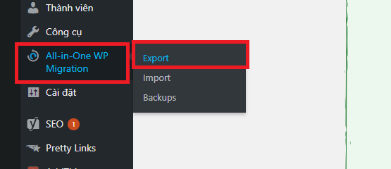

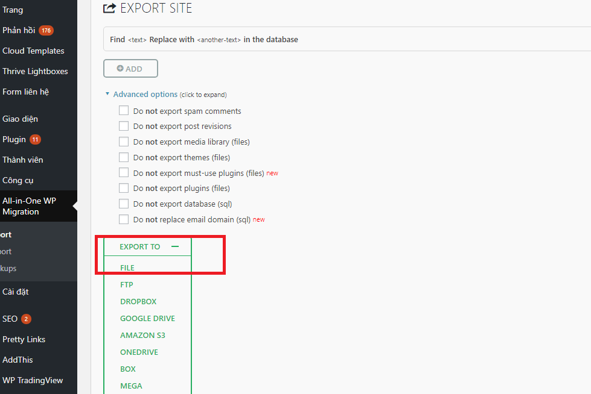

Sau khi nén xong plugin sẽ đưa link để download hoặc vào thủ công đường dẫn: **public\_html/wp-content/ai1wm-backups** để lấy file backup:

**Cách restore website wordpress bằng plugin All-in-One WP Migration.**

\+ Cài đặt 1 trang wordpress mới hoàn toàn, cài thêm plugin All-in-One WP Migration

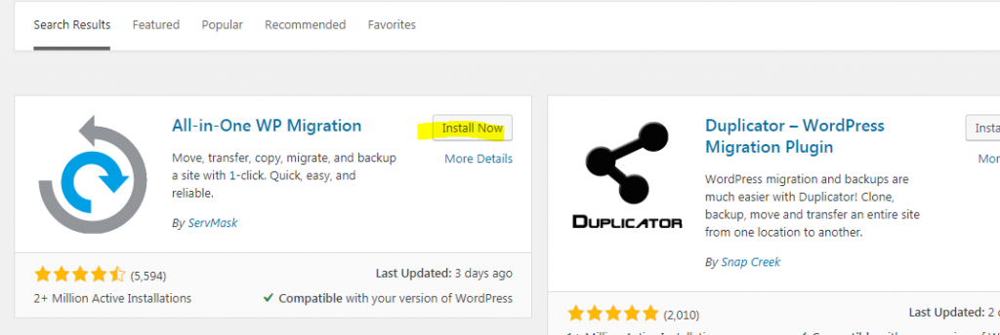

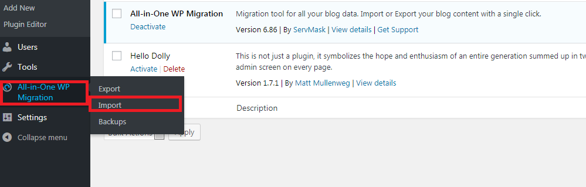

\+ Do giao diện Cpanel chỉ hỗ trợ chỉnh thông số upload tối đa là **1G** và post tối đa là **128MB** nên khi upload các file có dung lượng nhỏ ( < 128MB )thì không cần thao tác gì thêm, riêng nếu cần upload với dung lượng lớn hơn thì cần liên hệ với đội ngũ hỗ trợ của VinaHost tại [support@vinahost.vn](mailto:support@vinahost.vn) và yêu cầu tăng thêm các thông số upload và post\_max\_size. Ở ví dụ dưới đây là tăng lên 4GB cho cả 2 thông số

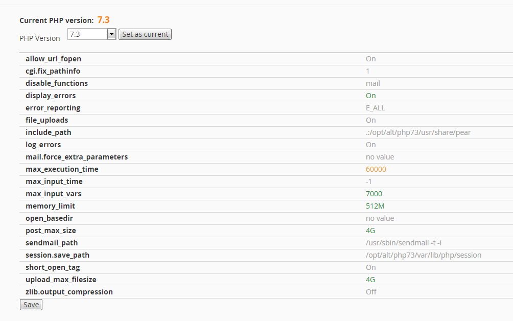

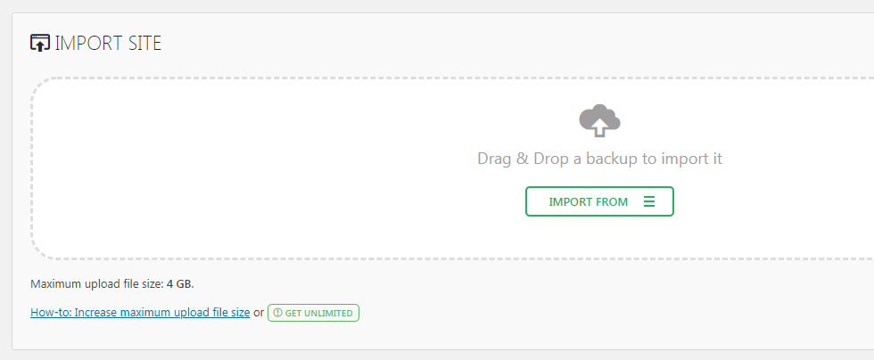

\-Tiến hành import from file và chờ đợi.

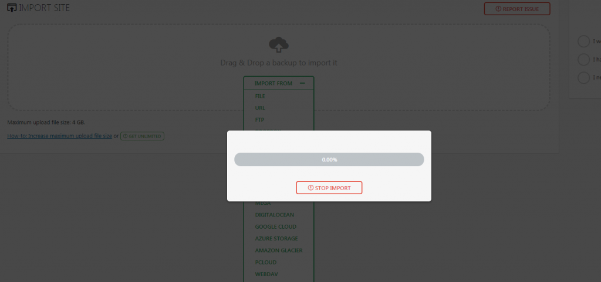

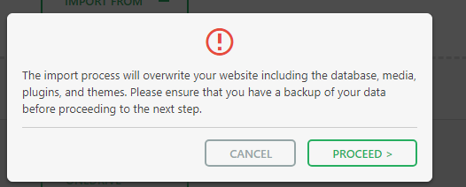

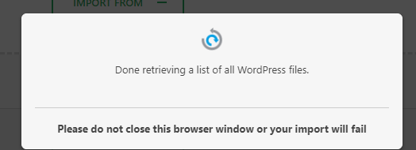

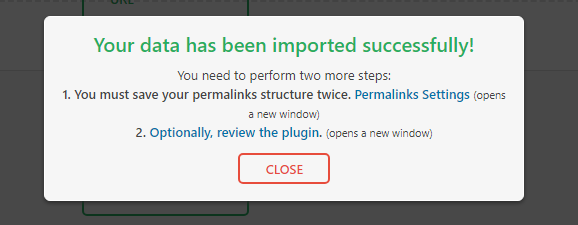

**Mở Permalinks Settings với Tab mới:**

 ** 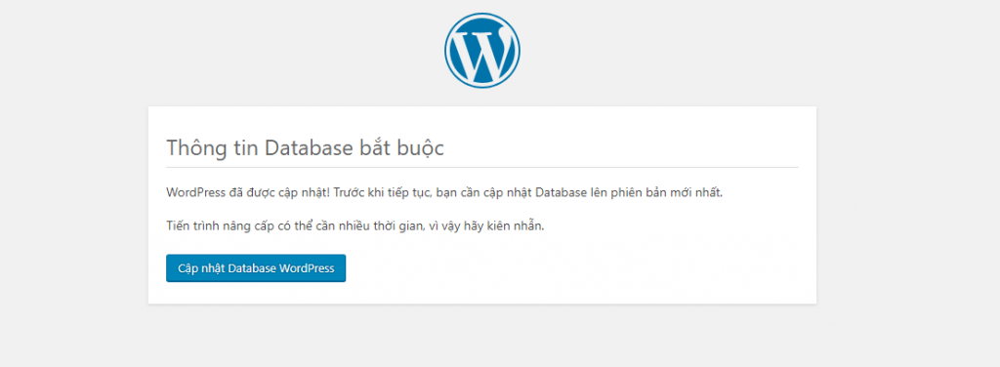**

**Cách tăng giới hạn 512MB của plugin** **All-in-One WP Migration miễn phí:**

\+ Đối với phiên bản 6.71 trở về trước, ta chỉ việc sửa giá trị Max File Size trong file: **/wp-content/plugins/all-in-one-wp-migration/constants.php**

Giá trị trên được tính là bytes nên nếu muốn phải convert từ GB hoặc MB xuống bytes.

\+ Đối với phiên bản 6.72 trở lên: (hoặc áp dụng với tất cả version – **bản mới nhất hiện tại – 6.86 đang bị lỗi, upload file quá lớn sẽ bị treo ở 30.42%**)

Sửa giá trị AI1WM\_MAX\_FILE\_SIZE lại, ví dụ 4GB là 4294967296. Nếu muốn 40GB thì sửa thành 4294967296 \* 10

\+ Nếu thấy giá trị này: 'AI1WM\_MAX\_FILE\_SIZE', 2 << 28 thì ta làm như sau:

'AI1WM\_MAX\_FILE\_SIZE', 2 << 28 \* 1.2 -> Tăng upload max lên 16GB.

Chúc các bạn thành công!

> **THAM KHẢO CÁC DỊCH VỤ TẠI VINAHOST**
> 
> **\>>** [**SERVER**](https://vinahost.vn/thue-may-chu-rieng/) **–** [**COLOCATION**](https://vinahost.vn/colocation.html) – [**CDN**](https://vinahost.vn/dich-vu-cdn-chuyen-nghiep)
> 
> **\>> [CLOUD](https://vinahost.vn/cloud-server-gia-re/) – [VPS](https://vinahost.vn/vps-ssd-chuyen-nghiep/)**
> 
> **\>> [HOSTING](https://vinahost.vn/wordpress-hosting)**
> 
> **\>> [EMAIL](https://vinahost.vn/email-hosting)**
> 
> **\>> [WEBSITE](http://vinawebsite.vn/)**
> 
> **\>> [TÊN MIỀN](https://vinahost.vn/ten-mien-gia-re/)**
> 
> **\>> [SSL](https://vinahost.vn/geotrust-ssl) – [LICENSE](https://vinahost.vn/bang-gia-license)**
