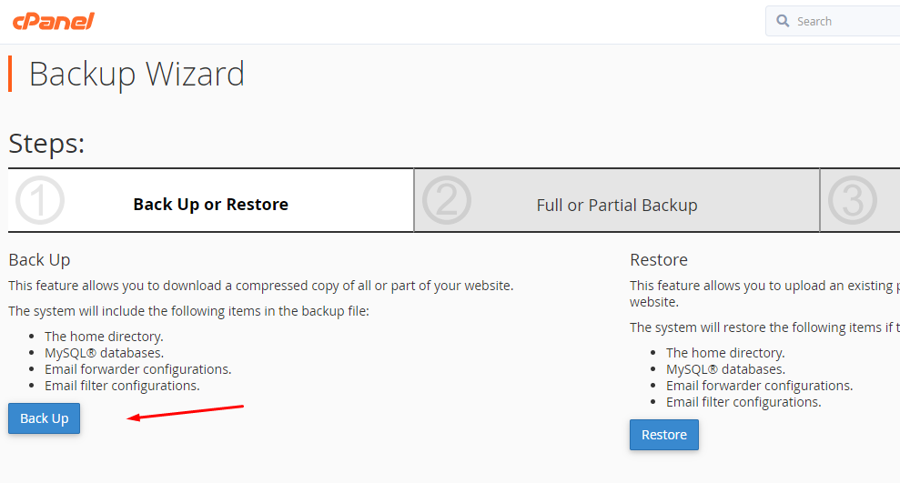

Bài viết này sẽ hướng dẫn bạn cách **Backup Dữ Liệu Website Trên Cpanel**. Nếu bạn cần hỗ trợ, xin vui lòng liên hệ VinaHost qua Hotline 1900 6046 ext.3, email về support@vinahost.vn hoặc chat với VinaHost qua livechat https://livechat.vinahost.vn/chat.php.

Bước 1: Truy cập Cpanel, tại đây chọn như hình:

Bước 2: Tại đây, chọn Back Up để backup toàn bọ file, soucre code web, cơ sở dữ liệu, các email chuyển tiếp và lọc email:

Bước 3: Sau đó chọn File Backup:

Bước 4: Sau đó click vào Generate Backup để download file Backup:

Chúc quý khách thực hiện thành công!

> **THAM KHẢO CÁC DỊCH VỤ TẠI [VINAHOST](https://kb.vinahost.vn/)**
> 
> **\>>** [**SERVER**](https://vinahost.vn/thue-may-chu-rieng/) **–** [**COLOCATION**](https://vinahost.vn/colocation.html) – [**CDN**](https://vinahost.vn/dich-vu-cdn-chuyen-nghiep)
> 
> **\>> [CLOUD](https://vinahost.vn/cloud-server-gia-re/) – [VPS](https://vinahost.vn/vps-ssd-chuyen-nghiep/)**
> 
> **\>> [HOSTING](https://vinahost.vn/wordpress-hosting)**
> 
> **\>> [EMAIL](https://vinahost.vn/email-hosting)**
> 
> **\>> [WEBSITE](http://vinawebsite.vn/)**
> 
> **\>> [TÊN MIỀN](https://vinahost.vn/ten-mien-gia-re/)**
