Bài viết này sẽ hướng dẫn bạn cách **Backup Và Restore OS Bằng Active Boot Disk**. Nếu bạn cần hỗ trợ, xin vui lòng liên hệ VinaHost qua **Hotline 1900 6046 ext.3, email về support@vinahost.vn hoặc chat với VinaHost qua livechat https://livechat.vinahost.vn/chat.php**.

**Active@ Boot Disk** là hệ điều hành hoạt động trên **USB/CD/DVD/(LiveCD)**, bao gồm các công cụ được hỗ trợ người sử dụng khi **Windows** gặp sự cố. Các công cụ này có thể cho phép thay đổi mật khẩu người dùng **Windows**, xóa/khôi phục dữ liệu, khôi phục các **partition** của đĩa v/v…

Sau khi boot được vào **Active Boot Disk**

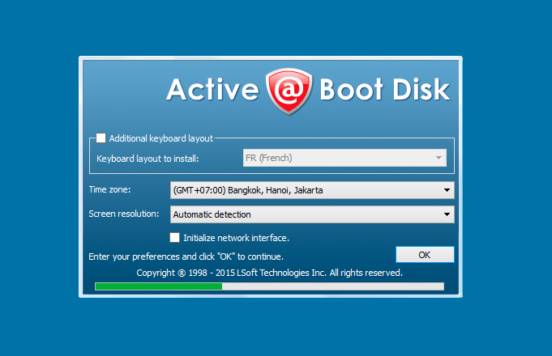

**Active@ Disk Image** là một phần mềm dùng để sao chép một bản sao chính xác của bất kỳ ổ đĩa máy tính (**HDD, SSD, USB, CD, DVD, Blu-ray, vv**) và lưu nó vào một thư mục. Các **Disk Image** có thể được sử dụng để sao lưu, nâng cấp máy tính hoặc các mục đích sao chép đĩa. Trong trường hợp mất máy tính, một hình ảnh sao lưu có thể được sử dụng để khôi phục hệ thống máy tính của bạn hoặc tìm và khôi phục bất kỳ tập tin cần thiết bên trong một hình ảnh.

Để sao lưu lại hay khôi phục lại những ổ đĩa cứng, USB, DVD, … thì phải cài đặt phần mềm **Active Disk Image** trên máy tính chạy hệ điều hành **Windows** trước hoặc tạo **USB Boot** như hướng dẫn bên dưới.

## 1\. Hướng dẫn Backup hệ điều hành bằng Active Boot Disk

**Bước 1:** Mở phần mềm Active Disk Image

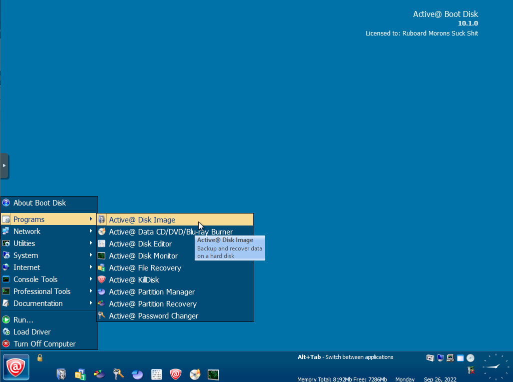

**Bước 2:** Chọn Disk to Image

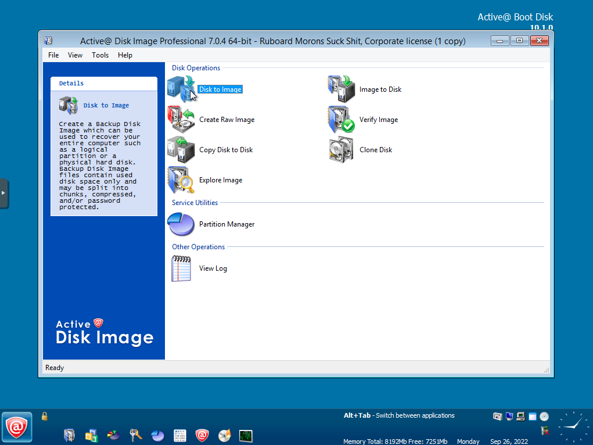

**Bước 3:** Chọn Full Backup và Next

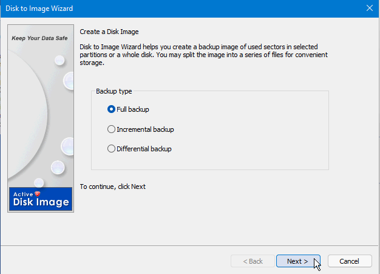

**Bước 4:** Chọn Disk 0 (nơi chứa hệ điều hành) và Next

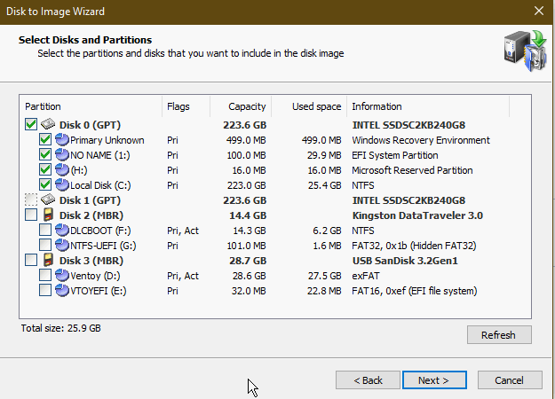

**Bước 5:** Chọn nơi lưu trữ file Backup

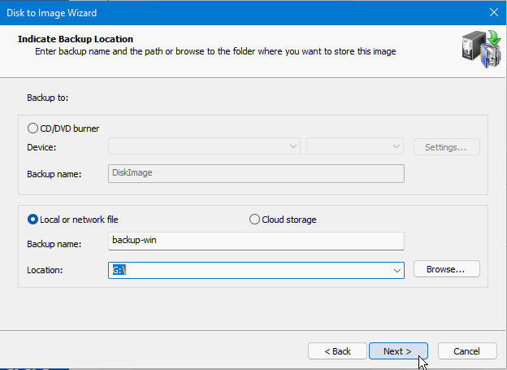

**Bước 6:** Giữ nguyên các cấu hình mặc định và Next.

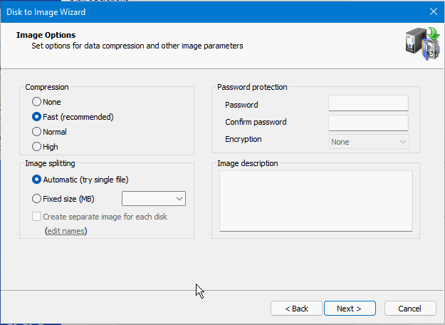

Cài đặt **password** và mã hóa cho bản **backup** nếu muốn ở phần **Password protection**

**Bước 7:** Chọn No và Next

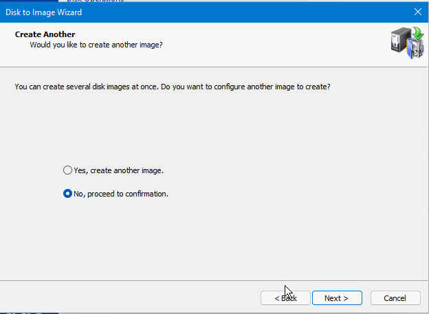

**Bước 8:** Kiểm tra lại các cấu hình trước và Next

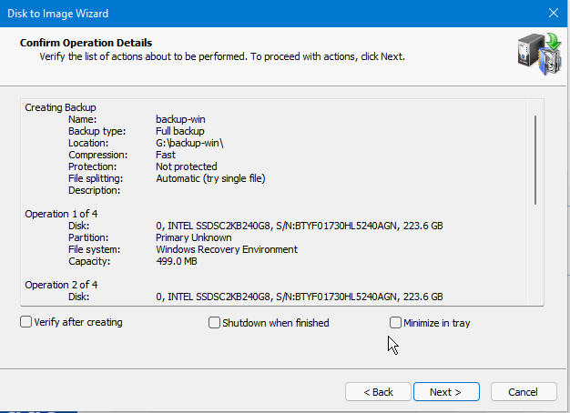

Tiến hành quá trình tạo bản **backup**

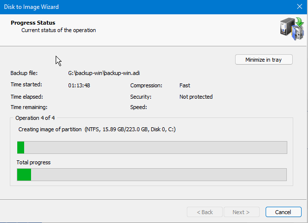

Vậy là đã tạo file **backup** hoàn tất trong `51s`

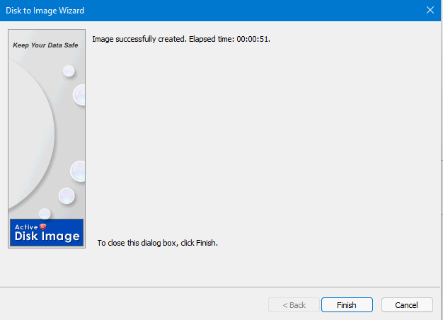

Kiểm tra lại file **backup** đã có trong đường dẫn đã chọn ở **Bước 5** chưa

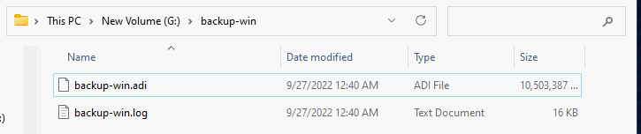

## 2\. Hướng dẫn Restore hệ điều hành bằng Active Boot Disk

**Bước 1**: Mở phần mềm lên và chọn Image to Disk

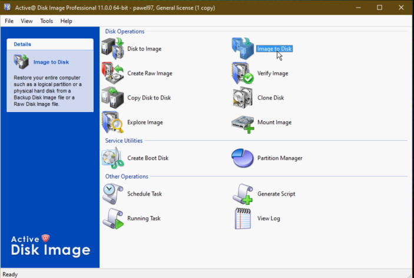

**Bước 2:** Chọn file backup đã tạo và Next

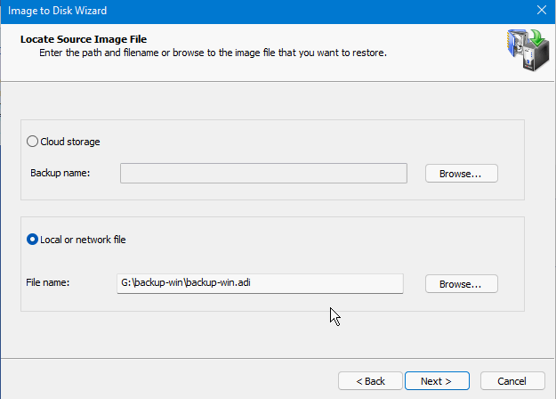

**Bước 3:** Chọn các mục cần restore và Next

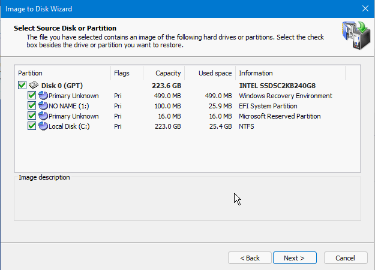

**Bước 4:** Chọn nơi restore hệ điều hành mới và Next

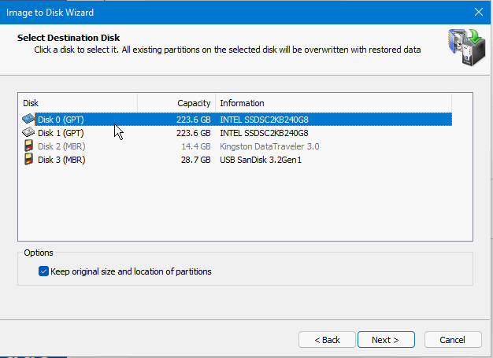

**Bước 5:** Chọn Yes để xóa hết dữ liệu trong phân vùng restore và Next

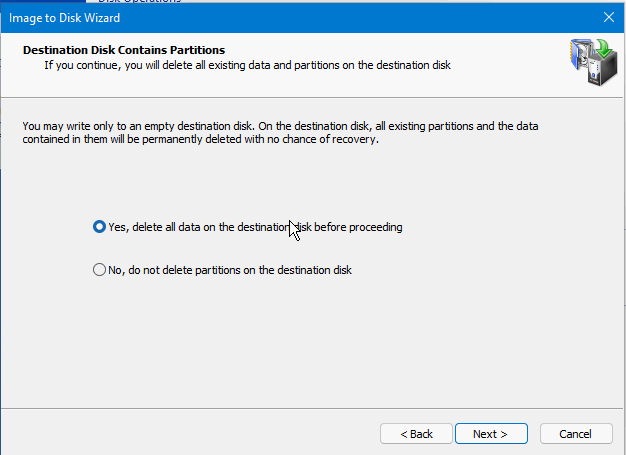

**Bước 6:** Chọn No và Next

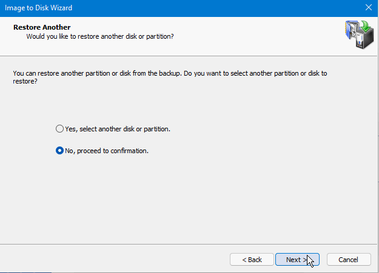

**Bước 7:** Kiểm tra lại các cấu hình và Next

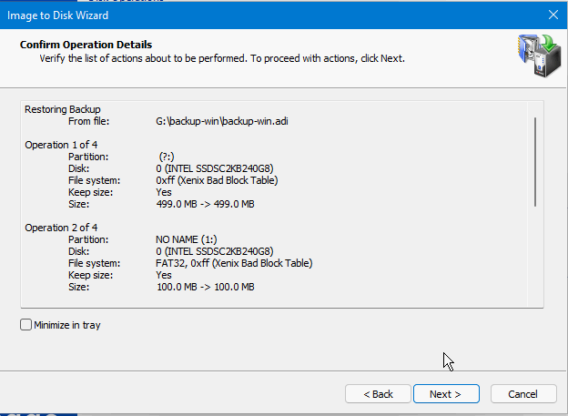

**Bước 8:** Tiến hành restore hệ điều hành

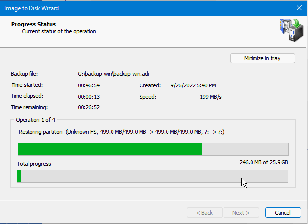

Quá trình **restore** đã hoàn tất trong `2m16s`

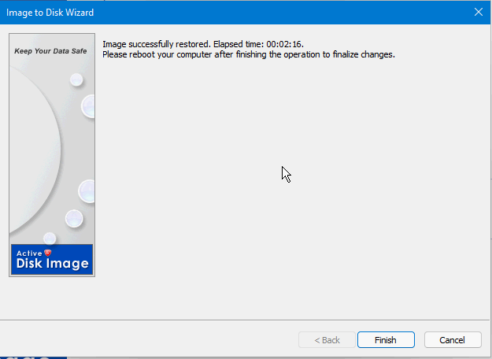

**Reboot** và truy cập vào hệ điều hành

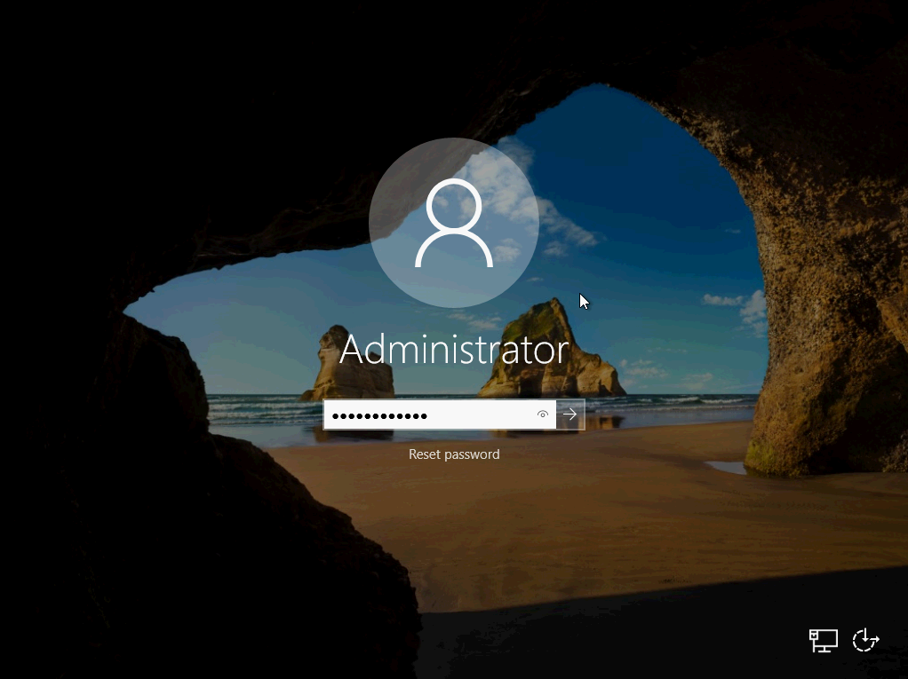

Chúc bạn thực hiện **Backup** Và **Restore OS** Bằng **Active Boot Disk** thành công!

> **THAM KHẢO CÁC DỊCH VỤ TẠI [VINAHOST](https://vinahost.vn/)**
> 
> **\>>** [**SERVER**](https://vinahost.vn/thue-may-chu-rieng/) **–** [**COLOCATION**](https://vinahost.vn/colocation.html) – [**CDN**](https://vinahost.vn/dich-vu-cdn-chuyen-nghiep)
> 
> **\>> [CLOUD](https://vinahost.vn/cloud-server-gia-re/) – [VPS](https://vinahost.vn/vps-ssd-chuyen-nghiep/)**
> 
> **\>> [HOSTING](https://vinahost.vn/wordpress-hosting)**
> 
> **\>> [EMAIL](https://vinahost.vn/email-hosting)**
> 
> **\>> [WEBSITE](http://vinawebsite.vn/)**
> 
> **\>> [TÊN MIỀN](https://vinahost.vn/ten-mien-gia-re/)**
