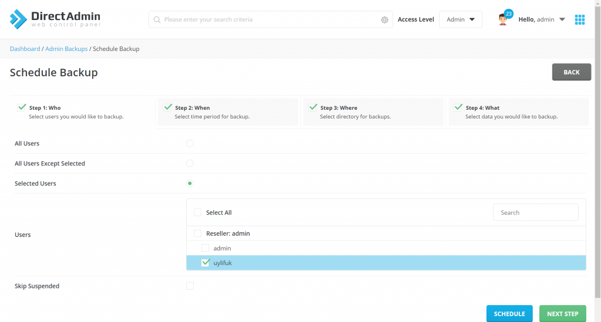

Bài viết này sẽ hướng dẫn bạn cách **backup và restore dữ liệu trên Directadmin**. Nếu bạn cần hỗ trợ, xin vui lòng liên hệ VinaHost qua Hotline 1900 6046 ext.3, email về support@vinahost.vn hoặc chat với VinaHost qua livechat https://livechat.vinahost.vn/chat.php.

Với các dịch vụ công cộng như **website**, việc bị kẻ xấu tấn công làm thay đổi hoặc mã hóa toàn bộ **source code website** là điều thường xảy ra và khó tránh khỏi. Do vậy là một người quản trị, chúng ta cần chuẩn bị các biện pháp phòng tránh và xử lý sự cố khi trường hợp trên xảy ra.

Bên cạnh việc triển khai các biện pháp phòng tránh trước khi bị tần công, các thao tác chuẩn bị phục hồi sau tấn công cũng là điều rất quan trọng.

Với các hosting sử dụng **Directadmin** để quản lý **website**, việc **back up** dữ liệu sẽ đơn giản hơn nhiều vì được hỗ trợ môi trường thuận lợi cho người quản trị giúp đơn giản hóa việc **back up** dữ liệu qua giao diện **web**.

<iframe title="YouTube video player" src="https://www.youtube.com/embed/FhiVJW3jnbE" width="560" height="315" frameborder="0" allowfullscreen="allowfullscreen"></iframe>

**Lưu ý:** Trong bài viết này sử dụng **Directadmin** với **Layout** dạng “**Icons Grid**”. Nếu các bạn muốn điều chỉnh giao diện theo như bài hướng dẫn, các bạn có thể điều chỉnh lại giao diện trong phần **Skin Options.**

## **Phần 1 - Backup dữ liệu**

**Bước 1**: Đăng nhập Directadmin dưới quyền admin, tại phần **Admin Tools** chọn **Admin Backup/Transfer.**

**Bước 2**: Chọn **Schedule Backup.**

**Bước 3:** Chọn user cần backup dữ liệu. Sau đó chọn **Next Step**

- Directadmin cho phép 3 lựa chọn:
    - **All Users**: Tạo bản backup cho toàn bộ user
    - **All User Except Selected**: Tạo back up cho tất cả user ngoại trừ những user được chọn trong bảng users bên dưới.
    - **Selected Users**: Tạo backup cho tất cả user được chọn bên dưới.

**Bước 4**: Chọn lịch Backup và chọn **Next Step.**

- Directadmin cung cấp 2 lựa chọn:
    - **Now**: Chạy Backup ngay thời điểm hiện tại
    - **Cron Schedule**: Lên lịch backup theo Cron.

Note: Các bạn có thể tham khảo bài viết về cron để thực hiện backup dạng lịch trình này.

**Bước 5**: Chọn vị trí lưu file backup và chọn **Next Step.**

- Có thể chọn một trong 2 lựa chọn:
    - **Local**: Lưu file backup về directory được nhập trong phần Local path.
    - **FTP**: Lưu file backup qua server khác thông qua giao thức FTP
- Trường **Append**: Cho phép định dạng thêm về tên file backup.

**Bước 6**: Chọn dữ liệu cần backup và chọn **Schedule**.

- Có thể chọn một trong 2 lựa chọn:
    - **All Data**: Backup toàn bộ dữ liệu user.
    - **Selected Data**: Backup dữ liệu nhất định của user.

Quá trình backup dữ liệu sẽ tùy vào lượng dữ liệu cần backup và mất khoảng thời gian tương ứng để backup. Quá trình này sẽ được thực hiện ngầm mà không hiển thị trên màn hình.

Sau khi backup thành công, hệ thống sẽ gửi thông báo trong phần Messages.

## **Phần 2 - Restore dữ liệu**

**Bước 1**: Đăng nhập Directadmin dưới quyền admin, tại phần **Admin Tools** chọn **Admin Backup/Transfer.**

**Bước 2**: Chọn option **Restore**.

**Bước 3**: Chọn vị trí file Backup đã lưu trước đó và chọn **Next Step**.

- Có thể chọn một trong 2 lựa chọn:
    - Local: Restore dùng file backup lưu tại directory nhập trong trường Path
    - FTP: Restore dùng file backup từ server khác qua giao thức FTP

**Bước 4**: Chọn IP dùng cho source backup và chọn **Next Step.**

Note: Trong trường hợp migrate source code từ server khác, IP lưu trong file backup sẽ khác với IP server hiện tại. Khi IP trong file cấu hình không giống IP server hiện tại, chúng ta sẽ không thể truy cập được dịch vụ thông qua IP hiện tại.

- Có thể chọn một trong 2 lựa chọn:
    - **Store in the backup**: Dùng IP lưu trong file backup.
    - **From the list**: Dùng IP của server hiện tại, trường server có nhiều IP, ta có thể chọn IP tại trường

**Bước 5:** Chọn file đã backup trước đó để thực hiện restore và chọn **Restore.**

Tương tự việc **backup**, quá trình **restore** sẽ mất một khoảng thời gian để hoành thành, và sẽ có thông báo trong **admin messages** “**Your User files have been restored**” khi hoàn thành.

Chúc quý khách thực hiện thành công!

> **THAM KHẢO CÁC DỊCH VỤ TẠI VINAHOST**
> 
> **\>>** [**SERVER**](https://vinahost.vn/thue-may-chu-rieng/) **–** [**COLOCATION**](https://vinahost.vn/colocation.html) – [**CDN**](https://vinahost.vn/dich-vu-cdn-chuyen-nghiep)
> 
> **\>> [CLOUD](https://vinahost.vn/cloud-server-gia-re/) – [VPS](https://vinahost.vn/vps-ssd-chuyen-nghiep/)**
> 
> **\>> [HOSTING](https://vinahost.vn/wordpress-hosting)**
> 
> **\>> [EMAIL](https://vinahost.vn/email-hosting)**
> 
> **\>> [WEBSITE](http://vinawebsite.vn/)**
> 
> **\>> [TÊN MIỀN](https://vinahost.vn/ten-mien-gia-re/)**
> 
> **\>> [SSL](https://vinahost.vn/geotrust-ssl) – [LICENSE](https://vinahost.vn/bang-gia-license)**
