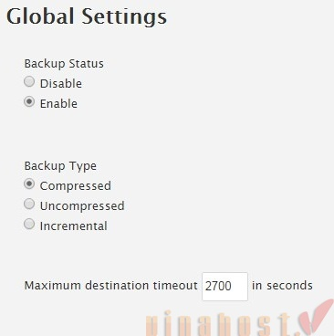
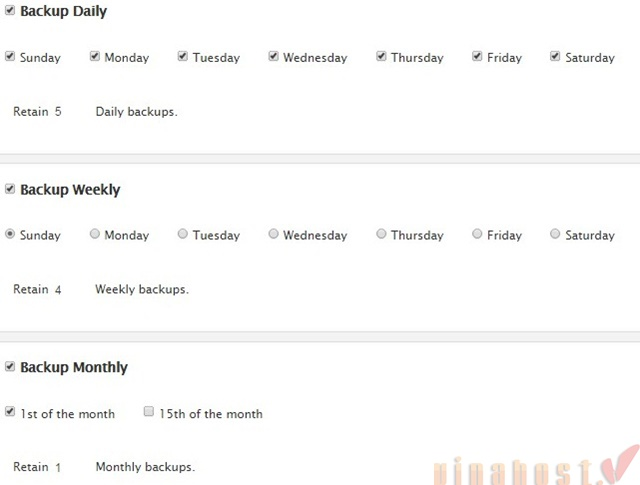
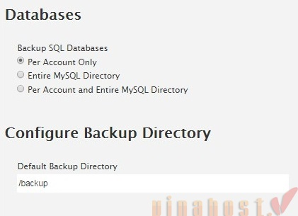
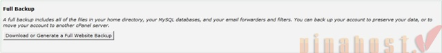
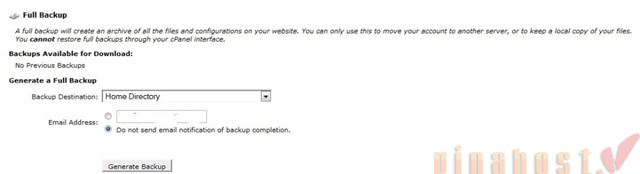
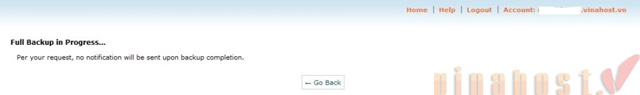
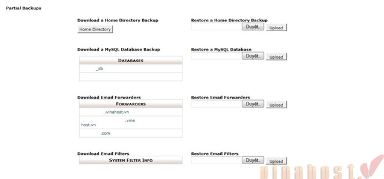

Bài viết này sẽ **hướng dẫn backup và restore dữ liệu trên server dùng Cpanel** để tăng tính dự phòng dữ liệu. Các bạn cứ thử hình dung chẳng may có sự cố và bạn bị mất hết dữ liệu, sẽ thế nào nếu không có dữ liệu để phục hồi? Tuy nhiên, tình huống trên sẽ rất đơn giản nếu bạn luôn có các bản backup cho việc phục hồi lại dữ liệu.

Đầu tiên là khái niệm về backup: "Backup là tiến trình sao lưu dữ liệu quan trọng để có thể khôi phục lại khi có sự cố xảy ra"

**1\. Lý do cần backup dữ liệu:**

Sau đây là một số lý do tại sao mà các bạn cần backup dữ liệu:

\- Bảo vệ dữ liệu trước các hư hỏng của phần cứng.

\- Bảo vệ dữ liệu trước các lỗi của phần mềm.

\- Bảo vệ dữ liệu khỏi thao tác lỗi của người dùng.

\- Phục hồi sau thảm họa, những sự cố ngoài mong muốn.

Bài viết này sẽ hướng dẫn bạn cách backup và restore dữ liệu trên [server](http://vinahost.vn/may-chu-rieng.html) bằng Cpanel.

**2\. Hướng dẫn các thao tác thực hiện:**

**2.1 BACKUP VÀ RESTORE TRÊN WHM**

_**a. Backup**_

Để backup dữ liệu bằng Cpanel bạn thao tác như sau:

\- Login vào Cpanel theo đường dẫn: **https://<IP>:2087** (vui lòng thay thế IP bằng IP server của bạn)

\- Truy cập vào **Home -> Backup -> Backup Configuration**.

Trong phần **Global Settings** bạn cấu hình các tham số như sau:

**\+ Backup Status:** Enable (bật chế độ backup dữ liệu trên Cpanel).

**\+ Backup Type:** Compressed (chọn nén dữ liệu, tùy chọn này làm giảm dung lượng của các bản backup nhằm tiết kiệm dung lượng lưu trữ).

**\+ Maximum destination timeout:** 2700 (bạn để mặc định).

Trong phần Scheduling and Retention bạn sẽ cấu hình lịch backup và số lượng các bản backup được giữ lại, trong phần này bạn cấu hình như sau:

**\+ Backup Daily:** thực hiện backup tất cả các ngày trong tuần và giữ lại 5 bản backup gần nhất.

**\+ Backup Weekly:** thực hiện backup hàng tuần vào chủ nhật và giữ lại 4 bản backup của các tuần trước.

**+Backup Monthly:** thực hiện backup hàng tháng và giữ lại 1 bản backup của tháng trước.

Với các tham số cấu hình trên bạn có thể phục hồi dữ liệu của 5 ngày gần nhất, phục hồi dữ liệu của 4 tuần trước vào chủ nhật và phục hồi dữ liệu vào ngày đầu tiên của tháng. Lưu ý chọn lịch backup và giữ lại số lượng bản backup (tham số Retain) cho phù hợp, việc giữ lại nhiều bản backup có thể làm đầy dung lượng lưu trữ trên server.

Trong các phần:

\- Files bạn click vào **Select Users** để chọn các tài khoản được thực hiện backup. Mặc định thì Cpanel sẽ thực hiện backup tất cả các tài khoản trên server. Các tùy chọn khác bạn để mặc định.

\- **Databases** chọn tham số **Backup SQL Databases** là: **Per Account Only**. Với cách cấu hình này Cpanel sẽ thực hiện backup database cho từng tài khoản trên server.

\- **Configure Backup Directory** bạn sẽ chọn thư mục để Cpanel lưu trữ các bản backup. Khi để mặc định thì các bản backup sẽ được lưu trữ vào **thư mục /backup**.

Sau khi chọn các cấu hình trên bạn click vào **Save Configuration** để lưu lại cấu hình. Mặc định Cpanel sẽ thực hiện backup vào lúc 2h sáng.

_**b. Restore**_

Để restore dữ liệu backup bằng Cpanel bạn thao tác như sau:

\- Truy cập vào **Cpanel --> Home -> Backup -> Backup Restoration**.

\- Chọn tài khoản cần restore sau đó chọn ngày restore tại bảng **Available Restoration Dates**.

\- Trong phần **Additional Options** bạn sẽ có các tùy chọn sau:

\+ Restore Subdomains (khôi phục dữ liệu các subdomain của tài khoản).

\+ Restore Mail Configuration (khôi phục các cấu hình mail).

\+ Restore MySQL (khôi phục dữ liệu database, bạn click vào tùy chọn này nếu muốn khôi phục cả mã nguồn và database).

\- Sau đó bạn click vào Add Account to Queue => vào Restore để restore dữ liệu.

**2.2 BACKUP VÀ RESTORE TRÊN CPANEL**

Phần này sẽ hướng dẫn bạn cách sao lưu và phục hồi dữ liệu trên cPanel. Để sử dụng chức này trên cPanel bạn thực hiện các bước sau:

\- Đăng nhập vào cPanel bằng tài khoản [hosting](http://vinahost.vn/hosting.php) của bạn.

\- Vào menu quản lý tài khoản chọn mục sao lưu dữ liệu.

**a. Chức năng Full Backup**

Đây là tính năng tạo đầy đủ bản sao lưu của tài khoản hosting bao gồm: Files, databases, email, các tài khoản FTP…

Để sử dụng tính năng này: Phần FullBackup click chọn: Download or Generate a Full Website Backup.

Tiếp tới click chọn Generate Backup.

Chờ quá trình backup hoàn thành. File backup sẽ được tạo ra tại thư mục: /home/user/ bạn có thể download file backup về máy tính cá nhân để lưu trữ.

**b. Chức năng Partial Backups (Sao lưu một phần)**

Phần này bao gồm các chức năng sau:

\- Download a Home Directory Backup: Tải bản sao lưu Home Directory của tài khoản. - Restore a Home Directory Backup: Phục hồi Home Directory của tài khoản bằng cách upload bản sao lưu từ máy tính. - Download a MySQL Database Backup: Tải xuống các cơ sở dữ liệu hiện có trên tài khoản. - Restore a MySQL Database: Phục hồi một cơ sở dữ liệu bằng cách upload từ máy tính. - Download Email Forwarders: Tải xuống các tài khoản email forwarders. - Restore Email Forwarders: Phục hồi các tài khoản email forwarders từ files sẵn có trên máy tính.

\*Tham khảo:

\- [http://docs.cpanel.net/twiki/bin/view/AllDocumenta...](http://docs.cpanel.net/twiki/bin/view/AllDocumentation/WHMDocs/BackupConfiguration)

\- [http://docs.cpanel.net/twiki/bin/view/AllDocumentation/WHMDocs/BackupRestoration](http://docs.cpanel.net/twiki/bin/view/AllDocumentation/WHMDocs/BackupRestoration)

Bạn có thể xem thêm video hướng dẫn sau:

<iframe src="https://www.youtube.com/embed/wUlHAbPmRDY" width="560" height="315" frameborder="0" allowfullscreen="allowfullscreen" data-mce-fragment="1"></iframe>

Chúc các bạn thành công!

> **THAM KHẢO CÁC DỊCH VỤ TẠI VINAHOST**
> 
> **\>>** [**SERVER**](https://vinahost.vn/thue-may-chu-rieng/) **–** [**COLOCATION**](https://vinahost.vn/colocation.html) – [**CDN**](https://vinahost.vn/dich-vu-cdn-chuyen-nghiep)
> 
> **\>> [CLOUD](https://vinahost.vn/cloud-server-gia-re/) – [VPS](https://vinahost.vn/vps-ssd-chuyen-nghiep/)**
> 
> **\>> [HOSTING](https://vinahost.vn/wordpress-hosting)**
> 
> **\>> [EMAIL](https://vinahost.vn/email-hosting)**
> 
> **\>> [WEBSITE](http://vinawebsite.vn/)**
> 
> **\>> [TÊN MIỀN](https://vinahost.vn/ten-mien-gia-re/)**
> 
> **\>> [SSL](https://vinahost.vn/geotrust-ssl) – [LICENSE](https://vinahost.vn/bang-gia-license)**
