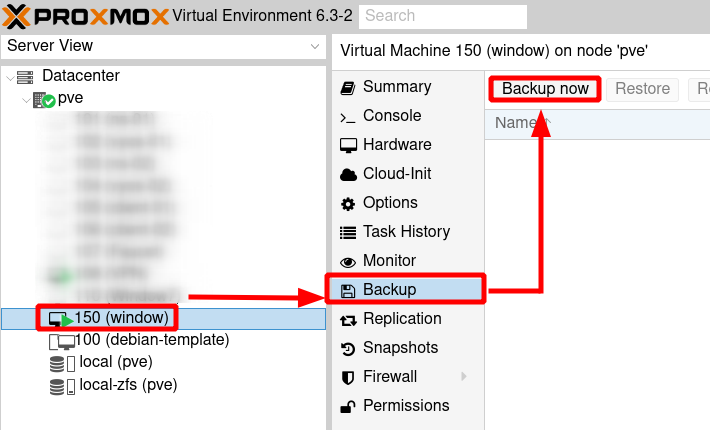
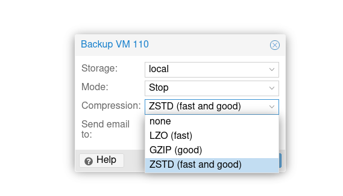
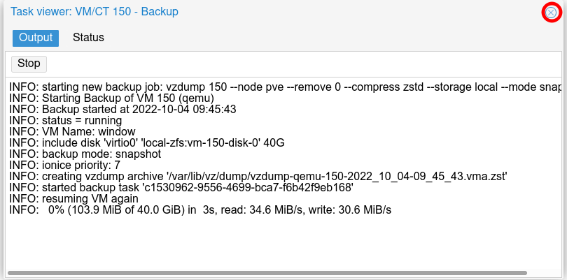
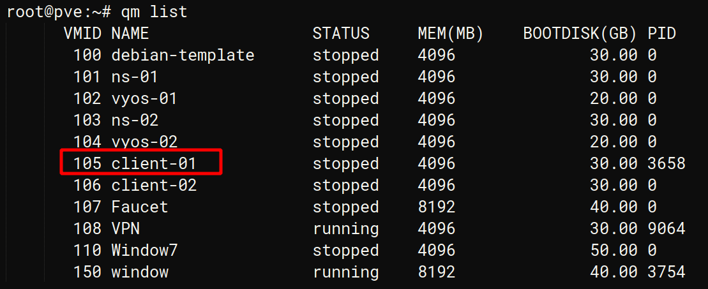
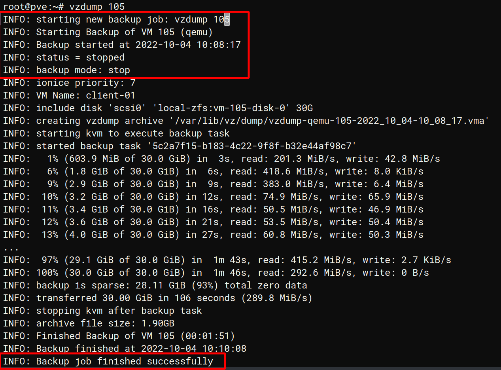

Bài viết này sẽ hướng dẫn bạn cách **Backup Virtual Machine Trong Proxmox**. Nếu bạn cần hỗ trợ, xin vui lòng liên hệ VinaHost qua **Hotline 1900 6046 ext.3, email về support@vinahost.vn hoặc chat với VinaHost qua livechat https://livechat.vinahost.vn/chat.php**.

## 1\. Mục tiêu bài viết

Sau bài viết này, người dùng có thể tự thao tác backup virtual machine (VM) bằng 2 cách:

- Giao diện Web Console
- Giao diện command line SSH

Trước khi tiến hành tạo **Backup Virtual Machine** Trong **Proxmox**, chúng ta cần điểm qua 1 vài lưu ý nhỏ:

Trong **proxmox**, có 3 trạng thái của VM mà chúng ta có thể set trước khi chạy tiến trình tạo backup

- _Snapshot  : chế độ Default, VM được backup ngay trong lúc đang running, không có downtime._
- _Suspend   : VM sẽ được backup ngay trong trạng thái suspend/resume mode._
- _Stop         : VM cần được shutdown trước rồi mới tạo file backup. Dữ liệu sẽ nhất quán trước và sau khi backup hoàn tất._

Trong **Proxmox**, có 3 chế độ nén được sử dụng:

- _.zst: Chuẩn nén Zstandard (zstd), đây là chế độ nén default của Proxmox._
- _.gz or .tgz: Chuẩn nén gzip , tôc độ nén chậm nhưng dung lượng file nén được tối ưu._
- _.lzo: Chuẩn nén lzo , tốc độ nén nhanh nhưng đánh đổi dung lượng file nén sẽ lớn, không được tối ưu._

## 2\. Hướng dẫn tạo Backup Trong Giao Diện Web Gui

Tại giao diện **Web GUI**, trỏ chuột tới **VM** cần tạo **backup**, chọn **Backup**, kế đó chọn **Backup now** như hình minh họa bên dưới:

Sau khi click vào **Backup Now**, một cửa sổ **popup** sẽ hiện lên như hình bên dưới:

Sau khi chọn xong các options (**Mode, Compression**) -> Click vào **Backup**

Tiến trình **Backup** sẽ hiển như trong cửa sổ **popup** như hình dưới, giúp cho người dùng theo dõi được **proccess Backup**:

_Backup proccess đang chạy_

Sau khi Backup chạy xong,  thông báo **TASK OK** sẽ hiện ra. Tắt **popup** và truy cập vào **local** > chọn **Backups** để **show** ra các bản **backup** đã tạo

## 3\. Tạo Backup Bằng COMMAND LINE

Tại cửa sổ `terminal`, chúng ta thao tác tuần tự như sau:

Hiện các **VM ID** tạo trên node **Proxmox**

_root@pve:~# qm list_

Lúc này người dùng cần xác định chế độ mà **VM backup**. Mặc định **snapshot** sẽ được chọn và chúng ta có thể bỏ qua bước này.

Nếu muốn **VM** được **backup** ở chế độ **suspend** hoặc **stop** thì trước tiên chúng ta cần **suspend/stop VM** trước

**Lệnh stop VM:**

_root@pve:~# qm stop ID_

**Lệnh suspend VM:**

_root@pve:~# qm suspend ID_

**Lệnh chạy Backup**

_root@pve:~# vzdump ID_

Tất cả file **backup** sẽ được lưu ở đường dẫn **/var/lib/vz/dump**

 

Chúc bạn thực hiện **Backup Virtual Machine Trong Proxmox** thành công!

> **THAM KHẢO CÁC DỊCH VỤ TẠI [VINAHOST](https://vinahost.vn/)**
> 
> **\>>** [**SERVER**](https://vinahost.vn/thue-may-chu-rieng/) **–** [**COLOCATION**](https://vinahost.vn/colocation.html) – [**CDN**](https://vinahost.vn/dich-vu-cdn-chuyen-nghiep)
> 
> **\>> [CLOUD](https://vinahost.vn/cloud-server-gia-re/) – [VPS](https://vinahost.vn/vps-ssd-chuyen-nghiep/)**
> 
> **\>> [HOSTING](https://vinahost.vn/wordpress-hosting)**
> 
> **\>> [EMAIL](https://vinahost.vn/email-hosting)**
> 
> **\>> [WEBSITE](http://vinawebsite.vn/)**
> 
> **\>> [TÊN MIỀN](https://vinahost.vn/ten-mien-gia-re/)**
