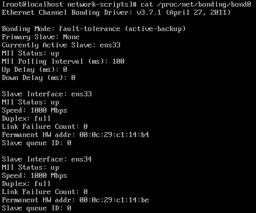
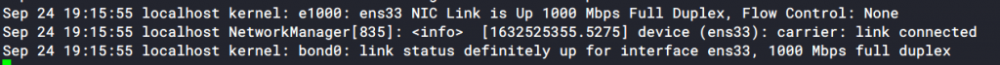

Bài viết này sẽ **Hướng Dẫn Cấu Hình Bonding Card Mạng Trên CentOS/Rhel 6/7**. Nếu bạn cần hỗ trợ, xin vui lòng liên hệ VinaHost qua Hotline 1900 6046 ext.3, email về support@vinahost.vn hoặc chat với VinaHost qua livechat https://livechat.vinahost.vn/chat.php.

## Bonding là gì?

Bonding là 1 thuật ngữ mà ở đó **user Linux** có thể cấu hình để nhóm từ 2 đến nhiều interface vật lý kết hợp thành 1 interface ảo gọi là “Bonding Interface” bằng cách sử dụng module kernel “bonding”. Tính năng của Bonding sẽ dựa trên các Mode sử dụng.

**Một số lợi ích của Bonding:**

- Tăng Bandwidth
- Tăng tính dự phòng
- Cân bằng tải

Trong bài viết này, VinaHost sẽ demo với ví dụ các thành phần như sau :

- Sử dụng 2 card mạng ‘ens33‘ và ‘ens34‘ tương ứng server phải có 2 card mạng vật lý, nhóm lại thành 1 card mạng ảo ‘bonding‘ là ‘bond0‘.
- Sử dụng cơ chế mode ‘active-backup‘ để chạy cơ chế dự phòng card mạng.

## Hướng dẫn cấu hình

Các file câu hình sẽ nằm tại đường dẫn

$ /etc/sysconfig/network-scripts

### **Bước** **1: Tạo file ifcfg-bond0**

\# cat /etc/sysconfig/network-scripts/ifcfg-bond0
_DEVICE=bond0_ 
_IPADDR=192.168.1.12_ 
_NETMASK=255.255.255.0_ 
_GATEWAY=192.168.1.1_ 
_DNS1=8.8.8.8_
_USERCTL=no_ 
_BOOTPROTO=none_ 
_ONBOOT=yes_
_BONDING\_OPTS="miimon=100 mode=1"_

### **Bước** **2: Tùy chỉnh lại inface file (ifcfg-ens\*)**

Tùy chỉnh cấu hình 2 file interface ens33 – ens34 như bên dưới. Chắc chắc bạn cần edit đúng giá trị MASTER, SLAVE trong file config.

_\# cat /etc/sysconfig/network-scripts/ifcfg-ens33_
_DEVICE=ens33_
_BOOTPROTO=none_ 
_ONBOOT=yes_ 
_\# Settings for Bond_ 
_MASTER=bond0_ 
_SLAVE=yes_
 
_\# cat /etc/sysconfig/network-scripts/ifcfg-ens34_
_DEVICE=ens34_
_BOOTPROTO=none_ 
_ONBOOT=yes_ 
_\# Settings for Bond_ 
_MASTER=bond0_ 
_SLAVE=yes_

### **Bước 3: Lựa chọn bonding mode**

Tới đây bonding sẽ cho bạn 7 option và tùy option bạn chọn sẽ có những tính năng khác nhau

mode=0 (Balance Round Robin)
mode=1 (Active backup)
mode=2 (Balance XOR)
mode=3 (Broadcast)
mode=4 (802.3ad)
mode=5 (Balance TLB)
mode=6 (Balance ALB)

### **Bước** **4: Enable bonding driver**

Kiểm tra module bonding đã được kernel load hay chưa

_\# lsmod | grep “bonding"_

– Nếu chưa thì bạn cần kích hoạt như sau.

_$ modprobe --first-time bonding_
_$ modinfo bonding_

– Cấu hình để load module ‘bonding’ khi hệ thống khởi động lại. Bạn cần tạo 1 file ‘bonding.conf’ nằm trong thư mục ‘/etc/modprobe.d’

_$ cat /etc/modprobe.d/bonding.conf_
_alias bond0 bonding_

### **Bước** **5: Restart lại network interface và tiến hành kiểm tra.**

_$ service network restart_

Để theo dõi trạng thái hoạt động của card interface bond0, chúng ta có thể kiểm tra file sau:

_$ cat /proc/net/bonding/bond0 

_ Kiểm tra cơ chế hoạt động của bonding, kiểm tra file sau:

_$ cat /sys/class/net/bond0/bonding/mode_
_active-backup 1_

Kiểm tra có bao nhiêu card interface ‘bonding‘ đang hoạt động trên hệ thống.

_\# cat /sys/class/net/bonding\_masters_

_bond0_

Tiến hành ifdown card mạng ens33 và kiểm tra lại trạng thái của bond0

_\[root@localhost ~\]# cat /proc/net/bonding/bond0_
_Ethernet Channel Bonding Driver: v3.7.1 (April 27, 2011)_

_Bonding Mode: fault-tolerance (active-backup)_
_Primary Slave: None_
_Currently Active Slave: ens34_
_MII Status: up_
_MII Polling Interval (ms): 100_
_Up Delay (ms): 0_
_Down Delay (ms): 0_

_Slave Interface: ens34_
_MII Status: up_
_Speed: 1000 Mbps_
_Duplex: full_
_Link Failure Count: 0_
_Permanent HW addr: 00:0c:29:c1:14:be_
_Slave queue ID: 0_

Lúc này thì **Current Active Slave** đã chuyển thành ens34 vì link ens33 đã bị down.

Bật lại ifup ens33 và kiểm tra /var/log/message đã thông báo NIC Link is Up.

Chúc bạn thực hiện thành công!

> **THAM KHẢO CÁC DỊCH VỤ TẠI VINAHOST**
> 
> **\>>** [**SERVER**](https://vinahost.vn/thue-may-chu-rieng/) **–** [**COLOCATION**](https://vinahost.vn/colocation.html) – [**CDN**](https://vinahost.vn/dich-vu-cdn-chuyen-nghiep)
> 
> **\>> [CLOUD](https://vinahost.vn/cloud-server-gia-re/) – [VPS](https://vinahost.vn/vps-ssd-chuyen-nghiep/)**
> 
> **\>> [HOSTING](https://vinahost.vn/wordpress-hosting)**
> 
> **\>> [EMAIL](https://vinahost.vn/email-hosting)**
> 
> **\>> [WEBSITE](http://vinawebsite.vn/)**
> 
> **\>> [TÊN MIỀN](https://vinahost.vn/ten-mien-gia-re/)**
> 
> **\>> [SSL](https://vinahost.vn/geotrust-ssl) – [LICENSE](https://vinahost.vn/bang-gia-license)**
