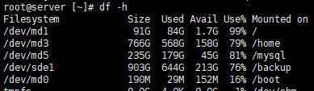
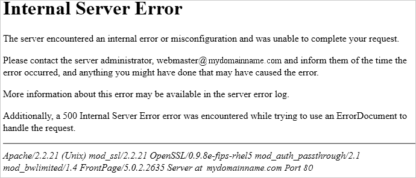
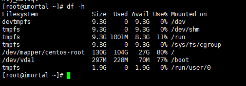
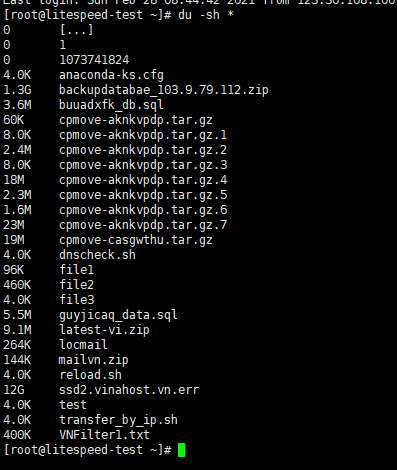

1/ Các nguyên nhân khiến VPS Linux bị đầy ổ cứng:

Hình 1: Mô tả 1 VPS  sắp full dung lượng ở phân vùng /

Hiện có nhiều nguyên nhân làm đầy dung lượng(full disk) vps , hầu hết chúng ta sẽ gặp các trường hợp tiêu biểu sau:

\+ Full disk do log(webserver, email…)

\+ Full disk do spam mail, mail queue

\+ Full disk do backup

\+ full disk do dữ liệu website, ứng dụng trên vps

2/ Cách kiểm tra và xử lý:

Khi VPS bị đầy dung lượng, các hiện tượng sau sẽ xảy ra:

\+ Website sẽ có hiện tượng lỗi 500:

Hình 2: Website bị lỗi 500 do full dung lượng.

\+ Các dịch vụ webserver(nginx,apache) và mysql sẽ bị dừng hoặc treo, không thể start hoặc restart vì thiếu dung lượng, để rõ hơn chúng ta có thể trong log ví dụ như /var/log/httpd/error.log sẽ có thông báo dạng “no space left on device”.

\+ Một số trường hợp VPS sẽ không boot lên được và shut down.

Để kiểm tra phân vùng nào bị đầy chúng ta sẽ dùng 2 lệnh Linux chủ yếu sau:

df –h : kiểm tra dung lượng toàn bộ vps, lệnh này sẽ cho thấy các thông tin như phân vùng, dung lượng của các thư mục VPS đang sử dụng, chúng ta tập trung chủ yếu vào phân vùng gốc / .

Hình 3: Mô tả lệnh df –h

du –sh  \[tên file\] hoặc \[tên thư mục\] : kiểm tra dung lượng của từng riêng file và thư mục, để xác định thư mục, file nào gây đầy ổ chúng ta tới  đường dẫn / và gõ lệnh du –sh \* ( dấu \* phần tử để kiểm tra nhiều đối tượng) để kiểm tra từng thư mục và đến từng thư mục xóa file không cần thiết gây đầy ổ.

Cách xử lý:

\+ Chúng ta sẽ dùng lệnh rm \[tên file\] để xóa file hoặc rm –rf \[tên file hoặc  thư mục\] để xóa vĩnh viễn file và thư mục, cần lưu ý rm –rf là lệnh nguy hiểm vì không có xác nhận “yes” hoặc “no” khi xóa toàn bộ thư mục, khi gõ hoặc nhập lệnh cần chú ý.

\+ Thực hiện empty log để giải phóng dung lượng: ví dụ log apache với lệnh echo: echo > /var/log/httpd/domain/domain.com.error.log ( lệnh này sẽ làm trống toàn bộ log và xóa nội dung vĩnh viễn)

\+ Kiểm tra dung lượng mail queue: du -chs /var/spool/exim/input/ |grep total và xóa mail queue với lệnh: rm -rf /var/spool/exim/input/\*

\+ xóa backup file nếu có: xóa backup directadmin tại rm –rf /home/admin/admin\_backups/\*

+Kiểm tra dữ liệu website có bị đầy, hầu hết dữ liệu trong public\_html hoặc đường dẫn vhost tùy theo cấu hình website.

Hình 4: Mô tả lệnh du –sh và sử dụng du –sh để check nhiều thư mục/file.

Chúc bạn thành công!

> **THAM KHẢO CÁC DỊCH VỤ TẠI [VINAHOST](https://blog.vinahost.vn/)**
> 
> **\>>** [**SERVER**](https://vinahost.vn/thue-may-chu-rieng/) **–** [**COLOCATION**](https://vinahost.vn/colocation.html) – [**CDN**](https://vinahost.vn/dich-vu-cdn-chuyen-nghiep)
> 
> **\>> [CLOUD](https://vinahost.vn/cloud-server-gia-re/) – [VPS](https://vinahost.vn/vps-ssd-chuyen-nghiep/)**
> 
> **\>> [HOSTING](https://vinahost.vn/wordpress-hosting)**
> 
> **\>> [EMAIL](https://vinahost.vn/email-hosting)**
> 
> **\>> [WEBSITE](http://vinawebsite.vn/)**
> 
> **\>> [TÊN MIỀN](https://vinahost.vn/ten-mien-gia-re/)**
> 
> **\>> [SSL](https://vinahost.vn/geotrust-ssl) – [LICENSE](https://vinahost.vn/bang-gia-license)**

