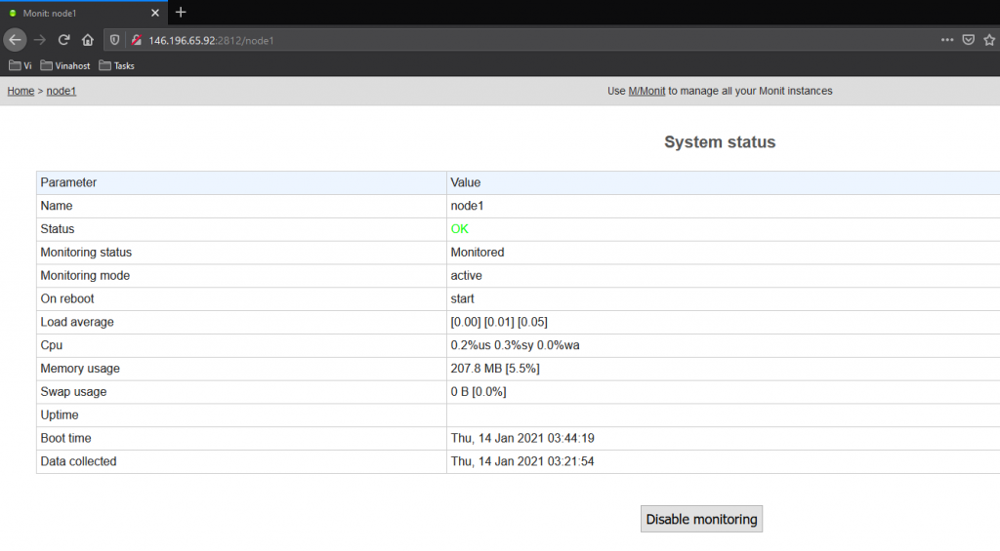
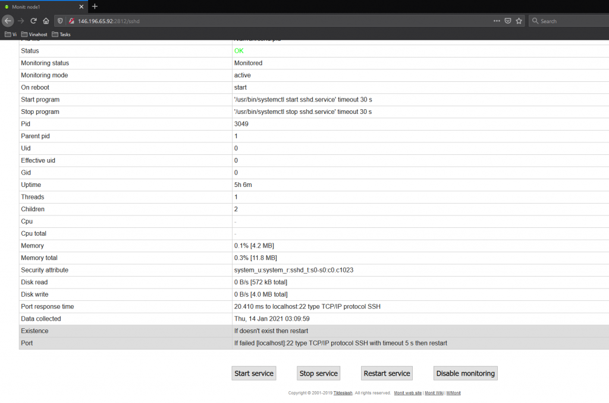
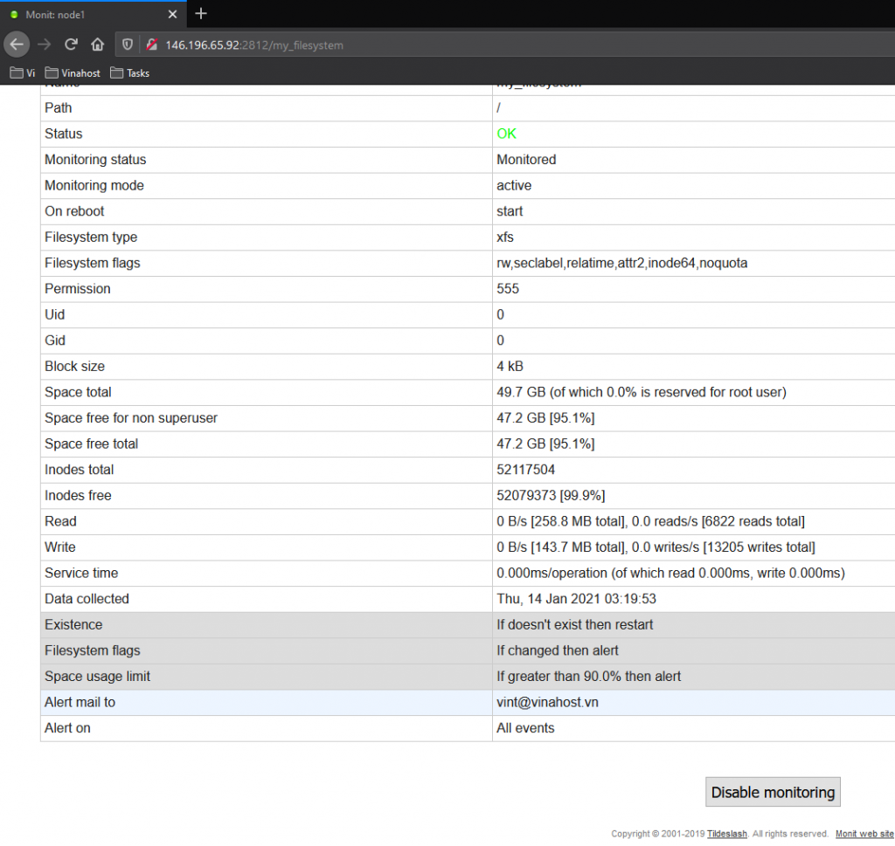

Bài viết này sẽ hướng dẫn bạn **Cài Đặt Và Cấu Hình Monit Cơ Bản**. Nếu bạn cần hỗ trợ, xin vui lòng liên hệ [**VinaHost**](https://blog.vinahost.vn/) qua Hotline **1900 6046 ext.3**, email về **support@vinahost.vn** hoặc chat với VinaHost qua livechat **[https://livechat.vinahost.vn/chat.php](https://livechat.vinahost.vn/chat.php)**.

## Giới thiệu về Monit

**Monit** là một công cụ giám sát mã nguồn mở miễn phí cho **Unix** và **Linux**. **Monit** chạy trên **localhost**, nó giúp theo dõi và quản lý các tiến trình máy chủ, thư mục, quyền, và các dịch vụ như **Apache, Nginx, MySQL, FTP, SSH, Sendmail**,… Ngoài ra, **Monit** còn có một giao diện web cơ bản mà qua đó ta có thể giám sát tất cả các quy trình.

## Hướng dẫn cài đặt Monit

Để cài đặt **Monit** trên **CentOS** 7 ta dùng lệnh sau:

        $ sudo yum install monit

Sau khi cài đặt, ta khởi động **Monit** bằng lệnh sau:

        $ monit

Để kiểm tra trạng thái hoạt động của **Monit**, các bạn có thể dùng lệnh sau:

        $ monit status

## Hướng dẫn cấu hình Monit cơ bản

Trên **CentOS 7**, file cấu hình chính của **Monit** nằm ở **/etc/monitrc.**

        $ sudo vi /etc/monitrc

Mặc định, **Monit** giám sát các dịch vụ đang chạy trong mỗi 30 giây và ghi lại lịch sử vào file log “**/var/log/monit.log**”. Để thay đổi các tuỳ chọn này, ta có thể chỉnh sửa các dòng **set daemon** và **set log syslog** ở phần đầu của file cấu hình.

Ví dụ như bạn muốn thiết lập thời gian kiểm tra các tiến trình đang chạy trong mỗi **2 phút** thì chỉ cần chỉnh thông số **30** thành **120**.

        set daemon  120

Hoặc thay đổi vị trí **file log**, ta chỉ cần thêm đường dẫn vào

        set log syslog /path/to/filelog

Giao diện web **Monit** mặc định chạy trên cổng **2812**. Để cấu hình giao diện **web**, các bạn hãy tìm và xoá dấu `#` dòng **set httpd port 2812**. Sau khi xoá dấu `#`, các bạn định cấu hình những dòng sau.

        set httpd port 2812 and

        use address 146.196.65.92          # Điền địa chỉ IP của máy chủ

        allow 0.0.0.0/0.0.0.0            # Cho phép IP nào truy cập vào giao diện web

        allow admin:monit             # Tạo user và password dùng để giám sát

Sau khi cấu hình, nếu muốn biết file cấu hình đúng hay sai. Ta có thể kiểm tra bằng lệnh sau:

        $ monit -t

Nếu kết quả sau khi kiểm tra là “Control file syntax OK” thì các bạn reload lại để Monit chạy file cấu hình mới

        $ monit reload

Sau khi reload các bạn có thể truy cập vào giao diện web của **Monit** bằng link sau

[http://146.196.65.92:2812/](http://146.196.65.92:2812/)

Đăng nhập bằng tên người dùng và mật khẩu bạn đã thiết lập bên trên

## Thiết lập Monitor

Để thêm các dịch vụ hoặc tiến trình bạn muốn giám sát vào giao diện web. Ta thiết lập như sau:

Ví dụ:

- Giám sát dịch vụ SSH

Để thêm một dịch vụ bất kỳ vào qui trình giám sát, các bạn chỉ cần tạo thêm file dịch vụ đó trong thư mục **/etc/monit.d/**

        $ sudo vi /etc/monit.d/ssh\monitor

Thêm dịch vụ ssh vào quy trình giám sát

        check process sshd with pidfile /var/run/sshd.pid

Thêm các nút start, stop vào giao diện web

        start program  "/usr/bin/systemctl start sshd.service"

        stop program  "/usr/bin/systemctl stop sshd.service"

Thiết lập rule tự động cho **sshd**, nếu dịch vụ **ssh** bị dừng đột ngột sẽ tự động **restart** lại

        if failed port 22 protocol ssh then restart       

Sau khi thiết lập file dịch vụ, các bạn nhớ **reload** lại **Monit**

        $ monit reload

Truy cập giao diện web để kiểm tra

- Giám sát **file system**

        $ sudo vi /etc/monit.d/fsmonitor

Để kiểm tra dung lượng file system các bạn thiết lập như sau

        check filesystem my\filesystem path /

Nếu dung lương file system lớn hơn **90% **sẽ gửi email cảnh báo về [vint@vinahost.vn](mailto:vint@vinahost.vn)

        if space usage > 90% then alert

        alert vint@vinahost.vn

> **THAM KHẢO CÁC DỊCH VỤ TẠI VINAHOST:**
> 
> **\>>** [**SERVER**](https://vinahost.vn/server.php) **-** [**COLOCATION**](https://vinahost.vn/colocation.html) - [**CDN**](https://vinahost.vn/dich-vu-cdn-chuyen-nghiep)
> 
> **\>> [CLOUD](https://vinahost.vn/cloud-server.html) - [VPS](https://vinahost.vn/vps.html)**
> 
> **\>> [HOSTING](https://vinahost.vn/wordpress-hosting)**
> 
> **\>> [EMAIL](https://vinahost.vn/email-hosting.html)**
> 
> **\>> [WEBSITE](http://vinawebsite.vn/)**
> 
> **\>> [TÊN MIỀN](https://vinahost.vn/bang-gia-ten-mien.html)**
> 
> **\>> [**SSL**](https://vinahost.vn/geotrust-ssl.html)**
