Bài viết này sẽ hướng dẫn bạn cách **Cài Đặt CS Cart Trên Hosting VinaHost**. Nếu bạn cần hỗ trợ, xin vui lòng liên hệ VinaHost qua Hotline 1900 6046 ext.3, email về support@vinahost.vn hoặc chat với VinaHost qua livechat https://livechat.vinahost.vn/chat.php.

## **Bước 1:** **Create Databases**

- Login vào Cpanel, ở khung **Databases** chọn **MySQL Database Wizard**:

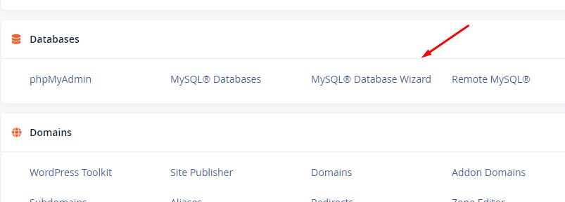

- Create Database:

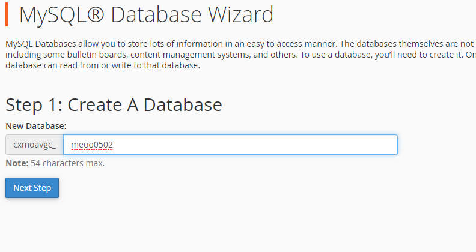

- Create Database User và Password:

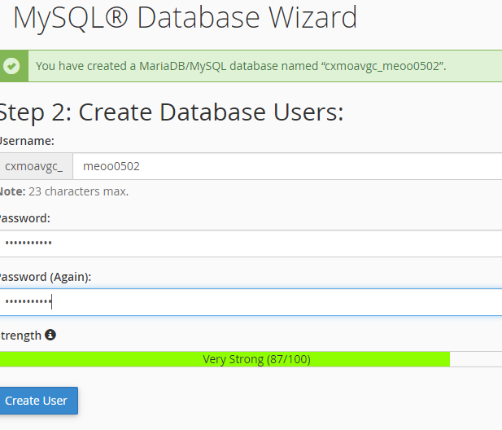

Tiếp đó click **All Privileges** và **Next step** -> **Return** **home****:**

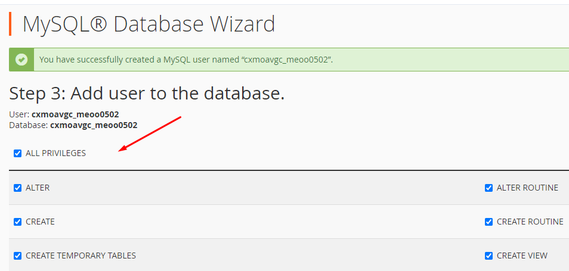

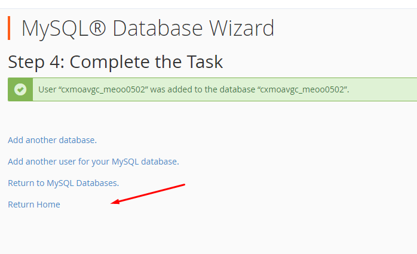

- Tiếp tục về lại Cpanel, tải xuống phiên bản mới của [CS-Cart](https://www.cs-cart.com/download-cs-cart.html?_ga=2.91397852.773396006.1662428349-1881469698.1662428348) hoặc [Multi-Vendor](https://www.cs-cart.com/download-multivendor.html?_ga=2.147700593.773396006.1662428349-1881469698.1662428348), sau đó vào **F****ile maneger** như hình:

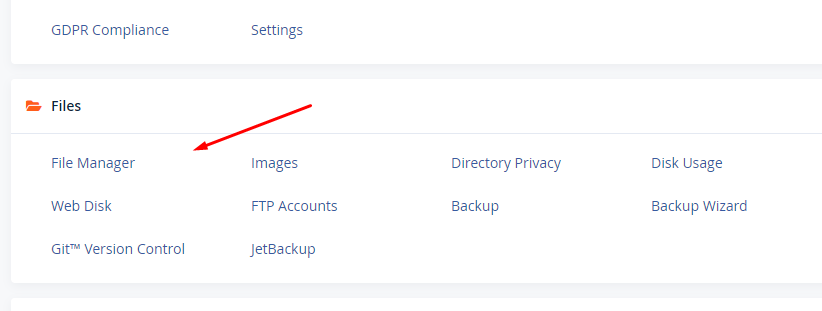

- Click **upload** để tải lên và chuột phải file mới up để giải nén:

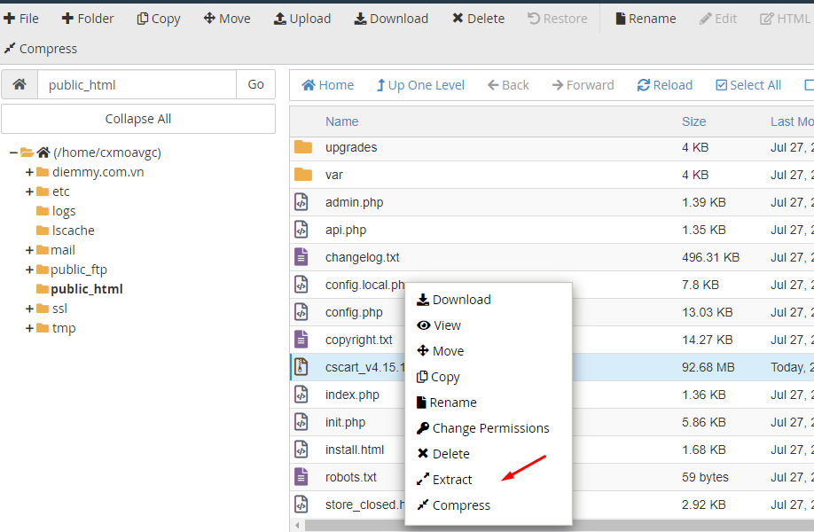

## Bước 2: Cài đặt CS-Cart

- Đầu tiên truy cập vào tên miền của bạn. Sẽ hiện thông báo chưa cài đặt CS-Cart bạn sẽ chọn install để cài đặt (ví dụ tên miền như hình, đã được cấu hình các bước trên):

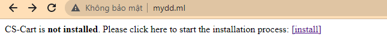

Sau đó điền các trường như hình:

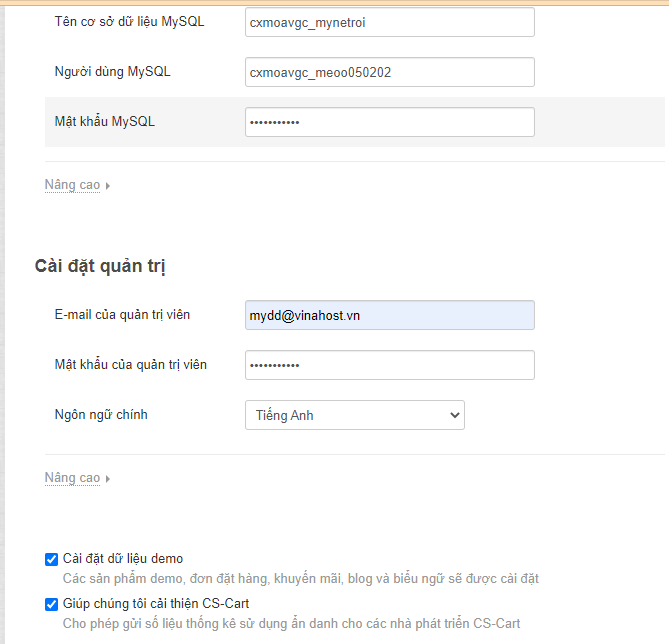

- Điền xong bạn click **Install** và đợi.

## **Bước 3: Lựa chọn chế độ cấp giấy phép CS Cart**

- Nếu chưa có giấy phép, ở đây sẽ có chế độ dùng thử 30 ngày miễn phí. Sau khi hết hạn thì bạn cần cung cấp giấy phép để tiếp tục sử dụng: chọn **Trial** rồi chọn **Select**.

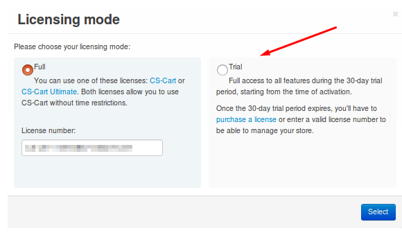

- Sau khi vào được giao diện như hình là đã thành công.

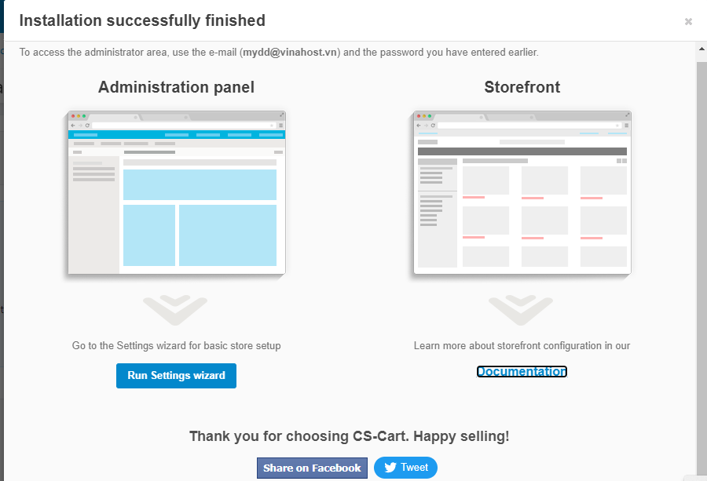

Chúc quý khách thực hiện cài đặt CS Cart thành công!

> **THAM KHẢO CÁC DỊCH VỤ TẠI [VINAHOST](https://kb.vinahost.vn/)**
> 
> **\>>** [**SERVER**](https://vinahost.vn/thue-may-chu-rieng/) **–** [**COLOCATION**](https://vinahost.vn/colocation.html) – [**CDN**](https://vinahost.vn/dich-vu-cdn-chuyen-nghiep)
> 
> **\>> [CLOUD](https://vinahost.vn/cloud-server-gia-re/) – [VPS](https://vinahost.vn/vps-ssd-chuyen-nghiep/)**
> 
> **\>> [HOSTING](https://vinahost.vn/wordpress-hosting)**
> 
> **\>> [EMAIL](https://vinahost.vn/email-hosting)**
> 
> **\>> [WEBSITE](http://vinawebsite.vn/)**
> 
> **\>> [TÊN MIỀN](https://vinahost.vn/ten-mien-gia-re/)**
