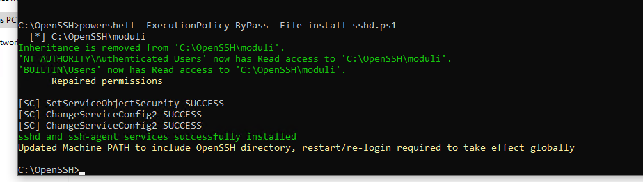
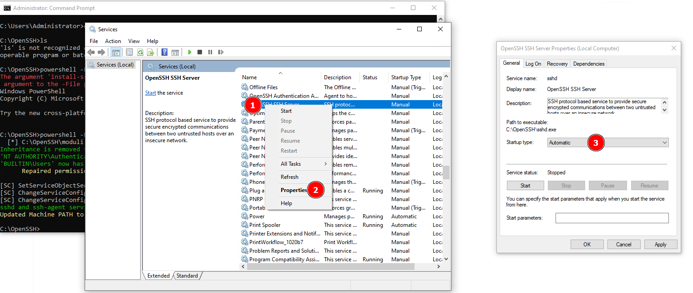
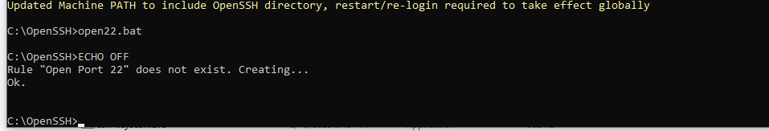
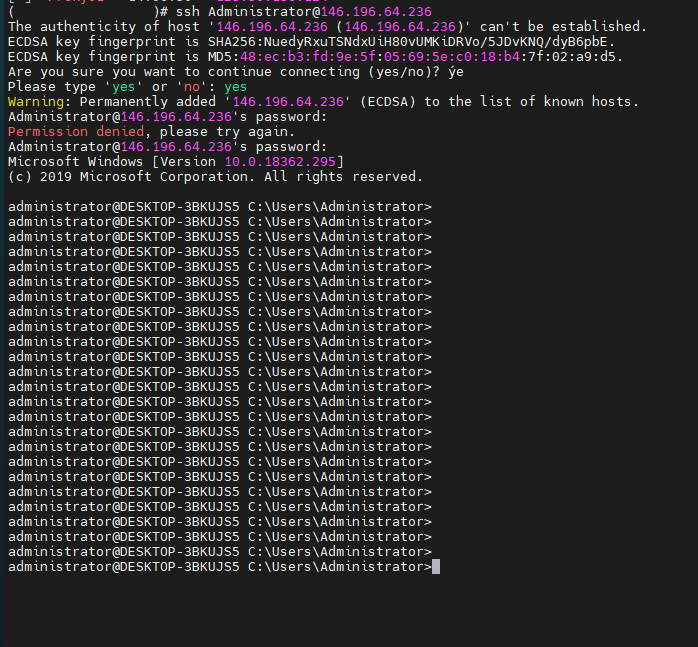

Bài viết này sẽ hướng dẫn bạn cách **Cài đặt OpenSSH Server trên Windows.** Nếu bạn cần hỗ trợ, xin vui lòng liên hệ VinaHost qua **Hotline 1900 6046 ext. 3**, email về [support@vinahost.vn](mailto:support@vinahost.vn) hoặc chat với VinaHost qua livechat [https://livechat.vinahost.vn/chat.php](https://livechat.vinahost.vn/chat.php).

## Giới thiệu chung

Để tạo VM Instance bằng tính năng **Standard Creation**, bạn phải trải qua nhiều bước thao tác cấu hình như điền đầy đủ thông tin của VM, chọn các cấu hình VM và OS Image cho VM, cấu hình network, cấu hình thông tin truy cập VM. Bài viết hôm nay mình sẽ hướng dẫn các bạn sử dụng tính năng **Fast Creation** để rút ngắn-đơn giản hóa quá trình tạo **VM Instance.**

Phần này hướng dẫn cài đặt SSH Server trên Windows từng bước - thủ công (_Để áp dụng được cho nhiều phiên bản Windows Desktop, Server - từ 7 đến 10, 2008, 2019 ..., vì các phiên bản mới của Windows cung cấp sẵn gói OpenSSH nên có thể cài đặt bằng gõ vài lệnh PowserShell, cái này mình sẽ nói ở một phần khác_).

## Cài đặt OpenSSH Server trên Windows

**Bước 1:** Tải về OpenSSH - vào đường link [Win OpenSSH](https://github.com/PowerShell/Win32-OpenSSH/releases), chọn đúng phiên bản phù hợp với hệ thống của bạn (chọn **OpenSSH-Win32.zip** hay **OpenSSH-Win64.zip** theo kiến trúc Windows của bạn), File tải về giải nén vào thư mục muốn cài đặt, ví dụ chọn giải nén vào thư mục **C:\\OpenSSH.**

**Bước 2:** Chạy PowserShell hoặc (Cmd) với quyền Administrator (Nhấn phải chuột vào biểu tượng PowerShell hoặc Cmd và chọn **Run as Administrator ...**), sau đó chuyển đến thư mục C:\\OpenSSH bằng lệnh:

cd C:\\OpenSSH

Đang ở thư mục C:\\OpenSSH, gõ lệnh sau để **cài đặt OpenSSH Server vào Windows**

powershell -ExecutionPolicy ByPass -File install-sshd.ps1

**Bước 3:** Gõ services.msc vào Menu Start, chạy và mở **Windows Services Manager**, tìm đến **OpenSSH SSH Server** và dịch vụ **OpenSSH Authetication Agent**. Thiết lập cả hai dịch vụ có Startup type là Automatic (khởi chạy cùng hệ thống), cuối cùng hãy chạy 2 dịch vụ đó (nhấn phải chuột vào nó, chọn **start**).

**Bước 4:** Mở cổng 22, vì SSH Server làm việc trên cổng 22 nên cần thiết lập Firewall cho phép kết nối đến cổng này. Để tự động tạo rule cho phép kết nối đến cổng 22 trong Windows Firewall, bạn có thể tải file .bat sau về [Open Popenort 22](https://raw.githubusercontent.com/xuanthulabnet/learn-ssh/master/openport22.bat) , lưu vào đĩa, ví dụ lưu tại C:\\OpenSSH\\openport22.bat, sau đó chạy file bat này với quyền Administrator.

Nội dung file bat

ECHO OFF
set PORT=22
set RULE\_NAME="Open Port %PORT%"

netsh advfirewall firewall show rule name=%RULE\_NAME% >nul
if not ERRORLEVEL 1 (
    rem Rule %RULE\_NAME% already exists.
    echo Hey, you already got a out rule by that name, you cannot put another one in!
) else (
    echo Rule %RULE\_NAME% does not exist. Creating...
    netsh advfirewall firewall add rule name=%RULE\_NAME% dir=in action=allow protocol=TCP localport=%PORT%
)

Sau khi chạy, nó sẽ tạo một Rule có tên **Open Port 22** trong **Windows Firewall** là thành công

Sau khi cấu hình xong có thể **SSH vào Windows** như đối vs Linux.

Chúc bạn thực hiện Cài đặt OpenSSH thành công!

> **THAM KHẢO CÁC DỊCH VỤ TẠI [VINAHOST](https://kb.vinahost.vn/)**
> 
> **\>>** [**SERVER**](https://vinahost.vn/thue-may-chu-rieng/) **–** [**COLOCATION**](https://vinahost.vn/colocation.html) – [**CDN**](https://vinahost.vn/dich-vu-cdn-chuyen-nghiep)
> 
> **\>> [CLOUD](https://vinahost.vn/cloud-server-gia-re/) – [VPS](https://vinahost.vn/vps-ssd-chuyen-nghiep/)**
> 
> **\>> [HOSTING](https://vinahost.vn/wordpress-hosting)**
> 
> **\>> [EMAIL](https://vinahost.vn/email-hosting)**
> 
> **\>> [WEBSITE](http://vinawebsite.vn/)**
> 
> **\>> [TÊN MIỀN](https://vinahost.vn/ten-mien-gia-re/)**
