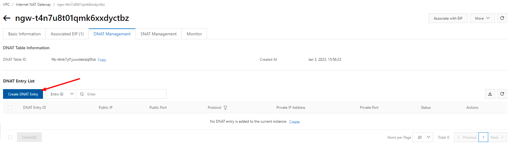
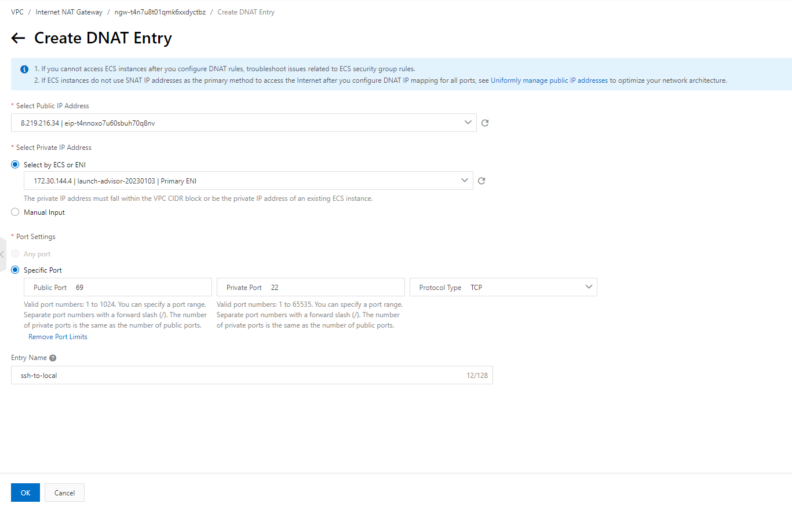
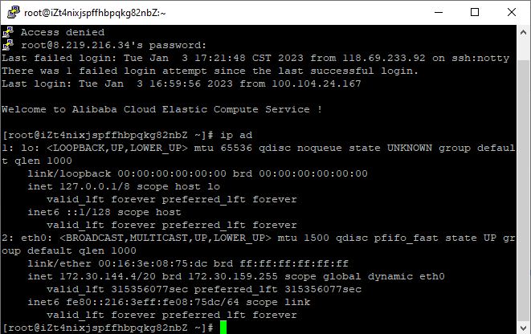

Bài viết này sẽ hướng dẫn bạn **Cấu Hình SNAT Cho ECS Instance Không Có IP Public Truy Cập Internet**. Nếu bạn cần hỗ trợ, xin vui lòng liên hệ VinaHost qua **Hotline 1900 6046 ext.3**, email về [support@vinahost.vn](mailto:support@vinahost.vn) hoặc chat với VinaHost qua livechat [https://livechat.vinahost.vn/chat.php](https://livechat.vinahost.vn/chat.php).

## Hướng Dẫn Cấu Hình DNAT Trên 1 Internet NAT Gateway Cho ECS Instance

Vào Tab DNAT Management > Create DNAT Entry

Thông tin cấu hình:

- Select Public IP Address: Lựa chọn IP Public để kết nối từ Users > ECS
- Select Private IP Address: Lựa chọn ECS Local sẽ được kết nối
- Port Setting:
- Public Port: 69
- Private Port: 22
- Protocol Type: Chọn giao thức TCP hoặc UDP
- Entry Name: Đặt tên cho DNAT này

VD: kết nối “IPprivate:22” thông qua “IPpublic:69”.

Sau khi tạo DNAT hoàn tất, test thử VD trên.

Kết nối SSH thành công ECS Local thông qua IP Public.

 

Chúc bạn thực hiện Cấu Hình DNAT Trên 1 Internet NAT Gateway Cho ECS Instance thành công!

> **THAM KHẢO CÁC DỊCH VỤ TẠI [VINAHOST](https://vinahost.vn/)**
> 
> **\>>** [**SERVER**](https://vinahost.vn/thue-may-chu-rieng/) **–** [**COLOCATION**](https://vinahost.vn/colocation.html) – [**CDN**](https://vinahost.vn/dich-vu-cdn-chuyen-nghiep)
> 
> **\>> [CLOUD](https://vinahost.vn/cloud-server-gia-re/) – [VPS](https://vinahost.vn/vps-ssd-chuyen-nghiep/)**
> 
> **\>> [HOSTING](https://vinahost.vn/wordpress-hosting)**
> 
> **\>> [EMAIL](https://vinahost.vn/email-hosting)**
> 
> **\>> [WEBSITE](http://vinawebsite.vn/)**
> 
> **\>> [TÊN MIỀN](https://vinahost.vn/ten-mien-gia-re/)**
