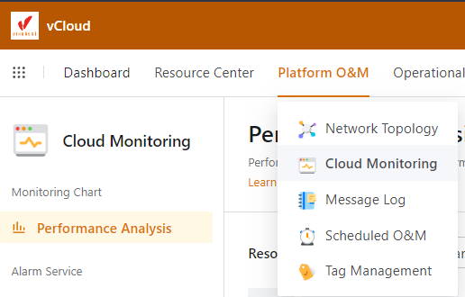
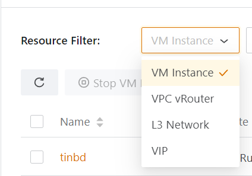
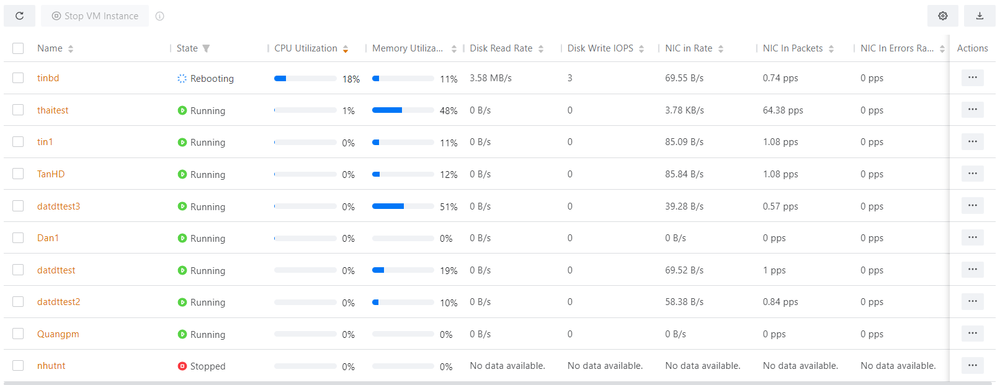
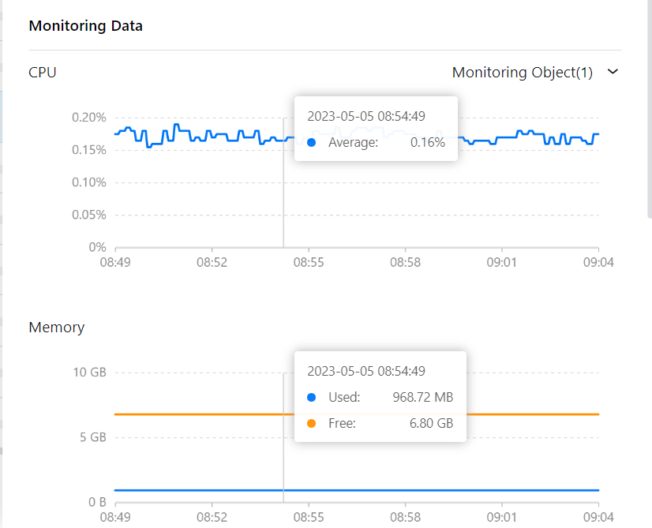
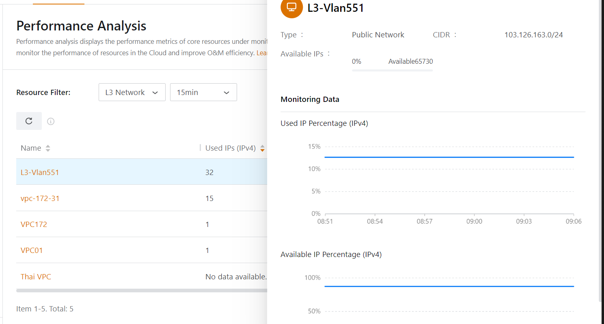

Bài viết này sẽ giới thiệu đến bạn chức năng **Cloud Monitoring Trong vCloud.** Nếu bạn cần hỗ trợ, xin vui lòng liên hệ VinaHost qua **Hotline 1900 6046 ext. 3**, email về [support@vinahost.vn](mailto:support@vinahost.vn) hoặc chat với VinaHost qua livechat [https://livechat.vinahost.vn/chat.php](https://livechat.vinahost.vn/chat.php).

Cloud Monitoring là công cụ để giám sát các máy ảo và nguồn tài nguyên trên hệ thống.

**Dashboard -> Platform O&M -> Cloud Monitoring**

Các chức năng chính của Cloud Monitoring

## 1\. Monitoring Chart: Biểu đồ giám sát

Phân tích hiệu suất hiển thị số liệu hiệu suất của các tài nguyên chính được giám sát bên ngoài hoặc bên trong Đám mây. Bạn có thể xem phân tích hiệu suất hoặc xuất báo cáo phân tích khi cần thiết để nâng cao hiệu quả O&M.

**Platform O&M > Cloud Monitoring > Monitoring Chart > Performance Analysis.**

Có thể giám sát các VM và VPC

## 2\. Giám sát các VM

- CPU Utilization: hiển thị mức sử dụng CPU trung bình của tất cả các phiên bản VM/VPC vRouter trong vùng hiện tại.
- Memory Utilization: hiển thị mức sử dụng bộ nhớ trung bình của tất cả các phiên bản VM/VPC vRouter trong vùng hiện tại.
- Disk Read Rate: Hiển thị tốc độ đọc đĩa trung bình của tất cả các phiên bản VM/VPC vRouter trong vùng hiện tại.
- Disk Write Rate: hiển thị tốc độ ghi đĩa trung bình của tất cả các phiên bản VM/VPC vRouter trong vùng hiện tại.
- NIC In Rate: Hiển thị tỷ lệ NIC trung bình của tất cả các phiên bản VM/VPC vRouter trong vùng hiện tại theo mặc định.
- NIC Out Rate: Hiển thị tỷ lệ NIC trung bình của tất cả các phiên bản VM/VPC vRouter trong vùng hiện tại theo mặc định.
- Disk Read IOPS: hiển thị tốc độ ghi đĩa trung bình của tất cả các phiên bản VM/VPC vRouter trong vùng hiện tại.
- Disk Write IOPS: hiển thị IOPS ghi đĩa trung bình của tất cả các phiên bản VM/VPC vRouter trong vùng hiện tại.
- NIC In Packets: Hiển thị số lượng gói NIC nhận được trung bình của tất cả các phiên bản VM/VPC vRouter trong vùng hiện tại.
- NIC Out Packets: hiển thị số lượng trung bình các gói NIC đã gửi của tất cả các phiên bản VM/VPC vRouter trong vùng hiện tại.
- NIC In Errors Rate: hiển thị tỷ lệ lỗi NIC nhận được trung bình của tất cả các phiên bản VM/VPC vRouter trong vùng hiện tại.
- NIC Out Errors Rate: hiển thị tỷ lệ lỗi NIC đã gửi trung bình của tất cả các phiên bản VM/VPC vRouter trong vùng hiện tại.

Biểu đồ hiển thị mức sử dụng CPU và RAM

## 2\. Giám sát các VLAN

Chúc bạn thực hiện thành công!

> **THAM KHẢO CÁC DỊCH VỤ TẠI [VINAHOST](https://kb.vinahost.vn/)**
> 
> **\>>** [**SERVER**](https://vinahost.vn/thue-may-chu-rieng/) **–** [**COLOCATION**](https://vinahost.vn/colocation.html) – [**CDN**](https://vinahost.vn/dich-vu-cdn-chuyen-nghiep)
> 
> **\>> [CLOUD](https://vinahost.vn/cloud-server-gia-re/) – [VPS](https://vinahost.vn/vps-ssd-chuyen-nghiep/)**
> 
> **\>> [HOSTING](https://vinahost.vn/wordpress-hosting)**
> 
> **\>> [EMAIL](https://vinahost.vn/email-hosting)**
> 
> **\>> [WEBSITE](http://vinawebsite.vn/)**
> 
> **\>> [TÊN MIỀN](https://vinahost.vn/ten-mien-gia-re/)**
