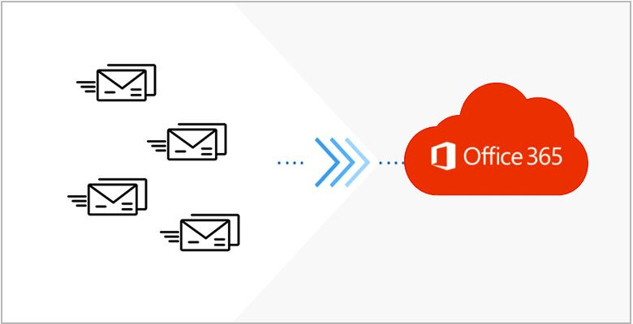

Trong bài viết này mình sẽ hướng dẫn các bạn cách migrate mail từ máy chủ mail sang Mail Microsoft 365. Nếu trước đó bạn đã từng sử dụng các máy chủ Mail như: G Suite, Yahoo, **[Email Hosting](https://vinahost.vn/email-hosting-chuyen-nghiep/)**, v.v. Nếu bạn cần hỗ trợ, xin vui lòng liên hệ VinaHost qua Hotline 1900 6046 ext.3, email về support@vinahost.vn hoặc chat với VinaHost qua livechat https://livechat.vinahost.vn/chat.php.

Việc chuyển mail từ máy chủ Mail sang dịch vụ Mail Microsoft 365 ta cần chuyển bằng giao thức IMAP Migration được tích hợp trên giao diện quản trị máy chủ **[Mail Microsoft 365](https://vinahost.vn/microsoft-365/)** của bạn.

**IMAP là gì?**

Đối với các dịch vụ Mail thường người dùng sẽ sử dụng 2 giao thức chính đó là IMAP và POP3. Nhưng hôm nay việc migrate Mail chỉ sử dụng giao thức IMAP. Nên chúng ta sẽ định nghĩa lại IMAP là gì?

IMAP cho phép bạn truy nhập email của mình ở bất kỳ đâu, từ mọi thiết bị. Khi bạn đọc thư email bằng IMAP, bạn không thực sự tải xuống hoặc lưu trữ nó trên máy tính của bạn; thay vào đó, bạn đang đọc nó từ dịch vụ email. Kết quả là, bạn có thể kiểm tra email của bạn từ các thiết bị khác nhau, bất kỳ đâu trên thế giới: điện thoại của bạn, máy tính, máy tính của bạn.

IMAP chỉ tải xuống thư khi bạn bấm vào đó và phần đính kèm không được tự động tải xuống. Bằng cách này, bạn có thể kiểm tra các tin nhắn của bạn nhanh hơn nhiều so với POP.

Việc đầu tiên và cũng là điều kiện cần để có thể migrate mail từ máy chủ mail sang máy chủ Microsoft 365 đó là: • Bạn cần có thông tin đăng nhập của dịch vụ Mail mà bạn muốn migrate sang Microsoft 365. • Bạn cần tạo các user trên Microsoft 365 trùng khớp với mail trên máy chủ mà bạn muốn chuyển sang. • Bạn cần có thông tin máy chủ Email của nhà cung cấp cũ.

Nếu đã có đủ các điều kiện cần ở trên chúng ta cùng nhau bắt tay vào việc Migrate mail nhé.

**Bước 1:** **Bạn cần đăng nhập vào trang _[https://admin.microsoft.com/#/homepage](https://admin.microsoft.com/#/homepage)_ bằng tài khoản admin của bạn.**

**Bước 2: Chọn vào phần “Hiển thị tất cả”.**

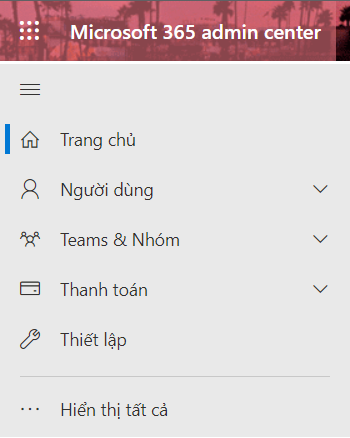

**Sau khi chọn ta kéo xuống phía dưới và chọn vào mục Exchange.**

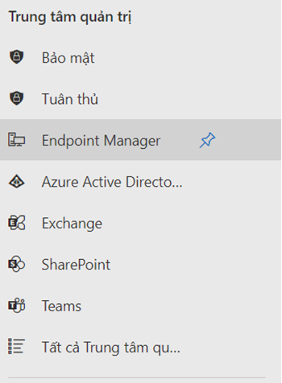

**Bước 3: Ta chọn vào Mục “Migration”**

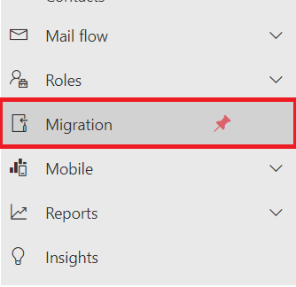

**Sau đó hệ thống sẽ hiển thị giao diện như sau:**

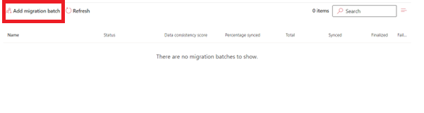

**Ở đây ta chọn vào mục “Add migration batch”**

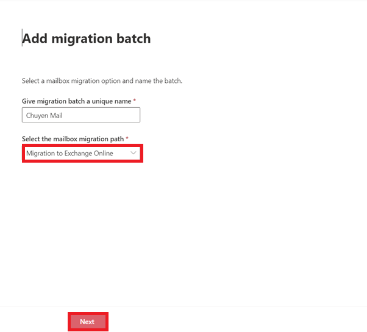

**Tiếp theo đó chúng ta sẽ đặt tên cho Migration batch của mình.** **Lưu ý:** _Đối với mục “Select the mailbox migration path” sẽ có 2 Option cho mọi người lựa chọn đó là: Migrate to Exchange Online (Là chuyển mail từ các máy chủ mail khác đến máy chủ Microsoft 365) và Migrate from Exchange Online (Là chuyển mail từ máy chủ Microsoft 365 sang các máy chủ mail khác). Vì ở đây là chúng ta chuyển mail từ máy chủ mail đến Mail Microsoft 365 thì ta chọn mục “Migrate to Exchange Online”._ **Sau đó ta chọn Next để đến bước tiếp theo**

**Bước 4: Ở đây ta có rất nhiều option để bạn chọn, nhưng vì chúng ta đang chuyển dữ liệu mail sang nên chỉ cần chọn giao thức IMAP migration.**

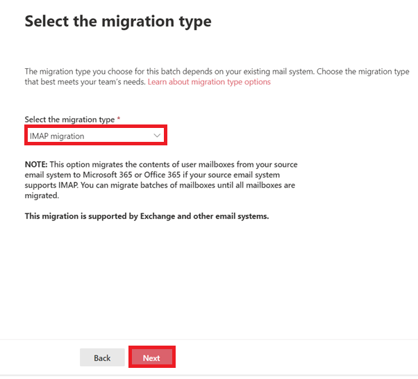

**Bước 5: Tiếp tục chọn Next**

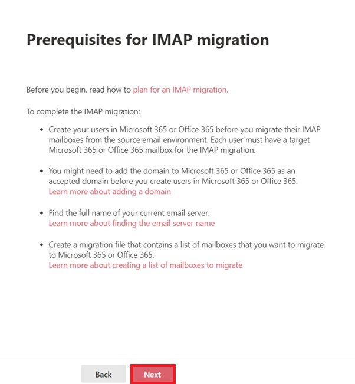

**Bước 6: Ở đây chúng ta click chọn vào Create a new Migratin endpoint. Có thể hiểu là tạo một điểm cuối của việc chuyển mail.**

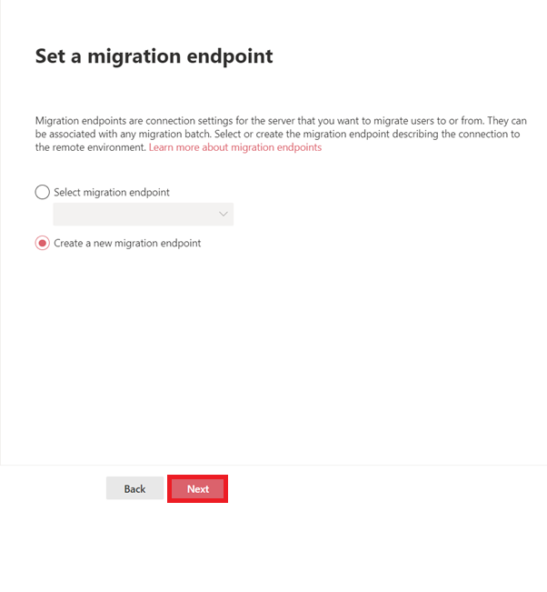

**Bước 7: Chúng ta sẽ tạo tên cho Migration Endpoint của mình.**

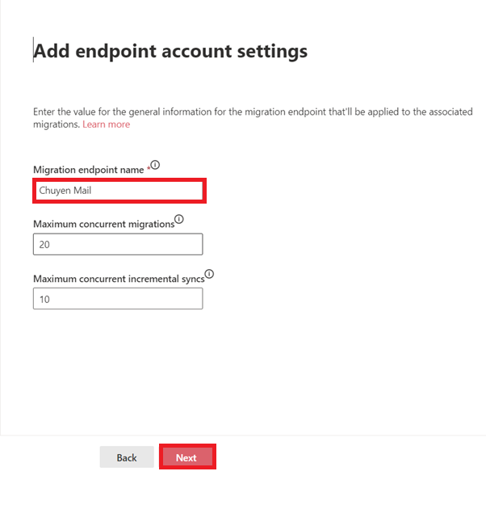

**Bước 8: Ở đây chúng ta sẽ điền thông tin server mail của mình vào. Ví dụ: mail.domain.com**

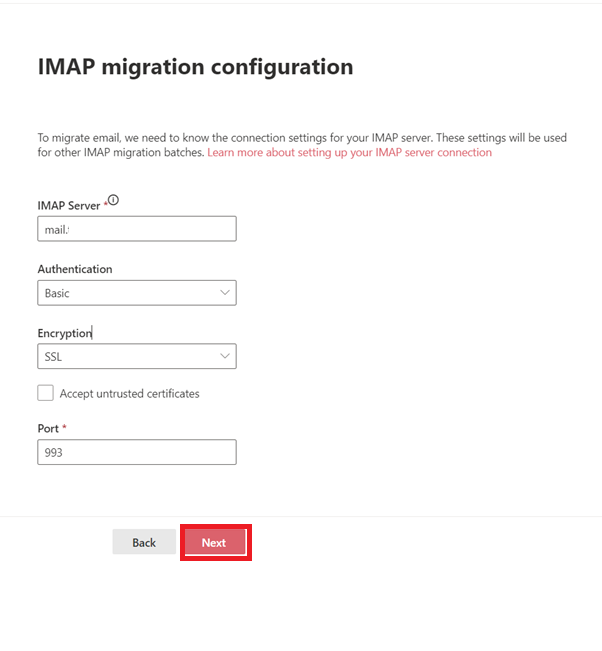

**Bước 9: Click vào Download a CSV file with headers and sample user information để tải về form CSV chuẩn để migrate mail nhé.**

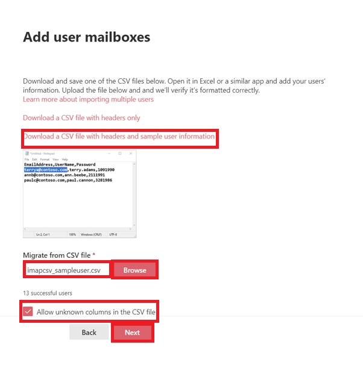

**Đây là form chuẩn của file CSV nhé.**

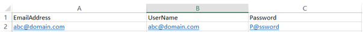

**Bước 10: Click Next**

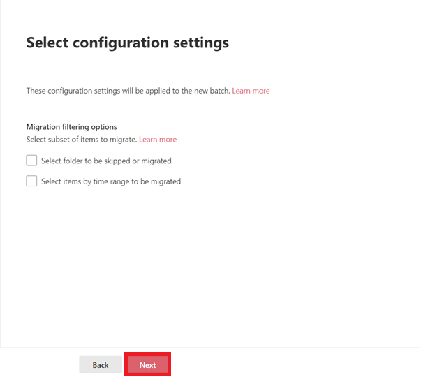

**Bước 11: Click Save**

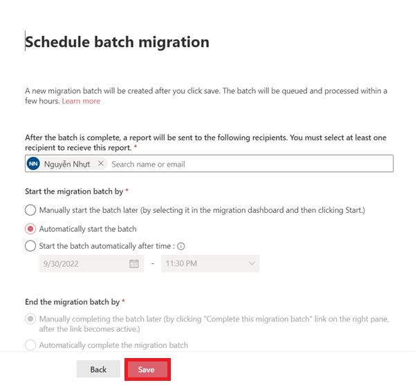

**Ở dòng Status hiển thị “Synced” là quá trình chuyển mail đã thành công.**

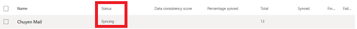

**Chúc các bạn thực hiện thành công nhé!**

Chúc bạn thực hiện thành công!

> **THAM KHẢO CÁC DỊCH VỤ TẠI [VINAHOST](https://vinahost.vn/)**
> 
> **\>>** [**SERVER**](https://vinahost.vn/thue-may-chu-rieng/) **–** [**COLOCATION**](https://vinahost.vn/colocation.html) – [**CDN**](https://vinahost.vn/dich-vu-cdn-chuyen-nghiep)
> 
> **\>> [CLOUD](https://vinahost.vn/cloud-server-gia-re/) – [VPS](https://vinahost.vn/vps-ssd-chuyen-nghiep/)**
> 
> **\>> [HOSTING](https://vinahost.vn/wordpress-hosting)**
> 
> **\>> [EMAIL](https://vinahost.vn/email-hosting)**
> 
> **\>> [WEBSITE](http://vinawebsite.vn/)**
> 
> **\>> [TÊN MIỀN](https://vinahost.vn/ten-mien-gia-re/)**
