Trong bài viết này mình sẽ hướng dẫn bạn thực hiện chuyển dữ liệu 1 trang web Wordpress từ nơi khác về Hosting mới hoặc nhân bản một trang web Wordpress bằng plugin **Duplicator – WordPress Migration Plugin.**

Nếu bạn cần hỗ trợ, xin vui lòng liên hệ VinaHost qua Hotline 1900 6046 ext.3, email về support@vinahost.vn hoặc chat với VinaHost qua livechat https://livechat.vinahost.vn/chat.php.

## **Bước 1: Cài Plugin Duplicator và thiết lập sao lưu**

Ta tiến hành cài Plugin Duplicator từ thư viện Plugin WordPress

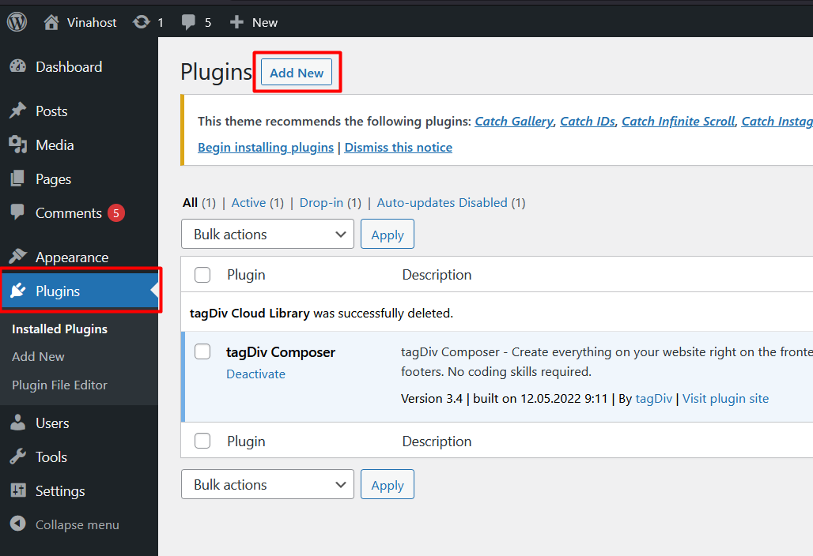 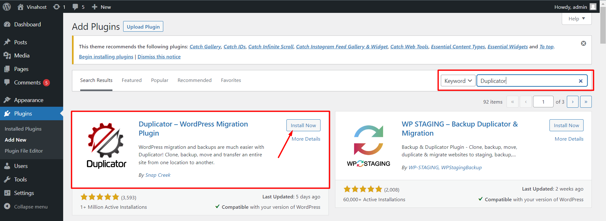

Sau khi cài đặt xong, bạn click vào Duplicator => Create New để tạo bản sao mới

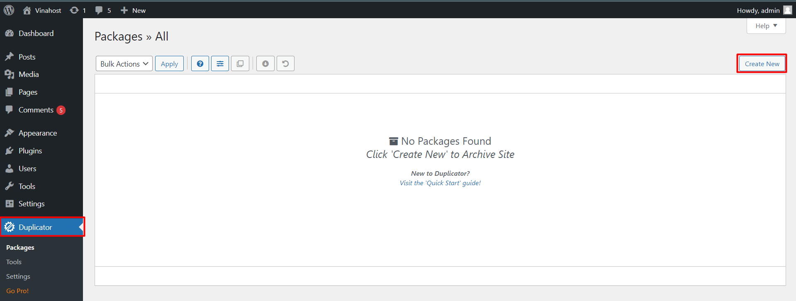

Bạn để mặc định và click Next để tiếp tục sang bước tiếp theo

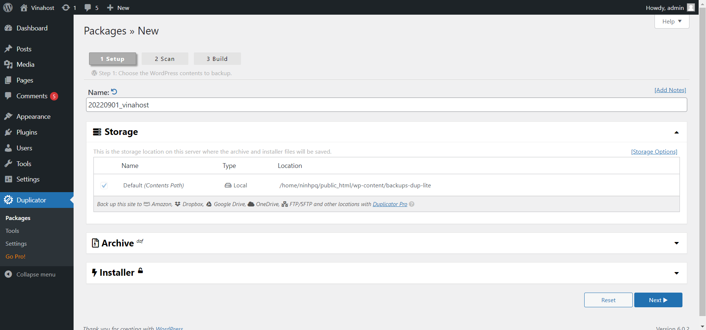 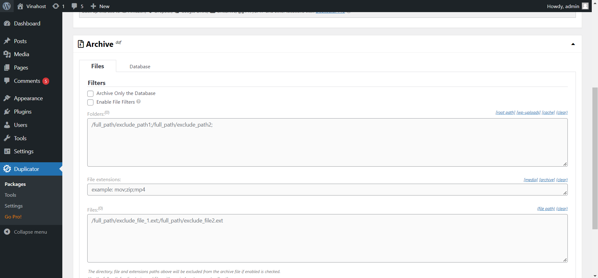 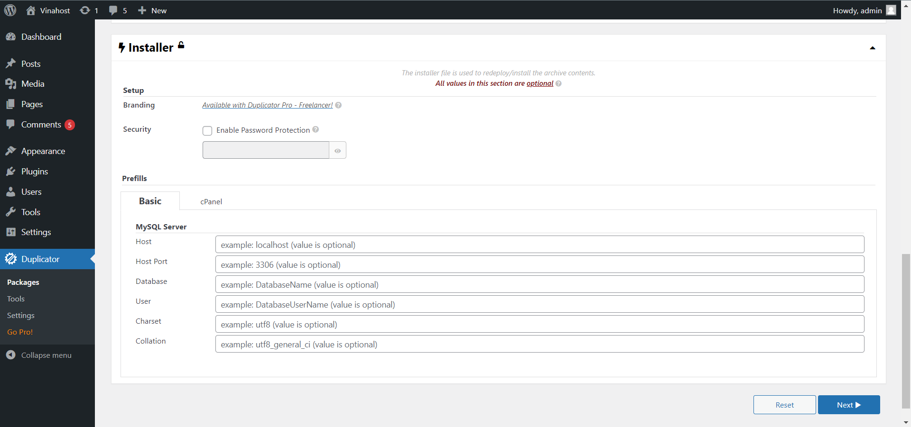

Sau khi click Next Plugin sẽ scan site của bạn

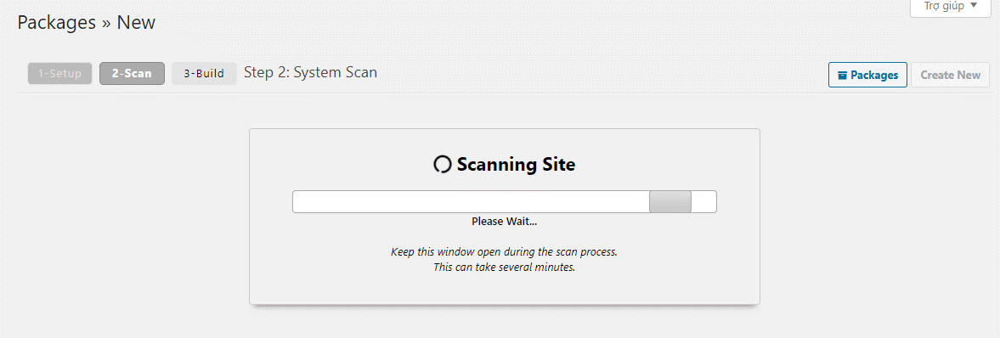

Plugin sẽ thông báo Scan hoàn tất và list ra danh sách như dưới, bạn click Build để bắt đầu tạo bản sao

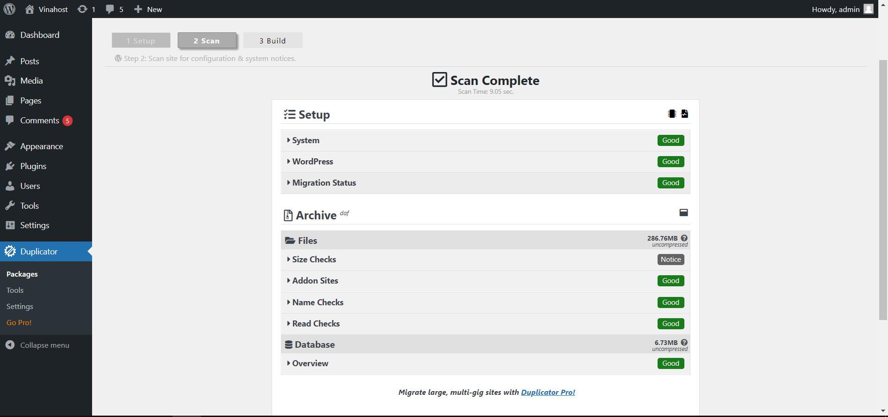

Quá trình build sẽ diễn ra và thông báo khi hoàn tất. Tùy thuộc vào dung lượng và quyết định thời giạn tạo bản sao nhanh hay chậm.

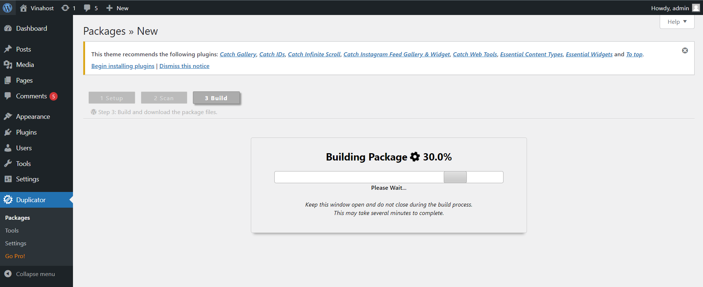

Sau khi tạo xong sẽ có 2 file bên dưới bao gồm

- File installer.php
- File bản sao có định dạng là date\_sitename\_..zip

Bạn tiến hành download về máy tính để tiến hành cho bước 2.

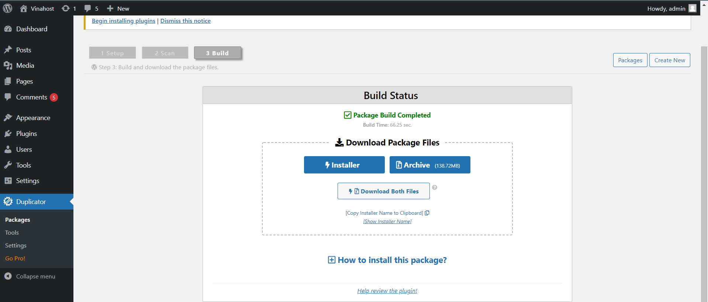

## **Bước 2: Tiến hành Restore**

**Lưu ý: Bạn cần trỏ chính xác domain về IP máy chủ hosting/vps thì mới restore được nhé!**

Ở bước này sẽ thực hiện bung file mà bạn đã tạo ở bước 1.

Trước tiên bạn cần đăng nhập vào Directadmin upload file 2 này lên hosting , đưa vào website bạn cần thực hiện.

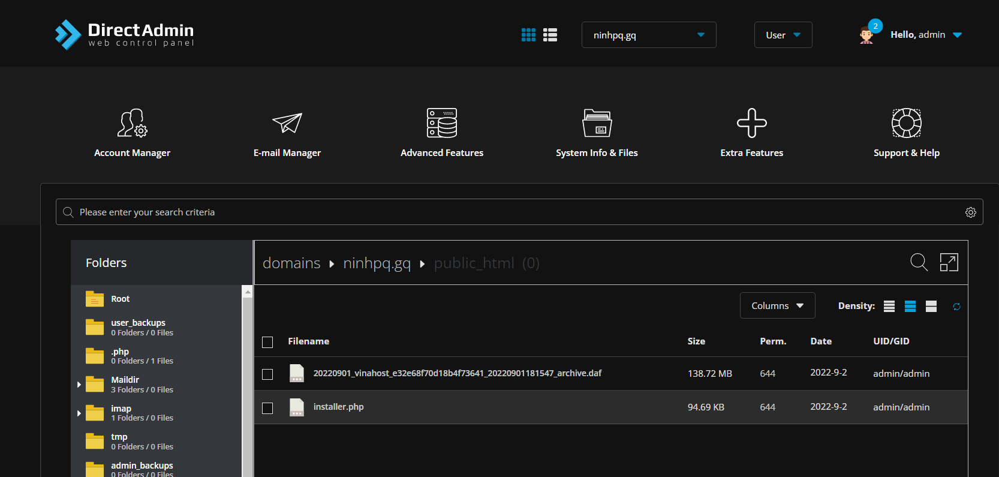

Bước tiếp theo bạn tạo 1 database rỗng mới hoàn toàn tại Account Manager và chọn MySQL Databases. Nhập tên database và User nhấn Create Database để tạo một database mới.

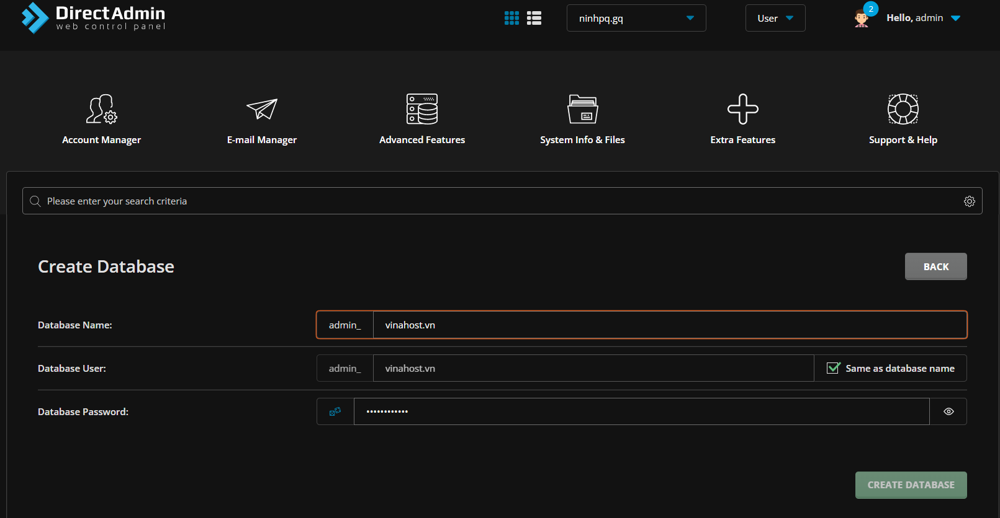

Sau khi đã tạo hoàn tất bạn truy cập vào website của bạn. Ở đây mình cài cho website là phamninh.cf mình sẽ truy cập [**https://ninhpq.gq/installer.php**](https://phamninh.cf/installer.php) trên trình duyệt.

Chọn kiểu cài đặt: Restore một site hay tất cả site

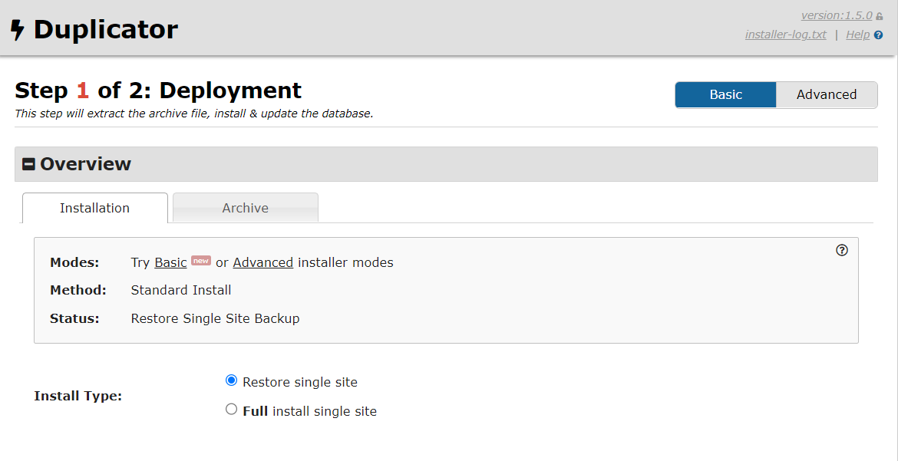

Tại mục Setup bạn điền như sau

- Hosts: localhost
- Database: Nhập vào tên database rỗng đã tạo trước đó
- User: Nhập vào tên user đã tạo trước đó
- Password: Nhập vào pasword database đã tạo trước đó

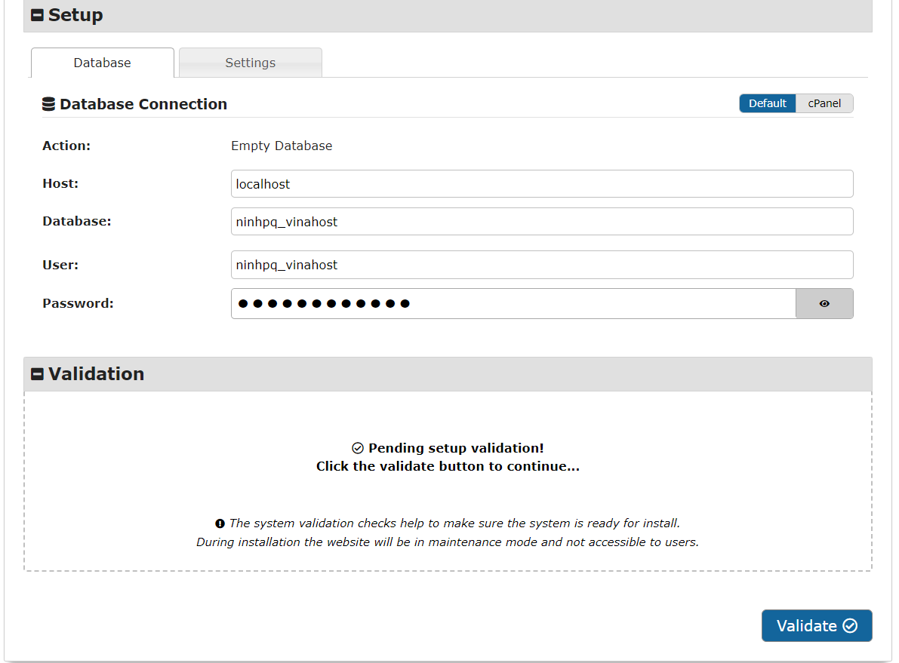

Nhấn OK để bắt đầu tiến hành restore

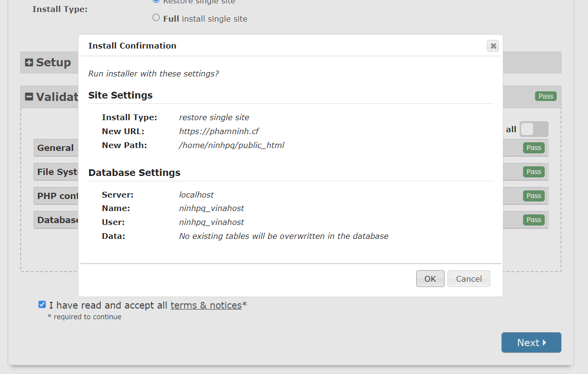 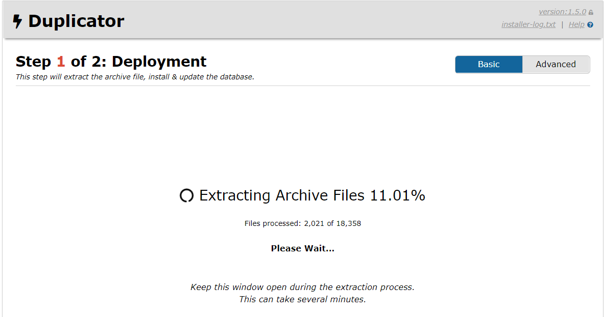

Giao diện khi thông báo đã cài đặt thành công. Lưu ý, bạn nên xóa file installer.php trên hosting đi nhé, hoặc tích vào Auto delete installer file để tránh rủi ro bảo mật.

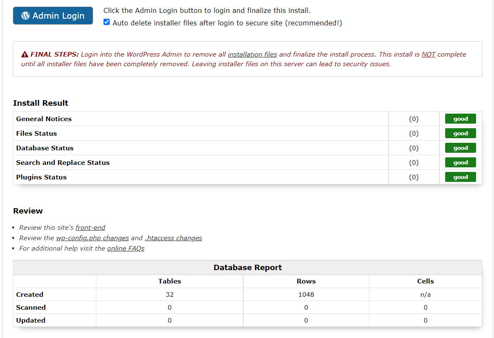

Chúng ta bắt đầu truy cập vào Admin Login theo thông tin như ban đầu.

Giao diện như dưới đây là đã Restore thành công rồi nhé!

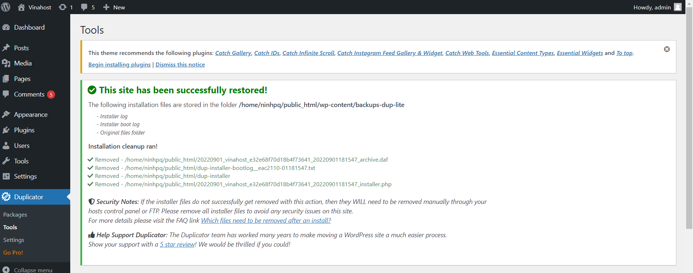

Chúc quý khách thực hiện thành công!

> **THAM KHẢO CÁC DỊCH VỤ TẠI [VINAHOST](https://kb.vinahost.vn/)**
> 
> **\>>** [**SERVER**](https://vinahost.vn/thue-may-chu-rieng/) **–** [**COLOCATION**](https://vinahost.vn/colocation.html) – [**CDN**](https://vinahost.vn/dich-vu-cdn-chuyen-nghiep)
> 
> **\>> [CLOUD](https://vinahost.vn/cloud-server-gia-re/) – [VPS](https://vinahost.vn/vps-ssd-chuyen-nghiep/)**
> 
> **\>> [HOSTING](https://vinahost.vn/wordpress-hosting)**
> 
> **\>> [EMAIL](https://vinahost.vn/email-hosting)**
> 
> **\>> [WEBSITE](http://vinawebsite.vn/)**
> 
> **\>> [TÊN MIỀN](https://vinahost.vn/ten-mien-gia-re/)**
