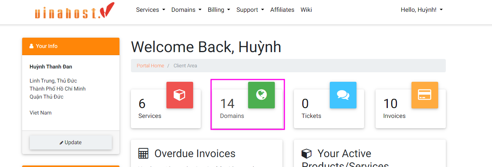

Bài viết này sẽ giải thích khái niệm **CNAME là gì** cũng như hướng dẫn bạn cách **Sử Dụng CNAME Record Với Domain.** Nếu bạn cần hỗ trợ, xin vui lòng liên hệ VinaHost qua **Hotline 1900 6046 ext. 3**, email về [support@vinahost.vn](mailto:support@vinahost.vn) hoặc chat với VinaHost qua livechat [https://livechat.vinahost.vn/chat.php](https://livechat.vinahost.vn/chat.php).

## 1\. CNAME là gì?

- CNAME là Bản ghi tên quy chuẩn – Canonical Name Record, hay là Bản ghi bí danh của một **_Tên miền_** nhất định.
- CNAME còn được giải thích là Bảng ghi tài nguyên trong DNS (Hệ thống tên miền) – là bí danh của một tên miền chuẩn khác.

## 2\. Một vài cách sử dụng bản ghi CNAME phổ biến

- Cung cấp tên máy chủ riêng cho các dịch vụ mạng cụ thể như: Email hoặc FTP => trỏ máy chủ đó đến tên miền gốc.
- Nhiều dịch vụ cung cấp tên miền phụ cho khách hàng trên miền của nhà cung cấp dịch vụ (ví dụ: company.hostname.com) và sử dụng CNAME để trỏ đến tên miền của khách hàng (www.company.com).
- Đăng ký cùng một tên miền ở một số quốc gia và trỏ về tên miền chính là “.com”.
- Trỏ từ một số trang web thuộc sở hữu của cùng một tổ chức đến một trang web chính.

## 3\. Hệ thống DNS xử lý bản ghi CNAME như thế nào?

**CNAME từ tên miền phụ đến tên miền chính**

NAME TYPE VALUE

**CNAME từ miền phụ sang miền gốc khác**

NAME TYPE VALUE

## 4\. Quy trình phân giải DNSvcho bản ghi CNAME

- Máy DNS của người dùng (trình duyệt hoặc thiết bị mạng) yêu cầu địa chỉ www.example.com và một yêu cầu tạo DNS.
- Trình phân giải DNS nhận yêu cầu và tìm Name Server có thẩm quyền để lưu trữ tệp DNS Zone với bản ghi DNS cho tên miền “example.com”.
- Yêu cầu DNS xử lý và bản ghi CNAME được trả về máy của người dùng.
- Người dùng hiểu www.example.com chỉ là bí danh cho địa chỉ thực “example.com” và đưa ra truy vấn DNS mới.
- Quá trình được lặp lại và trình phân giải trả về bản ghi A cho “example.com” có chứa địa chỉ IP.
- Máy DNS của người dùng hiện kết nối với “example.com” bằng địa chỉ IP của nó.

## 5\. Ưu điểm và nhược điểm của bản ghi CNAME

### 5.1. Ưu điểm của bản ghi CNAME

- Cho phép tạo các tên miền thay thế (alias) cho các tên miền chính (canonical), giúp dễ dàng quản lý tên miền và cấu trúc website.
- Cho phép dễ dàng thay đổi địa chỉ IP của tên miền chỉ bằng cách chỉnh sửa bản ghi CNAME liên kết đến nó, thay vì phải sửa đổi nhiều bản ghi A hoặc AAAA.
- Có thể sử dụng bản ghi CNAME để chuyển hướng truy cập từ một tên miền sang tên miền khác, giúp đơn giản hóa quá trình chuyển đổi tên miền.

### 5.2. Hạn chế của bản ghi CNAME

- CNAME không được đặt ở cấp miền gốc (root domain) – vì đây là DNS Start Of Authority (SOA) phải trỏ đến một địa chỉ IP.
- Bản ghi CNAME không bao giờ trỏ tới địa chỉ IP mà sẽ đến một tên miền khác.
- Tên máy chủ trong bản ghi CNAME phải là duy nhất, không thuộc loại khác như MX, A… ngoại trừ bản ghi DNSSEC như: RRSIG và NSEC.
- Bản ghi CNAME có thể trỏ đến các bản ghi CNAME khác, nhưng cách làm này không mang lại bất kỳ hiệu quả nào.
- Bản ghi MX và NS không bao giờ được trỏ đến CNAME.
- Tên miền được sử dụng cho Email có thể không có bản ghi CNAME.

## 6\. CNAME và các loại bản ghi thay thế

Bản ghi CNAME thường được sử dụng cùng với các loại bản ghi DNS khác gồm: Bản ghi A và Bản ghi ALIAS.

### 6.1. Sự khác biệt giữa A và CNAME

Bản ghi A ánh xạ tên máy chủ tới một hoặc nhiều địa chỉ IP, trong khi bản ghi CNAME ánh xạ tên máy chủ sang tên máy chủ khác.

### 6.2. Sự khác biệt giữa ALIAS và CNAME

Tương tự như CNAME, bản ghi ALIAS cũng ánh xạ tên máy chủ đến một tên máy chủ khác. Tuy nhiên, bản ghi ALIAS cho phép có nhiều bản ghi DNS khác nhau trên cùng một tên máy chủ, trong khi CNAME thì không.

\=> Do đó, bạn có thể áp dụng ALIAS tại miền gốc (DNS ZONE APEX) mà CNAME không thể.

Ngoài ra, ALIAS có hiệu suất tốt hơn CNAME vì không yêu cầu máy DNS của người dùng phân giải tên máy chủ khác – mà trực tiếp trả về IP.

Tuy nhiên, bản ghi ALIAS cũng cần phải Reverse lookup (Tra cứu ngược) nên có thể ảnh hưởng đến hiệu suất.

## 7\. So Sánh CNAME và Redirect

<table><tbody><tr><td style="text-align: center;" width="468">CNAME</td><td style="text-align: center;" width="468">ReDirect</td></tr><tr><td width="468">Bản ghi CNAME: được sử dụng để liên kết một tên miền với một tên miền khác, cho phép tạo các tên miền thay thế cho các tên miền chính</td><td width="468">Được sử dụng để chuyển hướng người dùng từ một địa chỉ URL đến một địa chỉ URL khác, giúp thay đổi địa chỉ của một trang web.</td></tr><tr><td width="468">Là một bản ghi DNS.</td><td width="468">Là một luồng HTML hoặc một tệp tin trên Webserver.</td></tr><tr><td width="468">Có thể ảnh hưởng đến tốc độ phản hồi truy vấn DNS.</td><td width="468">Tốc độ phản hồi sẽ được ảnh hưởng bởi việc phải tải lại trang web.</td></tr><tr><td width="468">Không thể sử dụng cho tên miền gốc (root domain) và không thể trỏ trực tiếp đến địa chỉ IP.</td><td width="468">Có thể sử dụng cho bất kỳ địa chỉ URL nào và có thể trỏ trực tiếp đến địa chỉ IP.</td></tr><tr><td width="468">Cho phép &nbsp;tạo ra các tên miền con (subdomain) với nội dung giống nhau nhưng cùng trỏ đến một địa chỉ IP duy nhất.</td><td width="468">Có nhiều loại redirect khác nhau như: 301 Permanently Moved, 302 Found, 303 See Other, và 307 Temporary Redirect.</td></tr><tr><td width="468">Thường được sử dụng để thiết lập email hosting, content delivery network (CDN), hay trang web nhận diện thương hiệu.</td><td width="468">Thường được sử dụng để chỉnh sửa cấu trúc URL, chuyển hướng trang bị lỗi, hay thông báo về việc di chuyển tạm thời của website.</td></tr></tbody></table>

- Tóm lại, CNAME được sử dụng để chỉ định tên miền 'alias' cho một tên miền cụ thể khác, trong khi Redirect được sử dụng để chuyển hướng truy cập từ một URL đến một URL khác.

Việc nên sử dụng CNAME hay Redirect phụ thuộc vào mục đích cụ thể ví dụ như:

### 7.1. Sử dụng CNAME

- Khi muốn tạo các tên miền con để trỏ về cùng một địa chỉ IP.
- Khi muốn kết nối tên miền với các dịch vụ bên ngoài như email hosting, content delivery network (CDN),…

### 7.2. Sử dụng Redirect

- Khi muốn chuyển hướng người dùng từ một URL đến một URL khác.
- Khi muốn cập nhật cấu trúc URL của trang web hoặc di chuyển trang web sang domain mới.
- Khi muốn thông báo cho người dùng biết về việc di chuyển tạm thời của website.

## 8\. Làm cách nào để tạo bản ghi CNAME?

Bước 1: Đăng nhập vào **quản lý domain của vinahost.**

Bước 2: Nhấp vào “**Manage DNS**“ tại domains cần thêm Cname.

Bước 3: Trong “**Add Record**“ và chọn “**CNAME**“.

Sau đó chọn CNAME

Bước 4: Nhập các thông tin sau:

- Tên miền phụ (bắt buộc) sẽ trở thành Bản ghi, ví dụ: www.
- Tên miền mà bạn muốn tạo Bản ghi – không phải là địa chỉ IP.
- Tùy chọn nhập TTL hoặc để trống ở chế độ mặc định.

Nhấn vào Add Record để lưu lại thông tin record CNAME.

## 9\. Hướng dẫn truy vấn bản ghi CNAME

Có rất nhiều tool có thể giúp kiểm tra CNAME, tại đây Vinahost sẽ hướng dẫn các bạn kiểm tra CNAME với một số tool nổi tiếng:

- MXToolbox - [https://mxtoolbox.com/CnameLookup.aspx](https://mxtoolbox.com/CnameLookup.aspx)

- DNS Checker - [https://dnschecker.org/cname-lookup.php](https://dnschecker.org/cname-lookup.php)

- Nslookup - [https://www.nslookup.io](https://www.nslookup.io)

## 10\. Hướng dẫn tạo bản ghi để xác thực các dịch vụ trực tuyến

Bản ghi CNAME được sử dụng để xác thực các dịch vụ trực tuyến như Google Workspace, Microsoft 365, Amazon Web Services, và nhiều dịch vụ khác. Phổ biến nhất là xác nhận

Thông thường sau khi kích hoạt sẽ có một mail hướng dẫn trỏ Cname để kích hoạt domains như sau:

Bạn có thể vào phần quản lý Domains và trỏ record như hướng dẫn ở trên như sau:

Sau đó khi bạn kiểm tra trên các tool truy vấn nếu đã phân giải thành công thì có thể đợi khoản 30-60 phút để có thể tải bộ Cert về và cài đặt lên WebServer.

## 11\. Kết luận

Bản ghi CNAME là một bản ghi DNS được sử dụng để định danh một tên miền con với một tên miền chính, giúp định hướng traffic từ một tên miền con đến tên miền chính hoặc đến một tên miền khác. Việc sử dụng bản ghi CNAME giúp quản lý tên miền trở nên linh hoạt và thuận tiện hơn.

Mặc dù bản ghi CNAME có nhiều ưu điểm, nhưng cũng có một số hạn chế, ví dụ như tăng độ trễ truy cập tên miền và có thể gây ra vấn đề về SEO. Do đó, việc sử dụng bản ghi CNAME cần được cân nhắc kỹ lưỡng trước khi triển khai.

Để tạo, chỉnh sửa hoặc xóa bản ghi CNAME, bạn cần truy cập vào phần quản lý DNS hoặc Zone file của tài khoản quản lý tên miền của bạn và thực hiện các bước tương ứng. Bạn cũng cần lưu ý rằng, thay đổi bản ghi DNS có thể mất một thời gian để cập nhật trên toàn hệ thống DNS, vì vậy cần phải đợi một thời gian trước khi kiểm tra lại.

Chúc bạn thực hiện thành công!

> **THAM KHẢO CÁC DỊCH VỤ TẠI [VINAHOST](https://vinahost.vn/)**
> 
> **\>>** [**SERVER**](https://vinahost.vn/thue-may-chu-rieng/) **–** [**COLOCATION**](https://vinahost.vn/colocation.html) – [**CDN**](https://vinahost.vn/dich-vu-cdn-chuyen-nghiep)
> 
> **\>> [CLOUD](https://vinahost.vn/cloud-server-gia-re/) – [VPS](https://vinahost.vn/vps-ssd-chuyen-nghiep/)**
> 
> **\>> [HOSTING](https://vinahost.vn/wordpress-hosting)**
> 
> **\>> [EMAIL](https://vinahost.vn/email-hosting)**
> 
> **\>> [WEBSITE](http://vinawebsite.vn/)**
> 
> **\>> [TÊN MIỀN](https://vinahost.vn/ten-mien-gia-re/)**
