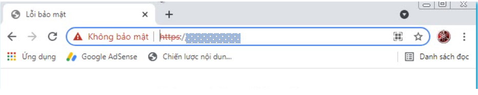
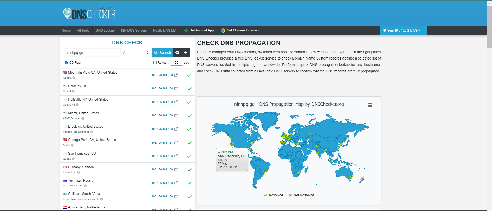
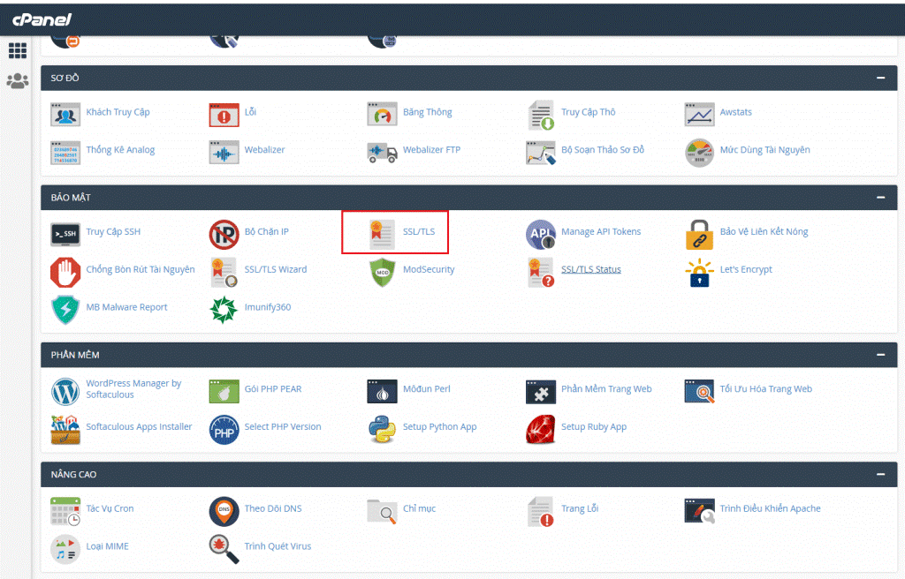
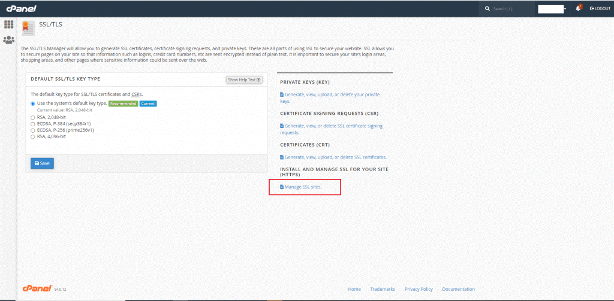
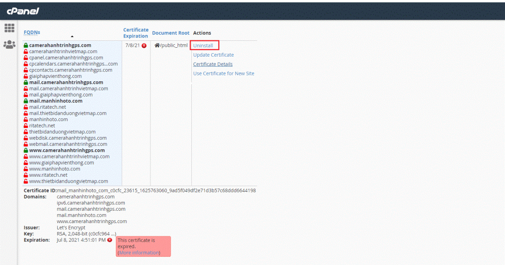
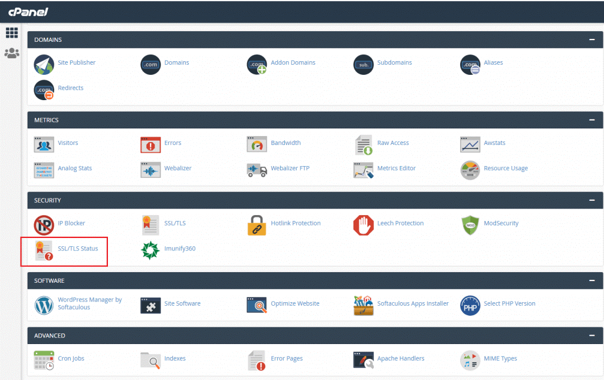
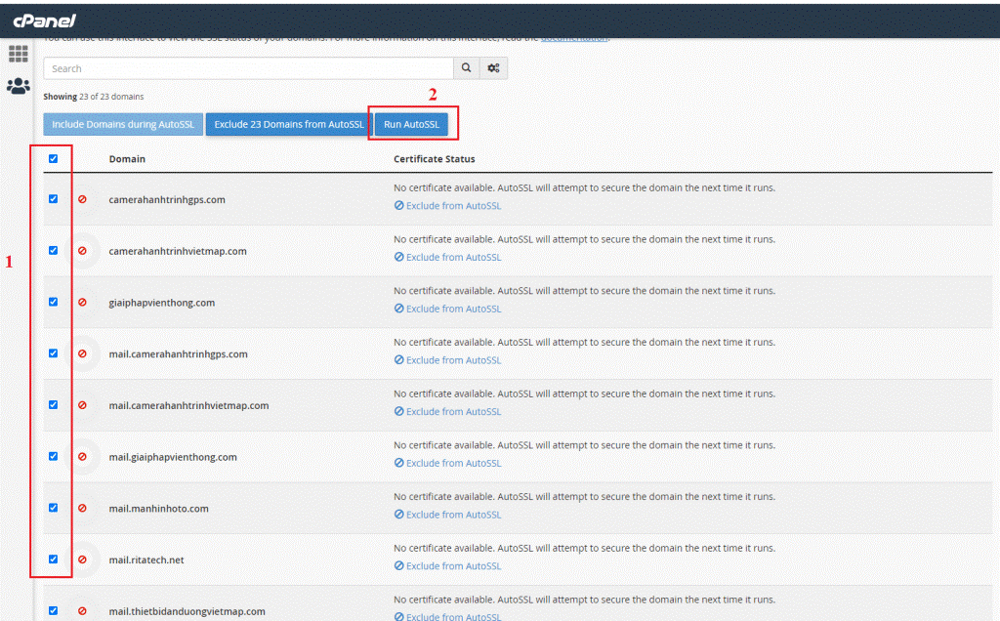
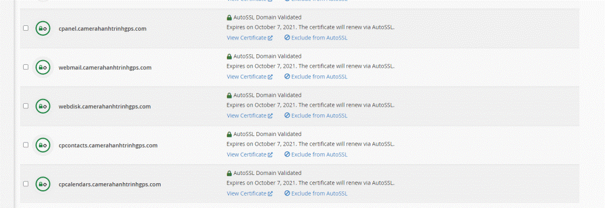

Bài viết này sẽ hướng dẫn bạn cách Đăng Ký Free SSL (Auto SSL) trên Hosting cPanel (chi tiết). Nếu bạn cần hỗ trợ, xin vui lòng liên hệ VinaHost qua Hotline 1900 6046 ext.3, email về support@vinahost.vn hoặc chat với VinaHost qua livechat https://livechat.vinahost.vn/chat.php.

Trên thực tế, trong quá trình bạn tạo 1 trang web mới hay trang web của bạn đã hoạt động ổn định. Tuy nhiên, bỗng 1 ngày nào đó khi bạn truy cập đến trang web đó thì bị báo lỗi lỗi “**Kết nối của bạn không phải là kết nối riêng tư**” hay trong tiếng Anh còn gọi là “**Your connection is not private**” kèm với những cảnh báo rũi ro bảo mật trên trình duyệt Chrome hay Firefox hoặc một số trình duyệt khác thì bạn cũng đừng lo lắng. Đây là một trong những lỗi khá phổ biến hiện nay của trang web. Bạn vẫn có thể truy cập chúng bằng bằng cách nhấn vào nút **Nâng cao** và nhấn tiếp vào link **Tiếp tục truy cập ….**

Thì bạn vẫn truy cập đến được trang web, tuy nhiên nó sẽ chuyển sang dùng giao thức http và sẽ có cảnh báo Không bảo mật như hình phía dưới.

Nguyên nhân trên là do trang web của bạn đang bị lỗi về chứng chỉ SSL dẫn đến 1 số trình duyệt hiểu lầm và cho rằng website đó không tin cậy.

Website thiếu bảo mật sẽ đánh mất lòng tin của khách hàng và ảnh hưởng nghiêm trọng đến danh tiếng của thương hiệu của trang web của bạn.

Thông thường, lỗi "Kết nối của bạn không phải là kết nối riêng tư" sẽ đi kèm với các thông báo sau:

**NET::ERR\_CERT\_COMMON\_NAME\_INVALID** : lỗi này là do phần common name (địa chỉ website) trong chứng chỉ SSL khác với địa chỉ trong thanh địa chỉ của trình duyệt.

Có thể, có một chứng chỉ khác được cài đặt trên tên domain. Kiểm tra để xác nhận thông tin domain “issued to” chứng chỉ domain. Và đảm bảo răng chứng chỉ **Free SSL** bạn đang sử dụng là SAN SSL hay Wildcard SSL và cần phân biệt rõ giữa tên miền có www và non-www.

**NET::ERR\_CERT\_AUTHORITY\_INVALID:** Lỗi này là do không thể xác minh tính hợp lệ của chứng chỉ SSL trên trang web của bạn. Hãy đảm bảo rằng bạn đang sử dụng chứng chủ SSL hợp lệ từ các nhà CA uy tín và đã thêm các file chứng chỉ hợp lệ lên hosting của mình.

**NET::ERR\_CERT\_DATE\_INVALID:** Lỗi này thường xảy ra là do sai ngày giờ trên máy tính của bạn hoặc chứng chỉ SSL trên trang web của bạn đã hết hạn.

**ERR\_SSL\_VERSION\_OR\_CIPHER\_MISMATCH:** do phiên bản SSL không phù hợp.

## **1\. AutoSSL là gì?**

**AutoSSL** là một tính năng mới được cPanel & WHM cho phép người dùng cPanel có thể tự cài đặt và gia hạn chứng chỉ SSL Free cho các website của mình một cách nhanh chóng và vô cùng đơn giản.

Tuy chỉ là chứng chỉ miễn phí tuy nhiên khi website sử dụng SSL thì không những dữ liệu được bảo mật mà còn nâng cao độ uy tín của công ty lên rất nhiều. Website của quý khách sẽ được xác thực và bảo vệ tốt hơn vì các thông tin giao dịch, thanh toán sẽ được mã hoá, bảo vệ nhằm giảm thiểu các nguy cơ xâm phạm từ kẻ xấu. Ngoài ra khi sử dụng SSL thì website sẽ được google đánh giá cao hơn trong việc tìm kiếm từ đó giúp nâng cao hiệu quả cho các chiến dịch SEO của quý khách. Để hiểu rõ hơn về SSL hoặc tham khảo thêm 1 số loại chứng chỉ SSL cao cấp hơn quý khách có thể xem thêm tại link [https://vinahost.vn/ssl.html](https://vinahost.vn/ssl.html)

## **2\. Cách cài đặt một chứng chỉ SSL miễn phí sử dụng Free SSL (AutoSSL) trên Hosting Cpanel**

Đầu tiên các bạn cần kiểm tra xem tên miền đã được trỏ chính xác về địa chỉ IP của Hosting hay chưa-**Đây là điều kiện bắt buộc** để kích hoạt chứng chỉ SSL thành công.

Các bạn có thể kiểm tra bằng cách truy cập đến trang web DNS Checker : [https://dnschecker.org/](https://dnschecker.org/) nhập tên miền cần kiểm tra và chọn Type là A, sau đó nhấn Search để kiểm tra kết quả.

Nếu kêt quả đã chính xác. Bây giờ ta truy cập vào trang quản trị của Hosting Cpanel của Vinahost để tiến hành đăng ký chứng chỉ **SSL** miễn phí nhé!

**Bước 1:** Bạn tiến hành truy cập vào Cpanel của Hosting bạn đăng ký tại Vinahost, tìm và Click vào biểu tượng SSL/TLS.

**Bước 2:** Giao diện cài đặt Free SSL hiện ra, bạn nhấn vào **Manage SSL sites** ( Để kiểm tra chứng chỉ SSL trước đó mình đang sử dụng) sau đó nhấn vào **Uninstall** để gỡ chứng chỉ SSL cũ đó ra. Đối với những bạn đăng kí chứng chỉ SSL mới hoàn toàn có thể bỏ qua bước này và tiến hành thực hiện bước 3.

**Bước 3:** Trở ra ngoài trang chủ và Chọn **SSL/TLS Status** bạn hãy tick vào những domain mình cần cài SSL sau đó nhấn Run AutoSSL

Quá trình cài đặt có thể diễn ra từ 1-2 phút. Sau khi cài đặt thành công sẽ có thông báo như ảnh:

Trong quá trình đăng kí/gia hạn chứng chỉ SSL trên nếu các bạn đã thực hiện và bị lỗi quá 3 lần mà không thể đăng kí/gia hạn chứng chỉ SSL thì hãy liên hệ ngay với Hỗ trợ kỹ thuật của Vinahost tại [support@vinahost.vn](mailto:support@vinahost.vn) hoặc trang web https://vinahost.vn/ để được hỗ trợ nhé! Vì nếu các bạn thao tác lỗi nhiều lần sẽ dẫn đến tình trạng bị Cpanel chặn không thể tạo chứng chỉ Free SSL được nữa.

Chúc quý khách thực hiện thành công!

> **THAM KHẢO CÁC DỊCH VỤ TẠI [VINAHOST](https://kb.vinahost.vn/)**
> 
> **\>>** [**SERVER**](https://vinahost.vn/thue-may-chu-rieng/) **–** [**COLOCATION**](https://vinahost.vn/colocation.html) – [**CDN**](https://vinahost.vn/dich-vu-cdn-chuyen-nghiep)
> 
> **\>> [CLOUD](https://vinahost.vn/cloud-server-gia-re/) – [VPS](https://vinahost.vn/vps-ssd-chuyen-nghiep/)**
> 
> **\>> [HOSTING](https://vinahost.vn/wordpress-hosting)**
> 
> **\>> [EMAIL](https://vinahost.vn/email-hosting)**
> 
> **\>> [WEBSITE](http://vinawebsite.vn/)**
> 
> **\>> [TÊN MIỀN](https://vinahost.vn/ten-mien-gia-re/)**
