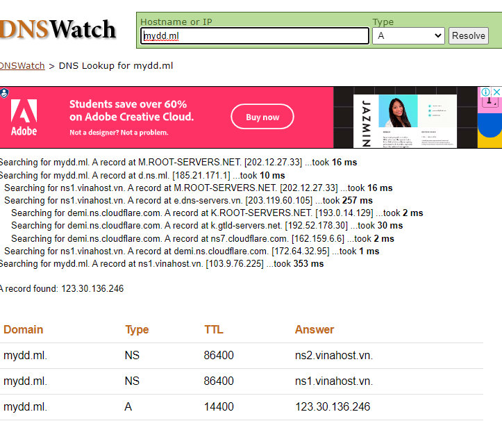
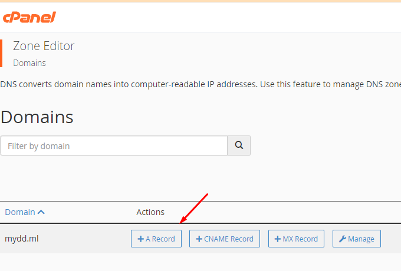
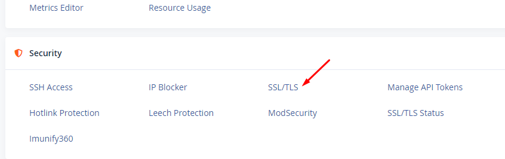
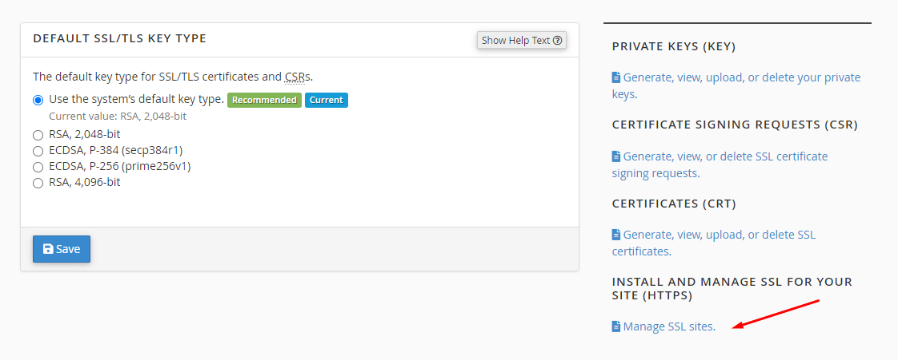
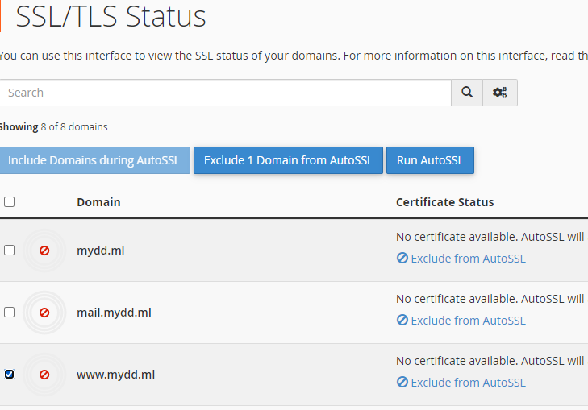
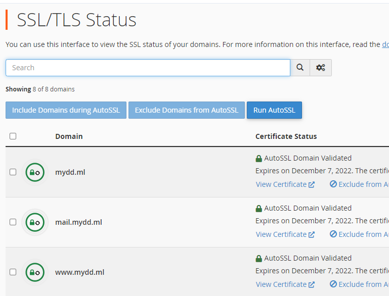

Bài viết này sẽ hướng dẫn bạn cách Đăng Ký Free SSL (Auto SSL) trên Hosting cPanel (rút gọn). Nếu bạn cần hỗ trợ, xin vui lòng liên hệ VinaHost qua Hotline 1900 6046 ext.3, email về support@vinahost.vn hoặc chat với VinaHost qua livechat https://livechat.vinahost.vn/chat.php.

## **Kiểm tra xem tên miền đã được trỏ chính xác về địa chỉ IP chưa**

Để kích hoạt chứng chỉ SSL trước tiên **cần kiểm tra xem tên miền đã được trỏ chính xác về địa chỉ IP chưa** bằng cách có thể truy cập đến trang DNSWatch để kiểm tra (nhập tên miền và chọn **type A**):

## **Nếu record sai record theo các bước sau để thay đổi record A**

- login vào host quản lý, tại khung **Domains** click **Zone editor**, tại đây có 4 lựa chọn, click vào A Record và nhập tên, địa chỉ ip như hình:

## **Tiến hành kích hoạt Free SSL**

- Bước 1: truy cập vào Cpanel, tại Security click SSL/TLS:

- Bước 2: tại đây bạn chọn như hình, sau đó click Uninstall để gỡ chứng chỉ cũ:

- Bước 3: cũng ở **Security** tìm **SSL/TLS Status**, tích vào những domain cần SSL sau đó nhấn **Run** và đợi:

- Như hình là đã thành công:

Chúc quý khách thực hiện cài đặt Free SSL thành công!

> **THAM KHẢO CÁC DỊCH VỤ TẠI [VINAHOST](https://kb.vinahost.vn/)**
> 
> **\>>** [**SERVER**](https://vinahost.vn/thue-may-chu-rieng/) **–** [**COLOCATION**](https://vinahost.vn/colocation.html) – [**CDN**](https://vinahost.vn/dich-vu-cdn-chuyen-nghiep)
> 
> **\>> [CLOUD](https://vinahost.vn/cloud-server-gia-re/) – [VPS](https://vinahost.vn/vps-ssd-chuyen-nghiep/)**
> 
> **\>> [HOSTING](https://vinahost.vn/wordpress-hosting)**
> 
> **\>> [EMAIL](https://vinahost.vn/email-hosting)**
> 
> **\>> [WEBSITE](http://vinawebsite.vn/)**
> 
> **\>> [TÊN MIỀN](https://vinahost.vn/ten-mien-gia-re/)**
