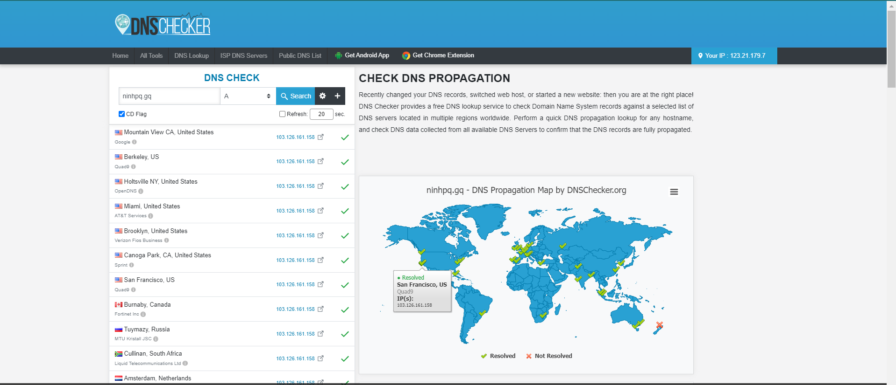

Bài viết này sẽ hướng dẫn bạn cách **Đăng Ký Hoặc Gia Hạn Free SSL Trên DirectAdmin**. Nếu bạn cần hỗ trợ, xin vui lòng liên hệ VinaHost qua Hotline 1900 6046 ext.3, email về support@vinahost.vn hoặc chat với VinaHost qua livechat https://livechat.vinahost.vn/chat.php.

Trên thực tế, trong quá trình bạn tạo 1 trang web mới hay trang web của bạn đã hoạt động ổn định. Tuy nhiên, bỗng 1 ngày nào đó khi bạn truy cập đến trang web đó thì bị báo lỗi lỗi “**Kết nối của bạn không phải là kết nối riêng tư**” hay trong tiếng Anh còn gọi là “**Your connection is not private**” kèm với những cảnh báo rũi ro bảo mật trên trình duyệt Chrome hay Firefox hoặc một số trình duyệt khác thì bạn cũng đừng lo lắng. Đây là một trong những lỗi khá phổ biến hiện nay của trang web. Bạn vẫn có thể truy cập chúng bằng bằng cách nhấn vào nút **Nâng cao** và nhấn tiếp vào link **Tiếp tục truy cập ….**

Thì bạn vẫn truy cập đến được trang web, tuy nhiên nó sẽ chuyển sang dùng giao thức http và sẽ có cảnh báo Không bảo mật như hình phía dưới.

Nguyên nhân trên là do trang web của bạn đang bị lỗi về chứng chỉ **free SSL** dẫn đến 1 số trình duyệt hiểu lầm và cho rằng website đó không tin cậy.

Website thiếu bảo mật sẽ đánh mất lòng tin của khách hàng và ảnh hưởng nghiêm trọng đến danh tiếng của thương hiệu của trang web của bạn.

Thông thường, lỗi "Kết nối của bạn không phải là kết nối riêng tư" sẽ đi kèm với các thông báo sau:

**NET::ERR\_CERT\_COMMON\_NAME\_INVALID** : lỗi này là do phần common name (địa chỉ website) trong chứng chỉ SSL khác với địa chỉ trong thanh địa chỉ của trình duyệt.

Có thể, có một chứng chỉ khác được cài đặt trên tên domain. Kiểm tra để xác nhận thông tin domain “issued to” chứng chỉ domain. Và đảm bảo răng chứng chỉ SSL bạn đang sử dụng là SAN SSL hay Wildcard SSL và cần phân biệt rõ giữa tên miền có www và non-www.

**NET::ERR\_CERT\_AUTHORITY\_INVALID:** Lỗi này là do không thể xác minh tính hợp lệ của chứng chỉ SSL trên trang web của bạn. Hãy đảm bảo rằng bạn đang sử dụng chứng chủ **free SSL** hợp lệ từ các nhà CA uy tín và đã thêm các file chứng chỉ hợp lệ lên hosting của mình.

**NET::ERR\_CERT\_DATE\_INVALID:** Lỗi này thường xảy ra là do sai ngày giờ trên máy tính của bạn hoặc chứng chỉ SSL trên trang web của bạn đã hết hạn.

**ERR\_SSL\_VERSION\_OR\_CIPHER\_MISMATCH:** do phiên bản SSL không phù hợp.

## **1\. Chứng chỉ SSL Let's Encrypt là gì?**

 **Let’s Encrypt** là cơ quan cấp chứng chỉ số (**Certificate Authority** - CA), được điều hành bởi **Internet Security Research Group** (ISRG). Đây là một tổ chức phi lợi nhuận có trụ sở tại California hoạt động vì lợi ích cộng đồng. Theo tuyên bố của Let’s Encrypt thì mục tiêu mà tổ chức này hướng tới là tạo ra một môi trường mạng internet an toàn, riêng tư và tôn trọng người dùng hơn.

Kể từ khi ra mắt vào tháng 4 năm 2016, Let’s Encrypt đã nhanh chóng trở thành một lựa chọn phổ biến cho bất kỳ ai muốn tăng cường bảo mật website. Tổ chức này chuyên cung cấp chứng chỉ số (SSL hoặc TLS) **free SSL**, tự động để kích hoạt HTTPS cho các trang web.

Lưu ý, chứng chỉ của Let’s Encrypt cấp chỉ có hạn sử dụng trong vòng 90 ngày. Trong khi đó chứng chỉ số SSL Cao Cấp có thể kéo dài đến một hoặc hai năm. Tuy bị hạn chế về mặt thời gian sử dụng nhưng nhờ tính năng tự động gia hạn chứng chỉ SSL được tích hợp sẵn trên các Hosting như Cpanel và Directadmin nên sẽ không bị gián đoạn hoạt động vì không có HTTPS. Tuy nhiên trong quá trình tự động gia hạn có thể gặp một số lỗi không dẫn đến việc không thể tự động tạo mới hoặc gia hạn lại chứng chỉ SSL.

Dưới đây Vinahost sẽ hướng dẫn bạn cách đăng ký hoặc gia hạn **SSL** **Let’s Encrypt** trên **DirectAdmin**

## **2\. Cách tiến hành đăng ký hoặc gia hạn chứng chỉ free SSL Let’s Encrypt**

Đầu tiên các bạn cần kiểm tra xem tên miền đã được trỏ chính xác về địa chỉ IP của Hosting hay chưa-**Đây là điều kiện bắt buộc** để kích hoạt chứng chỉ **free SSL** thành công.

Các bạn có thể kiểm tra bằng cách truy cập đến trang web DNS Checker : [https://dnschecker.org/](https://dnschecker.org/) nhập tên miền cần kiểm tra và chọn Type là A, sau đó nhấn Search để kiểm tra kết quả.

Nếu kêt quả đã chính xác. Bây giờ ta truy cập vào trang quản trị của Directadmin để tiến hành đăng ký hoặc gia hạn chứng chỉ **SSL Let’s Encrypt.**

Các bạn cần đảm bảo rằng đang truy cập đến trang quản trị Directadmin bằng quyền User tương ứng với tên miền của trang web mà bạn cần đăng kí hoặc gia hạn lại chứng chỉ SSL.

Nếu trên Directadmin của bạn có nhiều user và tên miền thì bạn thực hiện theo cách sau:

Truy cập vào **Account Manager > Show all user > chọn \*User > Login as \*User**

**Lưu ý: \*User** là tên user tương ứng với tên miền của trang web mà bạn muốn đăng ký hoặc gia hạn chứng chỉ SSL.

Cũng tại phần **Account Manager** Ta chọn **SSL Certificates**

Ta tích chọn và mục **Free & automatic certificate from Let's Encrypt**

- **Common Name** điền tên miền của bạn.
- **Key Size (bits):** có thể chojn 2048 hoặc 4096
- **Certificate Type:** có thể chọn kểu xác thực SHA1 hoặc SHA256 ( nên sử dụng SHA256)

Tùy theo như cầu tạo chứng chỉ SSL của bạn mà có thể tích thêm tùy chọn bên dưới. Mặc định cho **trang web** thì chỉ tích chọn  **domain** và [**www.domain**](http://www.domain)

Sau đó nhấn Save để tiến hành đăng kí mới hoặc gia hạn lại chứng chỉ SSL.

Nếu ta thấy dòng “Certificate for ninhpq.gq,www.ninhpq.gq **has been created successfully!”** tức đã đăng ký/gia hạn chứng chỉ SSL thành công. Sau khi thoát ra sẽ hiện giao diện như hình bên dưới.

Tiếp theo ta kéo xuống dưới và tích chọn vào mục **Force SSL with https redirect** sau đó nhấn **Save** để nó tự động chuyển hướng truy cập trang web bằng giao thức https.

Đối với giao diện Directadmin cũ ta cũng thực hiện tương tự.

Truy cập đến **SSL Certficates** trong phần **Advanced Features** và thực hiện tương tự như trên.

Lưu ý: Đối với một số phiên bản Directadmin khác có yêu cầu nhập thêm địa chỉ email. Các bạn hãy nhập với định dạng admin@domain nhé!

Trong quá trình đăng kí/gia hạn chứng chỉ free SSL trên nếu các bạn đã thực hiện và bị lỗi quá 3 lần mà không thể đăng kí/gia hạn chứng chỉ SSL thì hãy liên hệ ngay với Hỗ trợ kỹ thuật của Vinahost tại [support@vinahost.vn](mailto:support@vinahost.vn) hoặc trang web https://vinahost.vn/ để được hỗ trợ nhé! Vì nếu các bạn thao tác lỗi nhiều lần sẽ dẫn đến tình trạng bị chặn không thể tạo chứng chỉ **SSL Let's Encrypt** được nữa.

Để kiểm tra xem trang web đăng ký/gia hạn thành công chứng chỉ **SSL Let's Encrypt** hay chưa, các bạn truy cập vào trang web [https://www.sslshopper.com/ssl-checker.html](https://www.sslshopper.com/ssl-checker.html)

để kiểm tra nhé!   Kết quả như hình là bạn đã đăng ký/gia hạn chứng chỉ SSL thành công rồi nhé!

Chúc quý khách thực hiện thành công!

> **THAM KHẢO CÁC DỊCH VỤ TẠI [VINAHOST](https://kb.vinahost.vn/)**
> 
> **\>>** [**SERVER**](https://vinahost.vn/thue-may-chu-rieng/) **–** [**COLOCATION**](https://vinahost.vn/colocation.html) – [**CDN**](https://vinahost.vn/dich-vu-cdn-chuyen-nghiep)
> 
> **\>> [CLOUD](https://vinahost.vn/cloud-server-gia-re/) – [VPS](https://vinahost.vn/vps-ssd-chuyen-nghiep/)**
> 
> **\>> [HOSTING](https://vinahost.vn/wordpress-hosting)**
> 
> **\>> [EMAIL](https://vinahost.vn/email-hosting)**
> 
> **\>> [WEBSITE](http://vinawebsite.vn/)**
> 
> **\>> [TÊN MIỀN](https://vinahost.vn/ten-mien-gia-re/)**
