With the aim of bringing the best experience to customers when using the service at Vinahost. Today I would like to guide you to add email accounts by domain name to the interface of Gmail. This will make it possible to use email domain names via Gmail and easily manage your work.

**Step 1**: First you need to sign in to your personal **Gmail address**, then click on the gear item and select **View all settings**

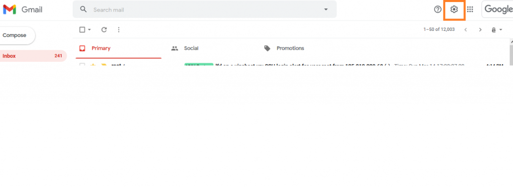

**Step 2**: In the Settings interface -> Click **Tap Account** and enter -> Click "**Add another email address**"

**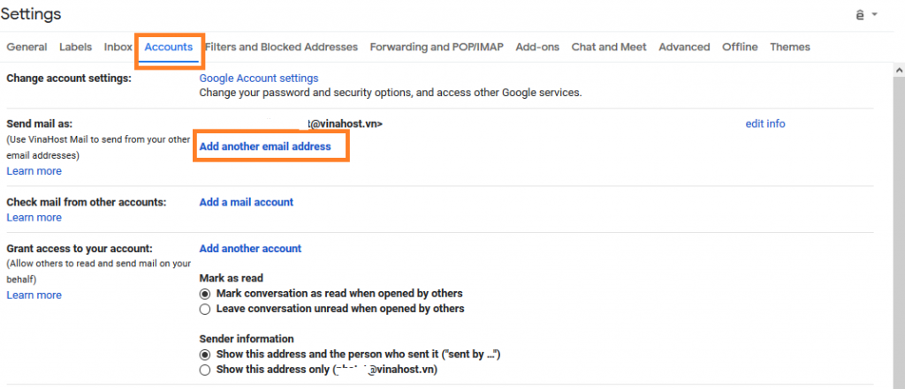**

**Step 3**: A popup appears, enter the email address of the domain you want to connect to gmail -> **Click Next**

Enter the email address you want to use with gmail. Here my example by email for example info @ 1001network will replace with [email@domain.com](mailto:email@domain.com)

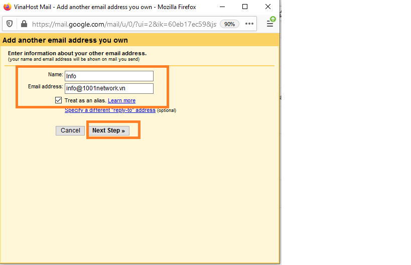

**Step 4**: Set up the SMTP email server - Enter SMTP server information: **e.vinahost.vn**, select port 465. - Username and password enter your email and email password. Click **on Add Account**

 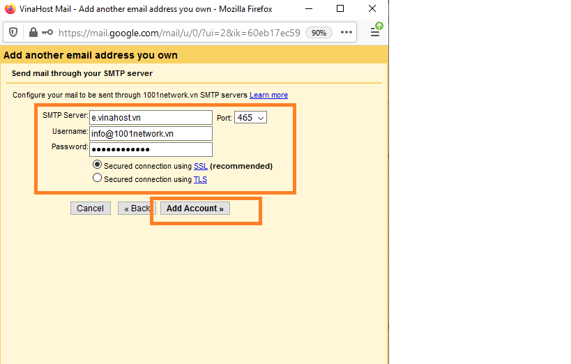

When you click to add an account, a new window will appear asking for authentication.

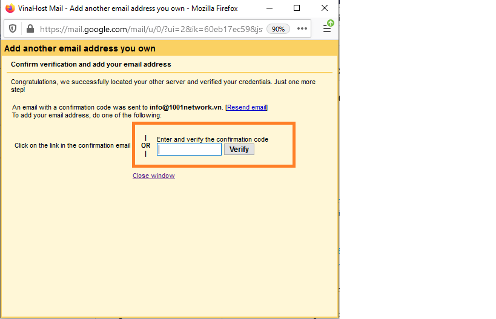

You check your email and use the code sent to the system to authenticate your account.

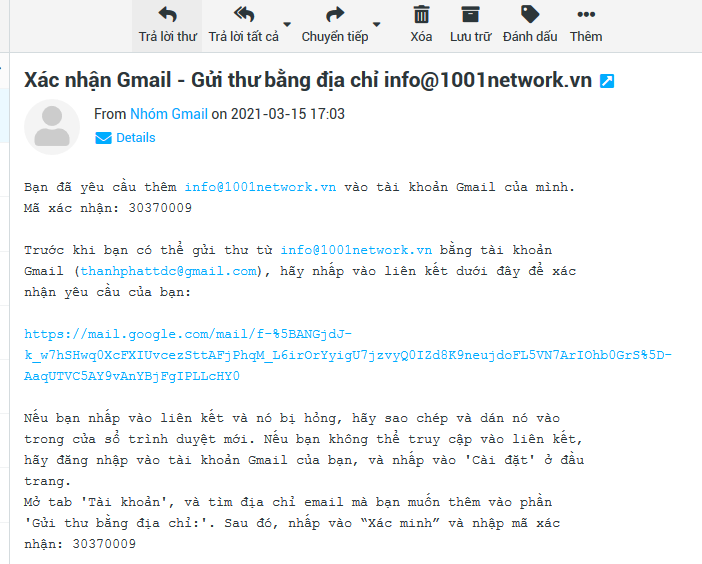

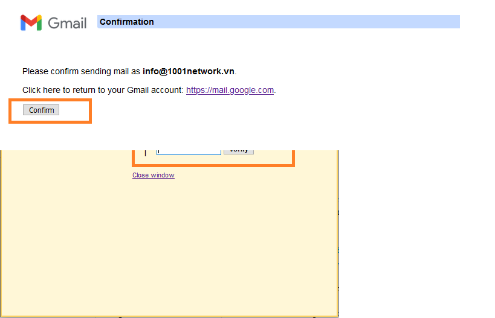

Click link and Confirm to finish.

Step 5: Add an email address for Gmail

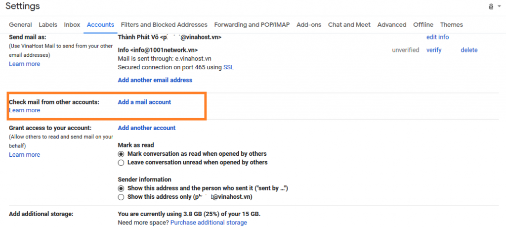

We click **Add a mail accout** in tab **Check mail from orther accounts**  like image.

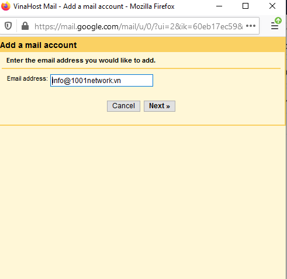

A tab will appear, enter the email you want to add and click **Continue** 

**Step 6:** Enter the information for the account that we want to add.

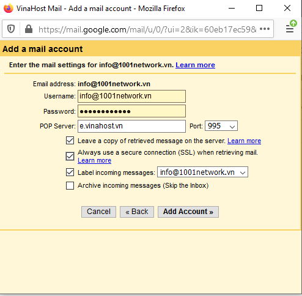

After we fill in the information and port like image, we check gmail's main email and we will receive an authentication email from the system. We open the email and click on the confirmation link as shown to complete the process of adding domain email to gmail.

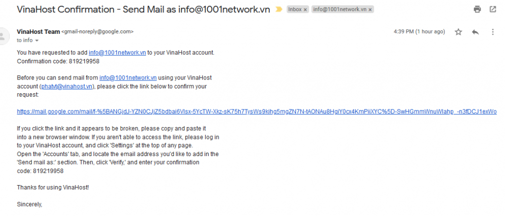

Click Link and click **Confirm** to finish.

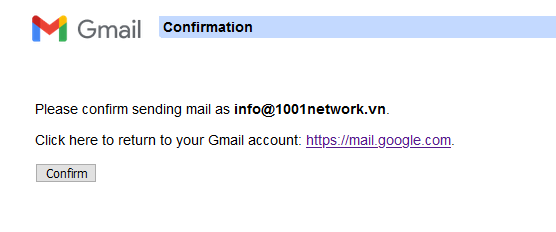

So we can send and receive Email by domain name email directly on the interface of Gmail. Here, for example, with another domain name, you can replace that domain name and email with your email.

**Note:** This tutorial is based on the service's account information at Vinahost. If you have any questions during use, please contact hotline: 19006046 or email support@vinahost.vn for support.

> **\>>** [**SERVER**](https://vinahost.vn/server.php) **-** [**COLOCATION**](https://vinahost.vn/colocation.html) - [**CDN**](https://vinahost.vn/dich-vu-cdn-chuyen-nghiep)
> 
> **\>> [CLOUD](https://vinahost.vn/cloud-server.html) - [VPS](https://vinahost.vn/vps.html)**
> 
> **\>> [HOSTING](https://vinahost.vn/wordpress-hosting)**
> 
> **\>> [EMAIL](https://vinahost.vn/email-hosting.html)**
> 
> **\>> [WEBSITE](http://vinawebsite.vn/)**
> 
> **\>> [TÊN MIỀN](https://vinahost.vn/bang-gia-ten-mien.html)**
> 
> **\>>** [**SSL**](https://vinahost.vn/geotrust-ssl.html)