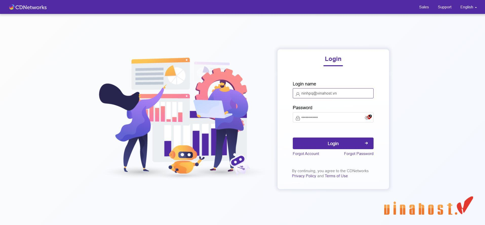
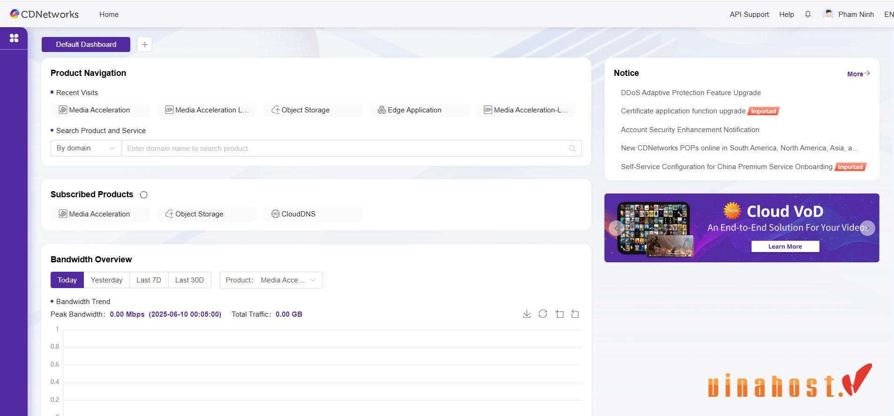
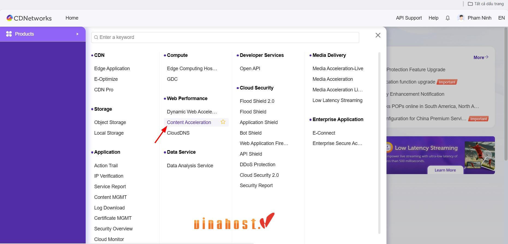

# 1. Hướng dẫn cấu hình dịch vụ Content Acceleration (CA) - Tăng tốc nội dung tĩnh

## 1.1. Đăng nhập vào Customer Portal

Khi bạn mua dịch vụ của CDNetworks, hệ thống sẽ tự động tạo một tài khoản và cung cấp cho bạn thông tin đăng nhập vào **Cổng quản lý khách hàng (Customer Portal)** của chúng tôi. Đây là nơi bạn sẽ thực hiện mọi cấu hình cho các dịch vụ của mình.

**Truy cập đường dẫn:** Bạn sẽ nhận được đường dẫn truy cập cổng quản lý qua email. Thông thường sẽ là một đường dẫn có dạng `https://portal.cdnetworks.com` hoặc tương tự.
**Nhập thông tin đăng nhập:** Sử dụng **Username** và **Password** đã được cung cấp.



!!! tip "Mẹo nhỏ"
        Hãy lưu trữ thông tin đăng nhập này ở nơi an toàn để tránh mất mát. Nếu quên mật khẩu, bạn có thể sử dụng chức năng "Forgot Password", link retset password sẽ được gửi về địa chỉ email.

## 1.2. Tổng quan giao diện

Sau khi đăng nhập thành công, bạn sẽ được đưa đến trang tổng quan (Dashboard) của Customer Portal. Tại đây, bạn có thể xem nhanh tình trạng dịch vụ, dữ liệu thống kê cơ bản và truy cập vào các phần quản lý dịch vụ cụ thể.



---

# 2. Cấu hình dịch vụ Content Acceleration

Dịch vụ này lý tưởng cho việc phân phối nội dung tĩnh như hình ảnh, CSS, JavaScript, video, và các tệp tải xuống.

Trong trường hợp này, cần sử dụng **tên miền phụ (subdomain)** để kết nối từ CDN tới **Origin là IP Host**.

Ví dụ cụ thể trong bài hướng dẫn này:

### 2.1  Truy cập dịch vụ:
  ``` markdown-tree 
Home
	Products
		Web Performance
			Content Acceleration
```


### 2.2  Nhập thông tin cơ bản:
    * **Service Name:** Đặt tên dễ nhớ cho dịch vụ của bạn (ví dụ: `MySubDomain_ContentAcc`).
    * **Domain:** Nhập tên miền phụ của bạn (ví dụ: `static.yourrootdomain.com`).
    * **Origin Type:** Chọn **IP Address**.
    * **Origin IP Address:** Nhập địa chỉ IP của máy chủ chứa nội dung tĩnh của bạn (ví dụ: `192.168.1.101`).

    ```
    # [Hình ảnh minh họa form điền thông tin cơ bản cho Content Acceleration]
    ```

3.  **Cấu hình nâng cao (tùy chọn và khuyến nghị):**
    * **Cache Policy:** Đây là phần rất quan trọng đối với Content Acceleration. Bạn cần cấu hình các quy tắc cache để đảm bảo nội dung tĩnh được lưu trữ trên các máy chủ biên của CDNetworks trong thời gian phù hợp.
        * Thiết lập thời gian tồn tại cache (TTL - Time To Live) cho các loại tệp khác nhau (ví dụ: 1 ngày cho hình ảnh, 1 giờ cho CSS/JS).
        * Sử dụng các tiêu đề `Cache-Control` trên máy chủ gốc để kiểm soát tốt hơn.
    * **Compression:** Bật nén Gzip/Brotli cho các loại tệp văn bản (HTML, CSS, JS) để giảm kích thước và tăng tốc độ tải.
    * **Smart Routing:** Cấu hình để tối ưu hóa đường đi của dữ liệu.

    ```
    # [Hình ảnh minh họa khu vực cấu hình Cache Policy và Compression]
    ```

4.  **Xem lại và tạo dịch vụ:**
    * Kiểm tra lại tất cả các cấu hình đã nhập.
    * Nhấp vào nút **Create Service**.

---

### 2.4. Cập nhật DNS cho Content Acceleration

Tương tự như Dynamic Web Acceleration, bạn cần cập nhật bản ghi CNAME cho tên miền phụ của mình.

1.  **Lấy CNAME Record:**
    * Trên trang chi tiết dịch vụ của bạn trong Customer Portal, bạn sẽ thấy thông tin **CNAME Record** (ví dụ: `static.yourrootdomain.com.cdnetworks.net`).

    ```
    # [Hình ảnh minh họa vị trí hiển thị CNAME Record cho tên miền phụ]
    ```

2.  **Cập nhật tại nhà cung cấp DNS của bạn:**
    * Đăng nhập vào trang quản lý DNS của nhà cung cấp tên miền của bạn.
    * **Tạo bản ghi CNAME:**
        * **Host/Name:** Nhập tên miền phụ của bạn (ví dụ: `static`).
        * **Value/Target:** Dán CNAME Record đã lấy từ CDNetworks.
    * Lưu các thay đổi.

    ```
    # [Hình ảnh minh họa giao diện cập nhật DNS, chỉ mũi tên vào vị trí tạo CNAME cho subdomain]
    ```

---

### :octicons-lightbulb-24: Luôn kiểm tra và theo dõi :octicons-lightbulb-24:

Sau khi cấu hình, điều quan trọng là bạn cần kiểm tra lại các dịch vụ của mình và theo dõi hiệu suất thông qua phần báo cáo và thống kê của CDNetworks Customer Portal.

* **Reports:** Cung cấp thông tin chi tiết về băng thông, lượt truy cập, lưu lượng truy cập theo khu vực địa lý, v.v.
* **Logs:** Giúp bạn gỡ lỗi nếu có vấn đề phát sinh.

Hy vọng hướng dẫn này sẽ giúp bạn dễ dàng cấu hình dịch vụ Content Acceleration của CDNetworks. Nếu có bất kỳ thắc mắc hay cần hỗ trợ thêm, đừng ngần ngại liên hệ với đội ngũ hỗ trợ của chúng tôi nhé!
