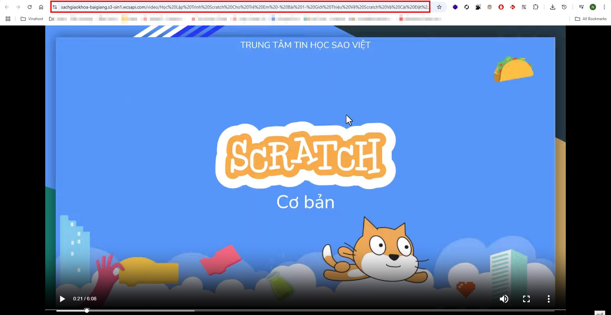
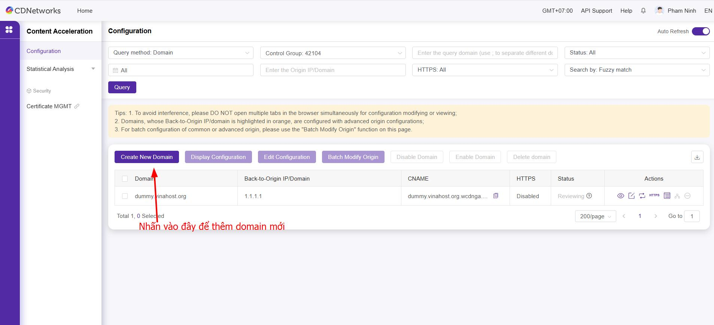
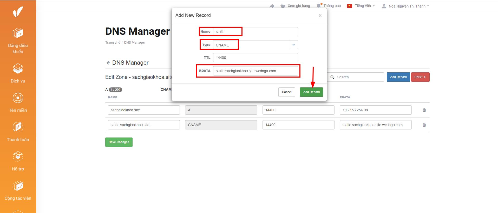

# Hướng dẫn cấu hình dịch vụ Content Acceleration (CA) với Object Storage

Tài liệu này hướng dẫn bạn cách tối ưu hóa tốc độ tải nội dung tĩnh cho website của mình bằng dịch vụ CDNetworks Content Acceleration (CA) với Object Storage

# Chuẩn bị  

- Domain chính: ví dụ `sachgiaokhoa.site`  
- Domain CDN: ví dụ `static.sachgiaokhoa.site`  

# Cấu hình  
== "Bước 1"  
	**Tạo Bucket trong Object Storage**  
		
		
		
		
		
		
		
		
		
		
== "Bước 2"  
	**Tạo Domain mới trong Content Acceleration**  
		
		
		
== "Bước 3"  
	**Trỏ record DNS**  
		
		Trỏ record DNS trong trang DNS Manager  
		
		Kiểm tra phân giải DNS
		
== "Bước 4"  
	**Cài đặt chứng chỉ SSL**  
	Sau khi DNS đã phân giải thành công, thì tiến hành cài đặt chứng chỉ SSL  
	
	Tiến hành oder một chứng chỉ SSL mới  
	
	
	
	
	Truy cập lại trang dịch vụ Content Acceleration để kiểm tra  
	
== "Bước 5"  
	**Cấu hình CDN lên trang web và kiểm thử**  
	Kiểm thử thông qua Postman https://web.postman.co/  
	