## Hướng dẫn cấu hình dịch vụ Content Acceleration (CA) với Origin Server

Tài liệu này hướng dẫn bạn cách tối ưu hóa tốc độ tải nội dung tĩnh cho website của mình bằng dịch vụ CDNetworks Content Acceleration (CA) với Origin Server
## 🎯 Mục tiêu:
Tăng tốc nội dung tĩnh của website `sachgiaokhoa.site` như HTML, CSS, JS, ảnh...
## 🔧 Cấu hình cần thiết:

| Mục                 | Giá trị                                                        |
| ------------------- | -------------------------------------------------------------- |
| **CDN Domain (CA)** | `static.sachgiaokhoa.site` _(subdomain dành cho CDN)_          |
| **Origin URL**      | `https://sachgiaokhoa.site`                                    |
| **CNAME record**    | `static.sachgiaokhoa.site` → trỏ về `CA edge hostname` của CDN |
## 📌 Cách cấu hình:

=== "**Bước 1**"  
	**Tạo Domain mới trong Content Acceleration**  
		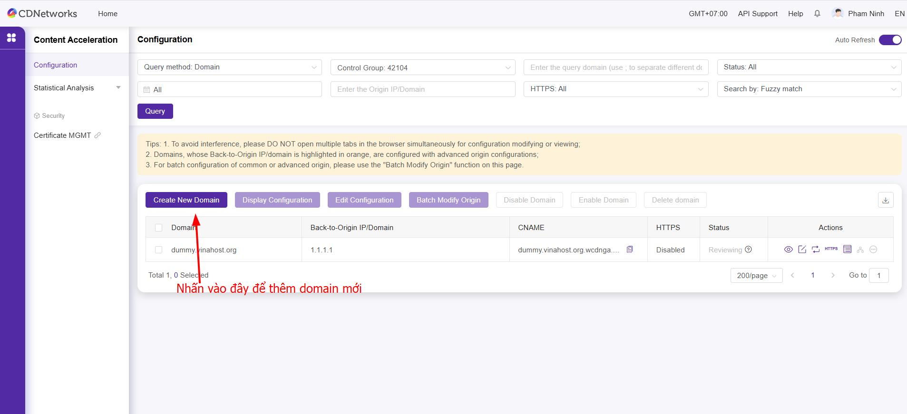
		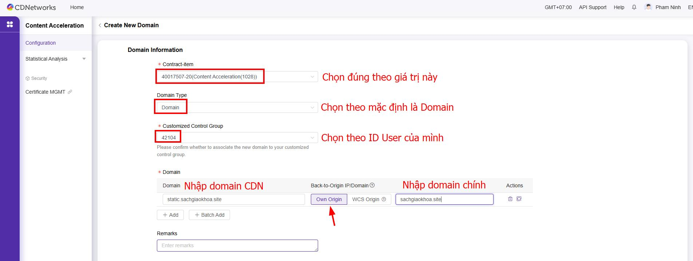
		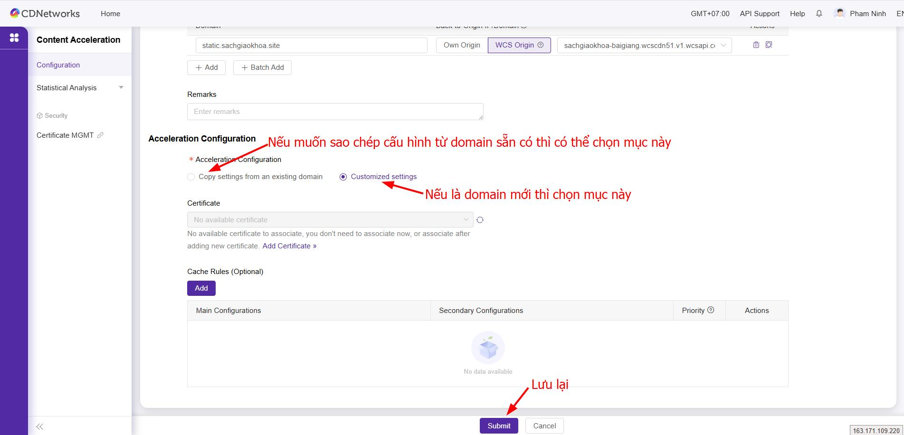
=== "**Bước 2**"  
	**Trỏ record DNS**  
		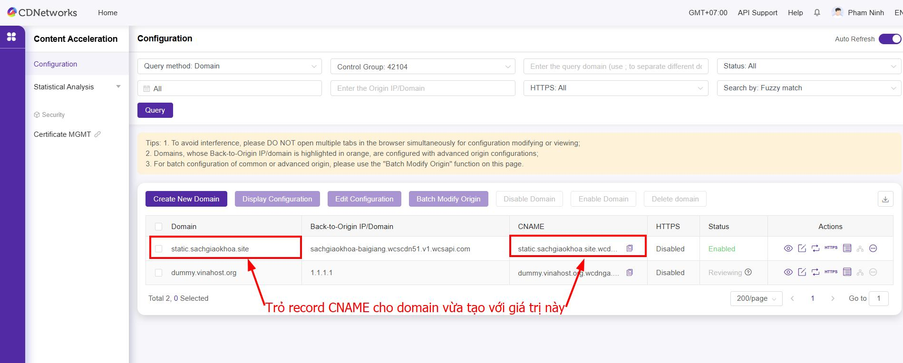
		Trỏ record DNS trong trang DNS Manager  
		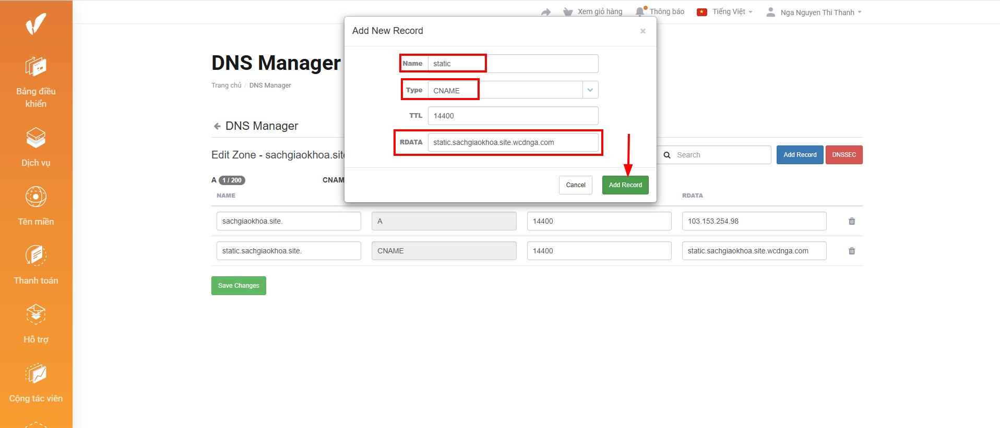
		Kiểm tra phân giải DNS
		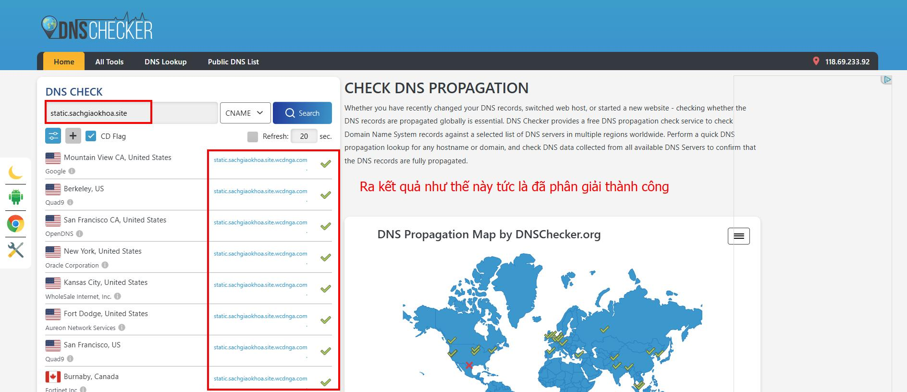
=== "**Bước 3**"  
	**Cài đặt chứng chỉ SSL**  
	Sau khi DNS đã phân giải thành công, thì tiến hành cài đặt chứng chỉ SSL  
	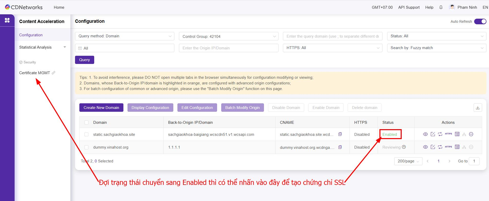
	Tiến hành oder một chứng chỉ SSL mới  
	
	
	
	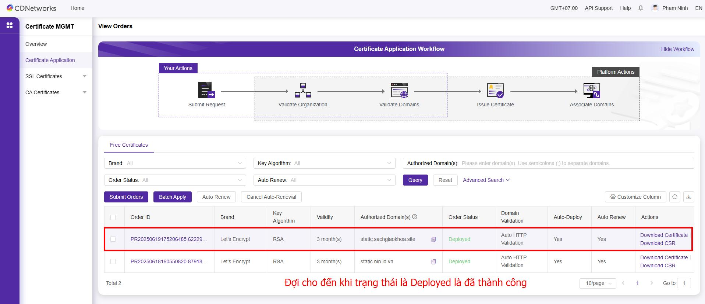
	Truy cập lại trang dịch vụ Content Acceleration để kiểm tra  
	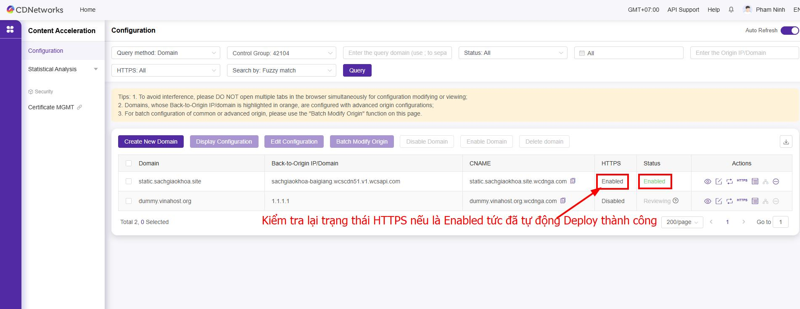
=== "**Bước 4**"  
	**Cấu hình CDN lên trang web**  
	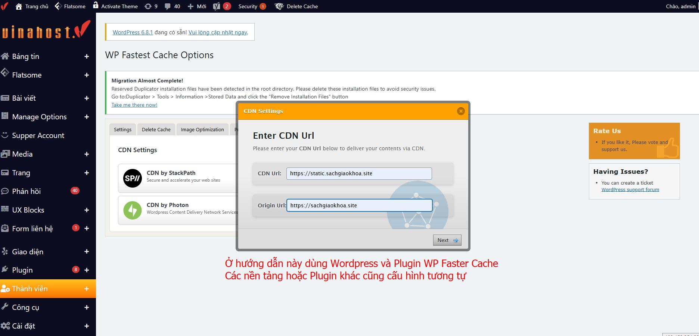
	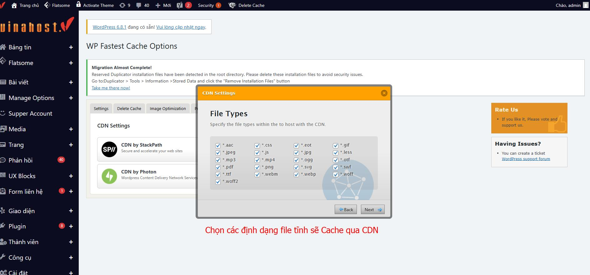
=== "**Bước 5**"  
	Truy cập trang web và nhấn F12 để kiểm tra các file tĩnh đã nhận domain CDN hay chưa và  cách nhận biết cách đã HIT hoặc MISS  
	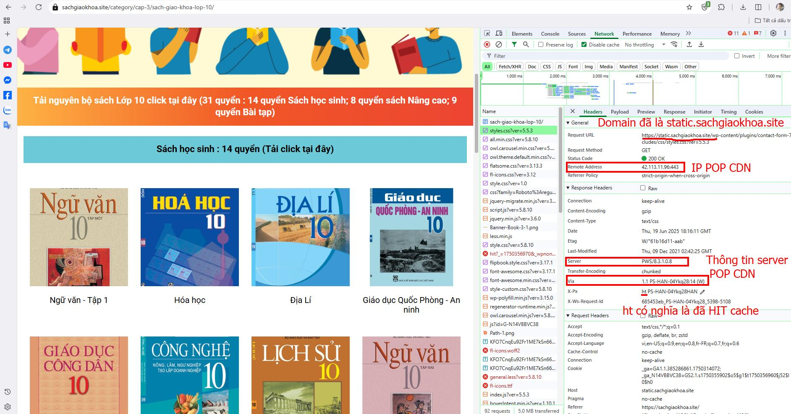
	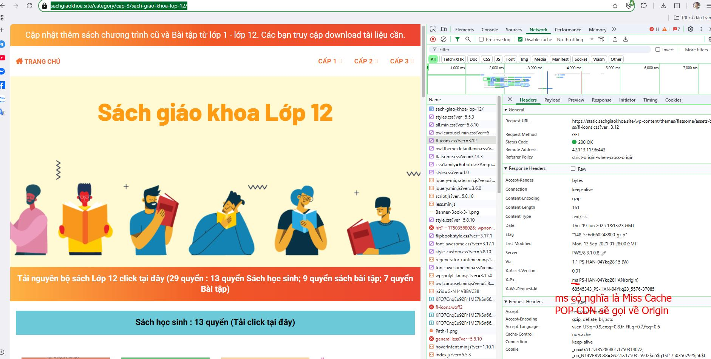
	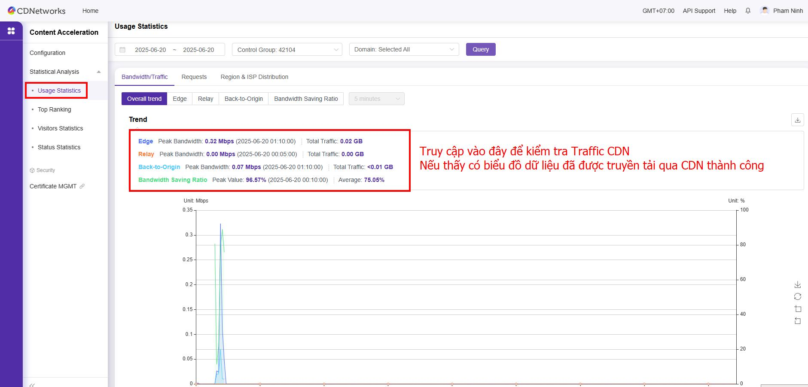