## **Hướng dẫn cấu hình dịch vụ Content Acceleration (CA) - Tăng tốc nội dung tĩnh**

Tài liệu này hướng dẫn bạn cách tối ưu hóa tốc độ tải nội dung tĩnh cho website của mình bằng dịch vụ CDNetworks Content Acceleration (CA).

## **Chuẩn bị**
- Domain chính: ví dụ `design.nin.id.vn`
- Domain CDN: ví dụ `static.nin.id.vn`

## **Cấu hình**
### **Bước 1:** Truy cập dịch vụ 

### **Bước 2**: Thêm domain mới

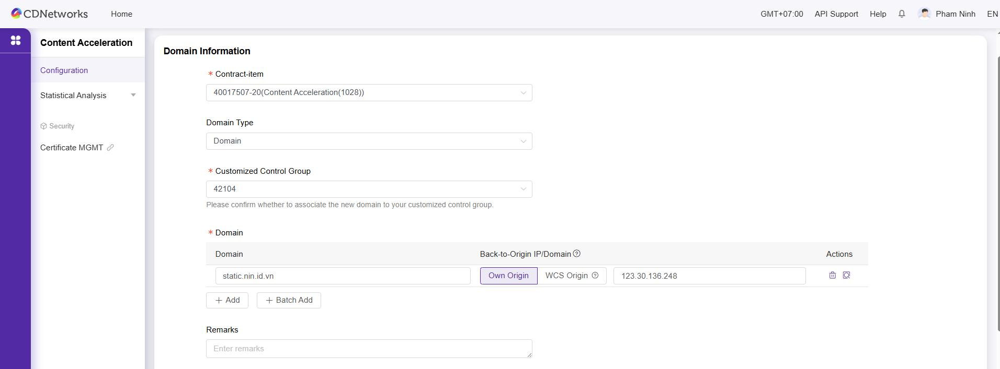

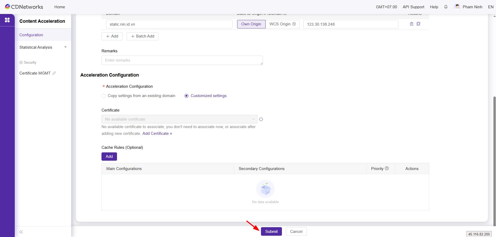

### **Bước 3**: Trỏ record DNS

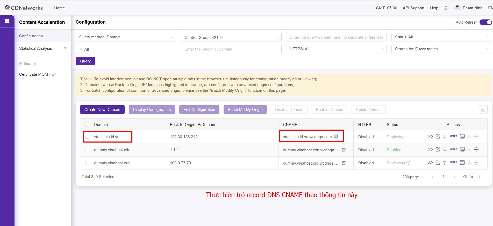

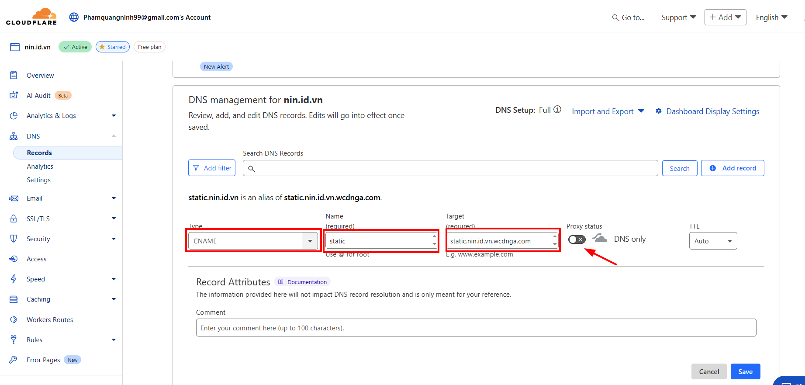

### **Bước 4**: Kiểm tra phân giải DNS

Truy cập trang DNSChecker để kiểm tra phân giải 
https://dnschecker.org/#CNAME/static.nin.id.vn

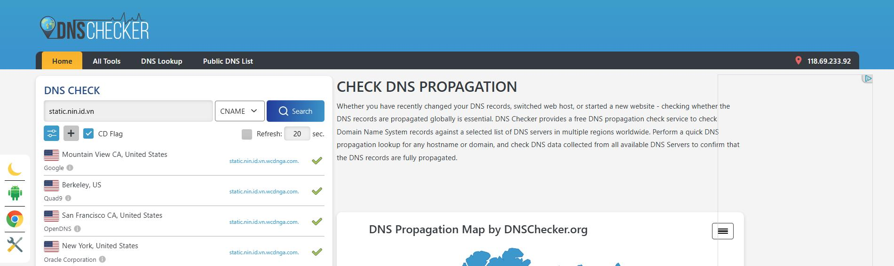

### **Bước 5**: Cài đặt chứng chỉ SSL

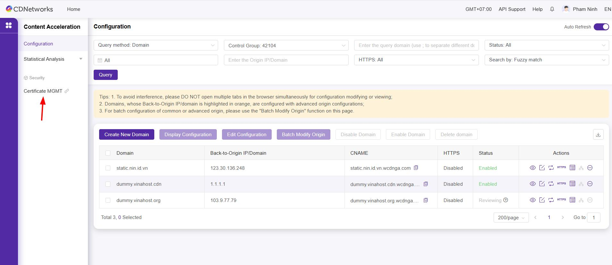

Ở đây mình sẽ ấn chọn **One-Click Certificate Application**

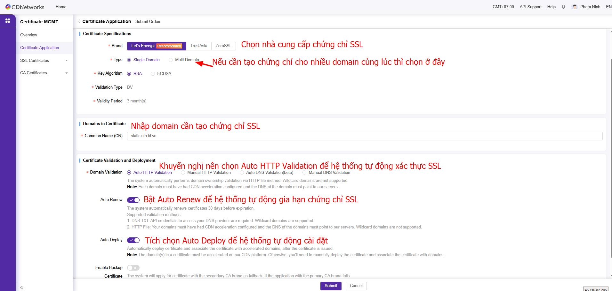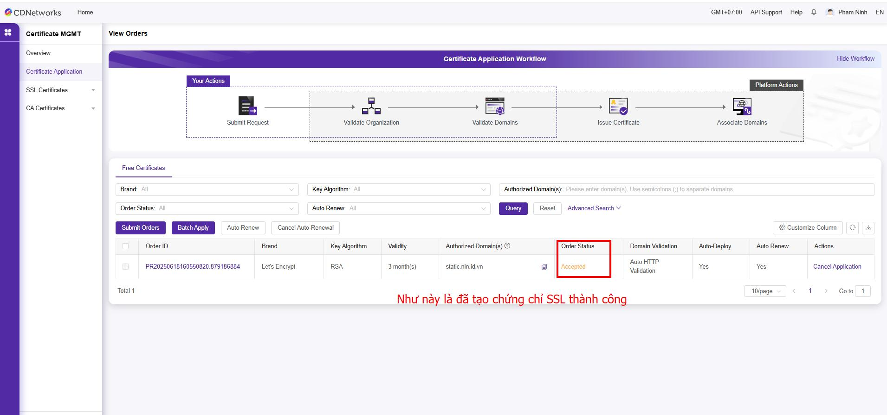

**Bây giờ hãy hay lại trang quản lý dịch vụ Content Acceleration để Deploy chứng chỉ SSL đó cho Subdomain thêm ở bước 2**

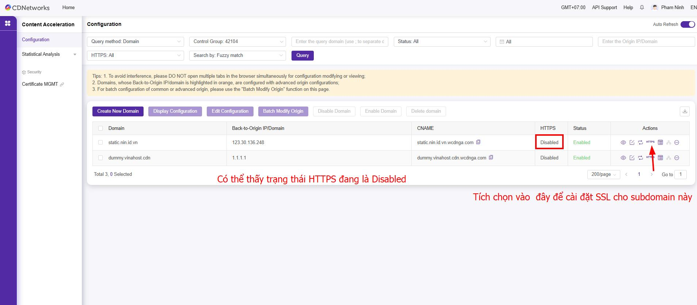

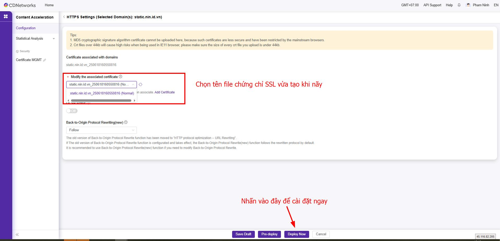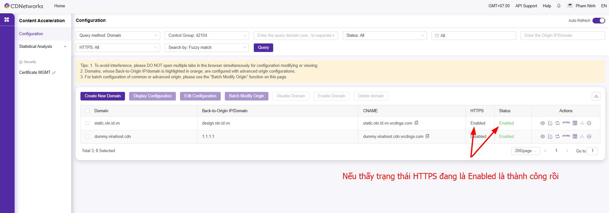

Lưu ý thêm, Nếu trang web của bạn đang sử dụng Shared Hosting và chỉ cho phép truy cập bằng Domain thì cần cấu hình khai báo thêm **Back-to-Origin Request Host** là domain trang web của bạn
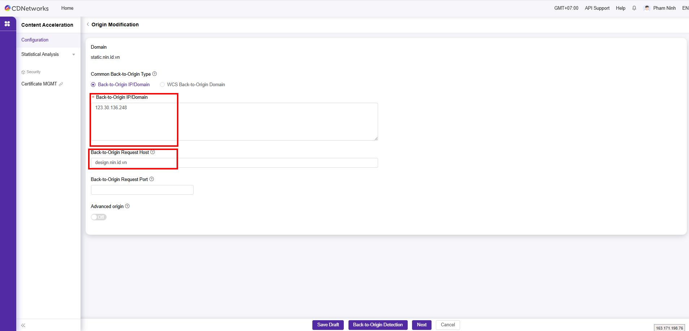

### **Bước 6: Cấu hình CDN trên trang web và kiểm thử**

Kiểm thử thời gian thông qua Postman

=== "Chưa cấu hình CDN"
	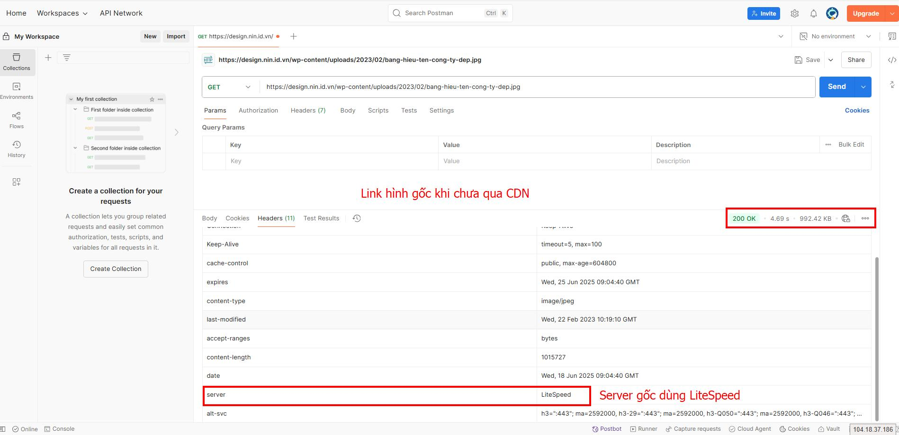
=== "Lần đầu CDN chưa cache"
	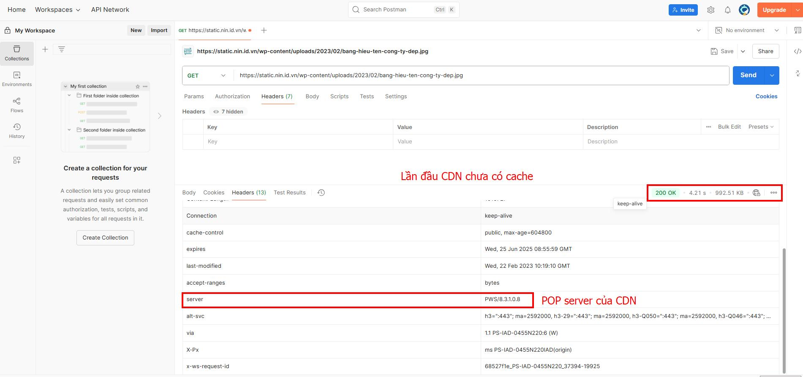
=== "Lần tiếp theo CDN đã có cache"
	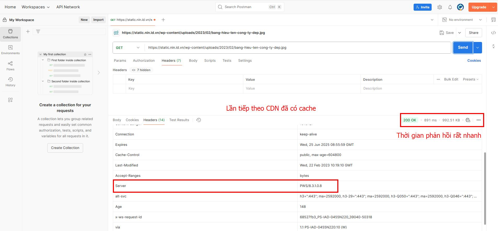
