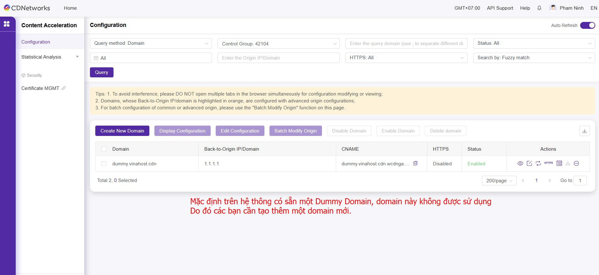
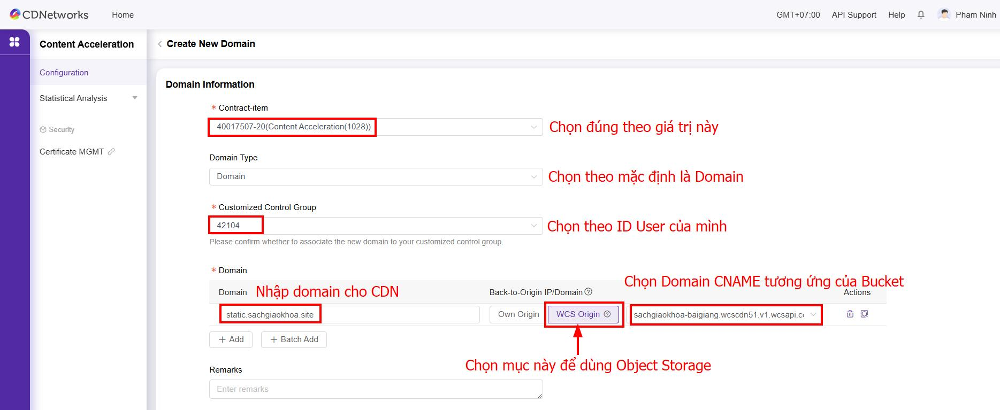

## Hướng dẫn cấu hình dịch vụ Content Acceleration (CA) với Origin Server

Tài liệu này hướng dẫn bạn cách tối ưu hóa tốc độ tải nội dung tĩnh cho website của mình bằng dịch vụ CDNetworks Content Acceleration (CA) với Origin Server

## 🎯 Mục tiêu:

Tăng tốc nội dung tĩnh của website `sachgiaokhoa.site` như HTML, CSS, JS, ảnh...

## 🔧 Cấu hình cần thiết:

| Mục                 | Giá trị                                                        |
| ------------------- | -------------------------------------------------------------- |
| **CDN Domain (CA)** | `static.sachgiaokhoa.site` _(subdomain dành cho CDN)_          |
| **Origin URL**      | `https://sachgiaokhoa.site`                                    |
| **CNAME record**    | `static.sachgiaokhoa.site` → trỏ về `CA edge hostname` của CDN |

## 📌 Cách cấu hình:

=== "Bước 1"
	
=== "Bước 2"
	
=== "Bước 3"
	
	