## 📺 Hướng dẫn cấu hình dịch vụ Low Latency Streaming (LLS) 

Tài liệu này hướng dẫn bạn cách cấu hình **dịch vụ phát trực tuyến độ trễ thấp (Low Latency Streaming)**, phù hợp với các ứng dụng livestream, truyền hình OTT, hội thảo trực tuyến, dạy học trực tiếp…

---

## 🎯 Mục tiêu:

Truyền phát video **trực tiếp** với **độ trễ cực thấp** (1~3 giây) từ máy phát lên hệ thống CDN, đảm bảo truyền tải mượt mà đến người xem cuối trên toàn cầu.

---

## 🔧 Cấu hình cần thiết:

| Mục                       | Giá trị                                                               |
| ------------------------- | --------------------------------------------------------------------- |
| **Stream Push URL**       | `rtmp://push.8sporttrutiep.info/8sportlive/01`                        |
| **Stream Pull URL (RTP)** | `https://pull.8sporttrutiep.info/8sportlive/01.sdp`                   |
| **Low Latency Protocol**  | HLS with Low-Latency Extensions (L-HLS), hoặc WebRTC nếu được hỗ trợ  |
| **Origin**                | Dịch vụ live encoder hoặc media server (OBS, XSplit, vMix, FFmpeg...) |

---

## 📌 Các bước cấu hình:

=== "**Bước 1**"  
	**Tạo thêm domain mới cho luồng RTMP Push/Pull tín hiệu**
	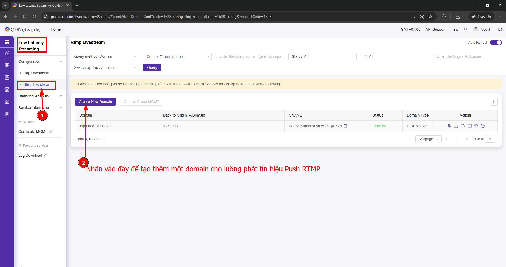
	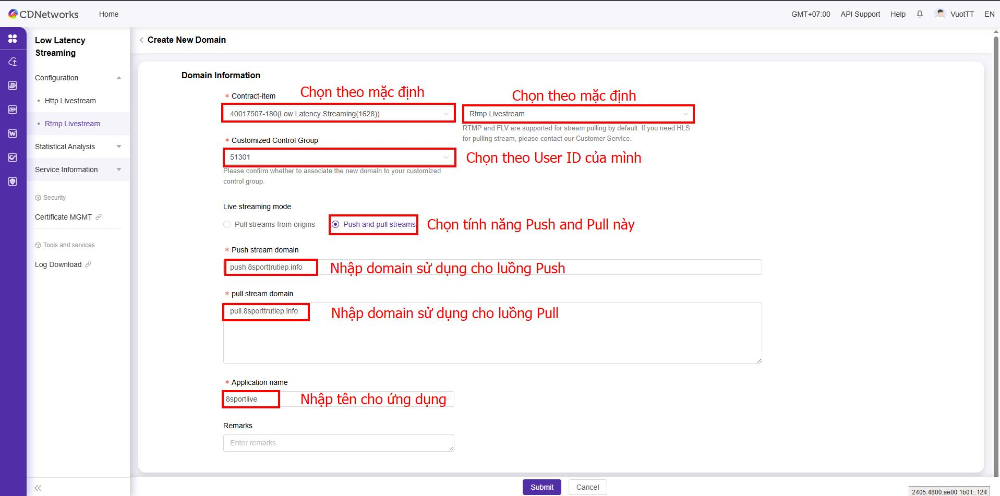
	
=== "**Bước 2**"
	**Thực hiện trỏ record DNS**
	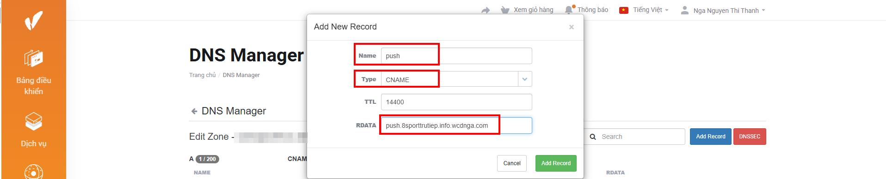
	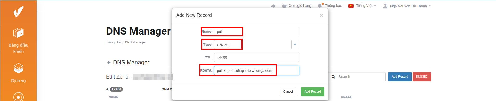
	**Kiểm tra phân giải DNS**
	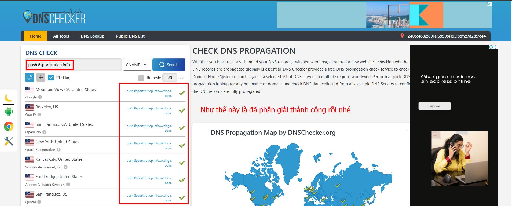
=== " **Bước 3**"
	**Cài đặt chứng chỉ SSL cho domain luồng Push và Pull**
	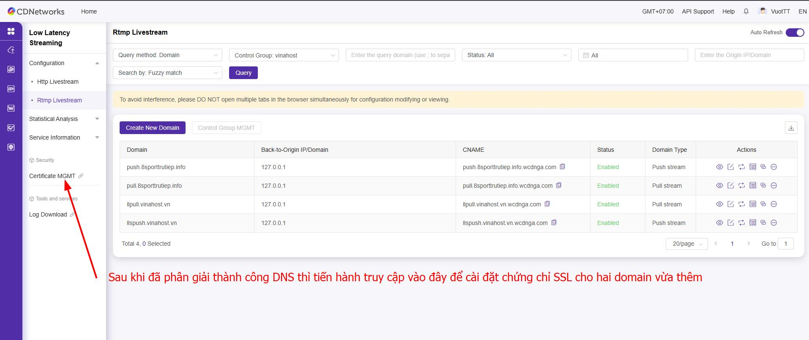
	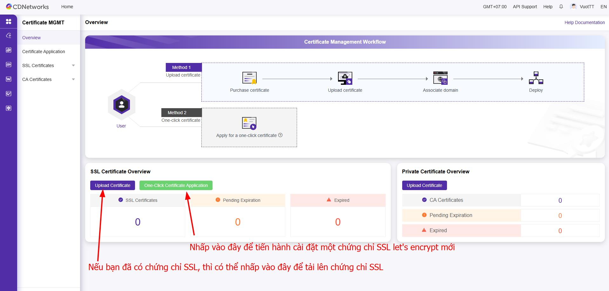
	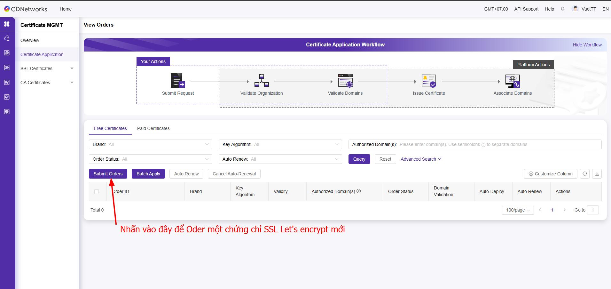
	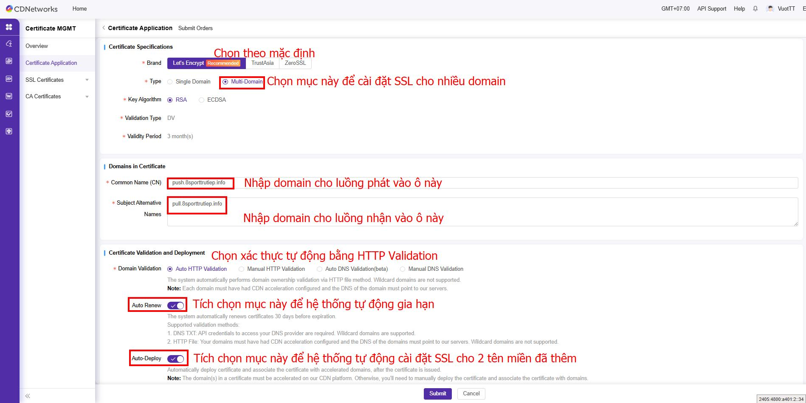
	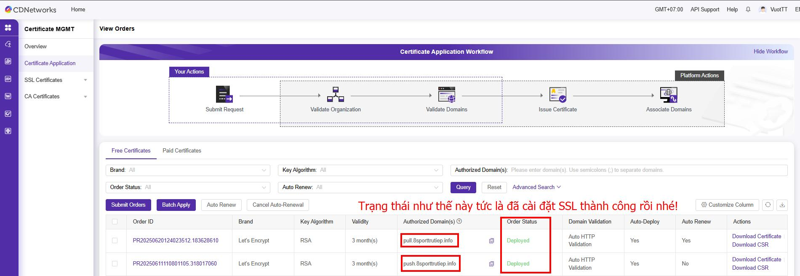
=== "**Bước 4**"
	**Lấy thông tin luồng Push và Pull**
	
	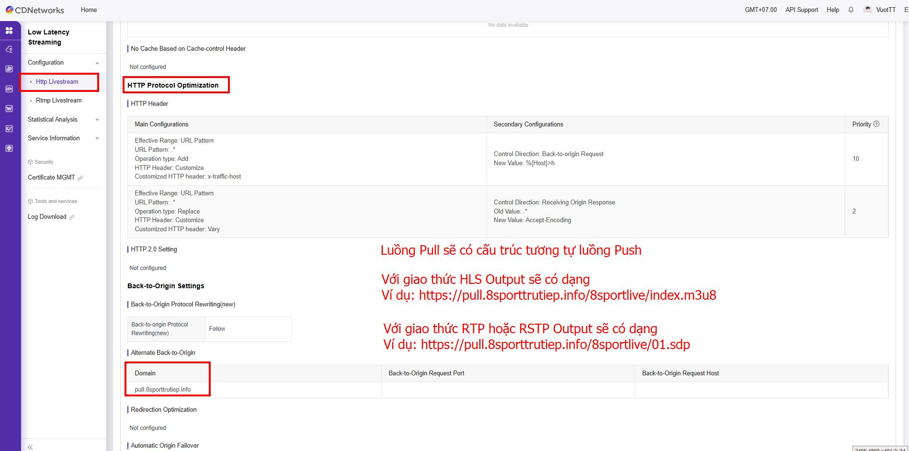
	🧪 Ví dụ thực tế:
	| Thành phần   | Giá trị                                             
	| **Push URL** | `rtmp://push.8sporttrutiep.info/8sportlive/01`
	| **Pull URL** | `https://pull.8sporttrutiep.info/8sportlive/01.sdp`
=== "**Bước 5**"
	Kiểm tra phát Streaming trên OBS và Phát thử trên trình duyệt
	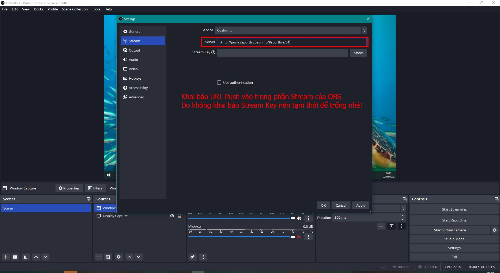
	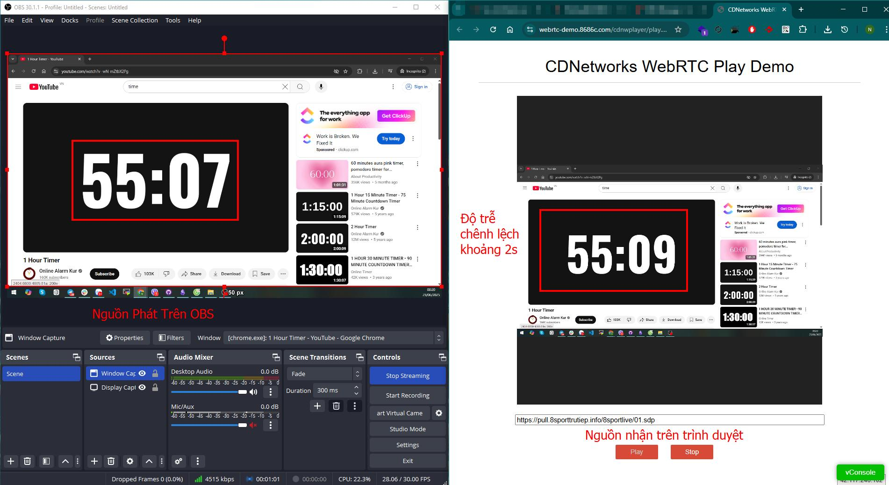

	
## Cấu hình dịch vụ Media Acceleration Live Broadcast
Tương tự như các bước cầu hình dịch vụ Low Latency Streaming ở trên
Tuy nhiên dịch vụ này chỉ hỗ trợ pull qua HTTP (HLS)
Nên luồng Push và Pull sẽ có dạng
🧪 Ví dụ thực tế:
| Thành phần   | Giá trị                                             
| **Push URL** | `rtmp://push.8sporttrutiep.info/8sportlive/01`
| **Pull URL** | `https://pull.8sporttrutiep.info/8sportlive/01/index.m3u8`