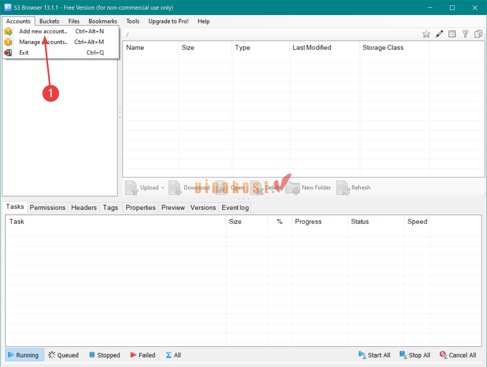
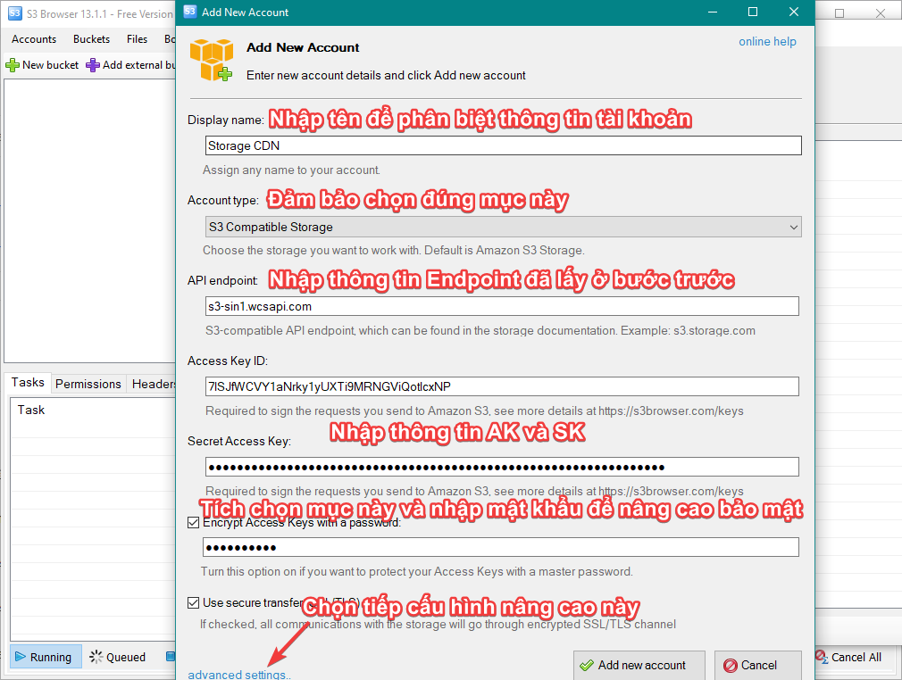
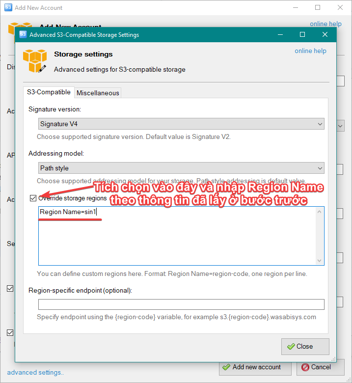
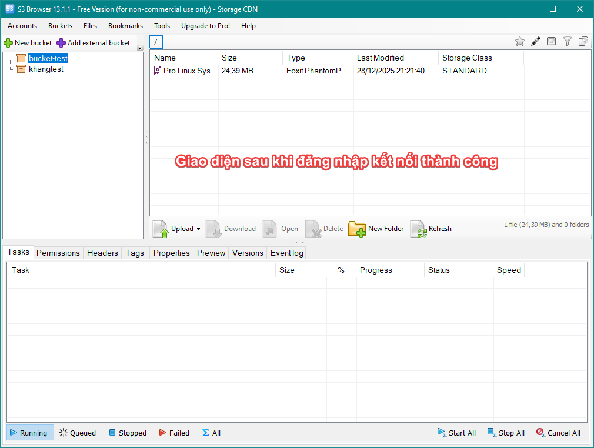
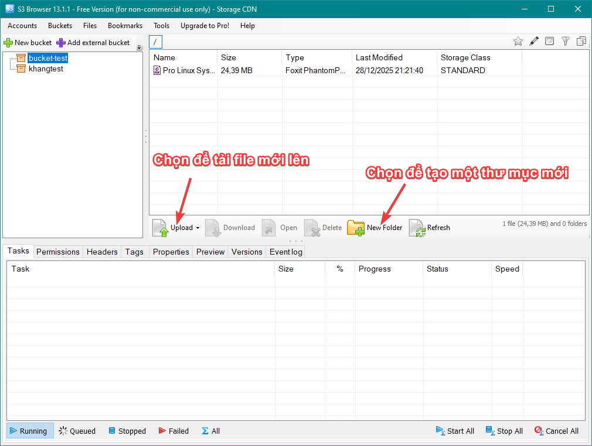
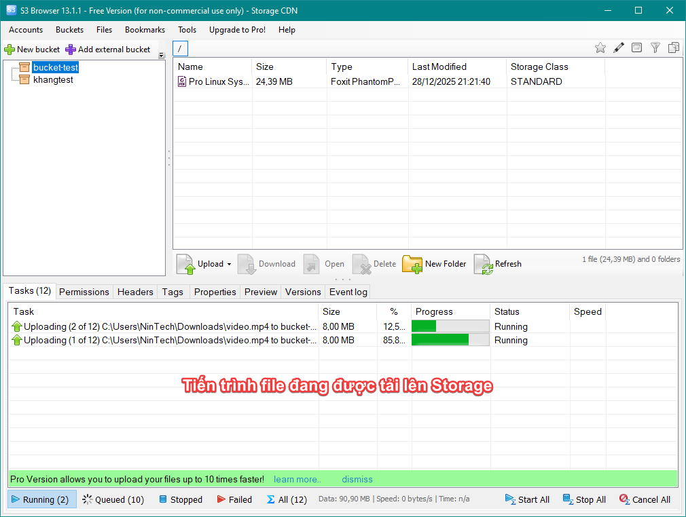
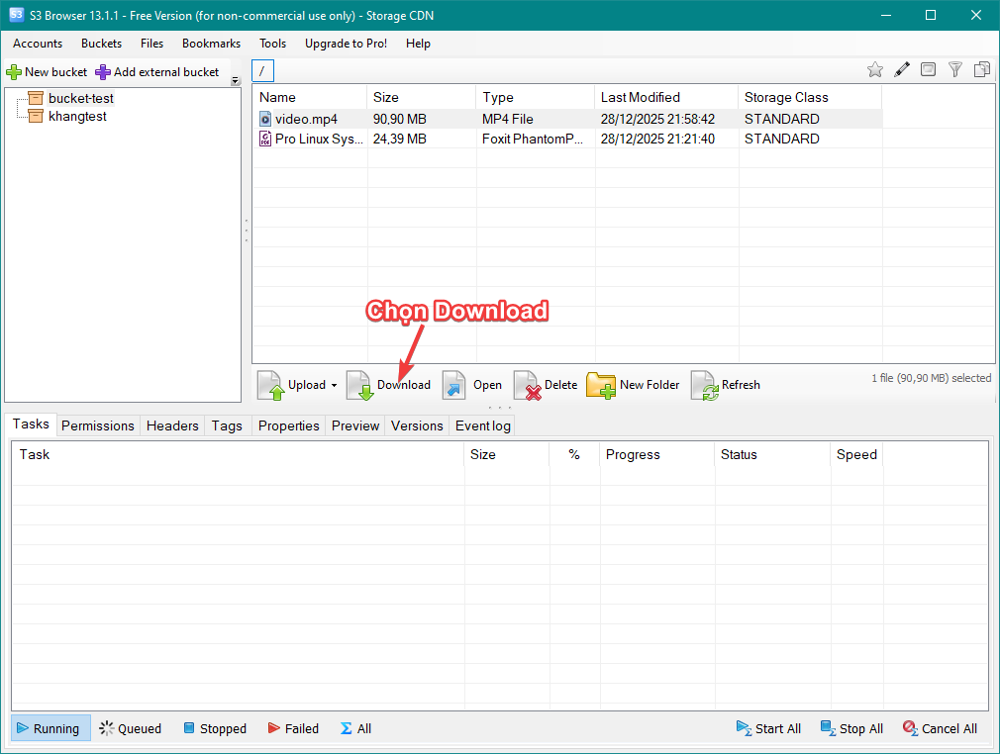
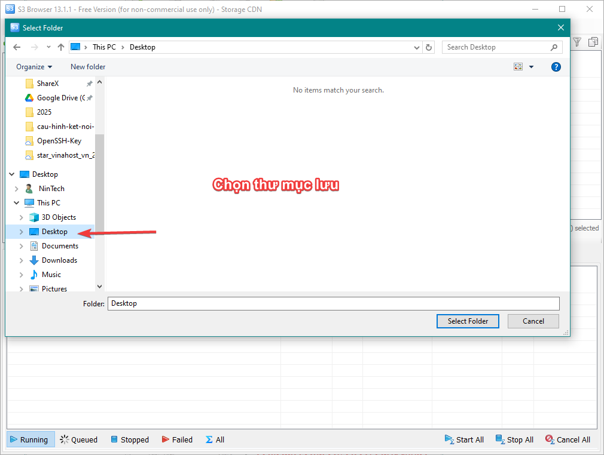
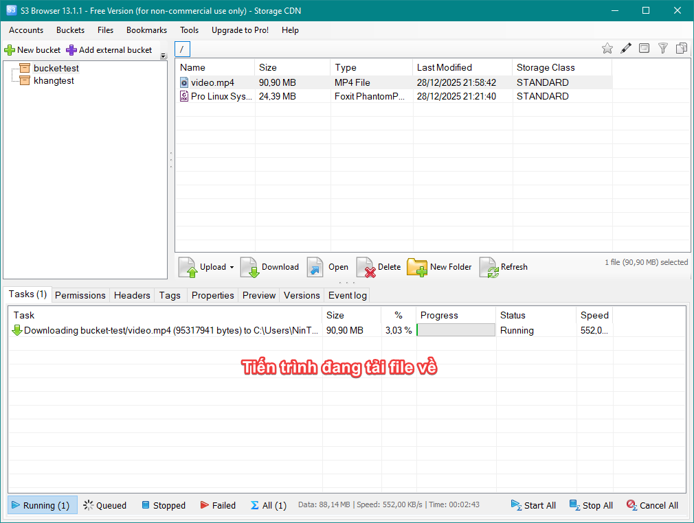
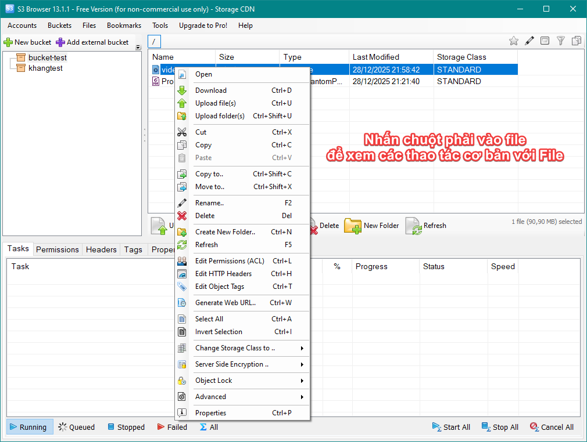

# HƯỚNG DẪN CÀI ĐẶT VÀ KẾT NỐI S3 CLIENT (S3 BROWSER) ĐẾN OBJECT STORAGE

Tài liệu này hướng dẫn bạn cách cài đặt phần mềm S3 Browser và thiết lập kết nối từ S3 client đến hệ thống Object Storage thông qua giao thức S3. Sau khi kết nối thành công, người dùng có thể quản lý dữ liệu như tải lên, tải xuống và xem các bucket/object.

---
## 1. Mục tiêu

Sau khi hoàn thành hướng dẫn, bạn có thể:
- Cài đặt thành công phần mềm S3 Browser
- Kết nối đến Object Storage bằng Access Key và Secret Key
- Truy cập và quản lý dữ liệu trên Object Storage

---
## 2. Chuẩn bị

Trước khi thực hiện, cần chuẩn bị các thông tin sau:
- Phần mềm S3 Browser (tải tại: [https://s3browser.com/download.aspx](https://s3browser.com/download.aspx))
- Thông tin kết nối Object Storage:
	- **RegionName**
    - **Endpoint** (Service URL)
    
    - **Access Key và Secret Key** (Nếu bạn chưa có thông tin này thì liên hệ lại với Hỗ trợ kỹ thuật để được cấp)

---

## 3. Các bước thực hiện

### Bước 1: Tải và cài đặt S3 Browser

1. Truy cập trang tải phần mềm: [https://s3browser.com/download.aspx](https://s3browser.com/download.aspx)
2. Chọn phiên bản phù hợp. (Khuyến nghị nên cài bản MSI Installer)
3. Tải file cài đặt về máy
4. Chạy file cài đặt và thực hiện các bước theo hướng dẫn trên màn hình
5. Hoàn tất quá trình cài đặt

---

### Bước 2: Khởi động S3 Browser

1. Mở ứng dụng S3 Browser
2. Cửa sổ quản lý tài khoản sẽ xuất hiện
3. Chọn “Add new account” để tạo kết nối mới

---

### Bước 3: Cấu hình kết nối Object Storage

Nhập các thông tin kết nối như sau:

Nhấn Close để đóng cửa sổ và nhấn Add new Account để kết nối
Nếu kết nối thành công, danh sách bucket sẽ được hiển thị
Trường hợp không kết nối được, cần kiểm tra lại Access Key, Secret Key và Endpoint URL.

---

## 4. Thao tác cơ bản

### Upload dữ liệu

1. Chọn bucket cần upload dữ liệu
2. Chọn Upload
3. Chọn file hoặc thư mục từ máy tính
4. Chờ quá trình upload hoàn tất

### Download dữ liệu

1. Chọn file hoặc thư mục cần tải
2. Chọn Download
3. Chọn thư mục lưu trữ trên máy tính

### Một số thao tác khác

---
## 5. Lưu ý

- Không chia sẻ Access Key và Secret Key cho người không có thẩm quyền
- Kiểm tra chính xác Endpoint trước khi kết nối
- Liên hệ bộ phận kỹ thuật nếu gặp lỗi trong quá trình sử dụng