# Hướng dẫn cấu hình dịch vụ Object Storage

### 🎯 Mục tiêu:
Lưu và phân phối file tĩnh như: ảnh, video bài giảng, PDF, MP3...
### 🔧 Cấu hình cần thiết:

| Mục                 | Giá trị                                               |
| ------------------- | ----------------------------------------------------- |
| **Bucket name**     | `sachgiaokhoa-baigiang` _(hoặc tuỳ chọn)_             |
| **CDN Domain (OS)** | `media.sachgiaokhoa.site`                             |
| **CNAME record**    | `media.sachgiaokhoa.site` → trỏ về CDN URL của bucket |

# Cấu hình  
=== "**Bước 1**"  
	**Tạo Bucket trong Object Storage**  
	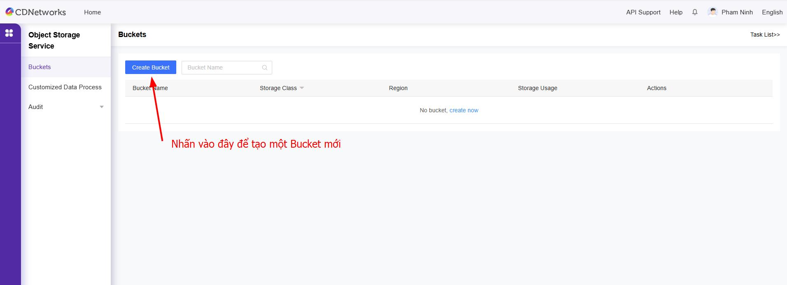
	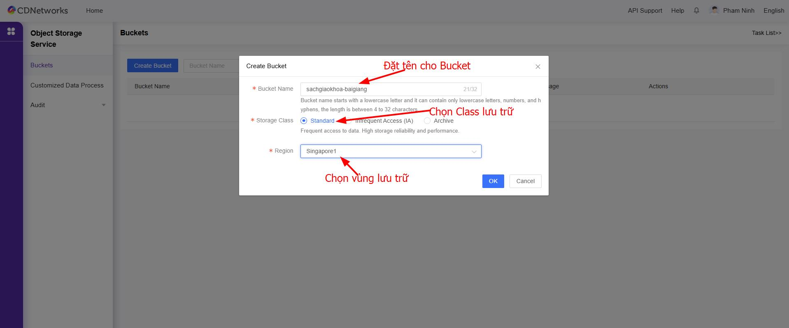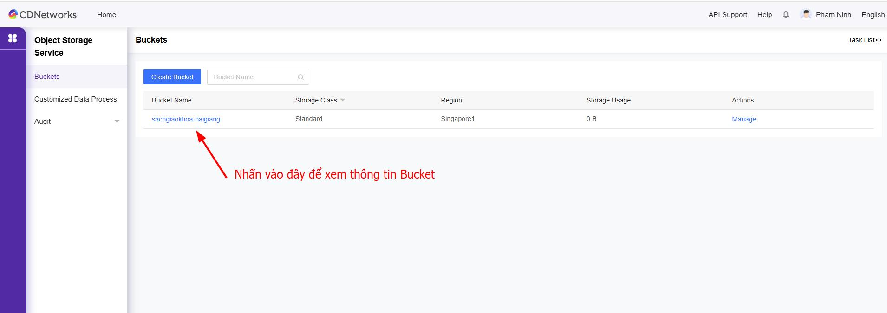
	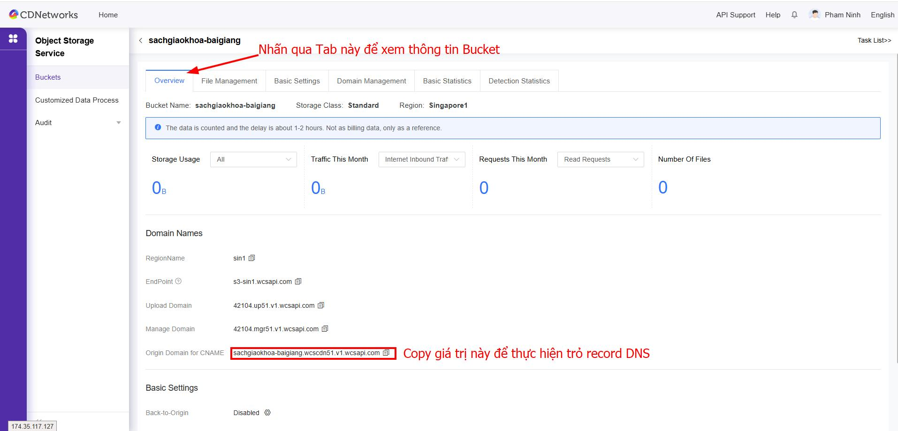
=== "**Bước 2**"  
	**Tạo thư mục và tải video lên Bucket**  
	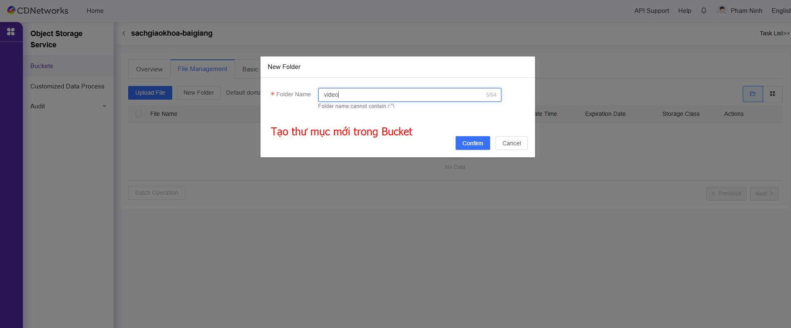
	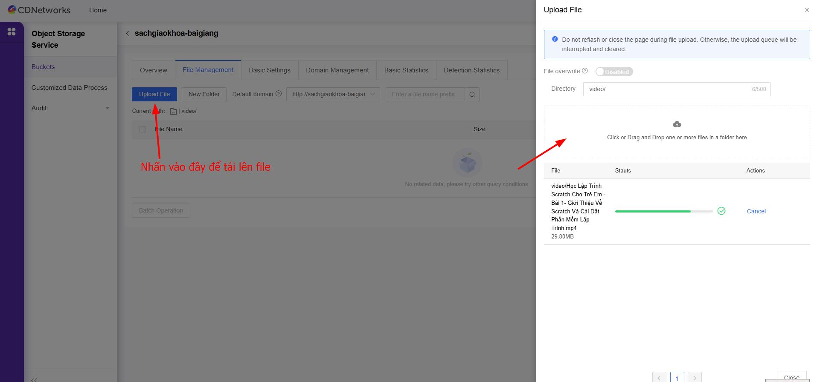
	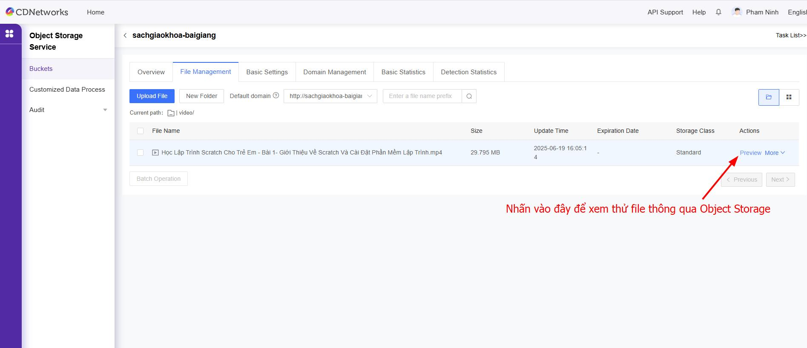
	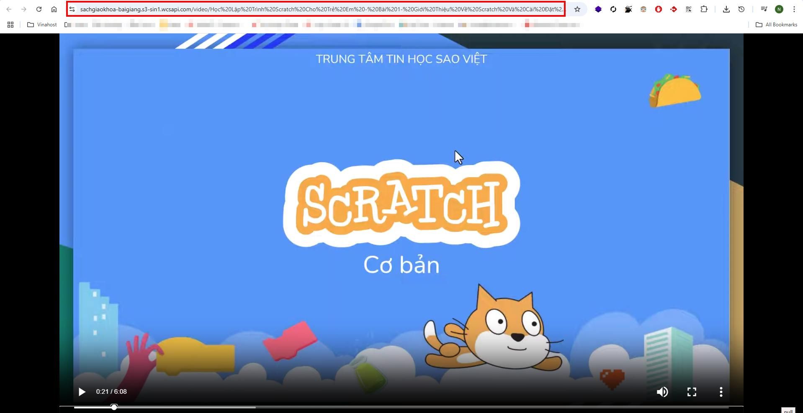
=== "**Bước 3 (Tuỳ chọn thêm)**"  
	**Tạo tên miền tuỳ chỉnh cho Bucket**  
	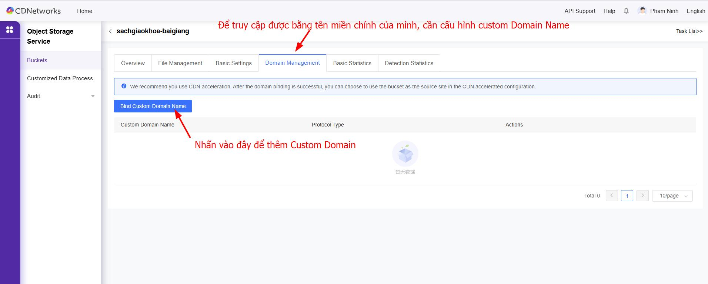
	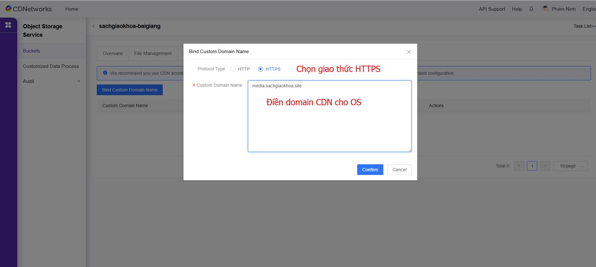
	**Trỏ record DNS**  
	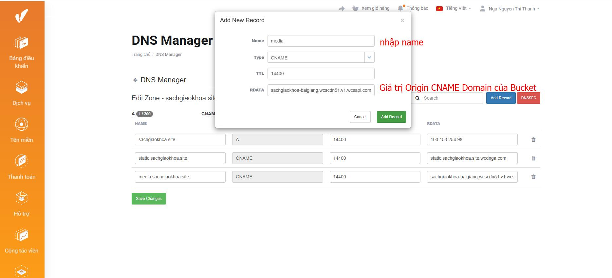
	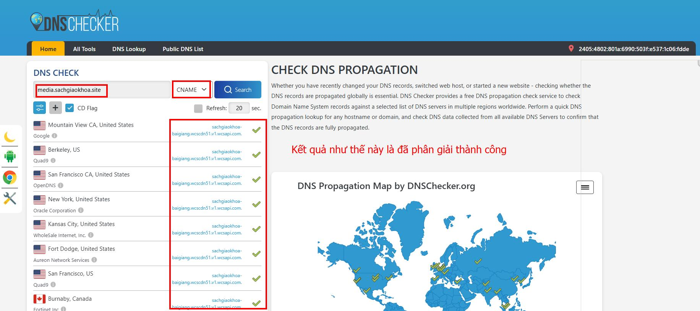
	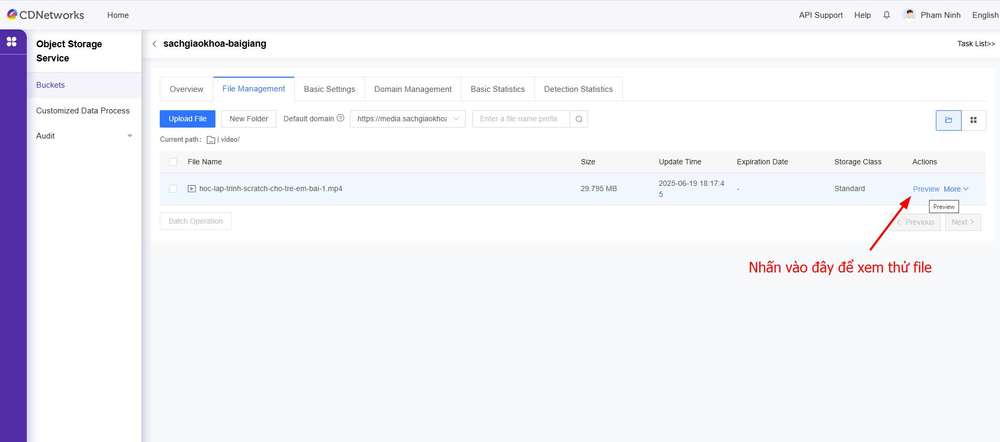
	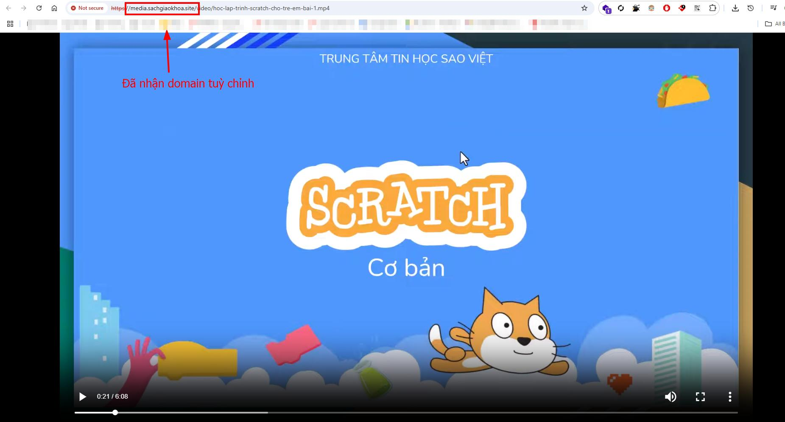
=== "**Bước 4 (Tuỳ chọn thêm)**"  
	📦 Chính sách giá Object Storage CDNetworks  
	  - **Tính 2 loại phí**:  
	    - **Phí lưu trữ**: Tính theo tổng dung lượng dữ liệu được lưu trữ cao nhất trong tháng.  
	    - **Phí truyền tải (Traffic Usage)**: Tính theo lượng dữ liệu **truy xuất ra ngoài**.  
	 - **Phí Traffic Usage phụ thuộc cách truy cập**:  
	    - ✅ **Truy cập qua CDN của CDNetworks** → **giá rẻ**  
	    - ❌ **Truy cập trực tiếp vào Storage** → **giá cao**  
	    - ❌ **CDN khác (ví dụ Cloudflare) truy cập Storage CDNW** → **vẫn tính giá cao**  
	 - **Khuyến nghị**:  
	    - **Luôn dùng CDN nội bộ của CDNetworks** để truy cập file lưu trong **Object Storage** nhằm tối ưu chi phí.  
	**Các bước cấu hình**  
	**Bước 1: Thêm domain mới trong dịch vụ Content Acceleration**  
	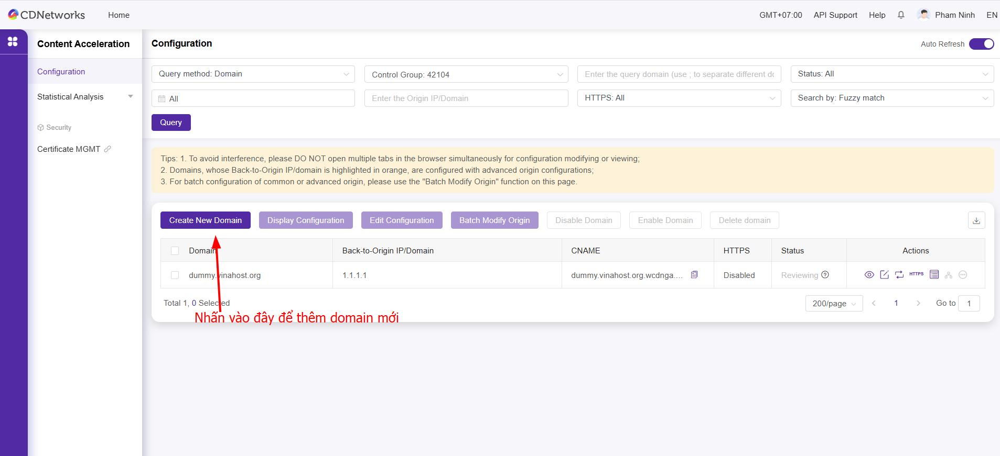
	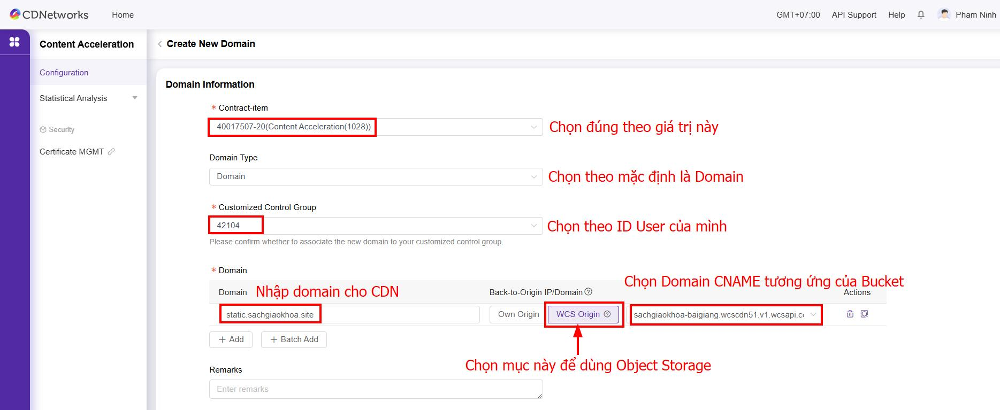
	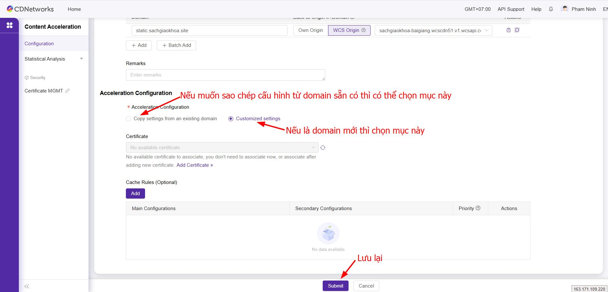
	**Bước 2: Trỏ record DNS**
	Copy giá trị CNAME
	
	Thêm record trong trang quản trị DNS Manager
	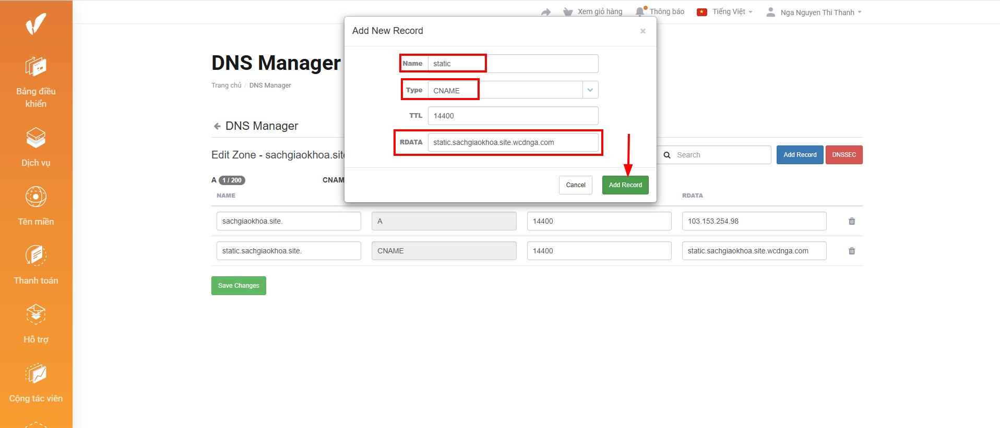
	Kiểm tra phân giải DNS
	
	**Bước 3: Cài đặt chứng chỉ SSL**
	
	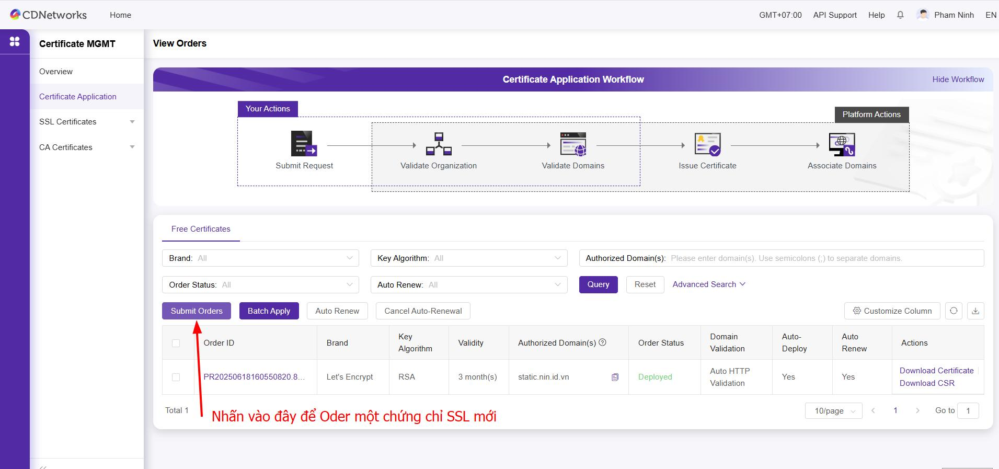
	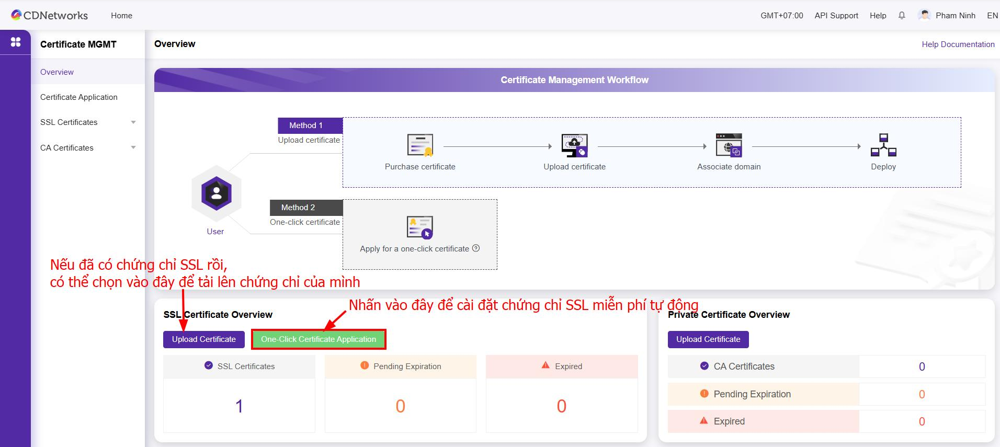
	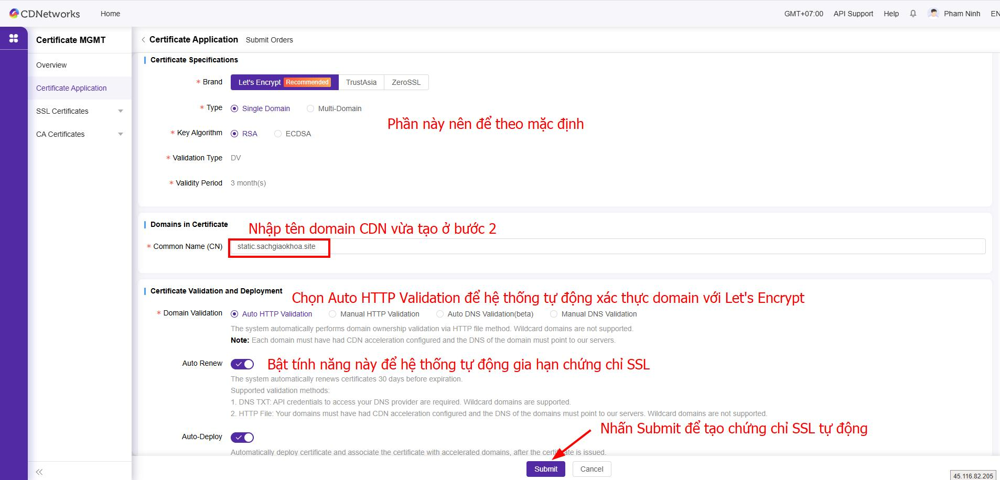
	
	
	**Bước 4: Kiểm tra thử truy cập file thông qua Content Acceleration**
	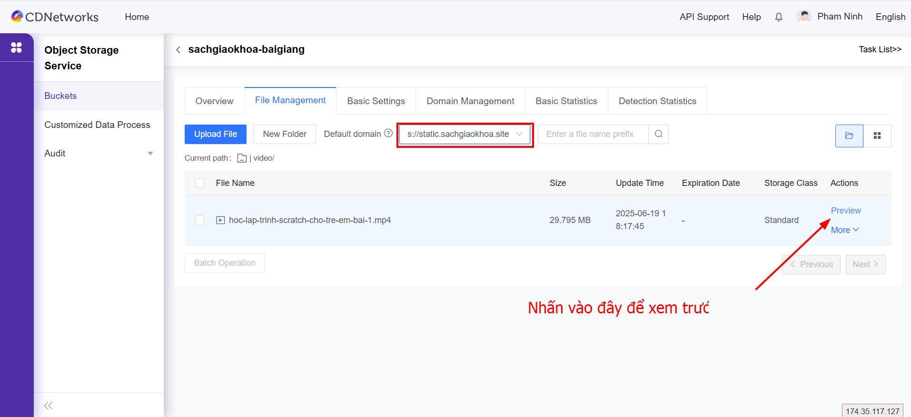
	