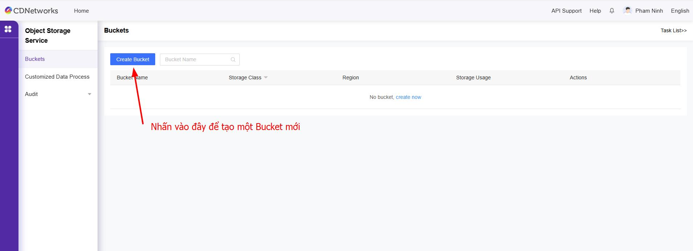
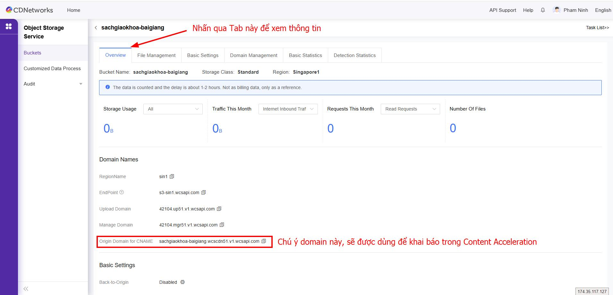
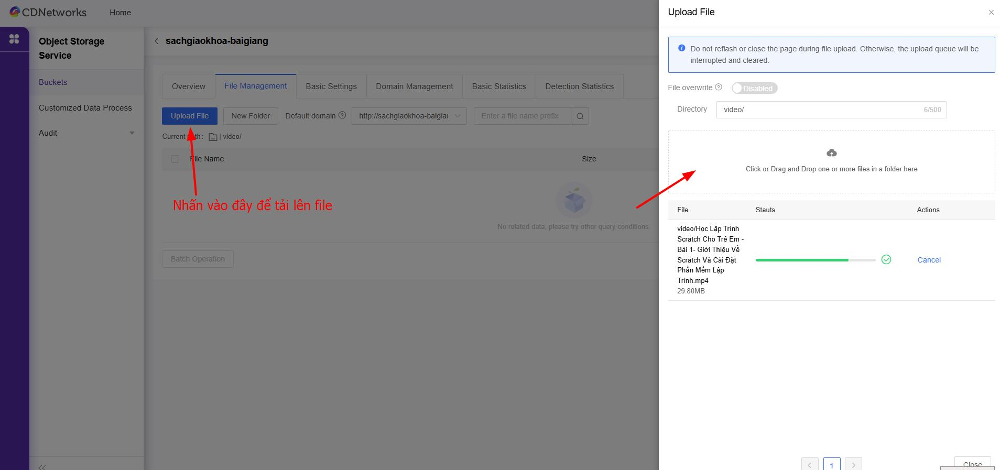
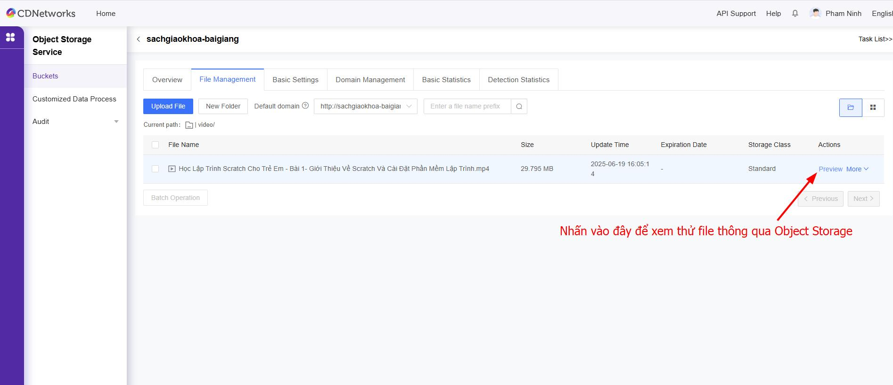
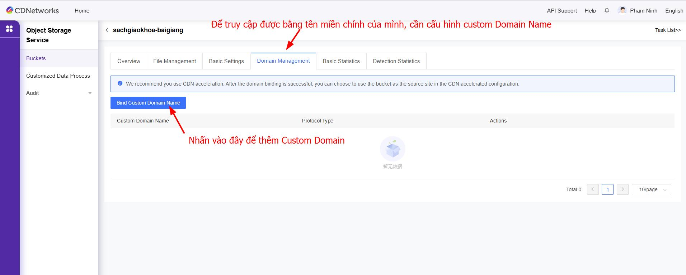

# Hướng dẫn cấu hình dịch vụ Object Storage

# Chuẩn bị  

- Domain chính: ví dụ `sachgiaokhoa.site`  
- Domain CDN: ví dụ `media.sachgiaokhoa.site`  

# Cấu hình  
== "Bước 1"  
	**Tạo Bucket trong Object Storage**  
		
		
		
		
		
		
		
		
		
		
