# Hướng dẫn cấu hình dịch vụ Dynamic Web Acceleration (DWA) với Origin Server

Tài liệu này hướng dẫn bạn cách tăng tốc tải nội dung động cho website của mình bằng dịch vụ **CDNetworks Dynamic Web Acceleration (DWA)**

---

## 🎯 Mục tiêu:

Tăng tốc toàn diện nội dung tĩnh và động cho website `sachgiaokhoa.site` bằng cách:
- Tối ưu kết nối TCP và sử dụng connection pooling để giảm độ trễ.
- Caching thông minh và nén nội dung tĩnh.
- Phân tách nội dung động – tĩnh để tăng hiệu suất.
- Hỗ trợ giao thức hiện đại như HTTP/2, QUIC, TLS 1.3.

---

## 🔧 Cấu hình cần thiết:

| Mục                  | Giá trị                                                  |
| -------------------- | -------------------------------------------------------- |
| **CDN Domain (DWA)** | `sachgiaokhoa.site` _(sử dụng root domain)_              |
| **Origin IP**        | Địa chỉ IP Server                                        |
| **CNAME record**     | `sachgiaokhoa.site` → trỏ về `DWA edge hostname` của CDN |

---

## 📌 Cách cấu hình:

=== "**Bước 1**"  
	**Tạo Domain mới trong Dynamic Web Acceleration (DWA)**
	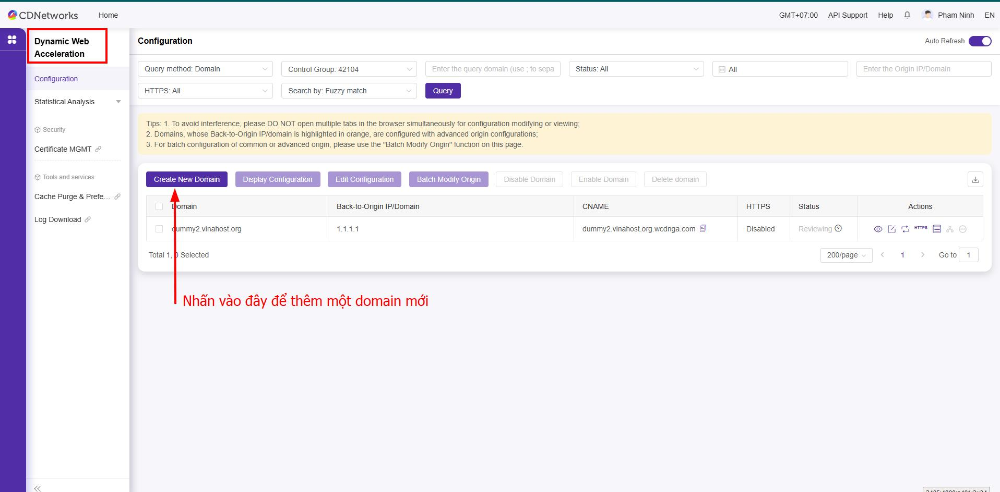
	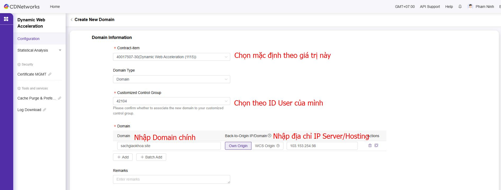
	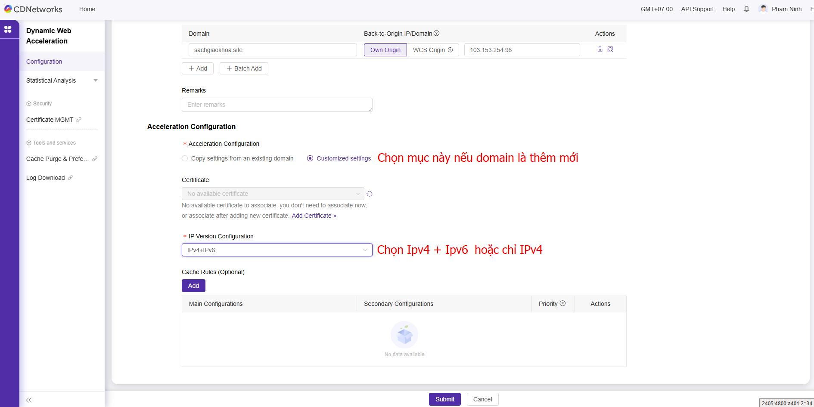
=== "**Bước 2**"
	**Trỏ record DNS**
	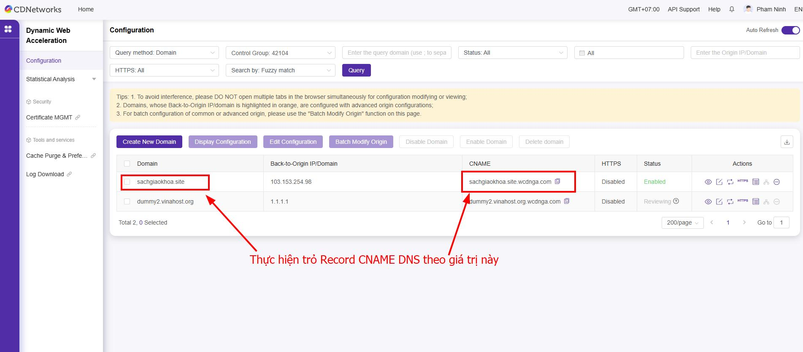
	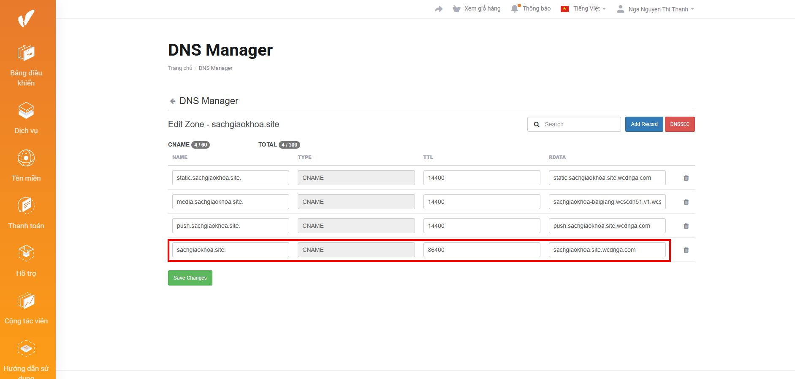
	**Kiểm tra phân giải DNS**
	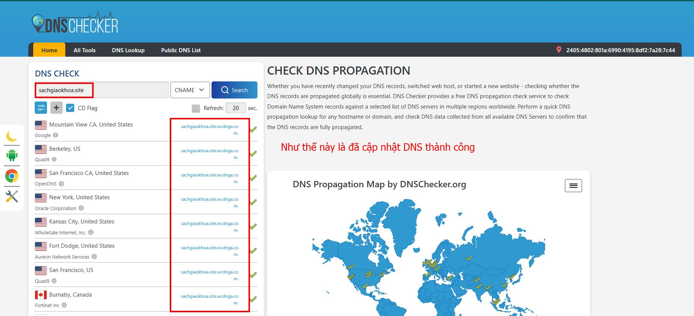
=== "**Bước 3**"
	**Cài đặt chứng chỉ SSL**
	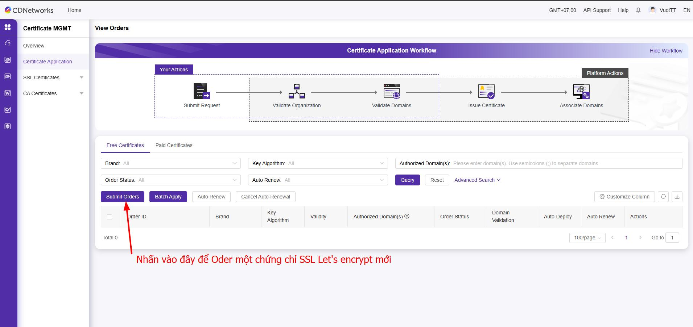
	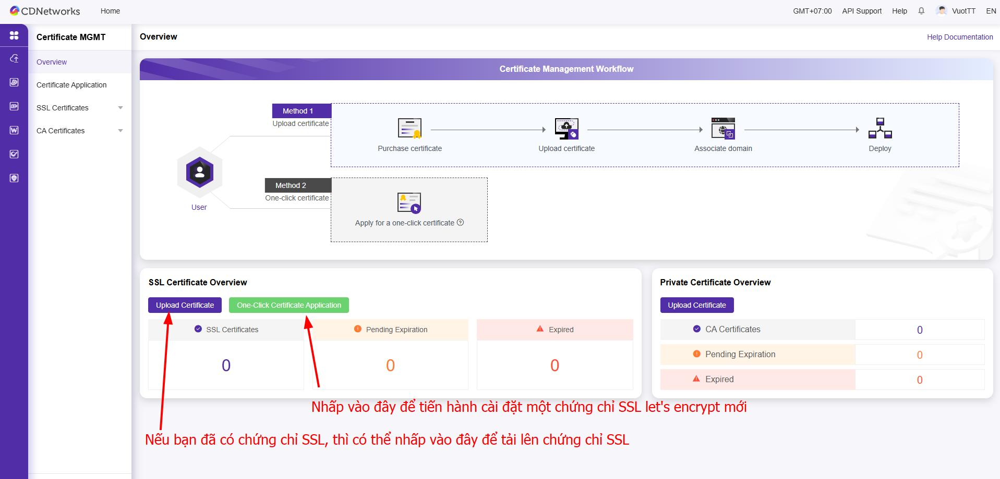
	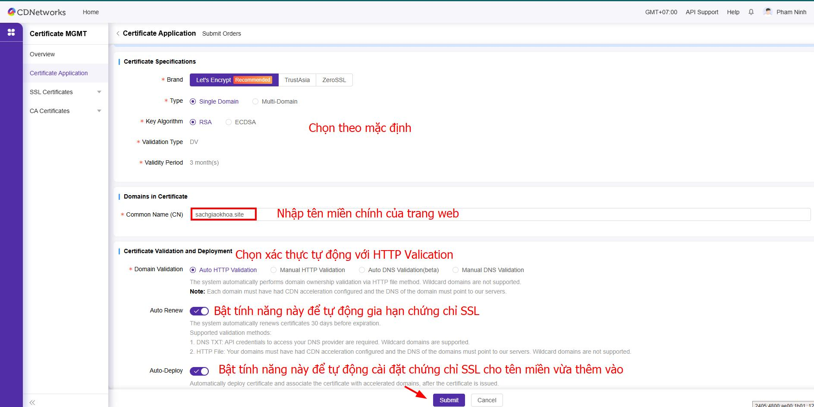
	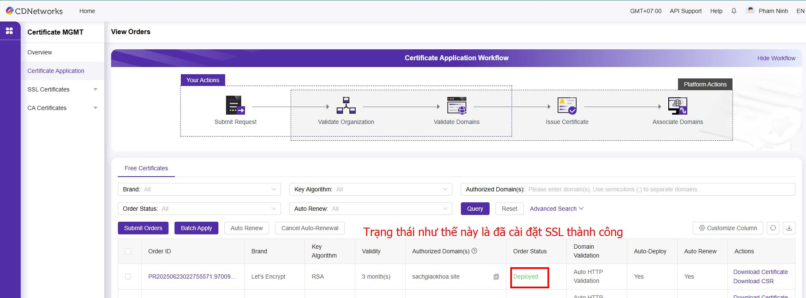
=== "**Bước 4**"
	**Truy cập và kiểm tra lại trang web đã cache qua CDN hay chưa**
	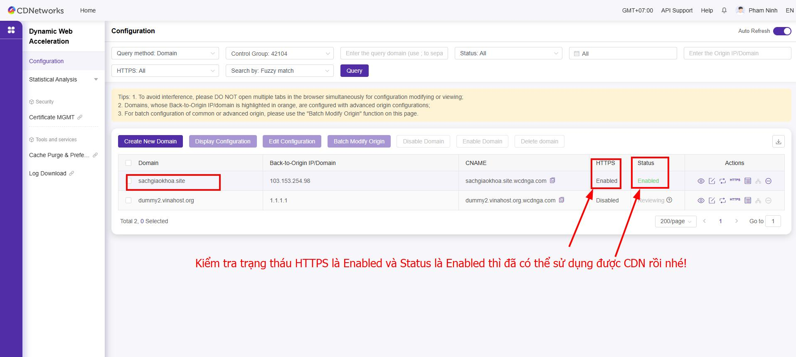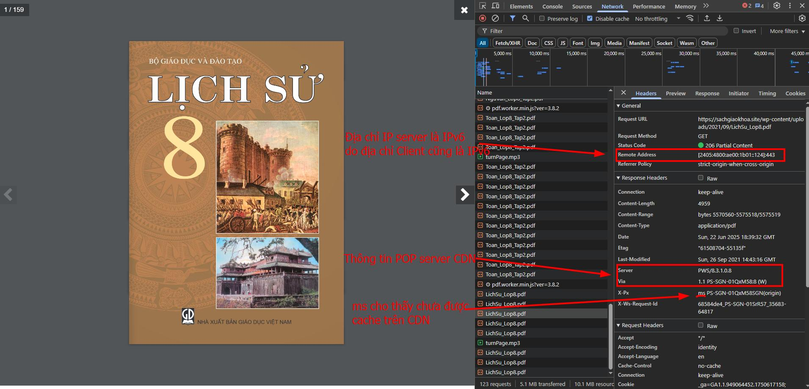
	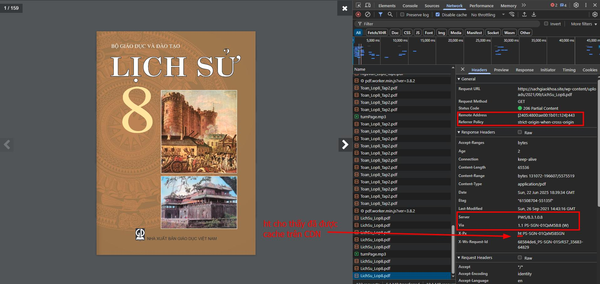
	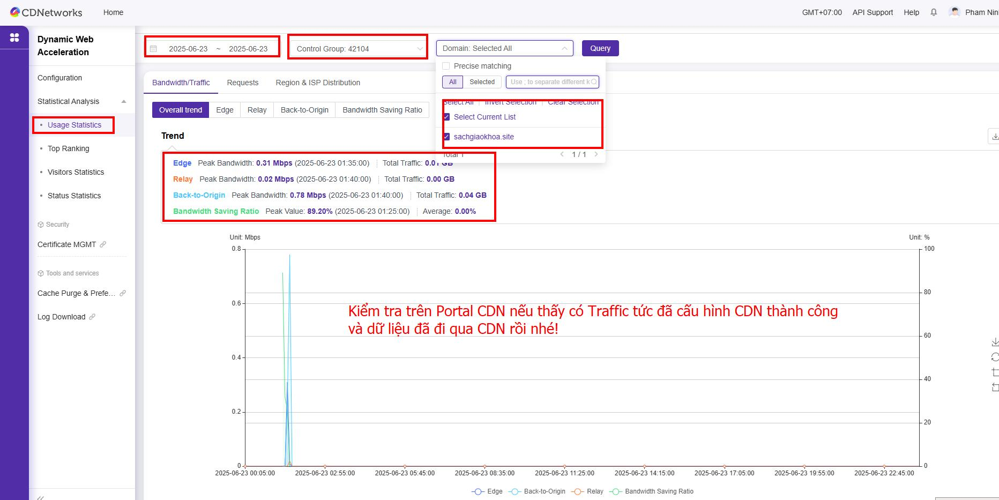