# Hướng dẫn cấu hình dịch vụ Media Acceleration với Object Storage

Tài liệu này hướng dẫn bạn cách tăng tốc phân phối video theo yêu cầu (VoD) trên website **`sachgiaokhoa.site`** thông qua dịch vụ **Media Acceleration****, sử dụng nguồn video từ **Object Storage**.

---
## 🎯 Mục tiêu:

Tối ưu việc truyền tải nội dung media (video) từ Object Storage tới người dùng cuối bằng cách:
- Phân phối nội dung qua các edge PoPs toàn cầu của CDNetworks.
- Tăng tốc phát video với cơ chế cache và định tuyến thông minh.
- Hỗ trợ các định dạng phát video phổ biến như HLS, MP4 Progressive, MPEG-DASH.
- Tương thích tốt với mọi thiết bị và hệ điều hành.
---

## 🔧 Cấu hình cần thiết:

| Mục                    | Giá trị                                                         |
| ---------------------- | --------------------------------------------------------------- |
| **CDN Domain (Media)** | `media.sachgiaokhoa.site` _(subdomain riêng cho media)_         |
| **Origin Type**        | Object Storage                                                  |
| **CNAME record**       | `media.sachgiaokhoa.site` → trỏ về `media-acceleration.cdn.net` |

---

## 📌 Cách cấu hình:

=== "**Bước 1**"  
	**Tạo Bucket mới**
	
	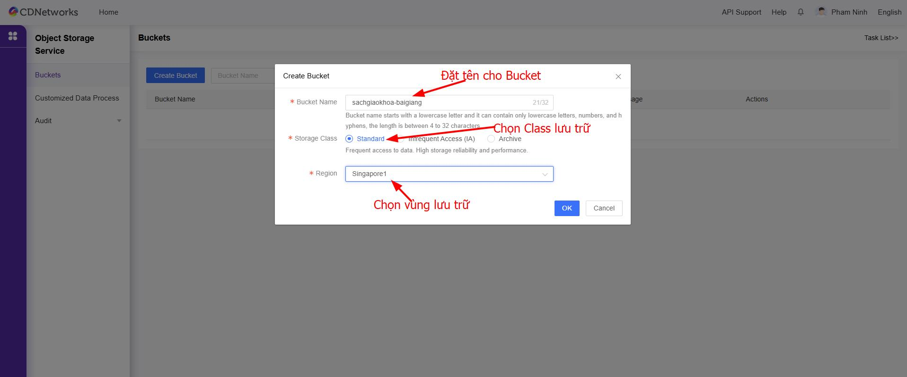
	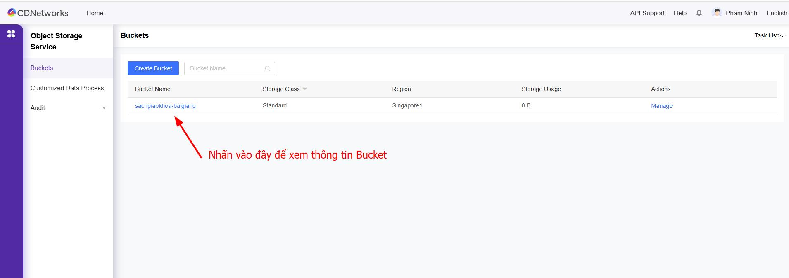
	**Tạo Folder trong Bucket**
	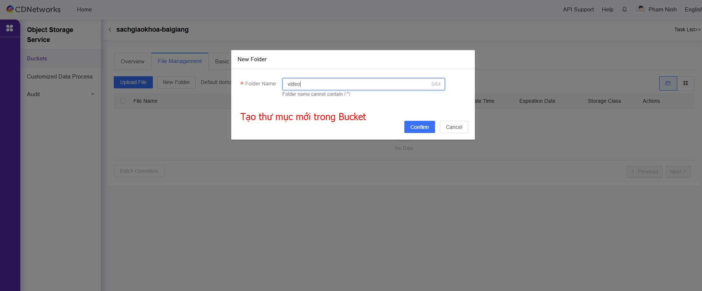
	**Upload File lên Bucket**
	
	**Kiểm tra xem trước File**
	
	
	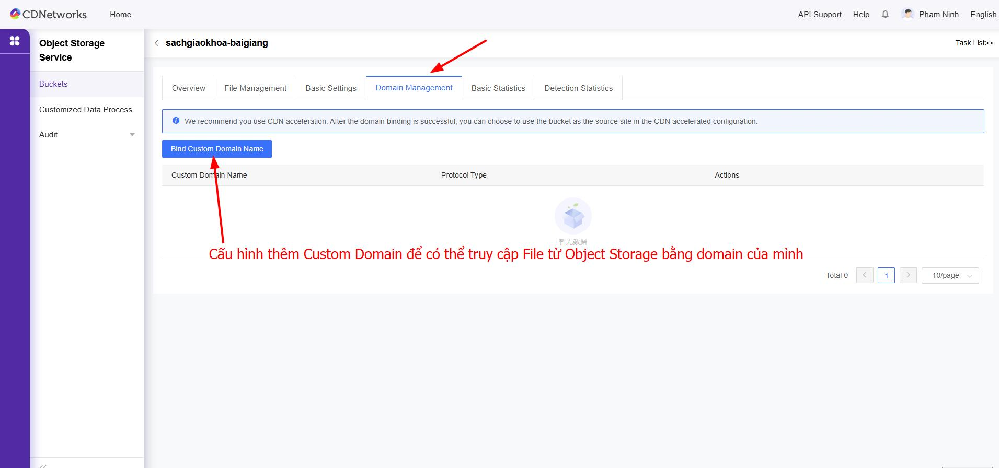
	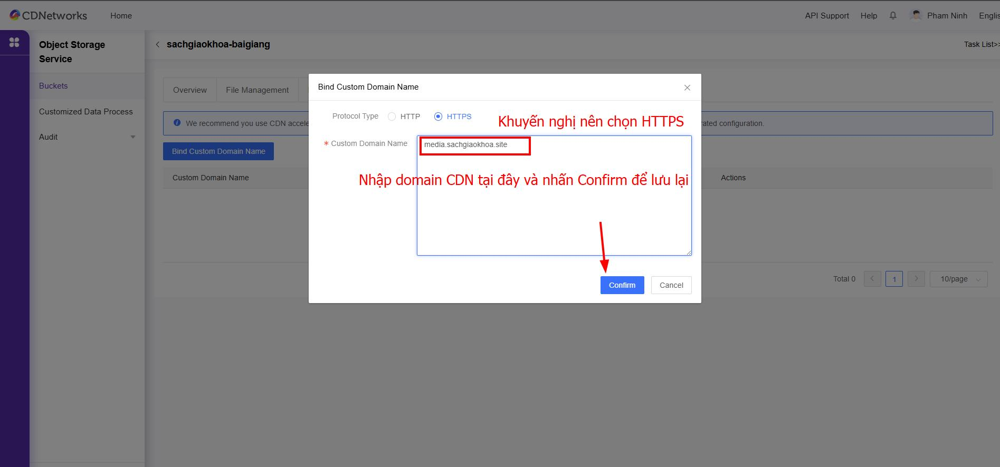
=== "**Bước 2**"  
	**Thêm domain trong dịch vụ Media Acceleration**  
	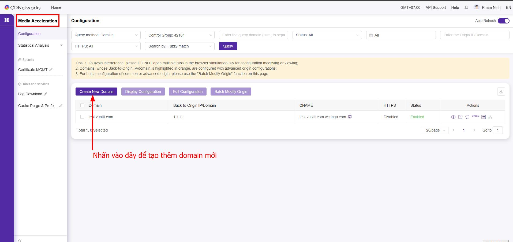
	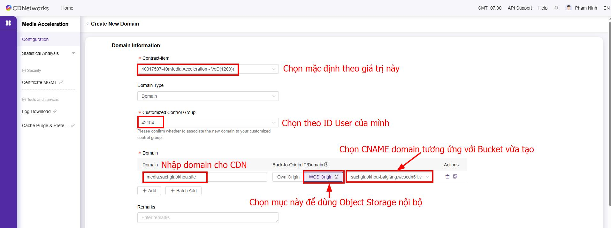
	
	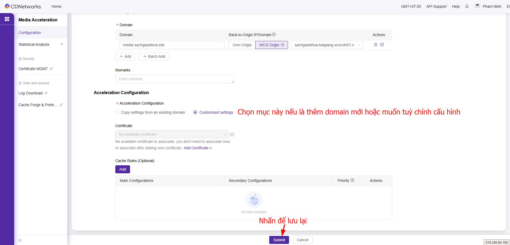
=== "**Bước 3**"  
	**Trỏ record DNS**
	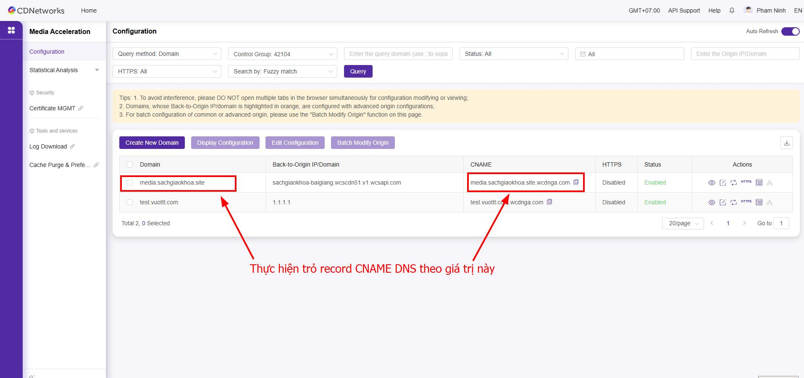
	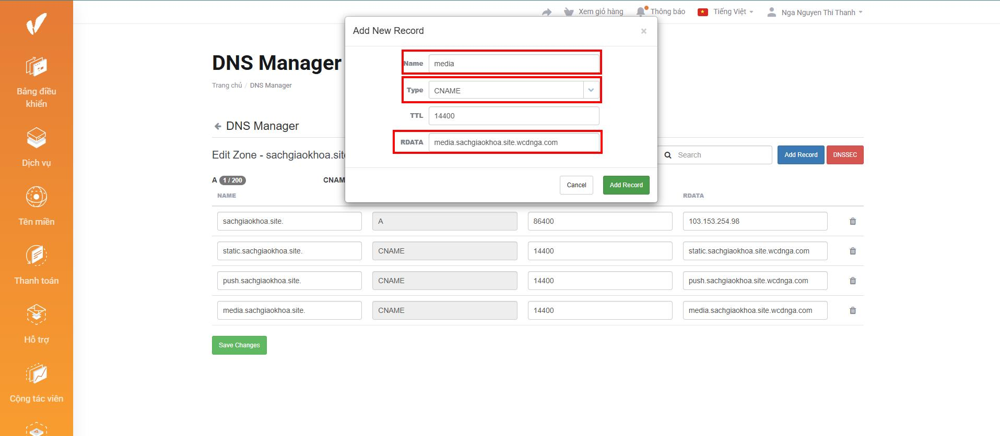
	**Kiểm tra phân giải DNS**
	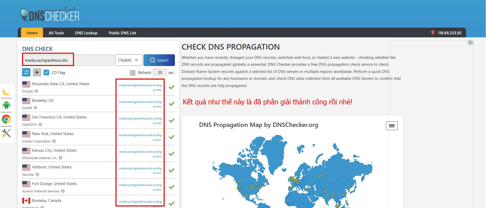
=== "**Bước 4**"  
	**Cài đặt chứng chỉ SSL**
	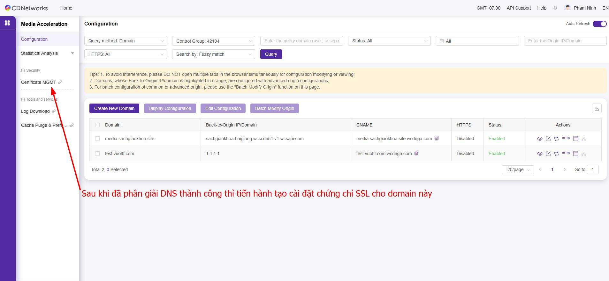
	
	
	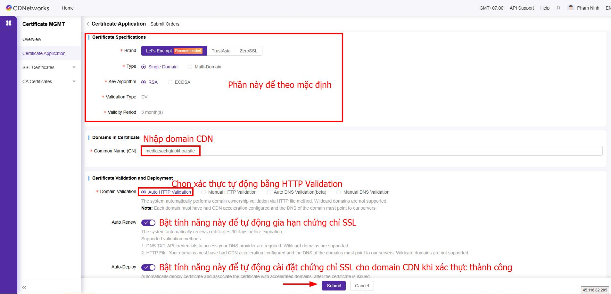
	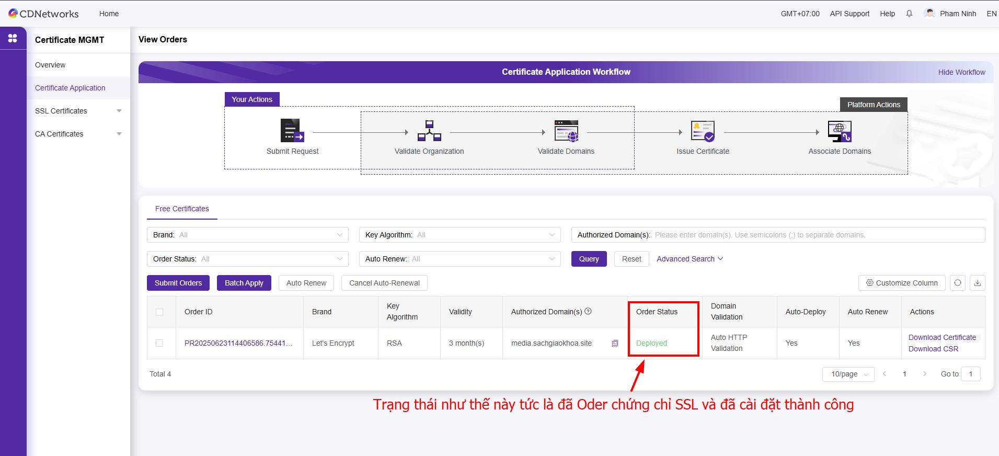
	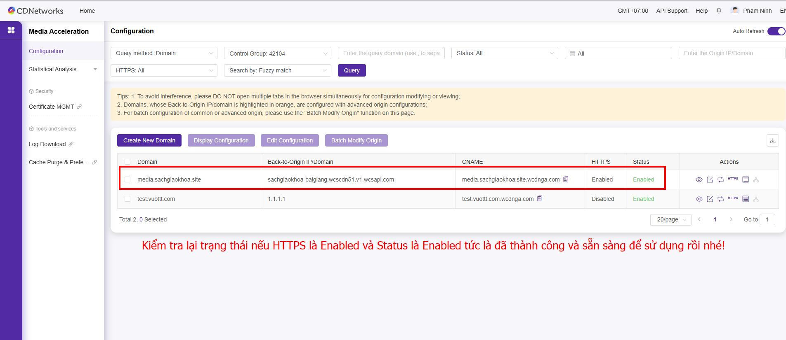
=== "**Bước 5**"  
	
	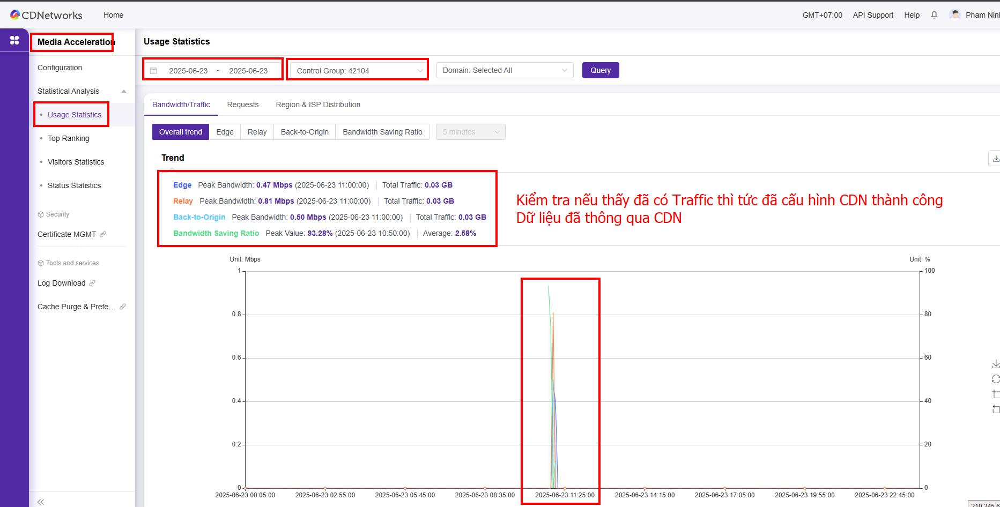
