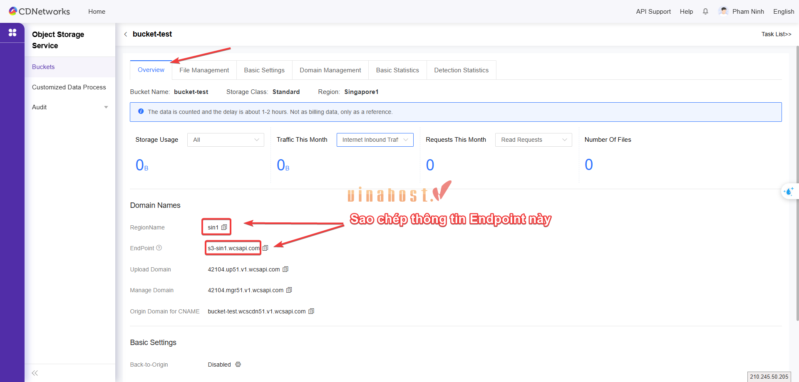

# HƯỚNG DẪN KẾT NỐI OBJECT STORAGE BẰNG PYTHON 

Tài liệu này hướng dẫn cách sử dụng Python và thư viện boto3 để kết nối và thao tác với Object Storage thông qua giao thức S3. Phù hợp cho các ứng dụng, script tự động và dịch vụ backend.

---

## 1. Mục tiêu

Sau khi hoàn thành hướng dẫn, khách hàng có thể:

- Cài đặt môi trường Python và thư viện boto3
- Kết nối đến Object Storage
- Thực hiện các thao tác cơ bản với bucket và object

---

## 2. Chuẩn bị

- Python phiên bản 3.7 trở lên
- Thông tin Object Storage:
    - **Endpoint**
    - **RegionName**
    
    - **Access Key và Secret Key** (Nếu bạn chưa có thông tin này thì liên hệ lại với Hỗ trợ kỹ thuật để được cấp)
    - **Tên bucket**

---

## 3. Cài đặt boto3

Cài đặt boto3 bằng pip:

pip install boto3`

Kiểm tra cài đặt:

`python -c "import boto3; print(boto3.__version__)"`

---
## 4. Sử dụng biến môi trường (khuyến nghị)

**Không hard-code Access Key và Secret Key trong source code.**

**Linux / macOS**:

`export ACCESS_KEY=your_access_key`
`export SECRET_KEY=your_secret_key`

**Windows PowerShell**:

`setx ACCESS_KEY your_access_key`
`setx SECRET_KEY your_secret_key`

---

## 5. Kết nối đến Object Storage

Ví dụ kết nối bằng boto3 client:

```
import os
import boto3

access_key = os.getenv("ACCESS_KEY")
secret_key = os.getenv("SECRET_KEY")

s3_client = boto3.client(
    "s3",
    endpoint_url="https://s3-sin1.wcsapi.com",
    aws_access_key_id=access_key,
    aws_secret_access_key=secret_key,
    region_name="sin1"
)
```

Lưu ý:

- `endpoint_url` là endpoint của Object Storage, nhập theo thông tin đã lấy ở bước trước
- `region_name` nhập theo thông tin đã lấy ở bước trước
---
## 6. Các thao tác cơ bản

### 6.1. Liệt kê danh sách bucket

```
response = s3_client.list_buckets()
for bucket in response["Buckets"]:
    print(bucket["Name"])
```

---

### 6.2. Upload file lên bucket

```
s3_client.upload_file(
    "file.txt",  # Tên (hoặc đường dẫn) của tệp trên máy cục bộ của bạn
    "ten-bucket",      # Tên của Bucket mà bạn muốn tải lên
    "file.txt"   # Tên của tệp khi được lưu trữ trên
)
```
---

### 6.3. Download file từ bucket

```
s3_client.download_file(
    "ten-bucket",     # 1. Tên của Bucket
    "file.txt",       # 2. Key (đường dẫn/tên tệp) hiện tại đang nằm trên Storage
    "file.txt"        # 3. Tên tệp bạn muốn lưu xuống máy tính cục bộ
)
```


---

### 6.4. Upload file bằng put_object

```
# Mở tệp ở chế độ "rb" (read binary - đọc hệ nhị phân)
with open("local-file.txt", "rb") as f:
    s3_client.put_object(
        Bucket="ten-bucket",  # Tên của Bucket trên Storage
        Key="local-file.txt", # Tên tệp (hoặc đường dẫn) sẽ lưu trên Storage
        Body=f                # Nội dung dữ liệu (đối tượng file vừa mở)
    )

```
---

### 6.5. Liệt kê object trong bucket

```
# Gọi API list_objects_v2 để lấy danh sách đối tượng trong bucket "ten-bucket"
response = s3_client.list_objects_v2(Bucket="ten-bucket")

# Kiểm tra xem trong bucket có chứa dữ liệu hay không (tránh lỗi nếu bucket trống)
if "Contents" in response:
    # Lặp qua từng đối tượng (tệp tin/thư mục) trong danh sách trả về
    for obj in response["Contents"]:
        # In ra "Key" (đường dẫn/tên tệp) của đối tượng đó
        print(obj["Key"])
```

---

### 6.6. Xóa object

```
s3_client.delete_object(
    Bucket="ten-bucket",  # Tên của Bucket chứa tệp cần xóa
    Key="local-file.txt"  # Tên chính xác (Key) của tệp bạn muốn xóa
)
```

---

## 7. Lưu ý

- Object Storage sử dụng giao thức S3
- Luôn bảo mật Access Key và Secret Key
- Kiểm tra chính xác endpoint trước khi kết nối
- Với file lớn, nên sử dụng `upload_file` để hỗ trợ multipart upload