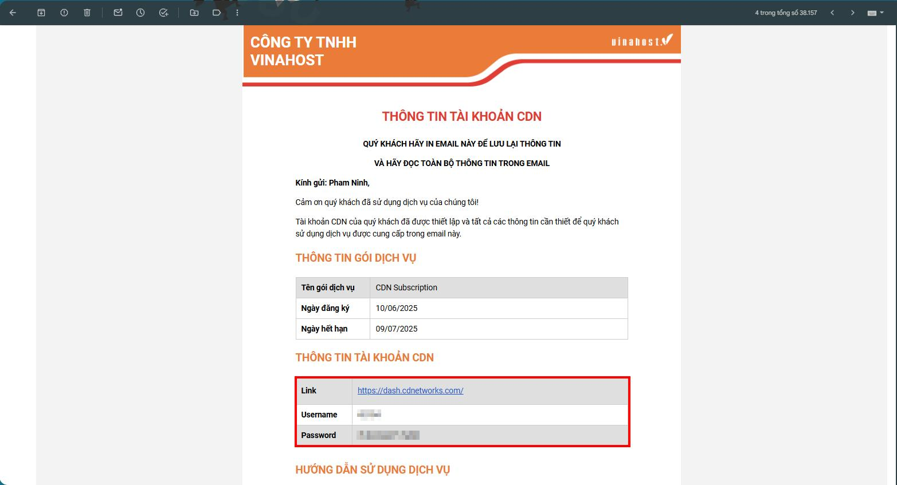
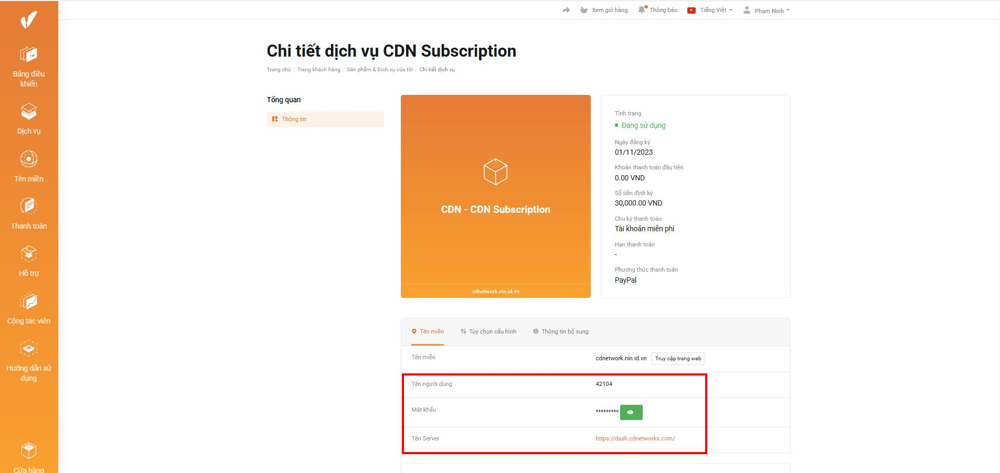
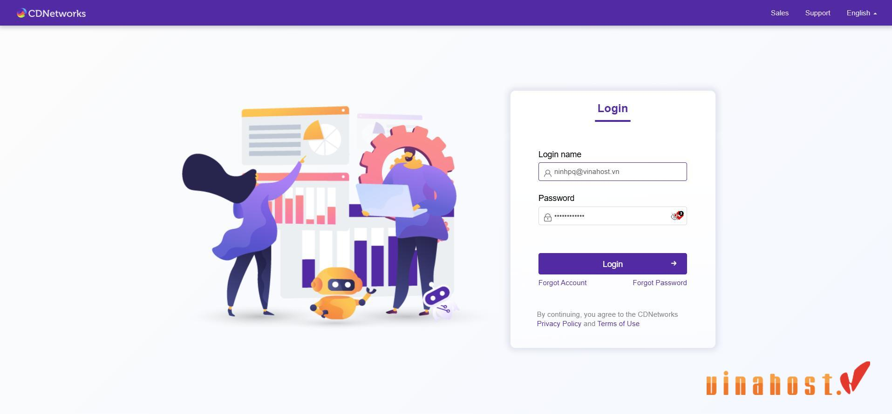
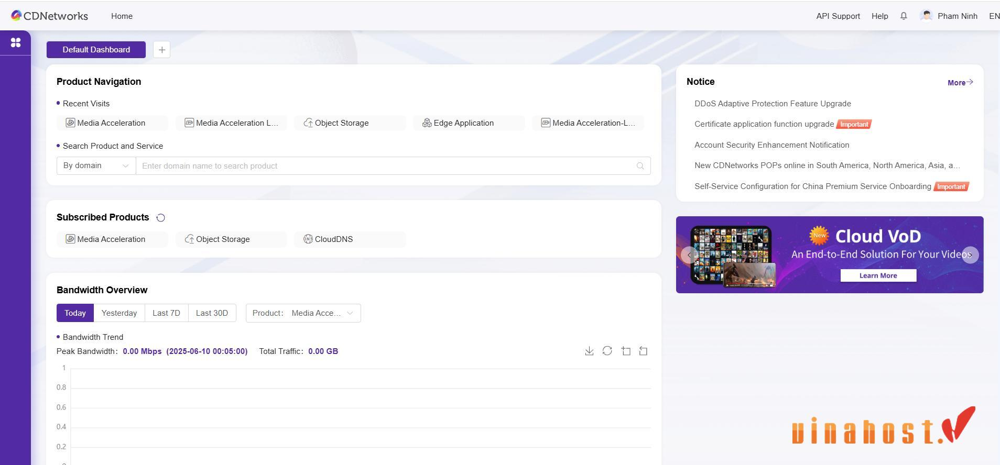

***
## Lấy thông tin đăng nhập từ Email

## Lấy thông tin đăng nhập từ Trang quản trị dịch vụ

## Đăng nhập vào trang quản trị CDN

!!! tip "Mẹo nhỏ"
        Hãy lưu trữ thông tin đăng nhập này ở nơi an toàn để tránh mất mát. Nếu quên mật khẩu, bạn có thể sử dụng chức năng "Forgot Password", link retset password sẽ được gửi về địa chỉ email.

## Tổng quan giao diện

Sau khi đăng nhập thành công, bạn sẽ được đưa đến trang tổng quan (Dashboard) của Customer Portal. Tại đây, bạn có thể xem nhanh tình trạng dịch vụ, dữ liệu thống kê cơ bản và truy cập vào các phần quản lý dịch vụ cụ thể.

---

