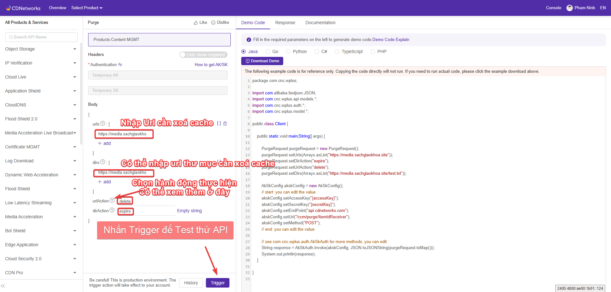
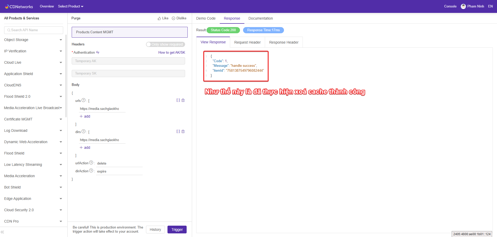
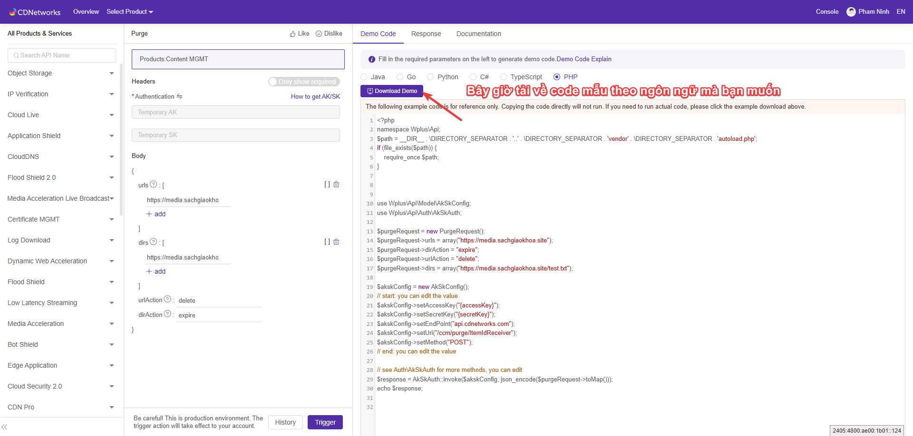
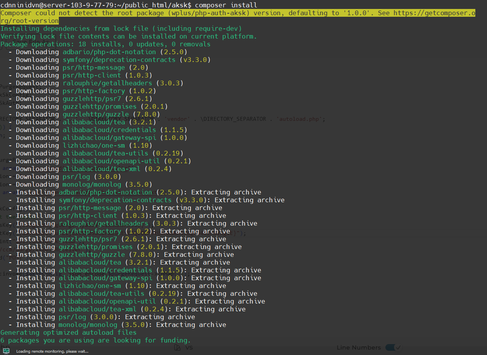
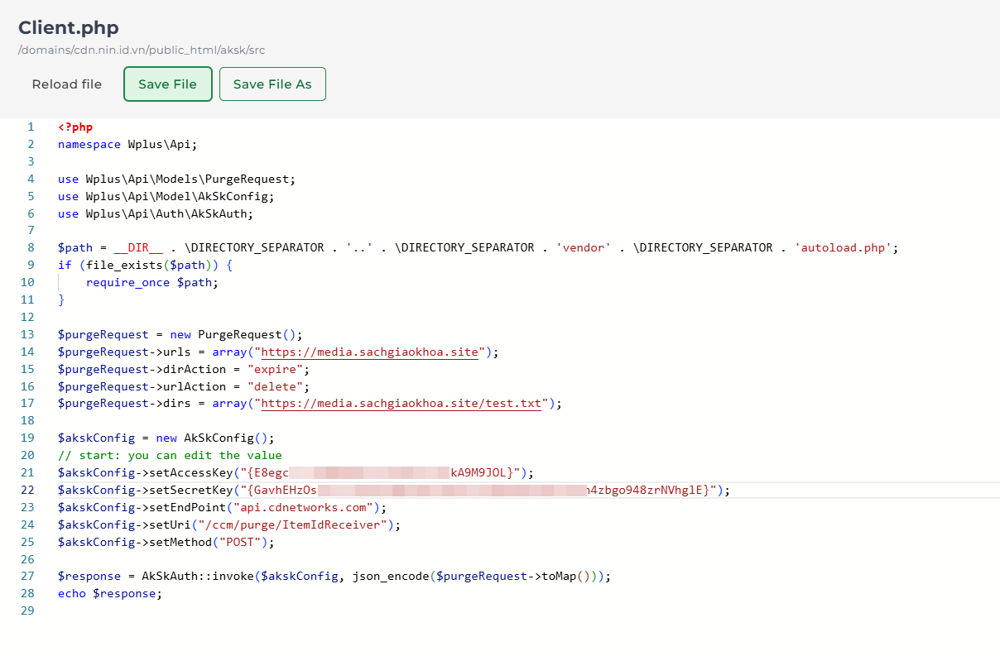

# Hướng dẫn xóa cache CDN bằng API CDNetworks

## Giới thiệu

Tài liệu này hướng dẫn cách sử dụng API CDNetworks để xóa cache CDN theo tài liệu chính thức tại: [API Explorer](https://apiexplorer.cdnetworks.com/apiexplorer/sdk?apiId=4515&productType=all_product)
https://apiexplorer.cdnetworks.com/apiexplorer/overview
## Chuẩn bị

### 1. Thông tin xác thực

Bạn cần có cặp khoá **accessKey**  **secretKey** . Trong thông tin kích hoạt dịch vụ đã có hoặc bạn có thể liên hệ Kỹ thuật để hỗ trợ cung cấp hoặc tạo lại

### 2. Tạo request mẫu test xóa cache
Truy cập link sau:
https://apiexplorer.cdnetworks.com/apiexplorer/sdk?apiId=4515&productType=all_product

### 3. Tải code mẫu

### 4. Cài thêm thư viện và thực hiện xoá cache

Sau khi tải về và Upload lên server, thực hiện chạy lệnh `composer install` để cài đặt một số thư viện cần thiết

Tiến hành thay thế `{accessKey}` và `{secretKey}` vào trong file Client.php

Bây giờ bạn có thể thực hiện xoá cache CDN bằng cách gọi file Client.php để thực hiện
php Client.php hoặc truy cập đường dẫn đến file Client.php trên trình duyệt.

