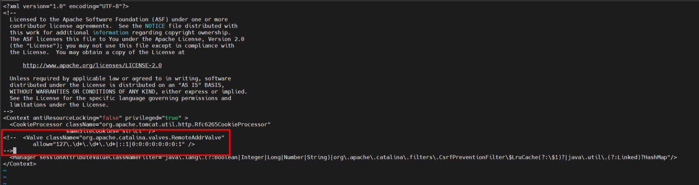

Bài viết này sẽ hướng dẫn cách **Cài Đặt Tomcat trên Centos**. Nếu bạn cần hỗ trợ, xin vui lòng liên hệ [**VinaHost**](https://blog.vinahost.vn/) qua Hotline **1900 6046 ext.3**, email về **support@vinahost.vn** hoặc chat với VinaHost qua livechat **[https://livechat.vinahost.vn/chat.php](https://livechat.vinahost.vn/chat.php)**.

Bài viết này sẽ hướng dẫn quý khách việc thực hiện tại về và cài đặt Apache Tomcat trên Centos.

Update hệ thống trước khi thao tác các lệnh install service:

#yum update -y

# 1. Kiểm tra version Java và cài đặt nếu chưa có

Bước 1: Kiểm tra version Java bằng lệnh sau:

#java --verion

Nếu chưa có Java trên máy chủ thì ta tiến hành cài đặt bằng câu lệnh sau:

#yum install java-1.8.0-openjdk-devel -y 

#Bước 2: Tạo User Tomcat

Vì lý do bảo mật, Tomcat nên được thực thi bởi một user được cấp quyền riêng (không phải user root). Chúng ta sẽ tạo một user  và group để thực thi Tomcat.

Đầu tiên, bạn tạo group bằng lệnh

#groupadd tomcat 

Sau đó, tạo một user tomcat (là thành viên của group tomcat) với thư mục home /opt/tomcat (thư mục cài đặt Tomcat ở bước sau) và tắt quyền truy cập vào server:

#useradd -M -s /bin/nologin -g tomcat -d /opt/tomcat tomcat

Bước 3: Tải xuống Tomcat ta có thể sử dụng lệnh wget để tải.

#cd /tmp/

#wget https://dlcdn.apache.org/tomcat/tomcat-9/v9.0.86/bin/apache-tomcat-9.0.86.tar.gz

Sau khi download hoàn thành ta tiến hành giải nén file .tar.gz vào thư mục cài đặt Tomcat (/otp/tomcat/) bằng lệnh sau:

#tar -xzvf apache-tomcat-9.0.86.tar.gz -C /opt/tomcat --strip-components=1

Bước 4: Cập nhật quyền thực thi

Để user tomcat có thể truy cập vào thư mục cài đặt Tomcat, bạn lần lượt thiết lập quyền như sau:

– Gán quyền sỡ hữu thư mục cài đặt Tomcat cho group tomcat

#cd /opt/tomcat 
#chgrp -R tomcat /opt/tomcat

– Kế tiếp, thiết lập quyền đọc và thực thi thư mục conf (và tất cả nội dung con bên trong) cho group tomcat.

#chmod -R g+r conf
#chmod g+x conf

Sau cùng, bạn gán user tomcat sở hữu các thư mục webapps, work, temp và logs như sau:

#chown -R tomcat webapps/ work/ temp/ logs/

Bước 5: Tạo file Systemd Unit cho Tomcat

Để Tomcat hoạt động như một dịch vụ trên CentOS 7, bạn cần tạo mới một file Tomcat Systemd unit.

Tạo và mở file unit bằng lệnh sau:

#vi /etc/systemd/system/tomcat.service

Thêm nội dung bên dưới vào file.

<pre class="code-pre "><code># Systemd unit file for tomcat
[Unit]
Description=Apache Tomcat Web Application Container
After=syslog.target network.target

[Service]
Type=forking

Environment=JAVA_HOME=/usr/lib/jvm/jre
Environment=CATALINA_PID=/opt/tomcat/temp/tomcat.pid
Environment=CATALINA_HOME=/opt/tomcat
Environment=CATALINA_BASE=/opt/tomcat
Environment='CATALINA_OPTS=-Xms512M -Xmx1024M -server -XX:+UseParallelGC'
Environment='JAVA_OPTS=-Djava.awt.headless=true -Djava.security.egd=file:/dev/./urandom'

ExecStart=/opt/tomcat/bin/startup.sh
ExecStop=/bin/kill -15 $MAINPID

User=tomcat
Group=tomcat
UMask=0007
RestartSec=10
Restart=always

[Install]
WantedBy=multi-user.target</code></pre>

Tiếp theo, bạn thực thi lệnh sau để khởi động lại Systemd để nhận file Tomat unit

#systemctl daemon-reload

Sau cùng, bạn lần lượt thực thi những lệnh sau để khởi động, bật chế độ chạy nền và kiểm tra trạng thái của Tomcat.

#systemctl start tomcat
#systemctl enable tomcat
#systemctl status tomcat

Bước 6: Cấu hình filrewall

Nếu server của bạn có sử dụng tường lửa (firewalld hoặc iptables), bạn cần thiết lập mở port 8080 để có thể truy cập giao diện Tomcat từ bên ngoài.

<pre># firewall-cmd --add-port=8080/tcp --permanent
# firewall-cmd --reload </pre>

Ngay sau khi mở port 8080, bạn có thể mở trình duyệt web, truy cập đường dẫn: http://ip-server:8080 để kiểm tra giao diện mặc định Tomat.

# 2. Cấu hình giao diện web quản trị TomCat

1. Cấu hình

Sau khi hoàn tât các bước cài đặt và cấu hình cơ bản, bạn đã có thể truy cập trang Tomcat mặc định như trên. Tuy nhiên, vì lý do bảo mật nên bạn cần tạo thêm user để có thể truy cập trang quản trị Tomcat manager.

User Tomcat và các quyền sẽ được định nghĩa trong file tomcat-users.xml. Bạn mở file /opt/tomcat/latest/conf/tomcat-users.xml, tìm và thêm nội dung bên dưới vào bên trong thẻ <tomcat-users>…</tomcat-users>

Ta sử dụng lệnh sau:

#vi /opt/tomcat/conf/tomcat-users.xml

**Lưu ý:**

rolename=”admin-gui” và “manager-gui” lần lượt các quyền truy cập vào trang quản trị Tomcat và trang quản lý webapps.
Thay đổi các giá trị username và password tương ứng với hệ thống của bạn.

Theo mặc định, giao diện quản trị Tomcat chỉ cho phép truy cập từ localhost, để có thể truy cập từ một remote IP hoặc bất kỳ đâu, bạn thực hiện những điều chỉnh như sau:

Lần lượt mở các file /opt/tomcat/webapps/manager/META-INF/context.xml và /opt/tomcat/webapps/host-manager/META-INF/context.xml, khóa hoặc xóa bỏ nội dung bên dưới trong thẻ <Context>…</Context>

Khởi động lại Tomcat để những điều chỉnh có tác dụng bằng lệnh sau:

#systemctl restart tomcat 

2. Kiểm tra cấu hình

Sau khi hoàn tất các thiết lập, bạn truy cập lại giao diện quản trị Tomcat theo đường dẫn: http://<your_domain_or_IP_address>:8080

Bạn lần lượt truy cập vào Server Status, Manage App và Host Manager, sau khi hoàn tất bước xác thực Tomcat User sẽ được kết quả tương tự như sau:

- Server Status

- Manage App

- Host-Manager

    Chúc quý khách thực hiện thành công!

> **THAM KHẢO CÁC DỊCH VỤ TẠI [VINAHOST](https://vinahost.vn/)**
> 
> **\>>** [**SERVER**](https://vinahost.vn/thue-may-chu-rieng/) **–** [**COLOCATION**](https://vinahost.vn/colocation.html) – [**CDN**](https://vinahost.vn/dich-vu-cdn-chuyen-nghiep)
> 
> **\>> [CLOUD](https://vinahost.vn/cloud-server-gia-re/) – [VPS](https://vinahost.vn/vps-ssd-chuyen-nghiep/)**
> 
> **\>> [HOSTING](https://vinahost.vn/wordpress-hosting)**
> 
> **\>> [EMAIL](https://vinahost.vn/email-hosting)**
> 
> **\>> [WEBSITE](http://vinawebsite.vn/)**
> 
> **\>> [TÊN MIỀN](https://vinahost.vn/ten-mien-gia-re/)**
