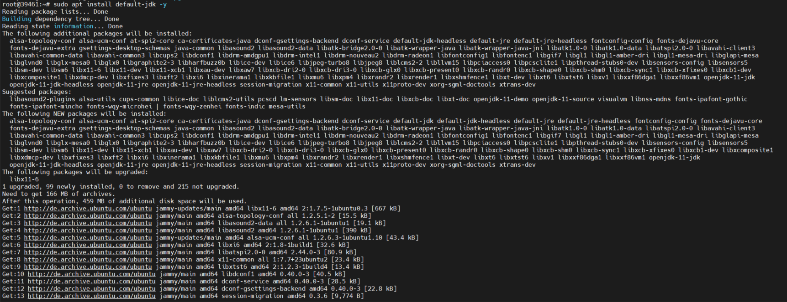
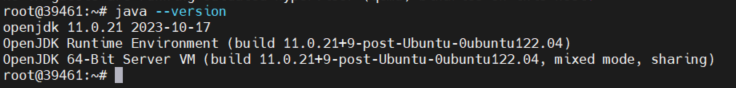
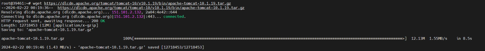
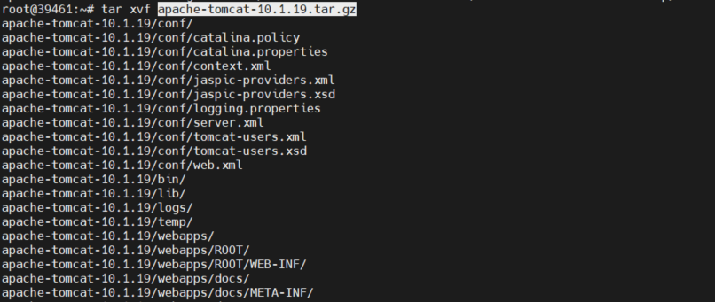
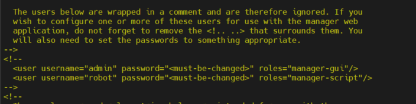
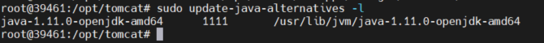
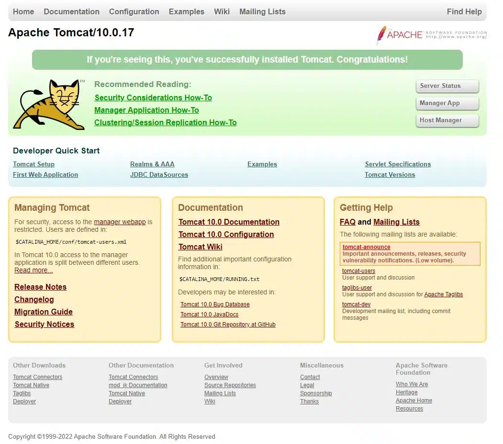

Bài viết này sẽ hướng dẫn cách **Cài Đặt Tomcat trên Ubuntu**. Nếu bạn cần hỗ trợ, xin vui lòng liên hệ [**VinaHost**](https://blog.vinahost.vn/) qua Hotline **1900 6046 ext.3**, email về **support@vinahost.vn** hoặc chat với VinaHost qua livechat **[https://livechat.vinahost.vn/chat.php](https://livechat.vinahost.vn/chat.php)**.

Bài viết này sẽ hướng dẫn quý khách việc thực hiện tại về và cài đặt Apache Tomcat trên Ubuntu.

# 1. Cài đặt Java (Phiên bản mới nhất)

Nếu như bạn vừa cài đặt lại version Ubuntu 22.04 trên hệ thống của mình, bạn cần phải thêm user mới trước khi thiết lập Apache Tomcat.

Ta thực hiện các bước sau:

- Update và cài đặt môi trường Java để setup Tomcat
<pre> 
<code class="hljs ">sudo apt update</code>
<code class="hljs ">sudo apt install default-jdk -y </code>
 </pre>

 

Sau khi tiến trình cài đặt Java thành công ta sử dụng lệnh sau để kiểm tra version Java:

**# java --verison**

# 2. Cài đặt Apache Tomcat

Tải file nén Tomcat từ trang web chính thức của Tomcat bằng lệnh sau:

#wget https://dlcdn.apache.org/tomcat/tomcat-10/v10.1.19/bin/apache-tomcat-10.1.19.tar.gz

Sau khi hoàn thành quá trình download file nén của Tomcat xuống chúng ta se giải nén file bằng lệnh:

#tar xvf apache-tomcat-10.1.19.tar.gz

Sau khi giải nén thư mục thành công chúng ta cần di chuyển các tệp đã nén vào thư mục chính (/usr/share/apache-tomcat) bằng cách sử dụng lệnh sau:

#sudo mv apache-tomcat-10.1.19 /usr/share/apache-tomcat

# 3. Thiết lập tài khoản người dùng Tomcat

Việc chạy máy chủ Tomcat thông qua một tài khoản người dùng nhất định rất tốt cho mục đích bảo mật. Thực hiển lệnh dưới đây để tạo tài khoản người dùng mới.

#sudo nano /opt/tomcat/conf/tomcat-users.xml

Để xóa hạn chế cho trang Manager, hãy mở file config của trang manager để chỉnh sửa:

#sudo nano /opt/tomcat/webapps/manager/META-INF/context.xml

<pre>
<code data-hcb-clip="13" class=" language-bash">...
&lt;Context antiResourceLocking="false" privileged="true" &gt;
  &lt;CookieProcessor className="org.apache.tomcat.util.http.Rfc6265CookieProcessor"
                   sameSiteCookies="strict" /&gt;
&lt;!--  &lt;Valve className="org.apache.catalina.valves.RemoteAddrValve"
         allow="127\.\d+\.\d+\.\d+|::1|0:0:0:0:0:0:0:1" /&gt; --&gt;
  &lt;Manager sessionAttributeValueClassNameFilter="java\.lang\.(?:Boolean|Integer|Long|Number|String)|org\.apache\.catalina\.filters\.Csr&gt;
&lt;/Context&gt;</code>
</pre>

# 4. Tạo một dịch vụ systemd

Dịch vụ systemd giữ cho Tomcat chạy ngầm trong background. Dịch vụ này cũng sẽ tự động khởi động lại Tomcat trong trường hợp xảy ra error hoặc failure.

Bản thân Tomcat là một ứng dụng Java, vì vậy cần phải có thời gian để chạy Java mà bạn đã cài đặt với JDK ở bước 1. Trước khi tạo dịch vụ, bạn cần biết locate của Java. Bạn có thể tra cứu điều đó bằng cách chạy lệnh sau:

#sudo update-java-alternatives -l

**Lưu ý:** Đường dẫn nơi Java reside, được liệt kê trong cột cuối cùng. Bạn sẽ cần đường dẫn này để xác định dịch vụ.

Bạn sẽ lưu trữ dịch vụ tomcat trong một file có tên tomcat.service, dưới phần /etc/systemd/system. Tạo file để chỉnh sửa bằng lệnh:

#sudo nano /etc/systemd/system/tomcat.service

Thêm các đòng sau:

<pre>
[Unit]
Description=Tomcat
After=network.target

[Service]
Type=forking

User=tomcat
Group=tomcat

Environment="JAVA_HOME=/usr/lib/jvm/java-1.11.0-openjdk-amd64"
Environment="JAVA_OPTS=-Djava.security.egd=file:///dev/urandom"
Environment="CATALINA_BASE=/opt/tomcat"
Environment="CATALINA_HOME=/opt/tomcat"
Environment="CATALINA_PID=/opt/tomcat/temp/tomcat.pid"
Environment="CATALINA_OPTS=-Xms512M -Xmx1024M -server -XX:+UseParallelGC"

ExecStart=/opt/tomcat/bin/startup.sh
ExecStop=/opt/tomcat/bin/shutdown.sh

RestartSec=10
Restart=always

[Install]
WantedBy=multi-user.target
</pre>

Sửa đổi giá trị JAVA_HOME nếu nó khác với giá trị bạn đã note trước đó.

Tại đây, bạn xác định một dịch vụ sẽ chạy Tomcat bằng cách thực thi các tập lệnh khởi động và shutdown mà Tomcat cung cấp. Bạn cũng đặt một vài biến môi trường (environment variables) để xác định thư mục chính (giống như /opt/tomcat trước) và giới hạn dung lượng bộ nhớ mà Java VM có thể phân bổ (trong CATALINA_OPTS). Khi failure, dịch vụ Tomcat sẽ tự động khởi động lại.

Khi bạn hoàn tất, hãy lưu và đóng file.

Tải lại systemd daemon để Tomcat nhận biết được dịch vụ mới:

#sudo systemctl daemon-reload

Sau đó, bạn có thể bắt đầu dịch vụ Tomcat bằng cách nhập lệnh:

#sudo systemctl start tomcat

Tiếp đến, hãy check trạng thái của Tomcat để xác nhận rằng dịch vụ đã bắt đầu thành công:

#sudo systemctl status tomcat

Để cho phép Tomcat khởi động cùng hệ thống, hãy chạy lệnh sau:

#sudo systemctl enable tomcat

# 5. Truy cập vào giao diện website Tomcat

Lúc này dịch vụ Tomcat đang chạy, bạn có thể cấu hình tường lửa để cho phép kết nối với Tomcat. Sau đó, bạn có thể truy cập giao diện web.

Tomcat sử dụng cổng 8080 để accept các yêu cầu HTTP. Chạy lệnh sau để cho phép lưu lượng truy cập vào cổng đó:

#sudo ufw allow 8080

Trong trình duyệt của bạn, bây giờ bạn có thể truy cập Tomcat bằng cách điều hướng đến địa chỉ IP của server của bạn:

http://your_server_ip:8080

Bạn sẽ thấy trang chủ mặc định của Tomcat:

Chúc quý khách thực hiện thành công!

> **THAM KHẢO CÁC DỊCH VỤ TẠI [VINAHOST](https://vinahost.vn/)**
> 
> **\>>** [**SERVER**](https://vinahost.vn/thue-may-chu-rieng/) **–** [**COLOCATION**](https://vinahost.vn/colocation.html) – [**CDN**](https://vinahost.vn/dich-vu-cdn-chuyen-nghiep)
> 
> **\>> [CLOUD](https://vinahost.vn/cloud-server-gia-re/) – [VPS](https://vinahost.vn/vps-ssd-chuyen-nghiep/)**
> 
> **\>> [HOSTING](https://vinahost.vn/wordpress-hosting)**
> 
> **\>> [EMAIL](https://vinahost.vn/email-hosting)**
> 
> **\>> [WEBSITE](http://vinawebsite.vn/)**
> 
> **\>> [TÊN MIỀN](https://vinahost.vn/ten-mien-gia-re/)**
