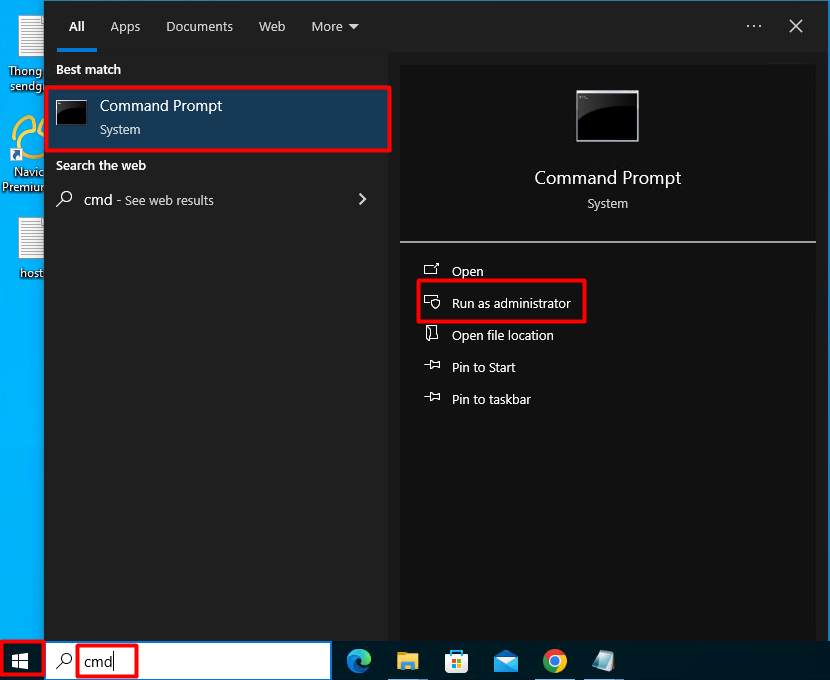

Bài viết này sẽ hướng dẫn cách **Cài Đặt TomCat trên Windows**. Nếu bạn cần hỗ trợ, xin vui lòng liên hệ [**VinaHost**](https://blog.vinahost.vn/) qua Hotline **1900 6046 ext.3**, email về **support@vinahost.vn** hoặc chat với VinaHost qua livechat **[https://livechat.vinahost.vn/chat.php](https://livechat.vinahost.vn/chat.php)**.

Bài viết này sẽ hướng dẫn quý khách việc thực hiện tại về và cài đặt Apache Tomcat trên Windows.

# 1 Tải Về
Đầu tiên chúng ta sẽ truy cập vào link download trực tiếp từ nhà cung cấp <a href="http://tomcat.apache.org/download-70.cgi" target="_blank" rel="noopener">tại đây</a>
Tại đây quý khách vui lòng thực hiện chọn 1 trong 2 phiên bản là 32bits  ( <a href ="https://dlcdn.apache.org/tomcat/tomcat-8/v8.5.99/bin/apache-tomcat-8.5.99-windows-x86.zip" rel="nofollow noopener" target="_blank">32-bit Windows Zip</a> ) hoặc 64bits ( <a href ="https://dlcdn.apache.org/tomcat/tomcat-8/v8.5.99/bin/apache-tomcat-8.5.99-windows-x86.zip" rel="nofollow noopener" target="_blank">64-bit Windows Zip</a> ).
 Lưu Ý máy chủ của quý khách phải được cài đặt sẵn Java JDK nếu không quá trình cài đặt sau này sẽ báo lỗi. Nếu chưa cài đặt quý khách có thể thực hiện tải về ở <a href="http://www.oracle.com/technetwork/java/javase/downloads/jdk8-downloads-2133151.html" target="_blank" rel="noopener">trang chủ&nbsp;</a> của Ocarcle với phiên bản phù hợp.

 

 # 2. Cài Đặt
 Sau khi tải file nén hoàn tất, quý khách có thể thực hiện unzip file này ra thư mục bất kì mà quý khách muốn sử dụng. Sau đó tiến hành:

 - Mở **cmd** trên Windows (Start => Run => CMD hoặc Windows Button + R = CMD).

 

 - Chạy lệnh sau: C:\apache-tomcat-7.0.69\bin\services.bat install

- Tiếp tục chạy thêm lệnh C:\apache-tomcat-7.0.69\bin\startup.bat để khởi động tomcat7, nếu kết quả trả về như hình là đã thành công.

Thực hiện truy cập http://localhost:8080 hoặc http://ip-server:8080 sẽ thấy trang default của Apache Tomcat

Lưu ý việc cài đặt sẽ dễ xảy ra lỗi The CATALINA_HOME environment variable is not defined correctly This environment variable is needed to run this program

Việc thực hiện fix lỗi như sau:

-Truy cập vào Control Panel => System 

- Click chọn Advenced System Settings ở cửa sổ hiện ra.

- Chọn tab Advanced => Environment Variables …

- Ở mục System Variables => Chọn New

- Add thêm các giá trị sau vào:
    -Variable Name: CATALINA_HOME – Variable value: C:\apache-tomcat-7.0.69 (thay bằng đường dẫn đến thư mục tomcat của quý khách)
    - Variable Name: CLASSPATH – Variable value: C:\apache-tomcat-7.0.69\bin (thay bằng đường dẫn đến thư mục tomcat của quý khách)
    - Variable Name: JAVA_HOME – Variable value: C:\Program Files\Java\jdk1.8.0_91(thay bằng đường dẫn đến thư mục cài đặt Java JDK của quý khách)

    Chúc quý khách thực hiện thành công!

> **THAM KHẢO CÁC DỊCH VỤ TẠI [VINAHOST](https://vinahost.vn/)**
> 
> **\>>** [**SERVER**](https://vinahost.vn/thue-may-chu-rieng/) **–** [**COLOCATION**](https://vinahost.vn/colocation.html) – [**CDN**](https://vinahost.vn/dich-vu-cdn-chuyen-nghiep)
> 
> **\>> [CLOUD](https://vinahost.vn/cloud-server-gia-re/) – [VPS](https://vinahost.vn/vps-ssd-chuyen-nghiep/)**
> 
> **\>> [HOSTING](https://vinahost.vn/wordpress-hosting)**
> 
> **\>> [EMAIL](https://vinahost.vn/email-hosting)**
> 
> **\>> [WEBSITE](http://vinawebsite.vn/)**
> 
> **\>> [TÊN MIỀN](https://vinahost.vn/ten-mien-gia-re/)**

