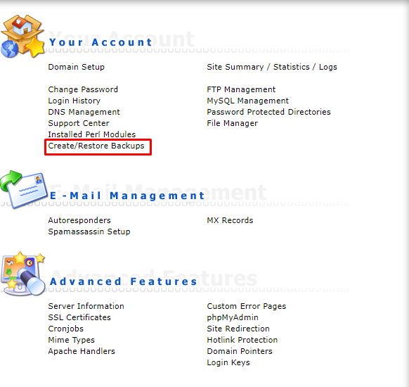
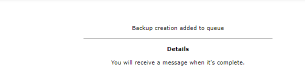

Bài viết này sẽ hướng dẫn mọi người cách  **Download backup trên Directadmin**. Nếu bạn cần hỗ trợ, xin vui lòng liên hệ [**VinaHost**](https://blog.vinahost.vn/) qua Hotline **1900 6046 ext.3**, email về **support@vinahost.vn** hoặc chat với VinaHost qua livechat **[https://livechat.vinahost.vn/chat.php](https://livechat.vinahost.vn/chat.php)**.

# Hướng dẫn download backup trên Directadmin

Các bước thực hiện quá trình download file backup trên Panel Directadmin.

Bước 1: Ta cần login vào giao diện Directadmin.

 

Bước 2: Chọn mục "**Show All USers**" để chọn user mà bạn muốn tạo backup vào download backup về

Bước 3: Login vào user mà bạn muốn backup. Sau đó chọn mục "**Create/Restore Backups**"

Bước 4: Chọn "**Create Backup**"

Sau khi hoàn thành bước này vui lòng xem trong mục **Message System**

Sau đó ta vào đường dẫn: "File Manager ==> backups ==> backup-thang-ngay-nam.tar.gz"

Click vào file backup-thang-ngay-nam.tar.gz để có thể download backup

Chúc các bạn thành công!

> **THAM KHẢO CÁC DỊCH VỤ TẠI [VINAHOST](https://vinahost.vn/)**
> 
> **\>>** [**SERVER**](https://vinahost.vn/thue-may-chu-rieng/) **–** [**COLOCATION**](https://vinahost.vn/colocation.html) – [**CDN**](https://vinahost.vn/dich-vu-cdn-chuyen-nghiep)
> 
> **\>> [CLOUD](https://vinahost.vn/cloud-server-gia-re/) – [VPS](https://vinahost.vn/vps-ssd-chuyen-nghiep/)**
> 
> **\>> [HOSTING](https://vinahost.vn/wordpress-hosting)**
> 
> **\>> [EMAIL](https://vinahost.vn/email-hosting)**
> 
> **\>> [WEBSITE](http://vinawebsite.vn/)**
> 
> **\>> [TÊN MIỀN](https://vinahost.vn/ten-mien-gia-re/)**