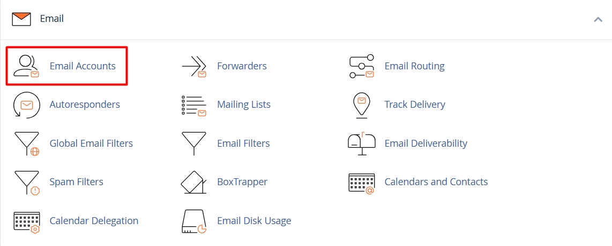
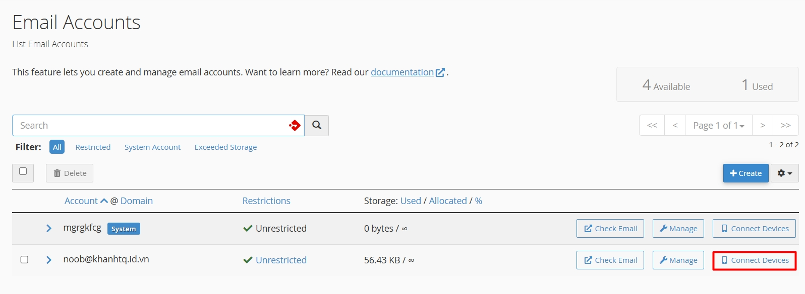
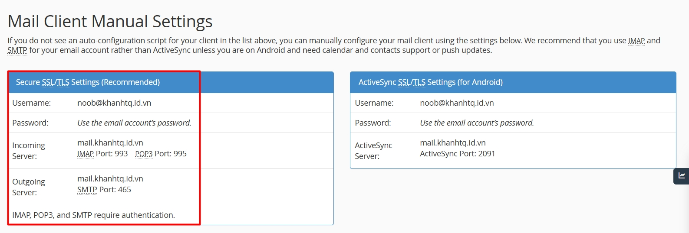
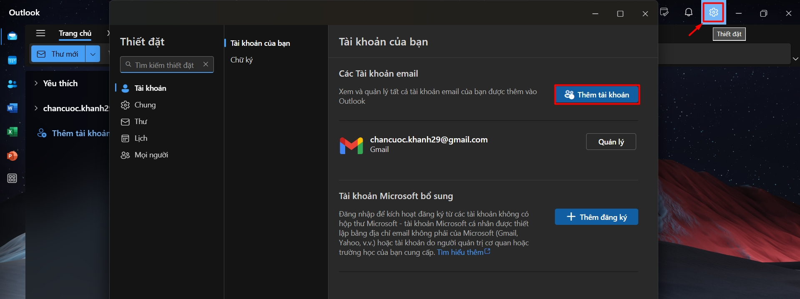
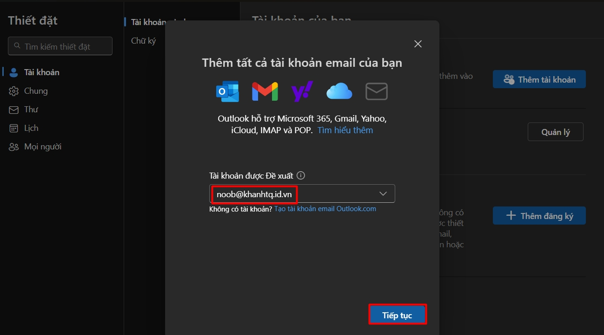
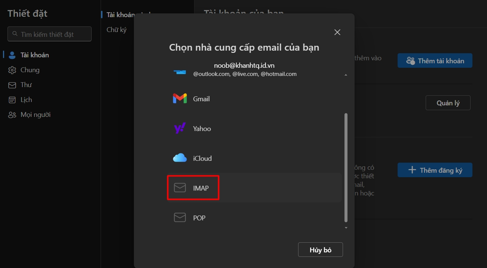
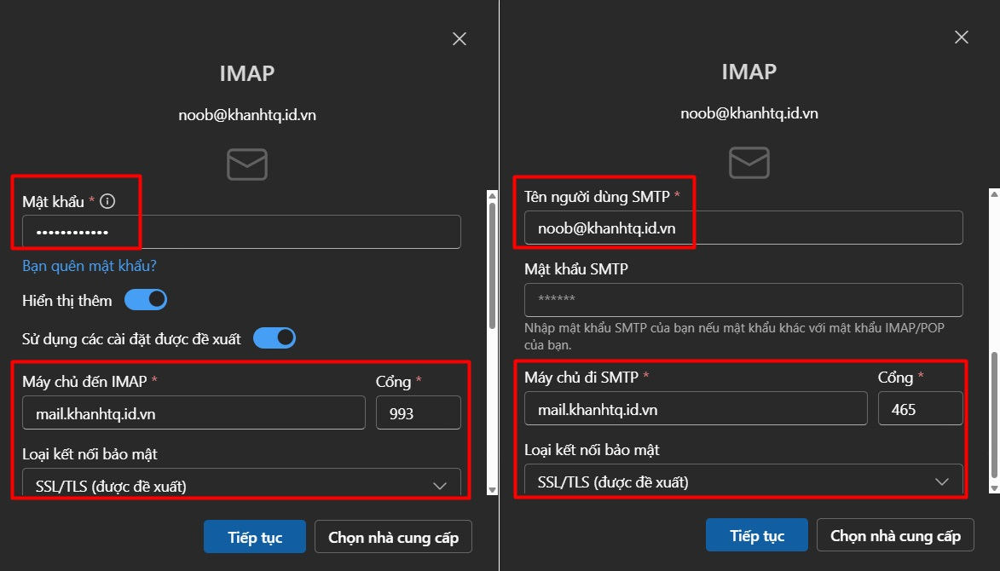
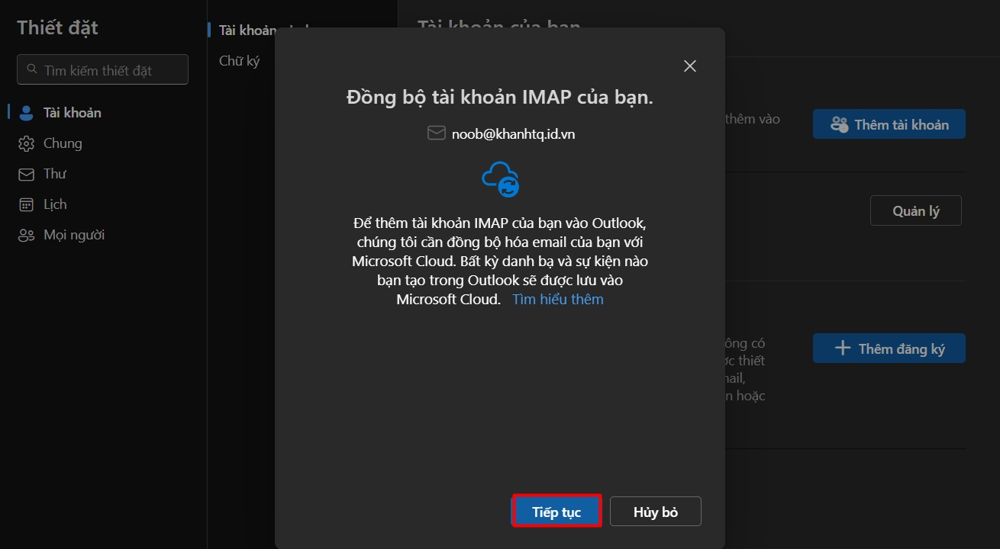
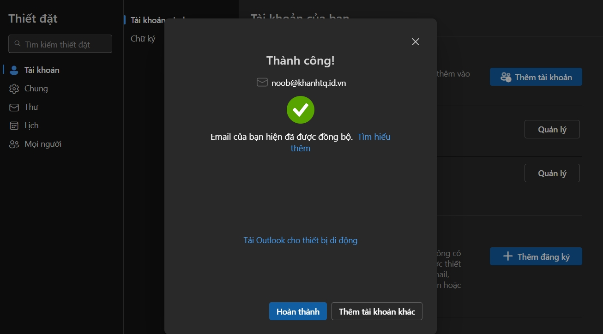

!!! info
    Bài viết này sẽ hướng dẫn bạn cách **cấu hình Outlook (new)** khi sử dụng dịch vụ Email Hosting. Nếu bạn cần hỗ trợ, xin vui lòng liên hệ hotline **1900 6046 nhánh 3**, gửi email đến [**support@vinahost.vn**](mailto:support@vinahost.vn), hoặc chat trực tiếp với chúng tôi tại [**đây**](https://livechat.vinahost.vn/chat.php).

**Trước khi vào nội dung chính, mong bạn lưu ý rằng:**

- Nếu không thể đăng nhập WebMail thành công, bạn cũng không thể cấu hình Outlook được.
- VinaHost chỉ đảm bảo hoạt động của WebMail. Việc gửi và nhận thành công trên WebMail có nghĩa là hệ thống đang hoạt động đúng.
- Outlook hay bất kỳ phần mềm email nào khác đều là phần mềm bên thứ ba.  
_VinaHost không có trách nhiệm đối với các phần mềm này. Vui lòng chủ động kiểm tra lại cấu hình Outlook theo hướng dẫn tại [đây](https://kb.vinahost.vn/Email/huong-dan-cau-hinh-email-tren-outlook/)._

## Thực hiện

### Lấy thông tin cấu hình

Thông tin cấu hình bạn cần lấy nằm trong **cPanel** - giao diện quản trị Email Hosting mà VinaHost đã cung cấp khi bạn đăng ký dịch vụ.

!!! info "Thông tin thêm"
    Thông tin đăng nhập cPanel đã được gửi đến địa chỉ email được dùng để đăng ký dịch vụ. Vui lòng liên hệ chủ sở hữu địa chỉ email này nếu bạn không sở hữu nó.

Trong cPanel, truy cập **Email Accounts**.

Chọn **Connect Devices** tại dòng tài khoản mà bạn muốn cấu hình.

Cuộn xuống dưới để xem thông tin cấu hình tại mục **Mail Client Manual Settings**.

### Cấu hình Outlook (new)

Tại góc phải trên trong Outlook (new), chọn **Thiết đặt** :octicons-gear-16:{ title="Settings" } > **Thêm tài khoản** :material-account-plus:{ title="Add account" }.

Nhập tài khoản bạn cần thêm vào hộp thoại hiện lên.

Tiếp theo, chọn **IMAP**.

Điền các thông tin đã lấy tại **bước 1.1**.

!!! tip "Mẹo"
    Bạn có thể để trống **Mật khẩu SMTP** do nó trùng với mật khẩu IMAP đã nhập trên cùng.

Chọn **Tiếp tục** tại bước tiếp theo để đồng bộ hoá dữ liệu.

Nếu các thông tin đều đã đúng, thông báo thêm tài khoản thành công sẽ xuất hiện.

!!! tip "Mẹo"
    Nếu bạn chắc chắn rằng mọi thông tin đã đúng nhưng vẫn không thể thêm được tài khoản, vui lòng lấy IP [tại đây](https://ip.vinahost.vn/) và gửi đến [support@vinahost.vn](mailto:support@vinahost.vn) để được hỗ trợ kiểm tra.

## 2. Kết luận

VinaHost đã hướng dẫn xong cách **cấu hình Outlook (new)** khi sử dụng dịch vụ Email Hosting. Sau khi cấu hình chính xác, bạn có thể sử dụng Outlook (new) để gửi và nhận email một cách mượt mà.

Chúc bạn thực hiện thành công! 🍻

> **THAM KHẢO CÁC DỊCH VỤ TẠI [VINAHOST](https://vinahost.vn/)**
>
> **\>> [SERVER](https://vinahost.vn/thue-may-chu-rieng/) – [COLOCATION](https://vinahost.vn/colocation.html) – [CDN](https://vinahost.vn/dich-vu-cdn-chuyen-nghiep)**  
> **\>> [CLOUD](https://vinahost.vn/cloud-server-gia-re/) – [VPS](https://vinahost.vn/vps-ssd-chuyen-nghiep/)**  
> **\>> [HOSTING](https://vinahost.vn/wordpress-hosting)**  
> **\>> [EMAIL](https://vinahost.vn/email-hosting)**  
> **\>> [WEBSITE](http://vinawebsite.vn/)**  
> **\>> [TÊN MIỀN](https://vinahost.vn/ten-mien-gia-re/)**
