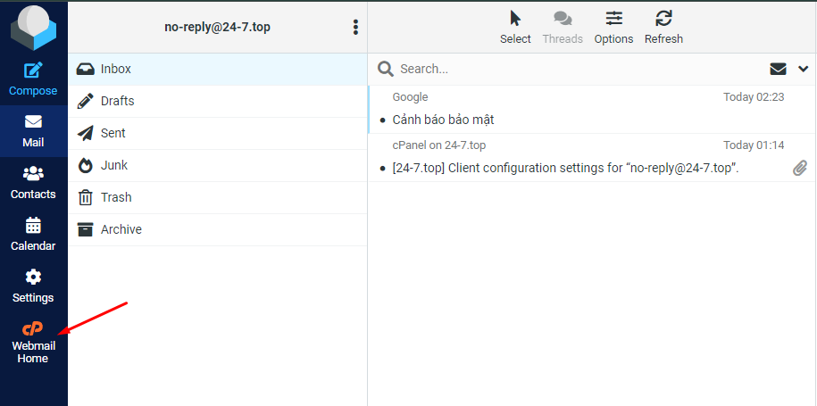
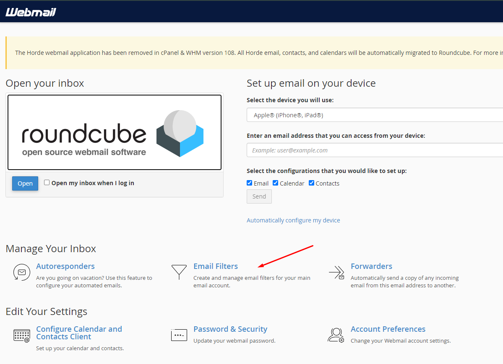
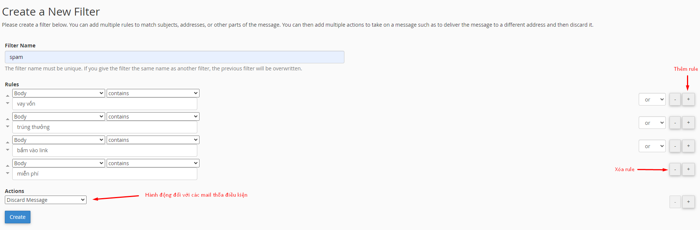
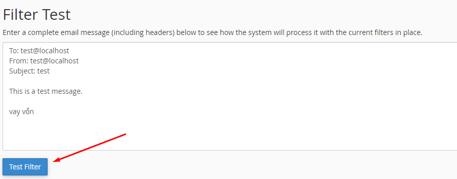
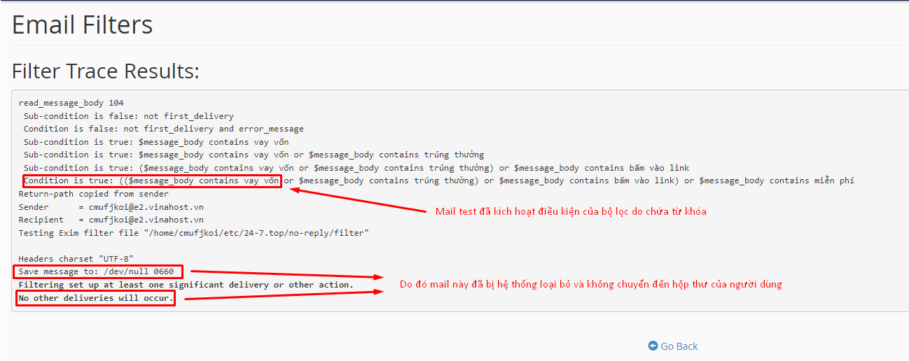

# Hướng dẫn cấu hình bộ lọc nội dung mail

Bài viết này sẽ giới thiệu về **Hướng dẫn cấu hình bộ lọc nội dung mail** và lợi ích của nó. Nếu bạn cần hỗ trợ, xin vui lòng liên hệ VinaHost qua **Hotline 1900 6046 ext. 3**, email về [support@vinahost.vn](mailto:support@vinahost.vn) hoặc chat với VinaHost qua livechat <https://livechat.vinahost.vn/chat.php>

Truy cập webmail 

 

Chọn **Email Filters**, chọn **Create a New Filter** để tạo bộ lọc mới

 

Mục đích của chúng ta sẽ lọc ra những mail có nội dung spam theo nhu cầu, nên sẽ thực hiện những điều chỉnh liên quan đến "body" tức là nội dung của các email.

 

Bao gồm:

* Phần lọc: ở đây lựa chọn Body
* Điều kiện kiểm tra:
  * **contains**: chứa
  * **matches regex:** khớp chuỗi, dựa trên quy tắc: <https://www.regular-expressions.info/quickstart.html>. Ví dụ `/(miễn\s*phí|khuyến\s*mãi|ưu\s*đãi|giảm\s*giá)/i` sẽ khớp với các từ khóa sau:
    * *Miễn phí vận chuyển*
    * *Khuyến mãi lớn*
    * *Ưu đãi đặc biệt*
    * *Giảm giá sốc*
  * **does not contain:** Không chứa
  * **equals:** Tương đương
  * **begins with:** Bắt đầu bằng
  * **ends with:** Kết thúc bằng
  * **does not begin:** Không bắt đầu bằng
  * **does not end with:** Không kết thúc bằng
  * **does not match:** Không khớp
* Phương pháp kết hợp: 
  * **OR**: Hoặc, thích hợp cho nhiều rule nhắm vào các từ khóa riêng lẻ
  * **AND**: Và, từ khóa cần thõa mãn 2 hay nhiều rule cùng lúc mới thực hiện hành động
* Hành động:
  * **Discard Message:** Loại bỏ mail
  * **Redirect to Email:** Chuyển tiếp mail đến 1 địa chỉ email
  * **Fail With Message:** Loại bỏ mail và gửi lời nhắn đến người gửi
  * **Stop Processing Rules:** Không thực hiện hành động hay áp dụng các bộ lọc khác cho mail này
  * **Deliver to Folder:** Đưa mail vào thư mục

Khi hoàn tất tạo, có thể dùng **Filter Test** để kiểm tra tính khả dụng của bộ lọc. Ta sẽ thử thêm từ khóa *vay vốn* vào nội dung mail test

 

 

**Chúc bạn thực hiện thành công!**

> **THAM KHẢO CÁC DỊCH VỤ TẠI [VINAHOST](https://vinahost.vn/)**
>
> **>>** **[SERVER](https://vinahost.vn/thue-may-chu-rieng/)** **–** **[COLOCATION](https://vinahost.vn/colocation.html)** – **[CDN](https://vinahost.vn/dich-vu-cdn-chuyen-nghiep)**
>
> **>> [CLOUD](https://vinahost.vn/cloud-server-gia-re/) – [VPS](https://vinahost.vn/vps-ssd-chuyen-nghiep/)**
>
> **>> [HOSTING](https://vinahost.vn/wordpress-hosting)**
>
> **>> [EMAIL](https://vinahost.vn/email-hosting)**
>
> **>> [WEBSITE](http://vinawebsite.vn/)**
>
> **>> [TÊN MIỀN](https://vinahost.vn/ten-mien-gia-re/)**