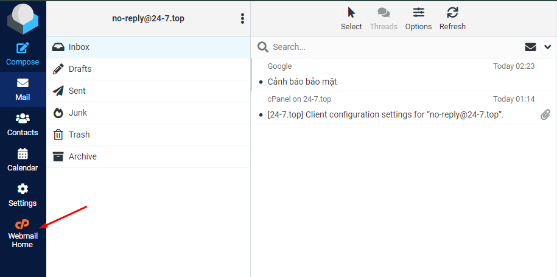
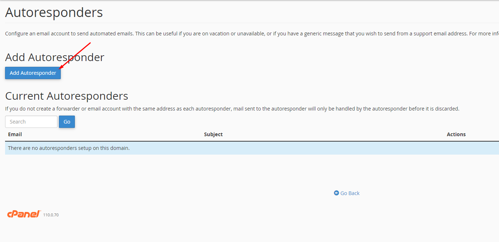

# Hướng dẫn cấu hình trả lời tự động Autoresponders

Bài viết này sẽ giới thiệu về **Hướng dẫn cấu hình Autoresponders** và lợi ích của nó. Nếu bạn cần hỗ trợ, xin vui lòng liên hệ VinaHost qua **Hotline 1900 6046 ext. 3**, email về [support@vinahost.vn](mailto:support@vinahost.vn) hoặc chat với VinaHost qua livechat <https://livechat.vinahost.vn/chat.php>

Đầu tiên, truy cập trang chủ webmail

 

Chọn phần **Autoresponders**

 

Chọn **Add Autoresponder** để tạo phản hồi tự động mới

 

 

Các trường tùy chỉnh dành cho nội dung/tiêu đề mail

* **%subject%:** Tiêu đề mail của người gửi
* **%from%:** Tên hiển thị của người gửi (nếu có)
* **%email%:** Địa chỉ email của người gửi

 

* **Character Set:** Mã văn bản, nên để mặc định
* **Interval:** Chu kỳ gửi phản hồi nếu cùng một email gửi đến, để 0 là luôn luôn
* **From:** Tên hiển thị của phản hồi tự động
* **Subject:** Tiêu đề
* **This message contains HTML:** Tích nếu nội dung mail chứa định dạng HTML
* **Body:** Nội dung mail

 

* **Start:** Thời điểm bắt đầu
  * **Immediately**: ngay lập tức
  * **Custom**: tùy chỉnh thời gian
* **Stop:** Thời điểm kết thúc

Sau khi hoàn tất, nhấn **Create**

Thành quả:

 

 

Nếu cần chỉnh sửa lại, truy cập như các bước đầu và chọn **Edit**

 

**Chúc bạn thực hiện thành công!**

> **THAM KHẢO CÁC DỊCH VỤ TẠI [VINAHOST](https://vinahost.vn/)**
>
> **>>** **[SERVER](https://vinahost.vn/thue-may-chu-rieng/)** **–** **[COLOCATION](https://vinahost.vn/colocation.html)** – **[CDN](https://vinahost.vn/dich-vu-cdn-chuyen-nghiep)**
>
> **>> [CLOUD](https://vinahost.vn/cloud-server-gia-re/) – [VPS](https://vinahost.vn/vps-ssd-chuyen-nghiep/)**
>
> **>> [HOSTING](https://vinahost.vn/wordpress-hosting)**
>
> **>> [EMAIL](https://vinahost.vn/email-hosting)**
>
> **>> [WEBSITE](http://vinawebsite.vn/)**
>
> **>> [TÊN MIỀN](https://vinahost.vn/ten-mien-gia-re/)**